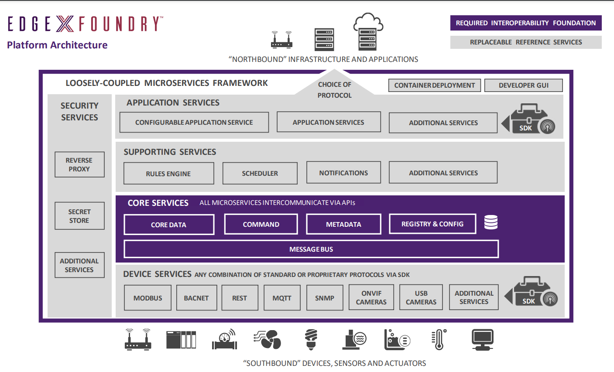
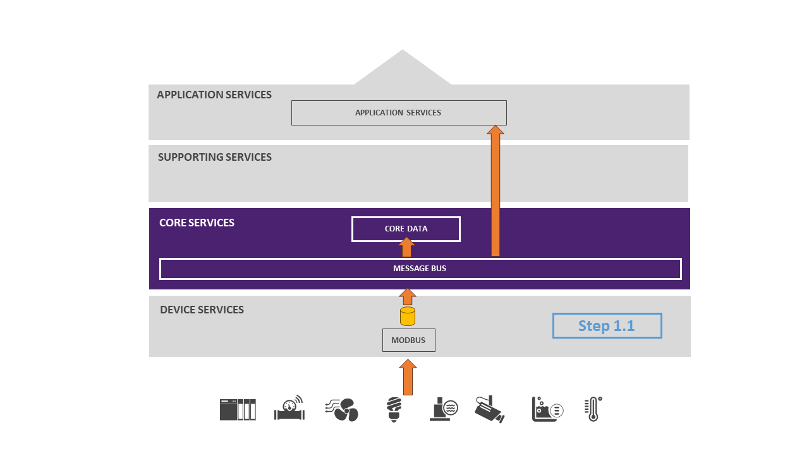
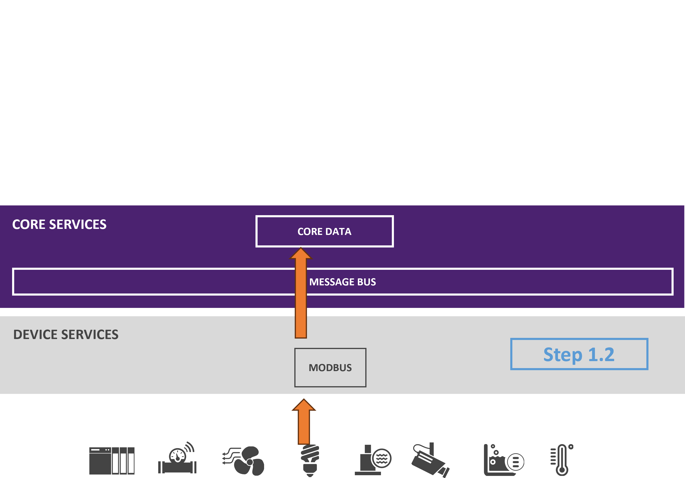
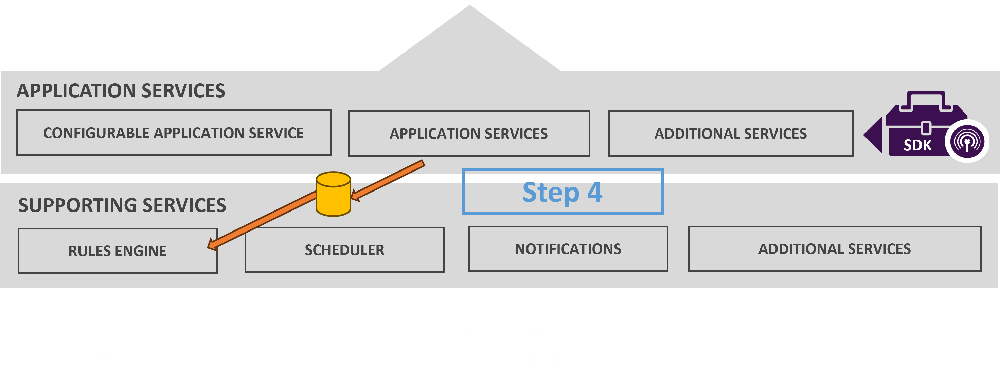
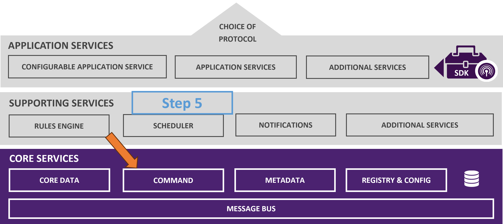

# About

EdgeX Foundry is an open source, vendor neutral, flexible, interoperable, software platform at the
edge of the network, that interacts with the physical world of [devices](./general/Definitions.md#Device), sensors, actuators, and other IoT objects. In simple terms, EdgeX is edge middleware - serving  between physical sensing and actuating "things" and our information technology (IT) systems.

The EdgeX platform enables and encourages the rapidly growing community of
IoT solution providers to work together in an ecosystem of interoperable
components to reduce uncertainty, accelerate time to market, and
facilitate scale.

By bringing this much-needed interoperability, EdgeX makes it easier to monitor physical world items, send instructions to them, collect data
from them, move the data across the fog up to the cloud where it may be
stored, aggregated, analyzed, and turned into information, actuated, and
acted upon. So EdgeX enables data to travel northwards towards the cloud or enterprise and back to devices, sensors, and actuators.

The initiative is aligned around a common goal: the simplification and
standardization of the foundation for tiered edge computing
architectures in the IoT market while still enabling the
ecosystem to provide significant value-added differentiation.

If you don't need further description and want to immediately use EdgeX
Foundry use this link: [Getting Started Guide](./getting-started/index.md)

## EdgeX Foundry Use Cases
Originally built to support industrial IoT needs, EdgeX today is used in a variety of use cases to include:

- Building automation – helping to manage shared workspace facilities
- Oil/gas – closed loop control of a gas supply valve
- Retail – multi-sensor reconciliation for loss prevention at the point of sale
- Water treatment – monitor and control chemical dosing
- Consumer IoT – the open source [HomeEdge](https://www.lfedge.org/projects/homeedge/) project is using elements of EdgeX as part of its smart home platform

## EdgeX Foundry Architectural Tenets

EdgeX Foundry was conceived with the following tenets guiding the
overall architecture:

- **EdgeX Foundry must be platform agnostic with regard to**
    - Hardware (x86, ARM)
    - Operating system (Linux, Windows, MacOS, ...)
    - Distribution
 (allowing for the distribution of functionality through micro services at the edge, on a gateway, in the fog, on cloud, etc.)
    - Deployment/orchestration (Docker, K8s, roll-your-own, ... )
    - Protocols ([north or south](./general/Definitions.md#South-and-North-Side) side protocols)

- **EdgeX Foundry must be extremely flexible**
    - Any part of the platform may be upgraded, replaced or augmented by other [micro services](./general/Definitions.md#Micro-service) or software components
    - Allow services to scale up and down based on device capability and use case 

- **EdgeX Foundry should provide "[reference implementation](./general/Definitions.md#Reference-Implementation)" services but encourages best of breed solutions**

- **EdgeX Foundry must provide for store and forward capability**
    - To support disconnected/remote edge systems
    - To deal with intermittent connectivity

- **EdgeX Foundry must support and facilitate "intelligence" moving closer to the edge in order to address**
    - Actuation latency concerns
    - Bandwidth and storage concerns 
    - Operating remotely concerns

- **EdgeX Foundry must support [brown and green](./general/Definitions.md#Brownfield-and-Greenfield) device/sensor field deployments**

- **EdgeX Foundry must be secure and easily managed**

## Deployments
EdgeX was originally built by Dell to run on its IoT [gateways](./general/Definitions.md#Gateway). While EdgeX can and does run on gateways, its platform agnostic nature and micro service architecture enables tiered distributed deployments.  In other words, a single instance of EdgeX’s micro services can be distributed across several host platforms.  The host platform for one or many EdgeX micro services is called a node.  This allows EdgeX to leverage compute, storage, and network resources wherever they live on the edge.

Its loosely-coupled architecture enables distribution across nodes to enable tiered edge computing.  For example, thing communicating services could run on a programmable logic controller (PLC), a gateway, or be embedded in smarter sensors while other EdgeX services are deployed on networked servers. The scope of a deployment could therefore include embedded sensors, controllers, edge gateways, servers and cloud systems.

EdgeX micro services can be deployed across an array of compute nodes to maximize resources while at the same time position more processing intelligence closer to the physical edge.  The number and the function of particular micro services deployed on a given node depends on the use case and capability of the hardware and infrastructure.

## Apache 2 License
EdgeX is distributed under [Apache 2 License](https://www.apache.org/licenses/LICENSE-2.0) backed by the Apache Foundation.  Apache 2 licensing is very friendly (“permissive”) to open and commercial interests.  It allows users to use the software for any purpose.  It allows users to distribute, modify or even fork the code base without seeking permission from the founding project.  It allows users to change or extend the code base without having to contribute back to the founding project.  It even allows users to build commercial products without concerns for profit sharing or royalties to go back to the Linux Foundation or open source project organization.

## EdgeX Foundry Service Layers

EdgeX Foundry is a collection of open source micro services. These
micro services are organized into 4 service layers, and 2 underlying
augmenting system services. The Service Layers traverse from the edge of
the physical realm (from the Device Services Layer), to the edge of the
information realm (that of the Application Services Layer), with the Core and Supporting Services Layers at the center.

The 4 Service Layers of EdgeX Foundry are as follows:

- Core Services Layer
- Supporting Services Layer
- Application Services Layer
- Device Services Layer

The 2 underlying System Services of EdgeX Foundry are as follows:

- Security
- System Management

### Core Services Layer

Core services provide the intermediary between the north and south sides of EdgeX.  As the name of these services implies, they are “core” to EdgeX functionality.  Core services is where most of the innate knowledge of what “things” are connected, what data is flowing through, and how EdgeX is configured resides in an EdgeX instance.  Core consists of the following micro services:

- Core data: a persistence repository and associated management service for data collected from south side objects.
- Command: a service that facilitates and controls actuation requests from the north side to the south side.
- Metadata: a repository and associated management service of metadata about the objects that are connected to EdgeX Foundry. Metadata provides the capability to provision new devices and pair them with their owning device services.
- Registry and Configuration: provides other EdgeX Foundry micro services with information about associated services within EdgeX Foundry and micro services configuration properties (i.e. - a repository of initialization values).

Core services provide intermediary communications between the things and the IT systems.

### Supporting Services Layer

The supporting services encompass a wide range of micro services to include edge analytics (also known as local analytics). Normal software application duties such as scheduler, and data clean up (also known as scrubbing in EdgeX) are performed by micro services in the supporting services layer.

These services often require some amount of core services in order to function.  In all cases, supporting service can be considered optional – that is they can be left out of an EdgeX deployment depending on use case needs and system resources.

Supporting services include:

- Rules Engine:  the reference implementation edge analytics service that performs if-then conditional actuation at the edge based on sensor data collected by the EdgeX instance.  This service may be replaced or augmented by use case specific analytics capability.
- Scheduler:  an internal EdgeX “clock” that can kick off operations in any EdgeX service.  At a configuration specified time, the service will call on any EdgeX service API URL via REST to trigger an operation.  For example, the scheduler service periodically calls on core data APIs to clean up old sensed events that have been successfully exported out of EdgeX.
- Alerts and Notifications:  provides EdgeX services with a central facility to send out an alert or notification.  These are notices sent to another system or to a person monitoring the EdgeX instance (internal service communications are often handled more directly).

### Application Services Layer

Application services are the means to extract, process/transform and send sensed data from EdgeX to an endpoint or process of your choice.  EdgeX today offers application service examples to send data to many of the major cloud providers (Amazon IoT Hub, Google IoT Core, Azure IoT Hub, IBM Watson IoT…), to MQTT(s) topics, and HTTP(s) REST endpoints.

Application services are based on the idea of a "functions pipeline". A functions pipeline is a collection of functions that process messages (in this case EdgeX event messages) in the order specified. The first function in a pipeline is a trigger. A trigger begins the functions pipeline execution. A trigger, for example, is something like a message landing in a message queue.  Each function then acts on the message.  Common functions include filtering, transformation (i.e. to XML or JSON), compression, and encryption functions.  The function pipeline ends when the message has gone through all the functions and is set to a sink.  Putting the resulting message into an MQTT topic to be sent to Azure or AWS is an example of a sink completing an application service.

### Device Services Layer

Device services connect “things” – that is sensors and devices – into the rest of EdgeX.

Device services are the edge connectors interacting with the "things" that include, but are not limited to: alarm systems, heating and air conditioning systems in homes and office buildings, lights, machines in any industry, irrigation systems, drones, currently automated transit such as some rail systems, currently automated factories, and appliances in your home. In the future, this may include driverless cars and trucks, traffic signals, fully automated fast food facilities, fully automated self-serve grocery stores, devices taking medical readings from patients, etc.

Device services may service one or a number of things or devices (sensor, actuator, etc.) at one time. A device that a device service manages, could be something other than a simple, single, physical device.  The device could be another gateway (and all of that gateway's devices), a device manager, a device aggregator that acts as a device, or collection of devices, to EdgeX Foundry.

The device service communicates with the devices, sensors, actuators, and other IoT objects through protocols native to each device object. The device service converts the data produced and communicated by the IoT object into a common EdgeX Foundry data structure, and sends that converted data into the core services layer, and to other micro services in other layers of EdgeX Foundry.

EdgeX comes with a number of [device services](https://wiki.edgexfoundry.org/display/FA/Device+Services+-+existing+and+work+underway) speaking many common IoT protocols such as Modbus, BACnet, MQTT, etc.

### System Services Layer

**Security Infrastructure**

Security elements of EdgeX Foundry protect the data and control of devices, sensors, and other IoT objects managed by EdgeX Foundry. Based on the fact that EdgeX is a "vendor-neutral open source software platform at the edge of the network", the EdgeX security features are also built on a foundation of open interfaces and pluggable, replaceable modules.

There are two major EdgeX security components.

- A security store, which is used to provide a safe place to keep the EdgeX secrets.  Examples of EdgeX secrets are the database access passwords used by the other services and tokens to connect to cloud systems. 
- An API gateway serves as the reverse proxy to restrict access to EdgeX REST resources and perform access control related works. 

### Software Development Kits (SDKs)

Two types of SDKs are provided by EdgeX to assist in creating north and south side services – specifically to create application services and device services.  SDKs for both the north and south side services make connecting new things or new cloud/enterprise systems easier by providing developers all the scaffolding code that takes care of the basic operations of the service.  Thereby allowing developers to focus on specifics of their connectivity to the south or north side object without worrying about all the raw plumbing of a micro service.

SDKs are language specific; meaning an SDK is written to create services in a particular programming language.  Today, EdgeX offers the following SDKs:

- Golang Device Service SDK
- C Device Service SDK
- Golang Application Functions SDK

## How EdgeX Works

### Sensor Data Collection
EdgeX’s primary job is to collect data from sensors and devices and make that data available to north side applications and systems.  Data is collected from a sensor by a device service that speaks the protocol of that device.  Example: a Modbus device service would communicate in Modbus to get a pressure reading from a Modbus pump.  The device service translates the sensor data into an EdgeX event object.  The device service can then either:

1. put the event object on a message bus (which may be implemented via Redis Streams or MQTT).  Subscribers to the event message on the message bus can be application services or core data or both (see step 1.1 below).

    

2. send the event object to the core data service via REST communications (see step 1.2).

    

When core data receives the event (either via message bus or REST), it persists the sensor data in the local edge database.  EdgeX uses Redis as our persistence store.  There is an abstraction in place to allow you to use another database (which has allowed other databases to be used in the past).  Persistence is not required and can be turned off.  Data is persisted in EdgeX at the edge for two basics reasons:

- Edge nodes are not always connected.  During periods of disconnected operations, the sensor data must be saved so that it can be transmitted northbound when connectivity is restored.  This is referred to as store and forward capability.
- In some cases, analytics of sensor data needs to look back in history in order to understand the trend and to make the right decision based on that history.  If a sensor reports that it is 72° F right now, you might want to know what the temperature was ten minutes ago before you make a decision to adjust a heating or cooling system.  If the temperature was 85° F, you may decide that adjustments to lower the room temperature you made ten minutes ago were sufficient to cool the room.  It is the context of historical data that are important to local analytic decisions.

When core data receives event objects from the device service via REST, it will put sensor data events on a message topic destined for application services.  Redis Pub/Sub is used as the messaging infrastructure by default (step 2).  MQTT or NATS (opt-in during build) can also be used as the messaging infrastructure between core data and the application services.

The application service transforms the data as needed and pushes the data to an endpoint.  It can also filter, enrich, compress, encrypt or perform other functions on the event before sending it to the endpoint (step 3).  The endpoint could be an HTTP/S endpoint, an MQTT topic, a cloud system (cloud topic), etc.

### Edge Analytics and Actuation
In edge computing, simply collecting sensor data is only part of the job of an edge platform like EdgeX.  Another important job of an edge platform is to be able to:

- Analyze the incoming sensor data locally
- Act quickly on that analysis
Edge or local analytics is the processing that performs an assessment of the sensor data collected at the edge (“locally”) and triggers actuations or actions based on what it sees.

Why [edge analytics](./general/Definitions.md#Edge-Analytics)?  Local analytics are important for two reasons:

- Some decisions cannot afford to wait for sensor collected data to be fed back to an enterprise or cloud system and have a response returned.
- Additionally, some edge systems are not always connected to the enterprise or cloud – they have intermittent periods of connectivity.

Local analytics allows systems to operate independently, at least for some stretches of time.  For example: a shipping container’s cooling system must be able to make decisions locally without the benefit of Internet connectivity for long periods of time when the ship is at sea.  Local analytics also allow a system to act quickly in a low latent fashion when critical to system operations.  As an extreme case, imagine that your car’s airbag fired on the basis of data being sent to the cloud and analyzed for collisions.  Your car has local analytics to prevent such a potentially slow and error prone delivery of the safety actuation in your automobile.  

EdgeX is built to act locally on data it collects from the edge.  In other words, events are processed by local analytics and can be used to trigger action back down on a sensor/device.

Just as application services prepare data for consumption by north side cloud systems or applications, application services can process and get EdgeX events (and the sensor data they contain) to any analytics package (see step 4).  By default, EdgeX ships with a simple rules engine (the default EdgeX rules engine is [eKuiper](https://www.lfedge.org/projects/ekuiper/) – an open source rules engine and now a sister project in LF Edge).  Your own analytics package (or ML agent) could replace or augment the local rules engine.

The analytic package can explore the sensor event data and make a decision to trigger actuation of a device.  For example, it could check that the pressure reading of an engine is greater than 60 PSI.  When such a rule is determined to be true, the analytic package calls on the core command service to trigger some action, like “open a valve” on some controllable device (see step 5).

The core command service gets the actuation request and determines which device it needs to act on with the request; then calling on the owning device service to do the actuation (see step 6).  Core command allows developers to put additional security measures or checks in place before actuating.

The device service receives the request for actuation, translates that into a protocol specific request and forwards the request to the desired device (see step 7).

## Project Release Cadence
Typically, EdgeX releases twice a year; once in the spring and once in the fall.  Bug fix releases may occur more often.  Each EdgeX release has a code name.  The code name follows an alphabetic pattern similar to Android (code names sequentially follow the alphabet).

The code name of each release is named after some geographical location in the world.  The honor of naming an EdgeX release is given to a community member deemed to have contributed significantly to the project.  A release also has a version number.  The release version follows sematic versioning to indicate the release is major or minor in scope.  Major releases typically contain significant new features and functionality and are not always backward compatible with prior releases.  Minor releases are backward compatible and usually contain bug fixes and fewer new features.  See the project Wiki for more information on [releases, versions and patches](https://wiki.edgexfoundry.org/pages/viewpage.action?pageId=21823969).

| Release | Schedule | Version |
| :------------- | :----------: | -----------: |
|Barcelona |Oct 2017 | 0.5.0 |
|California |Jun 2017 | 0.6.0 |
|Delhi |Oct 2018 | 0.7.0 |
|Edinburgh |Jul 2019 | 1.0.0 |
|Fuji |Nov 2019 | 1.1.0 |
|Geneva |May 2020 | 1.2.0 |
|Hanoi |November 2020 | 1.3.0 |
|Ireland |Spring 2021 | 2.0.0 |
|Jakarta |Fall 2021 | 2.1.0 |
|Kamukura |Spring 2022| TBD |
|Levski| Fall 2022| TBD|

*Note*: minor releases of the Device Services and Application Services (along with their associated SDKs) can be release independently.  Graphical User Interface, the command line interface (CLI) and other tools can be released independently.

EdgeX community members convene in a meeting right at the time of a release to plan the next release and roadmap future releases.

See the Project Wiki for more detailed information on [releases](https://wiki.edgexfoundry.org/display/FA/Releases) and [roadmap](https://wiki.edgexfoundry.org/display/FA/Roadmap).

## EdgeX History and Naming
EdgeX Foundry began as a project chartered by Dell IoT Marketing and developed by the Dell Client Office of the CTO as an incubation project called Project Fuse in July 2015.  It was initially created to run as the IoT software application on Dell’s introductory line of IoT gateways.
Dell entered the project into open source through the Linux Foundation on April 24, 2017.
EdgeX was formally announced and demonstrated at Hanover Messe 2017.  Hanover Messe is one of the world's largest industrial trade fairs.  At the fair, the Linux Foundation also announced the association of 50 founding member organizations – the EdgeX ecosystem – to help further the project and the goals of creating a universal edge platform.

The name ‘foundry’ was used to draw parallels to [Cloud Foundry](https://www.cloudfoundry.org/).  EdgeX Foundry is meant to be a foundry for solutions at the edge just like Cloud Foundry is a foundry for solutions in the cloud.  Cloud Foundry was originated by VMWare (Dell Technologies is a major shareholder of VMWare - recall that Dell Technologies was the original creator of EdgeX).  The ‘X’ in EdgeX represents the transformational aspects of the platform and allows the project name to be trademarked and to be used in efforts such as certification and certification marks.

The EdgeX Foundry Logo represents the nature of its role as transformation engine between the physical OT world and the digital IT world.

The EdgeX community selected the octopus as the mascot or “spirit animal” of the project at its inception.  Its eight arms and the suckers on the arms represent the sensors.  The sensors bring the data into the octopus.  Actually, the octopus has nine brains in a way.  It has millions of neurons running down each arm; functioning as mini-brains in each of those arms.  The arms of the octopus serve as “local analytics” like that offered by EdgeX.  The mascot is affectionately called “Edgey” by the community.

