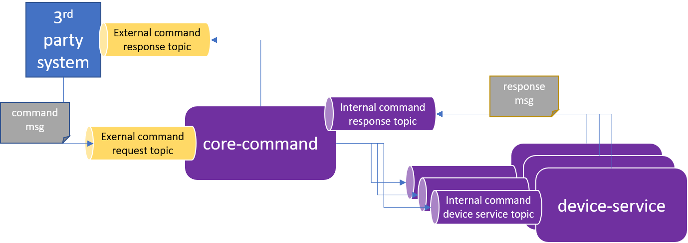
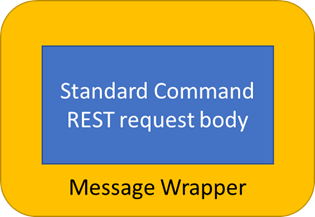

# North-South Messaging

## Status

**Approved** by TSC Vote on 4/28/22

## Context and Proposed Design

Today, data flowing from sensors/devices (the “southside”) through EdgeX to enterprise applications, databases and cloud-based systems (the “northside”) can be accomplished via REST or Message bus.  That is, sensor or device data collected by a device service can be sent via REST or message bus to core data.  Core data then relays the data to application services via message bus, but the sensor data can also be sent directly from device services to application services via message bus (bypassing core data).  The message bus is implemented via Redis Pub/Sub (default) or via MQTT.  From the application services, data can be sent to northside endpoints in any number of ways – including via MQTT.

So, in summary, data can be collected from a sensor or device and be sent from the southside to the northside entirely using message bus technology when desired.

Today, communications from a 3rd party system (enterprise application, cloud application, etc.) to EdgeX in order to acuate a device or get the latest information from a sensor is accomplished via REST.  The 3rd party system makes a REST call of the command service which then relays a request to a device service also using REST.  There is no built in means to make a message-based request of EdgeX or the devices/sensors it manages.  Note, these REST calls are optionally made via the API Gateway in order to provide access control.

In a future release of EdgeX, there is a desire to allow 3rd party systems to make requests of the southside via message bus.  Specifically, a 3rd party system will send a command request to the command service via external message broker. The command service would then relay the request via message bus to the managing device service via one of the allowed internal message bus implementations (which could be MQTT or Redis Pub/Sub today).  The device service would use the message to trigger action on the device/sensor as it does when it receives a REST request, and respond via message bus back to the command service.  In turn, the command service would relay the response to the 3rd party system via external message bus.

In summary, this ADR proposes that the core command service adds support for an external MQTT connection (in the same manner that app services provide an external MQTT connection), which will allow it to act as a bridge between the internal message bus (implemented via either MQTT or Redis Pub/Sub) and external MQTT message bus.


!!! Note
    For the purposes of this initial north-to-south message bus communications, external 3rd party communications to the command service will be **limited to use of MQTT**.

### Core Command as Message Bus Bridge

The core command service will serve as the EdgeX entry point for external, north-to-south message bus requests to the south side.



3rd party systems should not be granted access to the EdgeX internal message bus.  Therefore, in order to implement north to south communications via message bus (specifically MQTT), the command service needs to take messages from the 3rd party or external MQTT topics and pass them internally onto the EdgeX internal message bus where they can eventually be routed to the device services and then on to the devices/sensors (southside).

In reverse, response messages from the southside will also be sent through the internal EdgeX message bus to the command service where they can then be bridged to the external MQTT topics and respond to the 3rd party system requester.

!!! Note
    Note that eKuiper is allowed access directly to the internal EdgeX message bus.  This is a special circumstance of 3rd party external system communication as eKuiper is a sister project that is deemed the EdgeX reference implementation rules engine.  In future releases of EdgeX, even eKuiper may be routed through an external to internal message bus bridge for better decoupling and security.

### Message Bus Subscriptions and Publishing

The command service will require the means to publish messages to device services via the EdgeX message bus (**internal message bus**).  It would use the messaging client (go-mod-messaging) to create a new MessageClient, connect to the message bus, and publish to designated request message topics (see topic configuration below).

The command service will also need to connect to the EdgeX message bus (**internal message bus**) in order to receive responses from the device services after a request by message bus has been made.  Again, core command will use the go-mod-messaging MessageClient to subscribe and receive response messages from the device services.

In a similar fashion, device services will need to both subscribe and publish to the EdgeX message bus (**internal message bus**) to get command requests and push back any responses to the command service.  Go lang device services will, like the command service, use the go-mod-messaging module and MessagingClient to get command requests and send command responses to and from the EdgeX message bus.  C based device services will use a C alternative to subscribe and publish to the EdgeX message bus (**internal message bus**).  Note, device services already use go-mod-messaging when publishing events/readings to the message bus (**internal message bus**).

The command service will also need to subscribe to 3rd party MQTT topics (**external message bus**) in order to get command requests from the 3rd party system.  The command service will then relay command requests on to the appropriate device service via the internal message bus (forming the message bus to message bus bridge).  Likewise, the command service will accept responses from the device services on the EdgeX message bus (**internal message bus**) and then publish responses to the 3rd party system via the 3rd party MQTT topics (**external message bus**).

### Command Queries via Command Service
Today, 3rd party systems can make a REST call of core command to get the possible commands that can be executed.  There are two query REST API endpoints:  /device/all (to get the commands for all devices) and device/name/{name} (to get the commands for a specific device by name).

It stands to reason that if a 3rd party system wants to send commands via messaging that they would also want to get an understanding of what commands are available via messaging.  For this reason, the core command service will also allow message requests to get all command or get all commands for a particular device name.  In other words, the core command service must support command "queries" via messaging just as it supports command requests via messaging.

In the case of command queries, the REST responses include the actual REST command endpoints.  For example, the REST query would return core command paths, urls and parameters used to construct REST command requests (as shown in the example below).

``` JSON
 "coreCommands": [
        {
          "name": "coolingpoint1",
          "get": true,
          "path": "/api/v2/device/name/testDevice1/command/coolingpoint1",
          "url": "http://localhost:59882",
          "parameters": [
            {
              "resourceName": "resource1",
              "valueType": "Int32"
            }
          ]
        }
 ]
```

When using messaging to make the "queries" the response message must return information about how to pass a message to the appropriate topic to make the command request.  Therefore, the query response when using messaging would include something like the following:

``` JSON
 "coreCommands": [
        {
          "name": "coolingpoint1",
          "topic": "/edgex/command/request/testDevice1/coolingpoint/get",
          "parameters": [
            {
              "resourceName": "resource1",
              "valueType": "Int32"
            }          ]
        },
        {
          "name": "coolingpoint1",
          "topic": "/edgex/command/request/testDevice1/coolingpoint1/set",
          "parameters": [
            {
              "resourceName": "resource1",
              "valueType": "Int32"
            }          ]
        }
 ]
```

!!! Note
    Per Core WG meeting of 4/7/22 - the JSON above serves as a general example.  The implementation will have to address get/set (or read/write) differentiation, but this is considered an implementation detail to be resolved by the developers.

!!! Note
    The query response does not contain a URL since it is assumed that the broker address must already be known in order to make the query.

### Message Structure

In REST based command requests (and responses), the HTTP request line contains important information such as the path or target of the request, and the HTTP method type (indicating a GET or PUT request).  The HTTP status line provides the information such as the response code (ex: 200 for OK).  The body or payload of the HTTP message contains the request details (such as parameters to a device PUT call) or response information (such as events and associated readings from a GET call).  

Since most message bus protocols lack a generic message header mechanism (as in HTTP), providing request/response metadata is accomplished by defining a `message` envelope object associated with each request/response.  Therefore, messages described in this ADR must provide JSON `envelope` and `payload` objects for each request/response.

The message topic names act like the HTTP paths and methods in REST requests.  That is, the topic names specify the device receiver of any command request as paths do in the HTTP requests.



#### Message Envelope

The messages defined in this ADR are JSON formatted requests and responses that share a common base structure. The outer most JSON object represents the message `envelope`, which is used to convey metadata about request/response (e.g. a correlation identifier which will be added to any relayed request message as well as the response message envelope so that the 3rd party system will know to associate the responses to the original request).

!!! Note
        A Correlation ID (see this [article](https://www.rapid7.com/blog/post/2016/12/23/the-value-of-correlation-ids/) for a more detailed description) is a unique value that is added to every request and response involved in a transaction which could include multiple requests/responses between one or more microservices. It's not meant to correlate requests to responses, its meant to label every message involved in a potentially multi-request transaction.

        A Request ID should be an identifier returned on the response to a request (providing traceability between single request/response).

The `envelope` will also contain the API version (something provided in the HTTP path when using REST).

Command requests in HTTP may also contain ds-pushevent and ds-returnevent query parameters (for GET commands).  These will be optionally provided key/value pairs represented in the message `envelope`'s query parameters (and optionally allows for other parameters in the future).

``` JSON
{
    "Correlation-ID": "14a42ea6-c394-41c3-8bcd-a29b9f5e6835",
    "API":"V2",
    "queryParams": {
        "ds-pushevent":"true",
        "ds-returnevent":"true",
     }
     ...
}
```

!!! Note
    As with REST requests, if the ds-returnvent was `no`, then a message with envelope would be returned but with no payload as there would be no events to return.

#### Command Message Payload

The **request** message `payload` to the command service and those relayed to the device service would mimic their HTTP/REST request body alternatives.  The `payload` provides details needed in executing the command at the south side.

In the example GET and PUT messages below, note the `envelope` wraps or encases the message `payload`.  The payload may be empty (as is typical of GET requests).

``` JSON
{
    "Correlation-ID": "14a42ea6-c394-41c3-8bcd-a29b9f5e6835",
    "apiVersion": "v2",
    "requestId": "e6e8a2f4-eb14-4649-9e2b-175247911369",
    "queryParams": {
        "ds-pushevent":"true",
        "ds-returnevent":"true",
     }
}

{
    "Correlation-ID": "14a42ea6-c394-41c3-8bcd-a29b9f5e6835",
    "apiVersion": "v2",
    "requestId": "e6e8a2f4-eb14-4649-9e2b-175247911369",
    "payload": 
    {
        "AHU-TargetTemperature": "28.5",
        "AHU-TargetBand": "4.0",
        "AHU-TargetHumidity": {
            "Accuracy": "0.2-0.3% RH",
            "Value": 59
        }
    }
}
```

!!! Note
    Payload could be empty and therefore optional in the message structure - and exemplified in the top example here.


The **response** message `payload` would contain the response from the south side, which is typically EdgeX event/reading objects (in the case of GET requests) but would also include any error message details.

Example response messages for a GET and PUT request are shown below.  Again, note that the message `envelope` wraps the response `payload`.

``` JSON
{
    "Correlation-ID": "14a42ea6-c394-41c3-8bcd-a29b9f5e6835",
    "apiVersion": "v2",
    "requestId": "e6e8a2f4-eb14-4649-9e2b-175247911369",
    "errorCode": 0,
    "payload": 
    {
    "event": {
        "apiVersion": "v2",
        "id": "3fa85f64-5717-4562-b3fc-2c963f66afa6",
        "deviceName": "string",
        "profileName": "string",
        "created": 0,
        "origin": 0,
        "readings": [
            "string"
            ],
        "tags": {
            "Gateway-id": "HoustonStore-000123",
            "Latitude": "29.630771",
            "Longitude": "-95.377603"
            }
        }
    }
}

{
    "Correlation-ID": "14a42ea6-c394-41c3-8bcd-a29b9f5e6835",
    "apiVersion": "v2",
    "requestId": "e6e8a2f4-eb14-4649-9e2b-175247911369",
    "errorCode": 1,
    "payload": 
    {
        "message": "string"
    }
}

```

!!! Note
        Get command responses may include CBOR data.  The message envelope (which has a content type indicator) will indicate that the payload is either CBOR or JSON.  The same message envelope content type indicator that is used in REST communications will be used in this message bus communications.

!!! Alert
    Open discussions per working group meetings and reviews...

    - Should we be validating the messages for version (V2 in this case)?  Per @lenny-intel, do we validate incoming REST requests for the particular version of the APIs?
        - Ans (per monthly architect's meeting of 3/28/22): yes we should be validating, but this is not done in REST either.  We should implement validation for this message communications.  We should also add validation in REST communications in the future (Levski release??).  Add this to future planning meeting topics.
    - Should API version be in the response at all?  Per @iain-anderson, would the API version be implied in that a V2 request would mean a V2 response?
        - Ans (per monthly architect's meeting of 3/28/22): the DTO already has API version so it will be in the payload automatically.  Additionally, it was decided to add it to the message envelope.  The reason for this is that when using REST, the path of the request includes the version.  But in message communications which lacks the URL/path, it will be beneficial to also include the version in the envelope (in addition to the payload as part of the DTO) so that it is easily determined from the envelope without having to dig around in the payload.
    - Per core WG meeting discussion of 2/24/22 - do we really need the request id (is it redundant based on already having correlation id)?
        - Ans (per monthly architect's meeting of 3/28/22): request id and correlation id are two different things.  Request id should be returned on the response to a request (providing traceability between single request/response).  Correlation id is used to track across an entire transaction of many service request/responses (providing traceability across a "transaction" which is often across many services).  So both are needed and should be kept.
    - If we have request id, should it be in the payload?
        - Ans (per monthly architect's meeting of 3/28/22): This should be kept in the message envelope (not the message payaload).
    - Per core WG meeting discussion of 2/24/22 - do we have status code?  If so should it mimic the REST/HTTP status code responses?  Do we really want to mimic HTTP in our message bus approach?  As suggested by @farshidtz, maybe we should just have an `error` boolean and then have the message indicate the error condition. 
        - Ans (per monthly architect's meeting of 3/28/22): We will use errorCode to provide the indication of error.  The errorCode will be 0 (no error) or 1 (indicating error) as the two enums for error conditions today.  In the future, if we determine the need for additional errors, we will add more "enums" or error code numbers.  When there is an error (with errorCode set to 1), then the payload contains a message string indicating more information about the error.  When there is no error (errorCode 0) then there is no message string in the payload. 
    - If we have a status code or error code, where does it belong?  In the payload or in the envelope (as it would be in the header in REST)?  As a reference, the IoTAAP MQTT to REST bridge provides a status code to message string translation as an example means to handle this problem.  Should we use something similar?
        - Ans (per monthly architect's meeting of 3/28/22): errorCode should be in the message envelope not the payload.  When there is an error, the payload contains a single message string.

#### Query Message Payload

The **request** message `payload` to query the command service would mimic their HTTP/REST request body alternatives.  The `payload` provides details needed in executing the command at the south side.

In the example query to get all commands below, note the `envelope` wraps or encases the message `payload`.  The payload will be empty.  The query parameters will include the offset and limit (as per the REST counter parts).

``` JSON
{
    "Correlation-ID": "14a42ea6-c394-41c3-8bcd-a29b9f5e6835",
    "apiVersion": "v2",
    "requestId": "e6e8a2f4-eb14-4649-9e2b-175247911369",
    "queryParams": {
        "offset":0,
        "limit":20,
     }
}

In the example query to get commands for a specific device by name, the device name would be in the topic, so the query message would be without information (and removed from the message as queryParams will be optional).

{
    "Correlation-ID": "14a42ea6-c394-41c3-8bcd-a29b9f5e6835",
    "apiVersion": "v2",
    "requestId": "e6e8a2f4-eb14-4649-9e2b-175247911369",
}

```

The **response** message `payload` for queries would contain the information necessary to make a message-based command request.

An example response message is shown below.  Again, note that the message `envelope` wraps the response `payload`.

``` JSON
{
    "Correlation-ID": "14a42ea6-c394-41c3-8bcd-a29b9f5e6835",
    "apiVersion": "v2",
    "requestId": "e6e8a2f4-eb14-4649-9e2b-175247911369",
    "errorCode": 0,
    "payload": 
    {
        "apiVersion": "v2",
        "deviceCoreCommands": [
            {
            "deviceName": "testDevice1",
            "profileName": "testProfile",
            "coreCommands": [
                {
                "name": "coolingpoint1",
                "get": true,
                "topic": "/edgex/command/request/testDevice1/coolingpoint1/get",
                "url": "broker.address:1883",
                "parameters": [
                    {
                    "resourceName": "resource1",
                    "valueType": "Int32"
                    }
                ]
                }
            ]
            },
            {
            "deviceName": "testDevice1",
            "profileName": "testProfile",
            "coreCommands": [
                {
                "name": "coolingpoint1",
                "set": true,
                "topic": "/edgex/command/request/testDevice1/coolingpoint1/set",
                "url": "broker.address:1883",
                "parameters": [
                    {
                    "resourceName": "resource5",
                    "valueType": "String"
                    },
                    {
                    "resourceName": "resource6",
                    "valueType": "Bool"
                    }
                ]
                }
            ]
            }
        ]
    }
}

```

### Topic Naming


#### 3rd party system topics

The 3rd party system or application must publish command requests messages to an EdgeX specified MQTT topic (**external message bus**) and subscribe to responses from the same.  Messages topics should follow the following pattern:

- Publishing command request topic: `/edgex/command/request/<device-name>/<command-name>/<method>`
- Subscribing command response topic: `/edgex/command/response/#`

For queries, the following topics are used
- Publishing query command request topic: `/edgex/commandquery/request`
- Subscribing query command response topic: `/edgex/commandquery/response`

#### command service topics

The command service must subscribe to the request topics of the 3rd party MQTT topic (**external message bus**) to get command requests, publish those to a topic to send them to a device service via the EdgeX message bus (**internal message bus**), subscribe to response messages on topics from device services (**internal**), and then publish response messages to a topic on the 3rd party MQTT broker (**external**).  Message topics for the command service would follow the following standard:

- Subscribing to 3rd party command request topics: `edgex/command/request/#`
- Publishing to device service request topic: `edgex/command/request/<device-service>/<device-name>/<command-name>/<method>`
- Subscribing to device service command response topics: `edgex/command/response/#`
- Publishing to 3rd party command response topic: `edgex/command/response/<device-name>/<command-name>/<method>`

For queries, the following topics are used:

- Subscribing to 3rd party command query request topics: `edgex/commandquery/request`
- Publishing to 3rd party command query response topic: `edgex/commandquery/response`

#### device service topics

The device services must subscribe to the EdgeX command request topic (**internal message bus**) and publish response messages to an EdgeX command response topic.  The following naming standard will be applied to these topic names:

- Subscribing to command request topic: `edgex/command/request/#`
- Publishing to command response topic: `edgex/command/response/<device-service>/<device-name>/<command-name>/<method>`

### Configuration

Both the EdgeX command service and the device services must contain configuration needed to connect to and publish/subscribe to messages from topics on the EdgeX message bus (**internal**).  This includes configuration to access the message bus when secure or insecure.

The command service must also be provided configuration to connect to the 3rd party MQTT broker's topics (**external**).  Because the communications may be done in a secure or insecure fashion, the core command service will need to be provided access to the 3rd party MQTT broker (**external**)

Similar to EdgeX application services, the command service will have access to an external MQTT broker to get command requests and send 3rd parties a response.  This will require the command service to have two message queue configuration settings (internal and external).

#### command service configuration

Example command service configuration is provided below.

``` toml
[MessageQueue]
    [InternalMessageQueue]
    Protocol = "redis"
    Host = "localhost"
    Port = 6379
    Type = "redis"
    RequestTopicPrefix = "edgex/command/request/"   # for publishing requests to the device service; <device-service>/<device-name>/<command-name>/<method> will be added to this publish topic prefix
    ResponseTopic = "edgex/command/response/#”      # for subscribing to device service responses
    AuthMode = "usernamepassword"                   # required for redis messagebus (secure or insecure).
    SecretName = "redisdb"
    [ExternalMQTT]
    Protocol = "tcp"
    Host = "localhost"
    Port = 1883
    RequestCommandTopic = "edgex/command/request/#"           # for subscribing to 3rd party command requests
    ResponseCommandTopicPrefix = "edgex/command/response/"    # for publishing responses back to 3rd party systems /<device-name>/<command-name>/<method> will be added to this publish topic prefix
    RequestQueryTopic = "edgex/commandquery/request"
    ResponseQueryTopic = "edgex/commandquery/response"
```

!!! Note
        Core command contains no MessageQueue configuration today.  This is all additive/new configuration and therefore backward compatible with EdgeX 2.x implementations.

#### device service configuration

Example device service configuration is provided below.

``` toml
[MessageQueue]
## already existing message queue configuration (for sending events/readings to the message bus)
Protocol = "redis"
Host = "localhost"
Port = 6379
Type = "redis"
AuthMode = "usernamepassword"                           # required for redis messagebus (secure or insecure).
SecretName = "redisdb"
PublishTopicPrefix = "edgex/events/device" # /<device-profile-name>/<device-name>/<source-name> will be added to this Publish Topic prefix
  [MessageQueue.Optional]
  # Default MQTT Specific options that need to be here to enable environment variable overrides of them
  # Client Identifiers
  ClientId = "device-rest"
  # Connection information
  Qos = "0" # Quality of Service values are 0 (At most once), 1 (At least once) or 2 (Exactly once)
  KeepAlive = "10" # Seconds (must be 2 or greater)
  Retained = "false"
  AutoReconnect = "true"
  ConnectTimeout = "5" # Seconds
  SkipCertVerify = "false" # Only used if Cert/Key file or Cert/Key PEMblock are specified

## new configuration to allow device services to also communicate via message bus with core command
CommandRequestTopic = "edgex/command/request/#"         # subscribing for inbound command requests
CommandResponseTopicPrefix = "edgex/command/response/"  # publishing outbound command responses; <device-service>/<device-name>/<command-name>/<method> will be added to this publish topic prefix
```

!!! Note
        Most of the device service configuration is existing based on its need to already communicate with the message bus for publishing events/readings.  The last two lines are added to allow device services to subscribe and publish command messages from/to the message bus.

## EdgeX Service (Internal) Message Bus Requests

Application services (or other EdgeX services in the future) may want to also use message communications to make command requests.  Application services make command requests today via REST.

In order to support this, the following need to be added:

- The command service will also need an internal request topic and internal response topic prefix configuration to allow internal EdgeX services to make command requests (and query requests).

    ``` toml
        [MessageQueue]
            [InternalMessageQueue]
            Protocol = "redis"
            Host = "localhost"
            Port = 6379
            Type = "redis"
            RequestTopicPrefix = "edgex/command/request/"   # for publishing requests to the device service; <device-service>/<device-name>/<command-name>/<method> will be added to this publish topic prefix
            ResponseTopic = "edgex/command/response/#”      # for subscribing to device service responses
            InternalRequestCommandTopic = "/command/request/#"     # for subscribing to internal command requests
            InternalResponseCommandTopicPrefix = "/command/response/"    # for publishing responses back to internal service /<device-name>/<command-name>/<method> will be added to this publish topic prefix
            InternalRequestQueryTopic = "/commandquery/request"
            InternalResponseQueryTopic = "/commandquery/response"
            AuthMode = "usernamepassword"                   # required for redis messagebus (secure or insecure).
            SecretName = "redisdb"
    ```
    
- A new command message client will need to be created to allow internal services (app services in this instance) to conveniently use the message bus communications with core command.  The client service's configuration will also be expanded to include the corresponding topic and `UseMessageBus` flag that enables the new messaging based CommandClient to be created.   Example client configuration would look something like the following:

    ``` toml
        [Clients]
        [Clients.core-command]
        UseMessageBus = true
        Protocol = "redis"
        Host = "localhost"
        Port = 6379
        CommandRequestTopicPrefix = "/command/request"  /<device-name>/<command-name>/<method> will be added to this publish topic prefix
        CommandResponseTopic = "/command/response/#"
        CommandQueryRequestTopic = "/commandquery/request"
        CommandQueryResponseTopic = "/commandquery/response"
    ``` 

## Questions

- Do we need separate topics for all the devices or would one on the device service suffice?
    
    - Ans:  we have defined the deviceName in the parameterized topic, so one topic should be sufficient for Device Service- edgex/command/request/<device-name>...

- Would clients (non EdgeX services and applications) want to get a list of available commands via message (instead of calling REST)?

    - Ans:  this is a valid question and could be provided via later additions to the command service (or other service like metadata) in the future.  It does not have to be tackled immediately.  

- Dynamic configuration of the message subscription is not a user friendly operation today (requiring configuration changes).

    - Ans:  In the future, we might want to think about creating additional APIs for Adding/Updating/Deleting/Query the external subscription (and store them to the RedisDB).  One could also use the Consul UI to change configuration, but this would require the configuration in question be added to the writable section.

- Is it acceptable for more than one response to be published by the device service on the same correlation ID? Eg, send back "Acknowledged", then "Scheduled", then "Starting", then "Done" statuses?
    
    - Ans:  No, the correlation id has a life span to/from the initial requester to the response back to the requester.

- Would it make sense to echo the command name into the response, as a reality check?
    - Ans: solved via topic naming.  Also, per @lenny-intel: "not needed as we don't do this in the HTTP response. The response topic doesn't need the extra path info. The request ID or correlation ID is all that is needed to match the response to the request. No need to make it more complex."

- Would sending/receiving binary data (e.g. CBOR) be supported in this north-south message implementation?
    
    - Ans:  today, command service and device services support CBOR get operations but not set (C SDK suppports both).  [Suggest getting feature parity](https://github.com/edgexfoundry/device-sdk-go/issues/488) in place between the SDKs before exploring CBOR support messaging binary/CBOR payloads.
    - Ans update per Monthly Architect's meeting of 2/28/22: support get with CBOR payload.

- Use of the message bus communications (by the non-EdgeX 3rd party service or application) would bypass the API Gateway.

    - Ans:  (per Monthly Architect's meeting of 3/28/22) Since the command service is serving as an external to internal message bus broker.  While not an issue, it is worth calling out that the message bus security paradigm in use is not quite the same as what's provided by the API Gateway, which provides access control for EdgeX. When the API Gateway is used, the security configuration is defined by the EdgeX instance. When an EdgeX service acts as a bridge to an external message bus, if the external bus is properly configured, then any application on the bus can now interact with the EdgeX instance. Thus the security configuration is defined by the external broker, not EdgeX. Finally, note that most MQTT brokers support topic ACLs based on client username.

- Note a number of open questions in the Message Structure section that still need to be addressed.

!!! Alert

    Per TSC meeting of 4/27/22 - the discussion around error response was reopened.  There is still some polite disagreement as to whether to keep the error response simple (as documented in this ADR) or to offer errorCode enumerations that are similar to HTTP response codes for common problems (such as ).  As part of this discussion, the question is whether the error code enumerations should be exactly that of the HTTP response codes (400, 404, 423, 500, etc.) or more generic (i.e., non-HTTP) response error codes unique to this implementation.

    The resolution to this question was to explore some options at implementation time.  The use of an enumeration (HTTP or other) can be explored during development and options brought forth via PR.

!!! INFO
        This ADR does not handle securing the message bus communications between services.  This need is to be covered universally in an upcoming ADR.

## Future Considerations

- If desired, the query commands could return information to make *either* a REST or message request.  Presumably, the query responses would be the same then for both REST and message query requests so that information returned allows the 3rd party application to choose whether to use REST or message bus to make the command requests.
- As mentioned in this ADR, eKuiper is allowed access directly to the internal EdgeX message bus.  This is a special circumstance of 3rd party external system communication.  In future releases of EdgeX, even eKuiper may be routed through an external to internal message bus bridge for better decoupling and security.
- As noted, validation of all communications (REST or message bus) should be done in the future.
- In the future, we might want to think about creating additional APIs for Adding/Updating/Deleting/Query the external subscription (and store them to the RedisDB).  As part of this consideration, it should be noted that one could also use the Consul UI to change configuration, but this would require the configuration in question be added to the writable section.

## Consequences

## References

- [Core Command API](https://app.swaggerhub.com/apis/EdgeXFoundry1/core-command/2.1.0)
