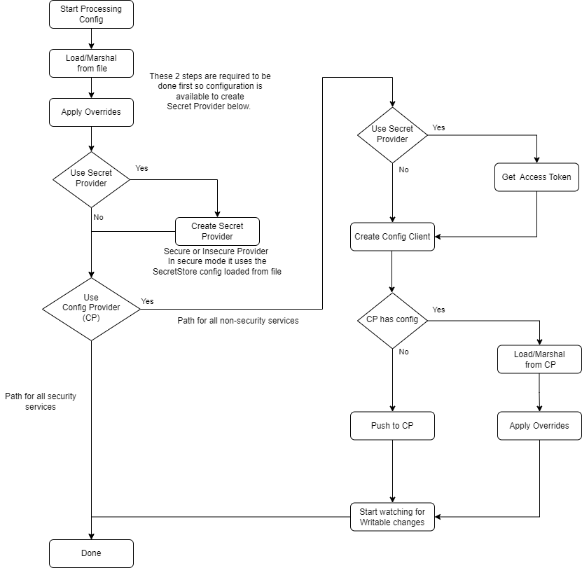

# Common Configuration
### Submitters
- Lenny Goodell (Intel)
- Elizabeth Lee (Intel)

## Change Log
- [original](https://github.com/edgexfoundry/edgex-docs/pull/909) - approved (2023-01-03)
- [revised](https://github.com/edgexfoundry/edgex-docs/pull/1025) - approved (2023-04-17)
  - Revised for Configuration Provider as System of Record  when used.

## Referenced Use Case(s)
- [Common Configuration UCR] - URL of use case link TBD

## Context
This ADR describes the architecture of the new common configuration capability which impacts all services. Requirements for this new capability are described in the above referenced UCR. This is deemed architecturally significant due to the cross-cutting impacts.

### Current Design

The following flow chart demonstrates the bootstrapping of each services' configuration in the current Levski release.



## Proposed Design
The configuration settings that are common to all services will be partitioned out into a separate common configuration source. This common configuration source will be pushed into the Configuration Provider by the new `core-common-config-bootstrapper` service.

During bootstrapping, each service will either load the common configuration from the Configuration Provider or via URI to some endpoint that provides the common configuration. Each service will have additional private configuration, which may override and/or extend the common configuration.  

An additional common configuration setting must be present to indicate all other common settings have been pushed to the Configuration Provider. This setting is stored last and the services must wait for this setting to be present prior to pulling the common settings.

Environment overrides are only applied when configuration is loaded from file. The overridden values are pushed into the Configuration Provider, when used.

### Common Config Bootstrapping

The following flow chart demonstrates the bootstrapping  (seeding) of the common configuration when using the Configuration Provider.


### Service Configuration Bootstrapping

The following flow chart demonstrates the bootstrapping of each services' configuration with this new common configuration capability.


### Secret Store Configuration

As part of this design, the Secret Store configuration is being removed from the service configuration (common and private). This is so the Secret Provider can be instantiated prior to processing the service's configuration which may require the Secret Provider. The Secret Store configuration will now be a combination of default values and environment variable overrides. These environment variables will be the same as the ones that are currently used to override the configuration.

### Specifying the Common Configuration location

If the `-cp/--configProvider` command line option is used, the service will default to pulling the common configuration from a standard path in the Configuration Provider. i.e. `edgex/3.0/common/` The `-cp/--configProvider` option assumes the usage of the core-common-config-bootstrapper service and cannot be used with the `-cc/--commonConfig` option.

The new `-cc/--commonConfig` command line option will be added for all services. This option will take the URI that specifies where the common configuration is pulled when not using the Configuration Provider. Authentication will be limited to `basic-auth`. In addition, a new environment override variable `EDGEX_COMMON_CONFIG` will be added which allows overriding this new command line option. 

If the `-cp/--configProvider` option is not specified and the `-cc/--commonConfig` option is not specified, then the service will start using solely the private configuration. In this scenario, any information in the common configuration must be added to the service's private configuration. The individual bootstrap handlers will need to be enhanced to detect an empty configuration for robust error messaging.

#### Options for Providing the Common Configuration

1. From the configuration provider, using the `-cp/--configProvider` command line option or the `EDGEX_CONFIG_PROVIDER` environment variable.
2. When the Configuration Provider is not used, the `-cc/--commonConfig` command line option or the `EDGEX_COMMON_CONFIG` environment variable may be specified using 
   1. An HTTP endpoint that returns the common configuration file in response
   2. A local file that contains the common configuration
3. From the private configuration file, alongside other private configurations

### Writable Sections

The Writable sections in common and in private configurations will be watched for changes when using the Configuration Provider.  When changes to the common Writable are processed, each changed setting must be checked to see if the setting exists in the service's private section. The change will be ignored if the setting exists in the service's private section. This is so that the service's private overrides are always retained.

Changes to the service's private Writable section will be processed as is done currently.

### Common Application and Device service settings

Any settings that are common to all Application Services and/or to all Device Services will be included in the single common configuration source. These settings will be ignored by services that don't use them when marshaled into the service's configuration struct.

### Example Configuration Files

#### Common Configuration

```toml
[Writable]
LogLevel = "INFO"
   [Writable.InsecureSecrets]
      [Writable.InsecureSecrets.DB]
         path = "redisdb"
            [Writable.InsecureSecrets.DB.Secrets]
            username = ""
            password = ""
 [Writable.Telemetry]
  Interval = "30s"
  PublishTopicPrefix  = "edgex/telemetry" # /<service-name>/<metric-name> will be added to this Publish Topic prefix
    [Writable.Telemetry.Metrics] # All service's metric names must be present in this list.
    # Device SDK Common Service Metrics
    EventsSent = false
    ReadingsSent = false
    # App SDK Common Service Metrics
    MessagesReceived = false
    InvalidMessagesReceived = false
    PipelineMessagesProcessed = false # Pipeline IDs are added as the tag for the metric for each pipeline defined
    PipelineMessageProcessingTime = false # Pipeline IDs are added as the tag for the metric for each pipeline defined
    PipelineProcessingErrors = false # Pipeline IDs are added as the tag for the metric for each pipeline defined
    HttpExportSize = false # Single metric used for all HTTP Exports
    MqttExportSize = false # BrokerAddress and Topic are added as the tag for this metric for each MqttExport defined    
    # Common Security Service Metrics
    SecuritySecretsRequested = false
    SecuritySecretsStored = false
    SecurityConsulTokensRequested = false
    SecurityConsulTokenDuration = false
    [Writable.Telemetry.Tags] # Contains the service level tags to be attached to all the service's metrics
    # Gateway="my-iot-gateway" # Tag must be added here or via Consul Env Override can only chnage existing value, not added new ones.

 # Device Service specifc common Writable configuration
 [Writable.Reading]
 ReadingUnits = true
 
 # Application Service specifc common Writable configuration
 [Writable.StoreAndForward]
   Enabled = false
   RetryInterval = "5m"
   MaxRetryCount = 10
   
[Service]
HealthCheckInterval = "10s"
Host = "localhost"
ServerBindAddr = "" # Leave blank so default to Host value unless different value is needed.
MaxResultCount = 1024
MaxRequestSize = 0 # Not curently used. Defines the maximum size of http request body in bytes
RequestTimeout = "5s"
  [Service.CORSConfiguration]
  EnableCORS = false
  CORSAllowCredentials = false
  CORSAllowedOrigin = "https://localhost"
  CORSAllowedMethods = "GET, POST, PUT, PATCH, DELETE"
  CORSAllowedHeaders = "Authorization, Accept, Accept-Language, Content-Language, Content-Type, X-Correlation-ID"
  CORSExposeHeaders = "Cache-Control, Content-Language, Content-Length, Content-Type, Expires, Last-Modified, Pragma, X-Correlation-ID"
  CORSMaxAge = 3600

[Registry]
Host = "localhost"
Port = 8500
Type = "consul"

[Databases]
  [Databases.Primary]
  Host = "localhost"
  Port = 6379
  Timeout = 5000
  Type = "redisdb"
  
[MessageQueue]
Protocol = "redis"
Host = "localhost"
Port = 6379
Type = "redis"
AuthMode = "usernamepassword"  # required for redis messagebus (secure or insecure).
SecretName = "redisdb"
  [MessageQueue.Optional]
  # Default MQTT Specific options that need to be here to enable evnironment variable overrides of them
  Qos =  "0" # Quality of Sevice values are 0 (At most once), 1 (At least once) or 2 (Exactly once)
  KeepAlive = "10" # Seconds (must be 2 or greater)
  Retained = "false"
  AutoReconnect = "true"
  ConnectTimeout = "5" # Seconds
  SkipCertVerify = "false"
  # Additional Default NATS Specific options that need to be here to enable evnironment variable overrides of them
  Format = "nats"
  RetryOnFailedConnect = "true"
  QueueGroup = ""
  Durable = ""
  AutoProvision = "true"
  Deliver = "new"
  DefaultPubRetryAttempts = "2"
  Subject = "edgex/#" # Required for NATS Jetstram only for stream autoprovsioning
  
# Device Service specifc common configuration
[Device]
DataTransform = true
MaxCmdOps = 128
MaxCmdValueLen = 256
ProfilesDir = "./res/profiles"
DevicesDir = "./res/devices"
EnableAsyncReadings = true
AsyncBufferSize = 16
Labels = []
UseMessageBus = true
  [Device.Discovery]
  Enabled = false
  Interval = "30s"

# Application Service specifc common configuration 
[Trigger]
Type="edgex-messagebus"
  [Trigger.EdgexMessageBus]
  Type = "redis"
    [Trigger.EdgexMessageBus.SubscribeHost]
    Host = "localhost"
    Port = 6379
    Protocol = "redis"
    [Trigger.EdgexMessageBus.PublishHost]
    Host = "localhost"
    Port = 6379
    Protocol = "redis"
    [Trigger.EdgexMessageBus.Optional]
    authmode = "usernamepassword"  # required for redis messagebus (secure or insecure).
    secretname = "redisdb"
    # Default MQTT Specific options that need to be here to enable environment variable overrides of them
    Qos =  "0" # Quality of Service values are 0 (At most once), 1 (At least once) or 2 (Exactly once)
    KeepAlive =  "10" # Seconds (must be 2 or greater)
    Retained = "false"
    AutoReconnect = "true"
    ConnectTimeout = "5" # Seconds
    SkipCertVerify = "false"
    # Default NATS Specific options that need to be here to enable environment variable overrides of them
    Format = "nats"
    RetryOnFailedConnect = "true"
    QueueGroup = ""
    Durable = ""
    AutoProvision = "true"
    Deliver = "new"
    DefaultPubRetryAttempts = "2"
    Subject = "edgex/#" # Required for NATS JetStream only for stream auto provisioning
```

#### Core Data Private Configuration

```toml
MaxEventSize = 25000  # Defines the maximum event size in kilobytes

[Writable]
PersistData = true
  [Writable.Telemetry]
    [Writable.Telemetry.Metrics] # All service's metric names must be present in this list.
    # Core Data Service Metrics
    EventsPersisted = false
    ReadingsPersisted = false
[Service]
Port = 59880
StartupMsg = "This is the Core Data Microservice"

[Clients] # Core data no longer dependent on "Client" services. Other services will have thier specific clients here

[Databases]
  [Databases.Primary]
  Name = "coredata"

[MessageQueue]
PublishTopicPrefix = "edgex/events/core" # /<device-profile-name>/<device-name> will be added to this Publish Topic prefix
SubscribeEnabled = true
SubscribeTopic = "edgex/events/device/#"  # required for subscribing to Events from MessageBus
  [MessageQueue.Optional]
  # Default MQTT Specific options that need to be here to enable evnironment variable overrides of them
  ClientId ="core-data"

```

#### App RFID LLRP Inventory Private Configuration

```toml
[Service]
Port = 59711
StartupMsg = "RFID LLRP Inventory Service"

[Clients]
  [Clients.core-data]
  Protocol = "http"
  Host = "localhost"
  Port = 59880
  
  [Clients.core-metadata]
  Protocol = "http"
  Host = "localhost"
  Port = 59881

  [Clients.core-command]
  Protocol = "http"
  Host = "localhost"
  Port = 59882

[Trigger]
Type="edgex-messagebus"
  [Trigger.EdgexMessageBus]
    [Trigger.EdgexMessageBus.SubscribeHost]
    SubscribeTopics="edgex/events/#/#/#/ROAccessReport,edgex/events/#/#/#/ReaderEventNotification"
    [Trigger.EdgexMessageBus.PublishHost]
    PublishTopic="edgex/events/device/{profilename}/{devicename}/{sourcename}" # publish to same topic format the Device Services use
    [Trigger.EdgexMessageBus.Optional]
    # Default MQTT Specific options that need to be here to enable environment variable overrides of them
    ClientId ="app-rfid-llrp-inventory"

[AppCustom]
  # Every device(reader) + antenna port represents a tag location and can be assigned an alias
  # such as Freezer, Backroom etc. to give more meaning to the data. The default alias set by
  # the application has a format of <deviceName>_<antennaId> e.g. Reader-10-EF-25_1 where
  # Reader-10-EF-25 is the deviceName and 1 is the antennaId.
  # See also: https://github.com/edgexfoundry/app-rfid-llrp-inventory#setting-the-aliases
  #
  # In order to override an alias, set the default alias as the key, and the new alias as the value you want, such as:
  # Reader-10-EF-25_1 = "Freezer"
  # Reader-10-EF-25_2 = "Backroom"
  [AppCustom.Aliases]

  # See: https://github.com/edgexfoundry/app-rfid-llrp-inventory#configuration
  [AppCustom.AppSettings]
  DeviceServiceName = "device-rfid-llrp"
  AdjustLastReadOnByOrigin = true
  DepartedThresholdSeconds = 600
  DepartedCheckIntervalSeconds = 30
  AgeOutHours = 336
  MobilityProfileThreshold = 6.0
  MobilityProfileHoldoffMillis = 500.0
  MobilityProfileSlope = -0.008
```

#### Device MQTT  Private Configuration

```toml
MaxEventSize = 0 # value 0 unlimit the maximum event size that can be sent to message bus or core-data

[Writable]
  # InsecureSecrets are required for when Redis is used for message bus
  [Writable.InsecureSecrets]
    [Writable.InsecureSecrets.MQTT]
    path = "credentials"
      [Writable.InsecureSecrets.MQTT.Secrets]
      username = ""
      password = ""

[Service]
Port = 59982
StartupMsg = "device mqtt started"

[Clients]
  [Clients.core-data]
  Protocol = "http"
  Host = "localhost"
  Port = 59880

  [Clients.core-metadata]
  Protocol = "http"
  Host = "localhost"
  Port = 59881

[MessageQueue]
PublishTopicPrefix = "edgex/events/device" # /<device-profile-name>/<device-name>/<source-name> will be added to this Publish Topic prefix
  [MessageQueue.Optional]
  # Default MQTT & NATS Specific options that need to be here to enable environment variable overrides of them
  ClientId = "device-mqtt"
  [MessageQueue.Topics]
  CommandRequestTopic = "edgex/device/command/request/device-mqtt/#"   # subscribing for inbound command requests
  CommandResponseTopicPrefix = "edgex/device/command/response"   # publishing outbound command responses; <device-service>/<device-name>/<command-name>/<method> will be added to this publish topic prefix

[MQTTBrokerInfo]
Schema = "tcp"
Host = "localhost"
Port = 1883
Qos = 0
KeepAlive = 3600
ClientId = "device-mqtt"

CredentialsRetryTime = 120 # Seconds
CredentialsRetryWait = 1 # Seconds
ConnEstablishingRetry = 10
ConnRetryWaitTime = 5

# AuthMode is the MQTT broker authentication mechanism. Currently, "none" and "usernamepassword" is the only AuthMode supported by this service, and the secret keys are "username" and "password".
AuthMode = "none"
CredentialsPath = "credentials"

# Comment out/remove when using multi-level topics
IncomingTopic = "DataTopic"
ResponseTopic = "ResponseTopic"
UseTopicLevels = false

# Uncomment to use multi-level topics
# IncomingTopic = "incoming/data/#"
# ResponseTopic = "command/response/#"
# UseTopicLevels = true

    [MQTTBrokerInfo.Writable]
    # ResponseFetchInterval specifies the retry interval(milliseconds) to fetch the command response from the MQTT broker
    ResponseFetchInterval = 500
```

### Modules and Services Impacted

The following modules and services are impacted:

- go-mod-bootstrap
    - All service configuration bootstrapping is handled in this module
- All services which consume go-mod-bootstrap
    - The configuration files will be updated to remove all common  settings
    - This leaves only the private settings and overrides of certain common settings (See examples above)
- New service which provides the common configuration
    - Contains new configuration file which contains all the common settings (See example above) 
    - No environment overrides will be applied to the common settings
    - This service is responsible for 
      - Pushing the common settings into the Configuration Provider during first start-up
      - Providing the override flag common to all services to force re-pushing the configuration into the Configuration Provider
- Changes to security-secret-store-setup are needed to seed the Basic Auth secret for the new configuration service and distribute it to the consuming microservice(s) 
- TAF test scripts may be impacted based on which settings are modified via the Configuration Provider

## Considerations

- New service which owns the common configuration could be integrated into Core Metadata rather than creating a new microservice. This violates the microservice design principle of single responsibility.
- When using the Configuration Provider, environment overrides are only used to seed the values into the Configuration Provider. This makes the Configuration Provider the **System of Record** for configuration when it is used. i.e. Environment overrides no longer have highest precedence as they do in EdgeX 2.x. Changing/adding environment overrides after the Configuration Provider is seeded has no impact on the service's configuration.
- Service full configuration store in Configuration Provider rather than just private settings. Consensus is that this is redundant for the common settings and should only be the service's private settings.
- Separate Application Service and Device Service common configuration settings could be in their own configuration sources which are loaded separately by Application and Device Services. This would add undue complexity that is mitigated by these settings being ignored by the marshaller in those services that do not use them.
- The new service could provide a REST endpoint to serve the common configuration. Consensus is to have no default configuration, thus no need for an endpoint.

## Decision
- Accept this new capability as described above.

## Other Related ADRs
- [0005-Service-Self-Config](../../adr/0005-Service-Self-Config/)

## References
- TBD
