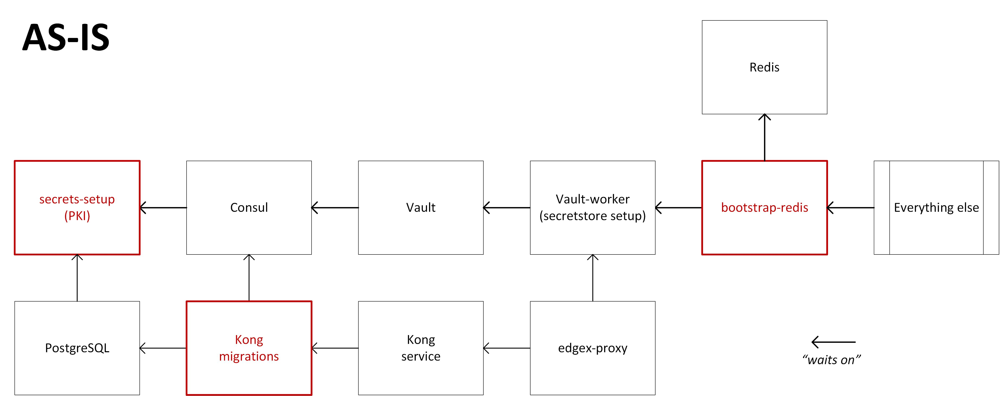

# Secure Bootstrapping of EdgeX

- [Secure Bootstrapping of EdgeX](#secure-bootstrapping-of-edgex)
  * [Status](#status)
  * [Context](#context)
    + [History](#history)
  * [Decision](#decision)
    + [Stage-gate mechanism](#stage-gate-mechanism)
    + [Docker-specific service changes](#docker-specific-service-changes)
      - ["As-is" startup flow](#as-is-startup-flow)
      - ["To-be" startup flow](#to-be-startup-flow)
      - [New Bootstrap/RTR container](#new-bootstraprtr-container)
  * [Consequences](#consequences)
    + [Benefits](#benefits)
    + [Drawbacks](#drawbacks)
  * [Alternatives](#alternatives)
    + [Event-driven vs commanded staging](#event-driven-vs-commanded-staging)
    + [System management agent (SMA) as the coordinator](#system-management-agent-sma-as-the-coordinator)
    + [Create a mega-install container](#create-a-mega-install-container)
    + [Manual secret provisioning](#manual-secret-provisioning)
  * [References](#references)

## Status

** Approved **

## Context

Docker-compose, the tool used by EdgeX to manage its Docker-based stack,
lags in its support for initialization logic.

Docker-compose v2.x used to have a `depends_on / condition` directive
that would test a service's HEALTHCHECK
and block startup
until the service was "healthy".
Unfortunately, this feature was removed in 3.x docker-compose.
(This feature is also unsuppported in swarm mode as well.)

Snaps have an explicit install phase and Kubernetes PODs have optional init containers.
In other frameworks, initialization is allowed to run to completion
prior to application components being started in production mode.
This functionality does not exist in Docker nor docker-compose.

The current lack of an initialization phase is a blocking
issue for implementing microservice communication security,
as critical EdgeX core components that are involved with
microservice communication (specifically Consul)
are being brought up in an insecure configuration.
(Consul's insecure configuration is will be addressed in a
[separate ADR](https://github.com/edgexfoundry/edgex-docs/issues/296).)

Activities that are best done in the initialization phase include the following:

* Bootstrapping of crytographic secrets needed by the application.
* Bootstrapping of database users and passwords.
* Installation of database schema needed for application logic to function.
* Initialization of authorization frameworks such as configuring RBAC or ACLs.
* Other one-time initialization activities.

Workarounds when an installation phase is not present include:

* Perform initialization tasks manually,
  and manually seed secrets into static configuration files.
* Ship with known hard-coded secrets in static configuration files.
* Start in an insecure configuration and remain that way.
* Provision some secrets at runtime.

EdgeX does not have a manual installation flow,
and uses a combination of the last three approaches.

The objective of this ADR is to define a framework for Docker-based initialization logic in EdgeX.
This will enable the removal of certain hard-coded secrets in EdgeX
and enable certain components (such as Consul) to be started in a secure configuration.
These improvement are necessary pre-requisites to implementing microservice communication security.

### History

In previous releases, container startup sequencing has been
primarily been driven by Consul service health checks
backed healthcheck endpoints of particular services
or by sentinel files placed in the file system
when certain intialization milestones are reached.

The implementation has been plagued by several issues:

* Sentinel files are not cleaned up if the framework fails or is shut down.
  Invalid state left over from previous instantiations of the framework
  causes difficult-to-resolve race conditions.
  (Implementation of this ADR will try to remove as many as possible,
  focusing on those that are used to gate startup.
  Some use of sentinel files may still be required to indicate
  completion of initialization steps so that they are not re-done
  if there is no API-based mechanism to determine if such
  initialization has been completed.)

* Consul healh checks are reported in a difficult-to-parse
  JSON structure, which has lead to the creation of specialized
  tools that are insensitive to libc implementations
  used by different container images.

* Consul is being used not only for service health, but for
  [service location and configuration as well](https://github.com/edgexfoundry/edgex-docs/issues/279).
  The requirement to synchronize framework startup for
  the purpose of securely initializing Consul means
  that a non-Consul mechanism must be used
  to stage-gate EdgeX initialization.

This last point is the primary motivator of this ADR.

## Decision

### Stage-gate mechanism

The stage-gate mechanism must work in the following environments:

* docker-compose in Linux on a single node/system
* docker-compose in Microsoft* Windows* on a single node/system
* docker-compose in Apple* MacOS* on a single node/system

Startup sequencing will be driven by two primary mechanisms:

1. Use of entrypoint scripts to:

   - Block on stage-gate and service dependencies
   - Perform first-boot initialization phase activities as noted in [Context](#context)

   The bootstrap container will inject entrypoint scripts into
   the other containers in the case where EdgeX is directly consuming
   an upstream container.  Docker will automatically retry
   restarting containers if its entrypoint script is missing.

2. Use of open TCP sockets as semaphores to gate startup sequencing

   Use of TCP sockets for startup sequencing is commonly used in Docker environments.
   Due to its popularlity, there are several existing tools for this, including
   [wait-for-it](https://github.com/vishnubob/wait-for-it),
   [dockerize](https://github.com/jwilder/dockerize), and
   [wait-for](https://github.com/Eficode/wait-for).
   The TCP mechanism is portable across platforms
   and will work in distributed multi-node scenarios.

At least three new ports will be added to EdgeX for sequencing purposes:

* `bootstrap` port. This port will be opened once first-time initialization has been completed.
* `tokens_ready` port. This port signals that secret-store tokens have been provisioned and are valid.
* `ready_to_run` port. This port will be opened once stateful services have completed initialization
  and it is safe for the majority of EdgeX core services to start.

The stateless EdgeX services should block on `ready_to_run` port.

### Docker-specific service changes

#### "As-is" startup flow

The following diagram shows the "as-is" startup flow.

There are several components being removed via activity unrelated with this ADR.
These proposed edits are shown to reduce clutter in the TO-BE diagram.
* secrets-setup is being eliminated through a separate ADR to eliminate TLS for single-node usage.
* kong-migrations is being combined with the kong service via an entrypoint script.
* bootstrap-redis will be incorporated into the Redis entrypoint script to set the Redis password before Redis starts to fix the time delay before a Redis password is set.

#### "To-be" startup flow

The following diagram shows the "to-be" startup flow.
Note that the bootstrap flows are always processed,
but can be short-circuited.

Another difference to note in the "to-be" diagram is that
the Vault depdendency on Consul is reversed
[in order to provide better security](https://github.com/edgexfoundry/edgex-docs/issues/296).

#### New Bootstrap/RTR container

The purpose of this new container is to:

* Inject entrypoint scripts into third-party containers
  (such as Vault, Redis, Consul, PostgreSQL, Kong)
  in order to perform first-time initialization and
  wait on service dependencies
* Raise the `bootstrap` semaphore
* Wait on dependent semaphores required to raise the `ready_to_run` semaphore
  (these are the stateful components such as databases,
  and blocking waiting for sercret store tokens to be provisioned)
* Raise the `ready_to_run` semaphore
* Wait forever (in order to leave TCP sockets open)

## Consequences

### Benefits

This ADR is expected to yield the following benefits after completion of the related engineering tasks:

* Standardization of the stage-gate mechanism.
* Standardized approach to component initialization in Docker.
* Reduced fragility in the framework startup flow.
* Vault no longer uses Consul as its data store (uses file system instead).
* Ability to use a stock Consul container instead of creating a custom one for EdgeX
* Elimination of several sentinel files used for Consul health checks
  - /tmp/edgex/secrets/ca/.security-secrets-setup.complete
  - /tmp/edgex/secrets/edgex-consul/.secretstore-setup-done

### Drawbacks

* Introduction of a new container into the startup flow
  (but other containers are eliminated or combined).

* Expanded scope and responsibility of entrypoint scripts,
  which must not only block component startup,
  but now must also configure a component for secure operation.

## Alternatives

### Event-driven vs commanded staging

In this scenario,
instead of a service waiting on a TCP-socket semaphore created by another service,
services would open a socket and wait for a coordinator/controller to issue a "go" command.

This solution was not chosen for several reasons:

1. The code required to open a socket and wait for a command
   is much more complicated than the code required to check for an open socket.
   Many open source utilities exist to block on a socket opening;
   there are no such examples for the reverse.
1. This solution would would duplicate the information regarding
   which services need to run: once in the docker-compose file,
   and once as a configuration file to the coordinator/controller.

### System management agent (SMA) as the coordinator

In this scenario,
the system management agent is responsbile bringing up the EdgeX framework.
Since the system management agent has access to the Docker socket,
it has the ability to start services in a prescribed order,
and as a management agent,
has knowledge about the desired state of the framework.

This solution was not chosen for several reasons:

1. SMA is an optional EdgeX component--use in this way would make SMA a required core component.
1. SMA, in order to authenticate an authorize remote management requests,
   requires access to persistent state and secrets.
   To make the same component responsible for initializing that state and secrets
   upon which it depends would make the design convoluted.

### Create a mega-install container

This alternative would create a mega-install container
that has locally installed verions of critical components
needed for bootstrapping such as Vault, Consul, PostgreSQL,
and others.

A sequential script would start each component in turn,
intiailizing each to run in a secure configuration,
and then shut them all down again.

The same stage-gate mechanism would be used to block
startup of these same components, but Docker would
start them in production configuration.

### Manual secret provisioning

A typical cloud-based microservice architecture typically has a manual provisioning step.
This step would include activities such as configuring Vault,
installing a database schema,
setting up database service account passwords,
and seeding initial secrets such as PKI private keys
that have been generated offline
(possibly requiring several days of lead time).
A cloud team may have weeks or months to prepare for this event,
and it might take the greater part of a day.

In contrast,
EdgeX up to this point has been a "turnkey" middleware framework:
it can be deployed with the same ease as an application,
such as via a docker-compose file,
or via a snap install.
This means that most of the secret provisioning must be automated
and the provisioning logic must be built into the framework in some way.
The proposals presented in this ADR are compatibile with
continuance of this functionality.

## References

- [ADR 0008 - Creation and Distribution of Secrets](0008-Secret-Creation-and-Distribution.md)
- [ADR 0015 - Encryption between microservices](0015-in-cluster-tls.md),
- [Hashicorp Consul](https://www.consul.io/)
- [Hashicorp Vault](https://www.vaultproject.io/)
- [Issue: ADR for securing access to Consul](https://github.com/edgexfoundry/edgex-docs/issues/296)
- [Issue: Service registry ADR](https://github.com/edgexfoundry/edgex-docs/issues/279)