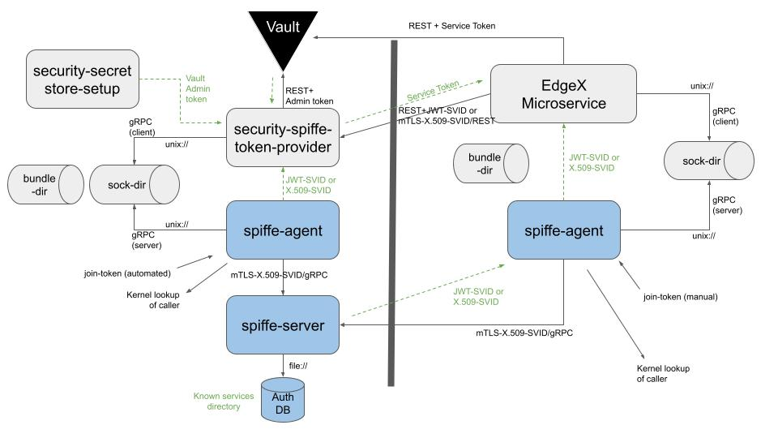

# Use SPIFFE/SPIRE for On-demand Secret Store Token Generation

## Status

** Approved ** via TSC vote on 2021-12-14

## Context

In security-enabled EdgeX,
there is a component called `security-secretstore-setup`
that seeds authentication tokens for Hashicorp Vault--EdgeX's secret store--into
directories reserved for each EdgeX microservice.
The implementation is provided by a sub-component, `security-file-token-provider`,
that works off of a static configuration file (`token-config.json`)
that configures known EdgeX services,
and an environment variable that lists additional services that require tokens.
The token provider creates a unique token for each service
and attaches a custom policy to each token that limits token access
in a manner that paritions the secret store's namespace.

The current solution has some problematic aspects:

* These tokens have an initial TTL of one hour (1h)
  and become invalid if not used and renewed within that time period.
  It is not possible to delay the start of EdgeX services until a later time
  (that is, greater than the default token TTL),
  as they will not be able to connect to the EdgeX secret store
  to obtain required secrets.

* Transmission of the authentication token requires one or more shared file systems
  between the service and `security-secretstore-setup`.
  In the Docker implementation,
  this shared file system is constructed by bind-mounting a host-based directory
  to multiple containers.
  The snap implementation is similar, utilizing a content-interface between snaps.
  In a Kubernetes implementation limited to a single worker node,
  a CSI storage driver that provided RWO volumes would suffice.

* The current approach cannot support distributed services
  without an underlying distributed file system to distribute tokens,
  such as GlusterFS, running across the participating nodes.
  For Kubernetes, the requirement would be a remote shared file system
  persistent volume (RWX volume).

## Decision

EdgeX will create a new service, `security-spiffe-token-provider`.
This service will be a mutual-auth TLS service that exchanges
a [SPIFFE](https://spiffe.io/) X.509 SVID for a secret store token.

An SPIFFE identifier is a URI of the format `spiffe://trust domain/workload identifier`.
For example: `spiffe://edgexfoundry.org/service/core-data`.
A SPIFFE Verifiable Identity Document (SVID) is a cryptographically-signed
version of a SPIFFE ID, typically a X.509 certificate with
the SPIFFE ID encoded into the `subjectAltName` certificate extension,
or a JSON web token (encoded into the `sub` claim).
The EdgeX implementation will use a naming convention on
the path component, such as the above, in order to be
able to extract the requesting service from the SPIFFE ID.

The SPIFFE token provider will take three parameters:

1. An X.509 SVID used in mutual-auth TLS for the token provider
   and the service to cross-authenticate.
   
2. The reqested service key.  If blank, the service key will
   default to the service name encoded in the SVID.
   If the service name follows the pattern `device-(name)`,
   then the service key must follow the format
   `device-(name)` or `device-name-*`.
   If the service name is `app-service-configurable`,
   then the service key must follow the format `app-*`.
   (This is an accomodation for the Unix workload attester
   not being able to distingish workloads that are launched
   using the same executable binary.
   Custom app services that support multiple instances
   won't be supported unless they name the executable
   the same as the standard app service binary or
   modify this logic.)

3. A list of "known secret" identifiers that will allow
   new services to request database passwords or
   other "known secrets" to be seeded into their service's
   partition in the secret store.

The `go-mod-secrets` module will be modified to enable a new mode
whereby a secret store token is obtained by:

1. Obtaining an X.509 SVID by contacting a local SPIFFE agent's
   workload API on a local Unix domain socket.

2. Connecting to the `security-spiffe-token-provider` service
   using the X.509 SVID to request a secret store token.

The SPIFFE authentication mode will be an opt-in feature.

The SPIFFE implementation will be user-replaceable;
specifically, the workload API socket will be configurable,
as well as the parsing of the SPIFFE ID.
Reasons for doing so might include: changing the name of
the trust domain in the SPIFFE ID, or moving the SPIFFE
server out of the edge.

This feature is estimated to be a "large" or "extra large"
effort that could be implemented in a single release cycle.

### Technical Architecture



The work flow is as follows:

1. Create a root CA for the SPIFFE user to use for creation of sub-CA's.
1. The SPIFFE server is started.
1. The server creates a sub-CA for issuing new identities.
1. The trust bundle (certificate authority) data is exported from the SPIFFE server
   and stored on a shared volume readable by other EdgeX microservices
   (i.e. the existing secrets volume used for sharing secret store tokens).
1. A join token for the SPIFFE agent is created using `token generate`
   and shared to the EdgeX secrets volume.
1. Workload entries are loaded into the SPIFFE server database,
   using the join-identity of the agent created in the previous step
   as the parent ID of the workload.
1. The SPIFFE agent is started with the join token
   created in a previous step to add it to the cluster.
1. Vault is started and `security-secret-store-setup`
   initializes it and creates an admin token for `security-spiffe-token-provider` to use.
1. The `security-spiffe-token-provider` service is started.
   It obtains an SVID from the SIFFE agent and uses it as a TLS server certificate.
1. An EdgeX microservice starts and obtains another SVID from the SPIFFE agent
   and uses it as a TLS client certificate to contact the
   `security-spiffe-token-provider` service.
   The EdgeX microservice uses the trust bundle as a server CA
   to verify the TLS certificate of the remote service.
1. `security-spiffe-token-provider` verifies the SVID using the trust bundle as client CA
   to verify the client,
   extracts the service key,
   and issues an appropriate Vault service token.
1. The EdgeX microservice accesses Vault as usual.


#### Workload Registration and Agent Sockets

The server uses a workload registration Unix domain socket that allows
authorization entries to be added to the authorization database.
This socket is protected by Unix file system permissions to control
who is allowed to add entries to the database.

In this proposal, a subcommand will be added to the EdgeX `secrets-config`
utility to simplify the process of registering new services
that uses the registration socket above.

The agent uses a workload attesation Unix domain socket that
is open to the world.  This socket is shared via a snap content-interface
of via a shared host bind mount for Docker.  There is one agent per node.


#### Trust Bundle

SVID's must be traceable back to a known issuing authority (certificate authority)
to determine their validity.

In the proposed implementation, we will generate a CA on first boot and store it persistently.
This root CA will be distributed as the trust bundle.
The SPIFFE server will then generate a rotating sub-CA for issuing SVIDs,
and the issued SVID will include both the leaf certificate and the intermediate certificate.

This implementation differs from the default implementation,
which uses a transient CA that is rotated periodically
and that keeps a log of past CA's.
The default implementation is not suitable because only the Kubernetes
reference implementation of the SPIRE server has a notification hook
that is invoked when the CA is rotated.
CA rotation would just result in issuing of SVIDs that are not
trusted by microservices that received only the initial CA.

The SPIFFE implementation is replaceable.
The user is free to replace this default implementation with
potentally a cloud-based SPIFFE server and a cloud-based CA.


#### Workload Authorization

Workloads are authenticated by connecting to the `spiffe-agent`
via a Unix domain socket, which is capable of identifying
the process ID of the remote client.
The process ID is fed into one of following workload attesters,
which gather additional metadata about the caller:

* The Unix workload attester gathers UID, GID, path, and SHA-256 hash of the executable.
  The Unix workload attester would be used native services and snaps.
* The Docker workload attester gathers container labels
  that are added by docker-compose when the container is launched.
  The Docker workload attester would be used for Docker-based EdgeX deployments.
  An example label is `docker:label:com.docker.compose.service:edgex-core-data`
  where the service label is the key value in the `services` section of the `docker-compose.yml`.
  It is also possible to refer to labels built-in to the container image.
* The Kubernetes workload attester gathers a wealth of pod and container metadata.

Once authenticated, the metadata is sent to the SPIFFE server
to authorize the workload.

Workloads are authorized via an authorization database
connected to the SPIFFE server.
Supported databases are SQLite (default), PostgreSQL, and MySQL.
Due to startup ordering issues, SQLite will be used.
(Disclaimer: SQlite, according for the
[Turtle book](https://thebottomturtle.io/Solving-the-bottom-turtle-SPIFFE-SPIRE-Book.pdf)
is intended for development and test only.
We will use SQlite anyway because because Redis is not supported.)

The only service that needs to be seeded to the database as this time
is `security-spiffe-token-provier`.  For example:

```sh
spire-server entry create -parentID "${local_agent_svid}" -dns edgex-spiffe-token-provider -spiffeID "${svid_service_base}/edgex-spiffe-token-provider" -selector "docker:label:com.docker.compose.service:edgex-spiffe-token-provider"
```

The above command associates a SPIFFE ID with a _selector_,
in this case, a container label, and configures a DNS
subjectAltName in the X.509 certificate for server-side TLS.

A snap-based installation of EdgeX would use a `unix:path` or `unix:sha256` selector instead.

There are two extension mechanims for authorization additional workloads:

1. Inject a config file or environment variable to authorize additional workloads.
   The container will parse and issue `spire-server entry create` commands
   for each additional service.
2. Run the `edgex-secrets-config` utility
   (that will wrap the `spire-server entry create` command)
   for ad-hoc authorization of new services.

The authorization database is persistent across reboots.


## Consequences

This proposal will require addition of several new, optional, EdgeX microservices:

* `security-spiffe-token-provider`, running on the main node
* `spiffe-agent`, running on the main node and each remote node
* `spiffe-server`, running on the main node
* `spiffe-config`, a one-shot service running on the main node

Note that like Vault, the recommended SPIFFE configuration is
to run the SPIFFE server on a dedicated node.
If this is a concern, bring your own SPIFFE implementation.

Minor changes will be needed to `security-secretstore-setup` to preserve
the token-creating-token used by `security-file-token-provider` so that
it can be used by `security-spiffe-token-provider`.

The startup flow of the framework will be adjusted as follows:

* Bootstrap service (original)
  * `spiffe-server`
    * `spiffe-config` (can be combined with `spifee-server`)
      * `spiffe-agent`
  * Vault service (original)
    * Secret store setup service (original)
      * `security-spiffe-token-provider`
    * Consul (original)
    * Postgres (original)

There is no direct dependency between `spiffe-server`
and any other microservice.
`security-spiffe-token-provider` requires an SVID
from `spiffe-agent` and a Vault admin token.

None of these new services will be proxied via the API gateway.

In the future,
this mechanism may become the default secret store distribution mechanism,
as it eliminates several secrets volumes used to share secrets between
`security-secretstore-setup` and various EdgeX microservices.

The EdgeX automation will only configure the SPIFEE agent on the main node.
Additional nodes can be manually added by the operator
by obtaining a join token from the main node
and using it to bootstrap a remote node.

SPIFFE/SPIRE has native support for Kubernetes
and can distribute the trust bundle via a Kubernetes
ConfigMap to more easily enable distributed scenarios,
removing a major roadblock to usage of EdgeX
in a Kubernetes environment.

### Footprint

NOTE: This data is limited by the fact that the
pre-built SPIRE reference binaries are compiled
with CGO enabled.

#### SPIRE Server
```
    69 MB executable, dynamically linked
   151 MB inside of a Debian-slim container
    30 MB memory usage, as container
```

#### SPIRE Agent
```
    33 MB executable, dynamically linked
   114 MB inside of a Debian-slim container
    64 MB memory usage, as container
```

#### SPIFFE-base Secret Store Token Provider

The following is the minimum size:
```
  >  6 MB executable (likely much larger)
  > 29 MB memory usage, as container
```

## Limitations

The following are known limitations with this proposal:

* The capabilities enabled by this solution
  would only be enabled on Linux platforms.
  SIFFE/SPIRE Agent is not available for native Windows
  and pre-built binaries are only avaiable for Linux.
  (It is unclear as to whether other *nix'es are supported.)

* The capabilities enabled by this solution
  would only be supported for Go-based services.
  The SPIFFE API's are implemented in gRPC,
  which is only ported to C#, C++, Dart, Go,
  Java, Kotlin, Node, Objective-C, PHP, Python, and Ruby.
  Notably, the C language is not supported,
  and the only other EdgeX supported language is Go.

* That default TTL of an x.509 SVID is one hour.
  As such, all SVID consumers must be capable of
  auto-renewal of SVIDs on both the client
  and server side.

## Alternatives

### Overcoming lack of a supported GRPC-C library

* **Leave C-SDK device services behind.**
  In this option, C device services would be unable to participate
  in the delayed-start services architecture.

* **Fork a grpc-c library.**
  Forking a grpc-c library and rehabilitating it is one option.
  There is at least one grpc-c library that has been proven to work,
  but it requires additional features to make it compatible with
  the SPIRE workload agent.  However, the project is extremely large
  and it is unlikely that EdgeX is big enough to carry the project.
  Available libraries include:

  * https://github.com/lixiangyun/grpc-c

    This library is several years out-of-date, does not compile
    on current Linux distributions without some rework,
    and does not pass per-request metadata tags.
    Proved to work via manual patching. Not supportable.

  * https://github.com/Juniper/grpc-c

    This library is serveral years out-of-date, also does not compile
    on current Linux distributiosn without some rework.
    Uses hard-coded Unix domain socket paths.
    May support per-request metadata tags, but did not test.
    Not supportable.

  * https://github.com/HewlettPackard/c-spiffe

    This library is yet untested. Rather than a gRPC library,
    this library implements the workload API client directly.
    Ultimately, this library also wraps the gRPC C++ library,
    and statically links to it. There is no benefit to the
    EdgeX project to use this library as we can call the
    underlying library directly.

* **Hybrid device services.**
  In this model, device services would always be written in Go,
  but in the case where linking to a C language library is required,
  CGO features would be used to invoke native C functions
  from golang. This option would commit the EdgeX project to
  a one-time investment to port the existing C device services
  to the new hybrid model. This option is the best choice if the
  long-term strategy is to end-of-life the C Device SDK.

* **Bridge.**
  In this model, the C++ implementation to invoke the
  SPIFFE/SPIRE workload API would be hidden behind a
  dynamic shared library with C linkage.
  This would require minimal change to the existing C SDK.
  However, the resulting binaries would have be based
  on GLIBC vs MUSL in order to get `dlopen()` support.
  This will also limit the choice of container base images
  for containerized services.

* **Modernize.**
  In this model, the Device SDK would be rewritten either 
  partially or in-full in C++. Under this model, the
  SPIFFE/SPIRE workload API could be accessed via a
  community-supported C++ GRPC SDK. There are many
  implementation options:

  * A "C++ compilation-switch" where the C SDK could
    be compiled in C-mode or C++-mode with enhanced
    functionality.

  * A C++ extension API.  The original C SDK would
    remain as-is, but if compiling with `__cplusplus`
    defined, additional API methods would be exposed.
    The SDK could thus be composed of a mixture of
    `.c` files with C linkage and `.cc` files with C++ linkage.
    The linker would ultimately determine whether or
    not the C++ runtime library needed to be linked in.

  * Native C++ device SDK with legacy C wrapper facade.

  * Compile existing code in C++ mode, with optional C++ facade.

### Opt-in or Standard Feature

If one of the following things were to happen,
it would push this proposal "over the edge" from being
an optional opt-in feature to a required standard feature for security:

* The "on-demand" method of obtaining a secret store token is
  the default method of obtaining a token for non-core EdgeX services.

* The "on-demand" method of obtaining a secret store token is
  the default method for all EdgeX services.

* SPIFFE SVID's become the implementation mechanism for
  microservice-level authentication.
  (Not in scope for this ADR.)

### Merge security-file-token-provider and security-spiffe-token-provider

Keeping these as separate executables clearly separates the
on-demand secret store tokens feature as an optional service.
It is possible to combine the services,
but there would need to be a configuration switch
in order to enable the SPIFFE feature.
It would also increase the base executable size to include the extra logic.

### Alternatives regarding SPIFFE CA

#### Transient CA option

The SPIFFE server can be configured with no "upstream authority" (certificate authority),
and the server will periodically generate a new, transient CA,
and keep a bounded history of previous CA's.
A rotating trust bundle only practically works in a Kubernetes environment,
since a configmap can be updated real-time.
For everyone else, we need a static CA that can be pre-distributed to remote nodes.
Thus, this solution was not chosen.

#### Vault-based CA option

The SPIFFE server can be configured to make requests to a Hashicorp Vault
PKI secrets engine to generate intermediate CA certificates for signing SVID's.
This is an option for future integrations,
but is omitted from this proposal due to the jump in implementation complexity
and the desire that the current proposal be on add-on feature.
The current implementation allows the SPIFFE server and Vault to be started
simultaneously.  Using a Vault-based CA would require
a complex interlocking sequence of steps.


## References

- [Issue to create ADR for handling delayed-start services](https://github.com/edgexfoundry/edgex-docs/issues/278)
- [0018 Service Registry ADR](../0018-Service-Registry.md) 
- [Service List ADR](https://github.com/edgexfoundry/edgex-docs/pull/377)
- [SPIFFE](https://spiffe.io/)
  - [SPIFFE ID](https://github.com/spiffe/spiffe/blob/main/standards/SPIFFE.md)
  - [X.500 SVID](https://github.com/spiffe/spiffe/blob/main/standards/X509-SVID.md)
  - [JWT SVID](https://github.com/spiffe/spiffe/blob/main/standards/JWT-SVID.md)
  - [Turtle book](https://thebottomturtle.io/Solving-the-bottom-turtle-SPIFFE-SPIRE-Book.pdf)
