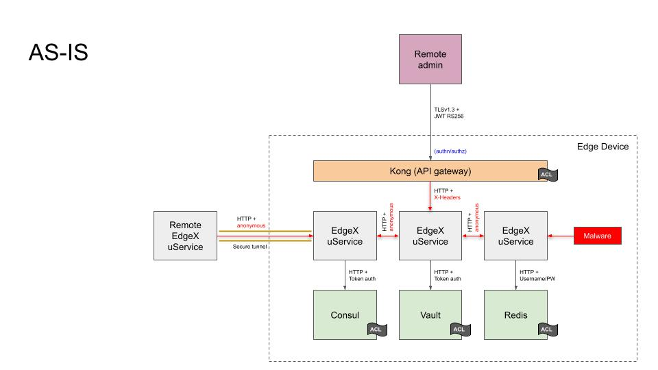
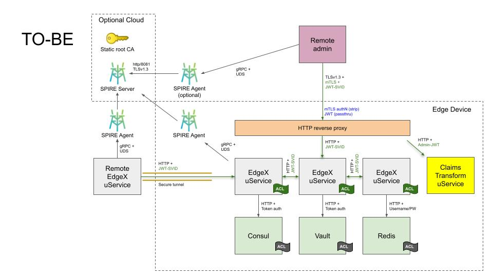

# EdgeX Microservice Authentication

## Status

DRAFT

## Context

The AS-IS Architecture figure below depicts the current state of
microservice communication security as of the EdgeX Levski release,
when security is enabled:

As shown in the diagram,
many of the foundational services used by EdgeX Foundry
have already been secured:

* Communication with EdgeX's secret store, as implemented by
  Hashicorp Vault, is secured over a local HTTP socket with
  token-based authentication.  An access control list limits access
  to the keyspace of the key value store.

* Communication with EdgeX's service registry and configuration provider,
  as implemented by Hashicorp Consul, is secured over a local HTTP
  socket with token-based authentication,
  with the token being mediated by Hashicorp Vault.
  An access control list limits access to the keyspace of
  the configuration store.

* Communication with EdgeX's default database, Redis, is secured using
  username/password authentication, with the password stored
  in Hashicorp Vault.  An access control list limits the commands
  that clients are allowed to issue to the server.

External access to EdgeX microservices has also been secured.
EdgeX microservices only bind to local ports,
and are only exposed externally through a Kong API gateway.
This gateway is configured to use TLS 1.3,
using JWT authentication using public key cryptography.
All external requests are filtered at the API gateway.
URL rewriting is used to concentrate microservices
on a single HTTP-accessible port.

Behind the proxy, it is not possible to verify Kong
as the origin of local network traffic because mutual-auth TLS
is not supported in the open source version of Kong.
Although the Kong JWT plugin will set request headers
on the backend request that identify the caller,
there is no mechanism by which Kong can prove to a
backend service that it was the component that
performed the authentication step.
Even though the original JWT passes through the proxy,
the Kong authentication plugins do not expose
token introspection endpoints that the backend service
could use to check token validity independently.

The consequence of having an API gateway that performs
all microservice authentication is that communication
between EdgeX microservices running behind the API gateway
are not authenticated in any way.
EdgeX microservices are unable to distinguish
malicous traffic that has evaded the API gateway
from legitimate microservice traffic.

## Decision

This ADR expands the use of Vault to include
issuing and validating [JWTs](https://www.rfc-editor.org/rfc/rfc7519)
for use in microservice authentication among EdgeX services.
Vault, and not Kong, owns JWTs issuance and validation
in the new propsal.

Having been relieved of JWT management responsibility,
it is now possible to replace the Kong API gateway and its associated
Postgres database with a much simpler (and smaller) NGINX reverse proxy.
All inbound requests can be authorized by an external plugin
that can in turn delegate the JWT validity check to Vault.
From the perspective of an external caller,
the existing JWT authentication feature is unchanged.
TLS termination enabled by default so as to be consistent with
[ADR 0015 - Encryption between microservices](./0015-in-cluster-tls.md).

Behind the proxy, there are two major changes:

1. Every EdgeX service, when security is enabled,
   requires a JWT be passed as part of the HTTP request
   that is validated using Vault's token introspection endpoint.

2. Every EdgeX service, when security is enabled,
   uses a Vault-supplied JWT to authenticate
   outgoing calls to peer EdgeX services.
   For microservice chaining scenarios,
   the original caller's identity can be passed through
   in most cases.

The new TO-BE architecture is diagrammed in the following figure:

The other architecturally signficant change to the proposal
is the use Vault's identity features.
Today, every EdgeX service is assigned a token with defined
access to the EdgeX secret store.
With this proposal, every service, and every external user,
will will have an assigned Vault identity.
The implication of this change is that it is now possible
to configure Vault authentication engines against
Vault identities.
For example:

* An external user identity could be authenticated by
  an external service, such as [Auth0](https://auth0.com).
  Alternatively, username/password or AppRole authentication
  could be used if an external source of identity is not available.
  This is viewed as beneficial, as downstream EdgeX implementations
  are already building their own similar integrations.

* An internal service identity could be authenticated by
  a Kubernetes service account token.  This would eliminate
  the requirement to pre-distribute Vault tokens to services
  via a shared filesystem volume, simplyfing Kubenetes-based
  deployments of EdgeX.

As an added bonus,
Vault supports longer JWT key sizes than the Kong JWT plugin.

## Alternatives

### Using Kong to Mediate EdgeX Microservice Interactions

One approach that is seen in some microservice architectures
is to force all communication between microservices to go
through the external API gateway.
The main barrier to this approach is lack of
proces-level traffic shaping in bare-metal environments.
Additionally, external address of the API gateway
may not be known to internal code,
increasing implementation difficulty for the programmer.

### mTLS Everywhere

One straightforward approach would be to use
use mutual-auth TLS everywhere and eliminate
the reverse proxy entirely.
Each service would necessarily have to be exposed
on its own port in order to process the client certificate.
A large number of exposed ports makes
security validation more difficult.

The primary problem with mutual-auth TLS
is key and certificate management.
Specifically,
[NIST SP 800-57 part 1](https://csrc.nist.gov/publications/detail/sp/800-57-part-1/rev-5/final)
recommends that authentication keys
should be rotated every 2 years as a minimum.
This is a potential issue for long-running
(for multiple years) processes.

### SPIFFE-based mTLS

This approach is a variation on mTLS Everywhere
where SPIFFE-aware client libraries that
are specifically designed to support live rotation
of TLS credentials are compiled into applications.
This is an effective migation for NIST SP 800-57
recommended cryptoperiods.

Legacy services such as Vault, Consul, et cetera
assume that their TLS server certificates are long-lived.
One way of to accomodate these services would be
to issue a long-lived X.509 SVID to these services.
Alternatively, certificates to these services
could be delivered out-of-band.
However, in both scenarios, 
certificate and/or key rotation
would require a disruptive service restart.

Tools such as ghosttunnel could be used to proxy
services that are not TLS-aware, but in a bare-metal
environment the proxy could be easily bypassed.

While a SPIFFE-based mTLS solution solves some
of the problems with an mTLS Everywhere approach,
a significant amount of effort would need to be
spent dealing with corner cases and
third-party service integration.

### Using Kong as a Service Identity Provider

Neither the JWT nor OAuth2 plugins offer a token introspection endpoint,
though it would be possible to create a fake service
that EdgeX microservices could call to validate a bearer token.
Using the Kong Admin API to obtain a public key for JWT
validation via database dump would be unnecessarily complex.
Validation of an opaque OAuth2 token would require direct access
to Kong's backend database and is also unnecessarily complex.

### Integrated Service Meshes

As part of the research for this ADR,
we conducted an architectural exploration of integrating the
[OpenZiti service mesh](https://openziti.github.io/)
directly into EdgeX microservices.
Although promising, there were three primary problems
with OpenZiti integration:

First is size. The OpenZiti quickstart container,
which contains the required OpenZiti compents such as
the OpenZiti controller and OpenZiti edge router,
is already twice as large (compressed size)
as the Kong container.  Since Kong is the largest
component in the secure EdgeX implementation,
brining in additional components that are already
larger than the component we seek to elilminate
is a non-starter.

The second is bootstrapping complexity.
There is no expedient way to leverage Vault
to onboard an EdgeX service into the OpenZiti service mesh.
The proposed bootstrapping process involved multiple steps:

* Create multiple instances of the Vault PKI engine.
  One instance for a root CA,
  and a second as a issuing CA for EdgeX service certificates.
  The secrity bootstrapper would have to augment the existing
  Vault service policies to allow EdgeX services
  to request a role-specific X.509 certificate.

* Configure the OpenZiti controller with 3rd party CA
  auto-enrollment with the certificate CN as the identity.
  It would also be necessary to pre-configure the controller
  with service policies that govern which EdgeX services
  where allowed to talk to each other,
  and to do this before any EdgeX services were actually
  started for the first time and made known to the controller.

* When an EdgeX service comes up and wants to talk on the network,
  it would have to request a key and certificate from Vault
  and cache it in memory,
  set a timer to replace the key/certificate before it expired,
  start its HTTP listener using the OpenZiti SDK,
  and use the OpenZiti SDK to dial other microservices.

The third is awkwardness for external clients.
In order to replace Kong,
it would be necessary to expose the OpenZiti controller
and OpenZiti edge router externally,
create an identity with username/password authentication,
authenticate with the controller to get an API session,
obtain a session key/certificate to onboard the OpenZiti tunneler,
remap local ports to remote services,
and then interact with the tunner to make remote calls.
The above procedure would resemble an SSH port-forwarding tunnel,
and the client could only talk to a single EdgeX instance at one time.

Although OpenZiti would solve some problems regarding
encrypted communicaiton across a network,
at this time the priority is microservice authentiation,
which an be achieved with less complexity than an OpenZiti integration.

## Consequences

Adopting this ADR has the following consequences:

* Deprecation of Kong and Postgres as the reverse proxy solution.

* Removal of Postgres and Kong from the bootstrapper scripts
  and docker-compose files and snap service lists.

* Modification to EdgeX security-secretstore-setup
  to create service identities to back existing Vault tokens.

* Modification of all REST API listeners to validate received JWTs.

* Modification of all outgoing EdgeX service requests
  (to other EdgeX services) to include JWT authentication.

* Modification of the EdgeX SPIFFE token provider
  to issue identity-backed Vault tokens.

* Validation that there are no additional impediments
  to the ability of EdgeX services to renew their tokens.

* Proxy service documentation updates.

## References

- [ADR 0015 Encryption between microservices](./0015-in-cluster-tls.md) 
- [ADR 0020 Delay start services (SPIFFE/SPIRE)](./0020-spiffe.md)
- [OpenZiti service mesh](https://openziti.github.io/)
- [SPIFFE](https://spiffe.io/)
