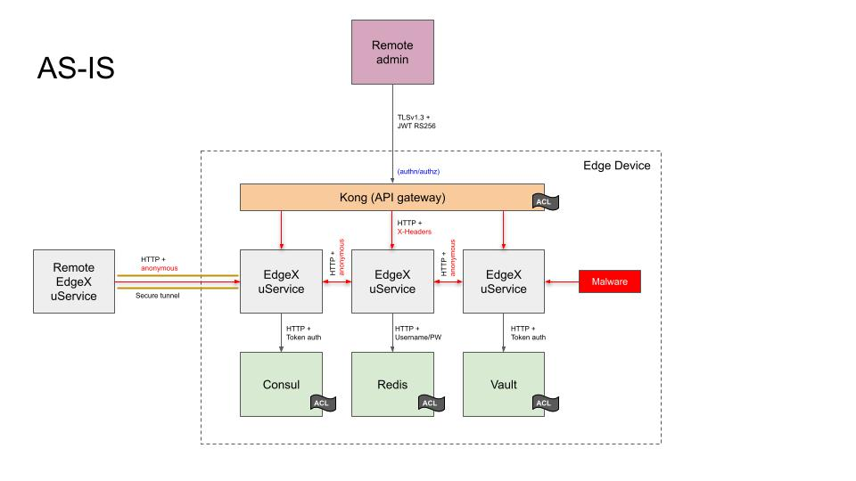
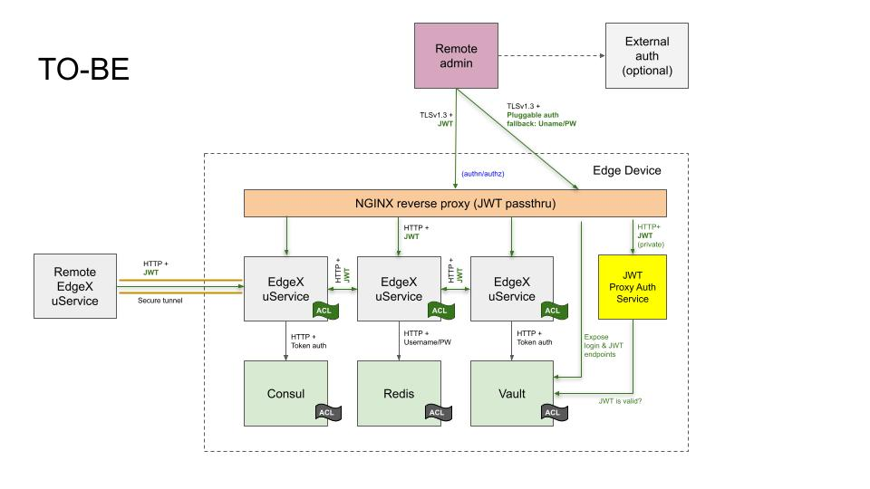

# EdgeX Microservice Authentication (token-based)

### Submitters

- Bryon Nevis (Intel)

## Change Log

- [proposed](https://github.com/edgexfoundry/edgex-docs/pull/659) (2021-12-28)
- [approved](https://github.com/edgexfoundry/edgex-docs/pull/966) (2023-02-18)

## Referenced Use Case(s)

- [Microservice Authentication](https://docs.edgexfoundry.org/3.0/design/ucr/Microservice-Authentication/)

## Context

The AS-IS Architecture figure below depicts the current state of
microservice communication security prior to EdgeX 3.0,
when security is enabled:

As shown in the diagram,
many of the foundational services used by EdgeX Foundry
have already been secured:

* Communication with EdgeX's secret store, as implemented by
  Hashicorp Vault, is secured over a local HTTP socket with
  token-based authentication.  An access control list limits access
  to the keyspace of the key value store.

* Communication with EdgeX's service registry and configuration provider,
  as implemented by Hashicorp Consul, is secured over a local HTTP
  socket with token-based authentication,
  with the token being mediated by Hashicorp Vault.
  An access control list limits access to the keyspace of
  the configuration store.

* Communication with EdgeX's default database, Redis, is secured using
  username/password authentication, with the password stored
  in Hashicorp Vault.  An access control list limits the commands
  that clients are allowed to issue to the server.

External access to EdgeX microservices has also been secured.
EdgeX microservices only bind to local ports,
and are only exposed externally through a Kong API gateway.
This gateway is configured to use TLS 1.3,
using RS256 or ES256 JWT authentication (at the user's discretion).
All external requests are filtered at the API gateway.
URL rewriting is used to concentrate microservices
on a single HTTP-accessible port.

Behind the proxy, it is not possible to verify Kong
as the origin of local network traffic because mutual-auth TLS
is not supported in the open source version of Kong.
Although the Kong JWT plugin will set request headers
on the backend request that identify the caller,
there is no mechanism by which Kong can prove to a
backend service that it was the component that
performed the authentication step.
Even though the original JWT passes through the proxy,
the Kong authentication plugins do not expose
token introspection endpoints that the backend service
could use to check token validity independently.

The consequence of having an API gateway that performs
all microservice authentication is that communication
between EdgeX microservices running behind the API gateway
are not authenticated in any way.
EdgeX microservices are unable to distinguish
malicious traffic that has evaded the API gateway
from legitimate microservice traffic.

## Proposed Design

This ADR proposes an implementation of the
[Microservice Authentication UCR](../../ucr/Microservice-Authentication.md)
that uses a token-based authentication mechanism.

This ADR proposes to relieve the Kong API gateway of its
[JWT](https://www.rfc-editor.org/rfc/rfc7519) management responsibility,
and instead use Hashicorp Vault for this purpose,
which is already used as EdgeX's secret store.
This change requires minimal modification of existing
clients written to perform JWT-based authentication at the Kong gateway:
they simply use a Vault-issued JWT
instead of a Kong-issued JWT or a self-issued JWT.

This ADR proposes a layered authentication scheme,
with the reverse proxy performing an initial check for all external requests,
and EdgeX services themselves authenticating all internal and external requests.
There are three reasons for the layered approach:

1. Authentication at the proxy layer provides a choke point
   and policy enforcement points for incoming requests.
   By customizing the behavior of the proxy-auth component,
   it is possible to allow access to some URLs
   and deny access to other URLs based on arbitrary criteria,
   such as source IP address, JWT-based claims,
   or user identity and role mappings.

2. It means that individual microservices do not immediately
   need to implement fine-grained authorization to get the
   same effect as having custom policy enforcement at the proxy.

3. It provides defense-in-depth against microservice implementation bugs
   and other technical debt that might otherwise put EdgeX
   microservices at risk.  Getting a known response to
   `/core-data/api/v2/ping` as a result of an anonymous HTTP request
   would positively identify an EdgeX installation.
   Similarly, an adopter porting their custom services to EdgeX 3.0
   without adding authentication hooks could be vulnerable to outside attacks
   that might be mitigated by the additional check at the proxy layer.

EdgeX microservices shall utilize Vault to assess JWT validity
and an NGINX reverse proxy shall use the
[ngx_http_auth_request_module](http://nginx.org/en/docs/http/ngx_http_auth_request_module.html)
to delegate confirmation of JWT validity.
TLS termination at the reverse proxy shall be enabled by default
so as to be consistent with
[ADR 0015 - Encryption between microservices](./0015-in-cluster-tls.md).

Behind the proxy, there are two major changes:

1. Every EdgeX service, when security is enabled,
   requires a JWT be passed as part of the HTTP request
   that is validated using Vault's token introspection endpoint,
   or manually validated based on published signature keys.

2. Every EdgeX service, when security is enabled,
   uses a Vault-supplied JWT to authenticate
   outgoing calls to peer EdgeX services.
   The original caller's identity may be passed through
   at the developers' discretion for microservice chaining scenarios.

The new TO-BE architecture is diagrammed in the following figure:

### Implementation pre-requisites

This ADR assumes a minor refactoring to the security bootstrapping
components use the Vault identity API and one or more authentication engines
to issue identity-based Vault tokens instead of raw Vault tokens.
Affected services include,
`go-mod-secrets` (configure identity, issue and validate JWT's),
`security-secretstore-setup`,
`security-file-token-provider`,
and `security-spiffe-token-provider`.

This refactoring results in several benefits:

* It de-privileges `security-secretstore-setup`'s use of Vault,
  which currently requires Vault "sudo" capability to issue raw Vault tokens.
  (This is a blocking issue for customers that want to bring their own Vault.)

* An external user identity could be authenticated by
  an external service, such as [Auth0](https://auth0.com).
  Alternatively, username/password or AppRole authentication
  could be used if an external source of identity is not available.
  This is viewed as beneficial, as downstream EdgeX deployments
  are already building their own similar integrations.

* An internal service identity could be authenticated by
  a Kubernetes service account token.  This could eliminate
  the requirement to pre-distribute Vault tokens to services
  via a shared filesystem volume, simplifying Kubernetes-based
  deployments of EdgeX.

* As an added bonus, Vault supports longer JWT key sizes than the Kong JWT plugin.

Additionally, `security-bootstrapper` will need to modified to not
block on availability of Postgres before issuing the ready-to-run signal.
(This change is already completed.)

### High-level list of changes

The following list of changes is derived from the proof of concept implementation
to actually effect the change (besides the prerequisite changes above):

- Kong and Postgres is removed from compose files.

- Add an NGINX reverse proxy with using the proxy auth module.

- Create a new `security-proxy-auth` service to check the incoming JWT for validity.
  (NGINX will be configured to delegate to this service for authentication checks.
  NGINX could also delegate to a minimal function like /api/v2/version,
  but the reason as to why the function was called wouldn't be as clear as
  having a separate authentication service.)

- The `security-proxy-setup` container remains, with the binary replaced
  with a small shell script to create a default TLS certificate and key.

- The `secrets-config` utility will create new users in Vault instead of Kong,
  and update TLS configuration for NGINX on disk instead of the Kong API.

- Modifications to `go-mod-core-contracts` to support an
  injectable authentication interface to add JWT's to outgoing HTTP requests.

- Modifications to `go-mod-bootstrap` to realize the `go-mod-secrets` changes,
  create common JWT authentication handlers,
  and inject JWT authentication to the core-contracts clients.

- Modifications to individual EdgeX services to authenticate selected routes
  (that is, every route except `/api/v2/ping`, which remains anonymous).

- Modifications to `security-bootstrapper` to build an entrypoint script for
  NGINX and a default NGINX configuration.

- Documentation updates.

## Decision

Token-based authentication is flexible and works in a wide variety of use cases,
but does not address issues of network security.

For scenarios where all EdgeX services are running on the same host,
or there is an existing solution to network security already in place,
such as an encrypted network overlay
as might be found in some Kubernetes deployments of EdgeX,
the token-based solution offers significant
memory and disk savings over the Kong-based solution
used in EdgeX releases prior to 3.0.

For scenarios where token-based authentication credentials can be exposed over a network,
an authentication solution based on end-to-end encryption would be more appropriate.

## Considerations

### Size and Space Impact of Kong + Postgres Versus Alternatives

#### Disk space

A savings of up to ~300 MB in docker images can be expected,
depending on specific selection of container images used.
(The POC implementation successfully used the smallest NGINX
available, alpine-slim.)

| Image                            | Tag         | Image ID     | Age          | Size   |
|----------------------------------|-------------|--------------|--------------|--------|
| nginx                            | alpine      | 2bc7edbc3cf2 | 6 days ago   | 40.7MB |
| nginx                            | alpine-slim | c59097225492 | 6 days ago   | 11.5MB |
| nginx                            | latest      | 3f8a00f137a0 | 8 days ago   | 142MB  |
| kong                             | 2.8         | 0affcb95d383 | 6 days ago   | 139MB  |
| postgres                         | 13.8-alpine | 551b13d106b4 | 4 months ago | 213MB  |
| edgexfoundry/security-proxy-auth | 0.0.0-dev   | b2ee5c21efba | 8 days ago   | 16.2MB |

Image data collected on 2023-02-17.

#### Memory

A memory savings of up to ~150 MB has been observed in the POC implementation
upon initial startup of the framework.

| CONTAINER ID | NAME             | CPU % | MEM USAGE / LIMIT   | MEM % | NET I/O         | BLOCK I/O       | PIDS |
|--------------|------------------|-------|---------------------|-------|-----------------|-----------------|------|
| cad71e71ab32 | edgex-kong       | 0.03% | 109.4MiB / 15.61GiB | 0.68% | 255kB / 263kB   | 0B / 69.6kB     | 2    |
| 9ab4de1e5448 | edgex-kong-db    | 0.11% | 64.51MiB / 15.61GiB | 0.40% | 232kB / 183kB   | 32.2MB / 53.9MB | 18   |
| ff1e97c16e55 | edgex-nginx      | 0.00% | 4.289MiB / 15.61GiB | 0.03% | 3.24kB / 248B   | 0B / 0B         | 5    |
| 42629157e65c | edgex-proxy-auth | 0.00% | 6.258MiB / 15.61GiB | 0.04% | 22.9kB / 16.2kB | 7.3MB / 0B      | 11   |

### Alternative: Using Kong to Mediate EdgeX Internal Microservice Interactions

One approach that is seen in some microservice architectures
is to force all communication between microservices to go
through the external API gateway.
There are two problems with this approach:

- In the typical EdgeX runtime environment,
  there is no mechanism to block direct
  microservice-to-microservice communication.

- The external address of the API gateway
  may not be known to internal code,
  increasing implementation difficulty for the programmer.

### Alternative: Using Kong as a Service Identity Provider

Neither the JWT nor OAuth2 plugins offer a token introspection endpoint,
though it would be possible to create a fake service
that EdgeX microservices could call to validate a bearer token.
Using the Kong Admin API to obtain a public key for JWT
validation via database dump would be unnecessarily complex.
Validation of an opaque OAuth2 token would require direct access
to Kong's backend database and is also unnecessarily complex.

## Other Related ADRs

- [ADR 0015 Encryption between microservices](./0015-in-cluster-tls.md) 
- [ADR 0020 Delay start services (SPIFFE/SPIRE)](./0020-spiffe.md)
- [Microservice authentication based on end-to-end encryption](https://github.com/edgexfoundry/edgex-docs/pull/935)

## References

- [Microservice Authentication UCR](../../ucr/Microservice-Authentication.md)
- [OpenZiti zero-trust networking fabric](https://openziti.github.io/)
- [SPIFFE](https://spiffe.io/)
