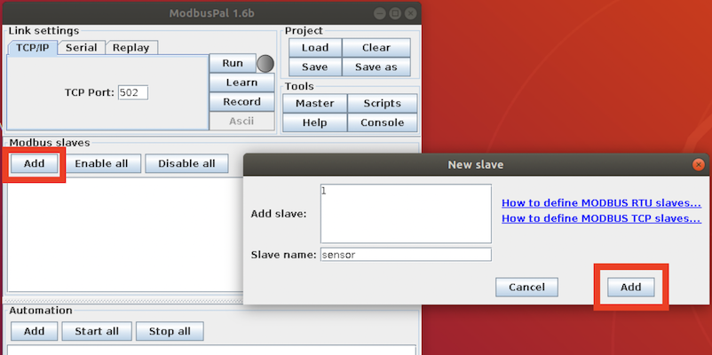
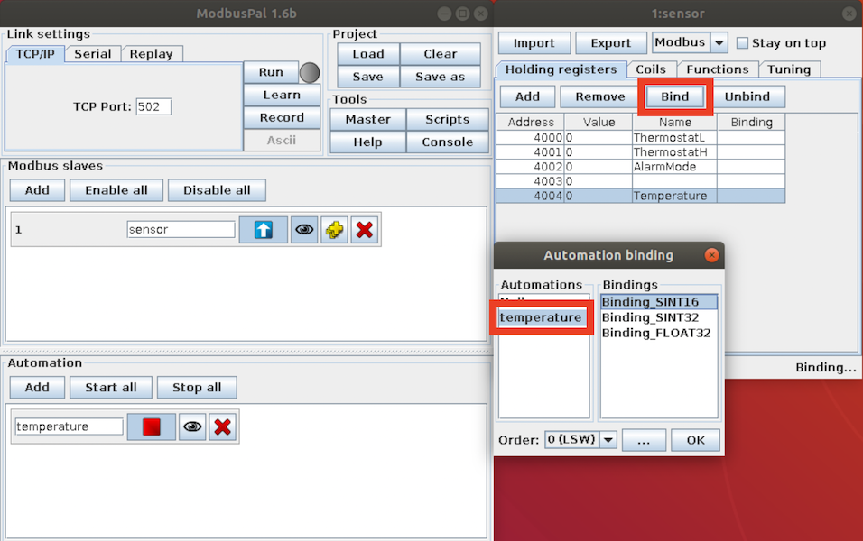
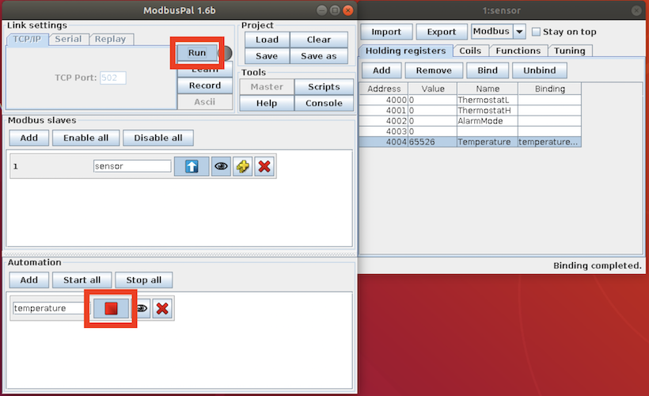

# Modbus

EdgeX - Ireland Release

This page describes how to connect Modbus devices to EdgeX. In this example, we simulate the [temperature sensor](https://www.audon.co.uk/ethernet_sensors/NANO_TEMP.html) instead of using a real device. This provides a straightforward way to test the device service features.

- Temperature sensor: https://www.audon.co.uk/ethernet_sensors/NANO_TEMP.html
- User manual: http://download.inveo.com.pl/manual/nano_t/user_manual_en.pdf

## Important Notice
To fulfill the [issue #61](https://github.com/edgexfoundry/device-modbus-go/issues/61), there is an important incompatible change after v2 (Ireland release). In the Device Profile attributes section, the `startingAddress` becomes an integer data type and zero-based value. In v1, `startingAddress` was a string data type and one-based value.

## Environment

You can use any operating system that can install docker and
docker-compose.  In this example, we use Ubuntu to deploy EdgeX using docker.

## Modbus Device Simulator
1.Download ModbusPal 

Download the fixed version of ModbusPal from the [https://sourceforge.net/p/modbuspal/discussion/899955/thread/72cf35ee/cd1f/attachment/ModbusPal.jar](https://sourceforge.net/p/modbuspal/discussion/899955/thread/72cf35ee/cd1f/attachment/ModbusPal.jar) .

2.Install required lib:
```
sudo apt install librxtx-java
```
3.Startup the ModbusPal:
```
sudo java -jar ModbusPal.jar
```

### Modbus Register Table
You can find the available registers in the user manual.

Modbus TCP – Holding Registers

| Address | Name            | R/W | Description |
| ------- | --------------- | --- | --------------------- |
| 4000    | ThermostatL     | R/W | Lower alarm threshold |
| 4001    | ThermostatH     | R/W | Upper alarm threshold |
| 4002    | Alarm mode      | R/W | 1 - OFF (disabled), 2 - Lower, 3 - Higher, 4 - Lower or Higher |
| 4004    | Temperature x10 | R   | Temperature x 10 (np. 10,5 st.C to 105) |

### Setup ModbusPal

To simulate the sensor, do the following:

1.  Add mock device:
    
2.  Add registers according to the register table:
    

3.  Add the ModbusPal support value auto-generator, which can bind to
    the registers:
    
    

### Run the Simulator

Enable the value generator and click the `Run` button.



## Set Up Before Starting Services

The following sections describe how to complete the set up before
starting the services. If you prefer to start the services and then add
the device, see [Set Up After Starting
Services](#set-up-after-starting-services)

### Create a Custom configuration folder
Run the following command:
```
mkdir -p custom-config
```

### Set Up Device Profile

Run the following command to create your device profile:
```
cd custom-config
nano temperature.profile.yml
```

Fill in the device profile according to the [Modbus Register Table](#modbus-register-table), as shown below:
```yaml
name: "Ethernet-Temperature-Sensor"
manufacturer: "Audon Electronics"
model: "Temperature"
labels:
  - "Web"
  - "Modbus TCP"
  - "SNMP"
description: "The NANO_TEMP is a Ethernet Thermometer measuring from -55°C to 125°C with a web interface and Modbus TCP communications."

deviceResources:
  -
    name: "ThermostatL"
    isHidden: true
    description: "Lower alarm threshold of the temperature"
    attributes:
      { primaryTable: "HOLDING_REGISTERS", startingAddress: 3999, rawType: "Int16" }
    properties:
      valueType: "Float32"
      readWrite: "RW"
      scale: "0.1"
  -
    name: "ThermostatH"
    isHidden: true
    description: "Upper alarm threshold of the temperature"
    attributes:
      { primaryTable: "HOLDING_REGISTERS", startingAddress: 4000, rawType: "Int16" }
    properties:
      valueType: "Float32"
      readWrite: "RW"
      scale: "0.1"
  -
    name: "AlarmMode"
    isHidden: true
    description: "1 - OFF (disabled), 2 - Lower, 3 - Higher, 4 - Lower or Higher"
    attributes:
      { primaryTable: "HOLDING_REGISTERS", startingAddress: 4001 }
    properties:
      valueType: "Int16"
      readWrite: "RW"
  -
    name: "Temperature"
    isHidden: false
    description: "Temperature x 10 (np. 10,5 st.C to 105)"
    attributes:
      { primaryTable: "HOLDING_REGISTERS", startingAddress: 4003, rawType: "Int16" }
    properties:
      valueType: "Float32"
      readWrite: "R"
      scale: "0.1"

deviceCommands:
  -
    name: "AlarmThreshold"
    readWrite: "RW"
    isHidden: false
    resourceOperations:
      - { deviceResource: "ThermostatL" }
      - { deviceResource: "ThermostatH" }
  -
    name: "AlarmMode"
    readWrite: "RW"
    isHidden: false
    resourceOperations:
      - { deviceResource: "AlarmMode", mappings: { "1":"OFF","2":"Lower","3":"Higher","4":"Lower or Higher"} }
```
In the Modbus protocol, we provide the following attributes:

1.`primaryTable`: HOLDING\_REGISTERS, INPUT\_REGISTERS, COILS,
    DISCRETES\_INPUT

2.`startingAddress` This attribute defines the zero-based startingAddress in Modbus device. For example, the GET command requests data from the Modbus address 4004 to get the temperature data, so the starting register address should be 4003.

| Address | Starting Address | Name            | R/W | Description |
| ------- | --------------   |---------------  | --- | --------------------- |
| 4004    | 4003             | Temperature x10 | R   | Temperature x 10 (np. 10,5 st.C to 105) |

3.`IS_BYTE_SWAP`, `IS_WORD_SWAP`: To handle the different Modbus binary data order, we support Int32, Uint32, Float32 to do the swap operation before decoding the binary data.

For example: `{ primaryTable: "INPUT_REGISTERS", startingAddress: "4", isByteSwap: "false", isWordSwap: "true" }`

4.`RAW_TYPE`: This attribute defines the binary data read from the Modbus device, then we can use the value type to indicate the data type that the user wants to receive.

We only support `Int16` and `Uint16` for rawType. The corresponding value type must be `Float32` and `Float64`.
For example:
```yaml
deviceResources:
  -
    name: "Temperature"
    isHidden: false
    description: "Temperature x 10 (np. 10,5 st.C to 105)"
    attributes:
      { primaryTable: "HOLDING_REGISTERS", startingAddress: 4003, rawType: "Int16" }
    properties:
      valueType: "Float32"
      readWrite: "R"
      scale: "0.1"
```

In the device-modbus, the Property `valueType` decides how many registers will be read. Like
Holding registers, a register has 16 bits. If the Modbus device's user manual
specifies that a value has two registers, define it as `Float32` or `Int32`
or `Uint32` in the deviceProfile.

Once we execute a command, device-modbus knows its value type and
register type, startingAddress, and register length. So it can read or
write value using the modbus protocol.

### Set Up Device Service Configuration

Run the following command to create your device configuration:
```
cd custom-config
nano device.config.yaml
```
Fill in the device.config.yaml file, as shown below:
```yaml
deviceList:
  name: "Modbus-TCP-Temperature-Sensor"
  profileName: "Ethernet-Temperature-Sensor"
  description: "This device is a product for monitoring the temperature via the ethernet"
  labels: 
    - "temperature"
    - "modbus"
    - "TCP"
  protocols:
    modbus-tcp:
      Address: "172.17.0.1"
      Port: "502"
      UnitID: "1"
      Timeout: "5"
      IdleTimeout: "5"
  autoEvents:
    interval: "30s"
    onChange: false
    sourceName: "Temperature"
```
> The address `172.17.0.1` is point to the docker bridge network which means it can forward the request from docker network to the host.

Use this configuration file to define devices and AutoEvent. Then the device-modbus will generate the relative instance on startup.


The device-modbus offers two types of protocol, Modbus TCP and Modbus RTU, which can be defined as shown below:

  
  |protocol        | Name            | Protocol   | Address      | Port    | UnitID | BaudRate | DataBits | StopBits | Parity | Timeout | IdleTimeout |
  |--------------- | --------------- | ---------- | -------------|---------| ------- | ------- |--------- | -------- | ------ | -------- | ------ |
  |Modbus TCP      | Gateway address | TCP        | 10.211.55.6  | 502     | 1      |          |          |          |        | 5        | 5      |
  |Modbus RTU      | Gateway address | RTU        | /tmp/slave   | 502     | 2      | 19200    | 8        | 1        | N      | 5        | 5      |
  

In the RTU protocol, Parity can be:

* N - None is 0
* O - Odd is 1 
* E - Even is 2, default is E


## Prepare docker-compose file

1. Clone edgex-compose
```
$ git clone git@github.com:edgexfoundry/edgex-compose.git
```
2. Generate the docker-compose.yml file
```
$ cd edgex-compose/compose-builder
$ make gen ds-modbus
```

### Add Custom Configuration to docker-compose File

Add prepared configuration files to docker-compose file, you can mount them using
volumes and change the environment for device-modbus internal use.

Open the `docker-compose.yml` file and then add volumes path and environment as shown below:
```yaml
 device-modbus:
    ...
    environment:
      ...
      DEVICE_DEVICESDIR: /custom-config
      DEVICE_PROFILESDIR: /custom-config
    volumes:
    ...
    - /path/to/custom-config:/custom-config
```

## Start EdgeX Foundry on Docker

Since we generate the `docker-compose.yml` file at the previous step, we can deploy EdgeX as shown below:
```
$ cd edgex-compose/compose-builder
$ docker-compose up -d
Creating network "compose-builder_edgex-network" with driver "bridge"
Creating volume "compose-builder_consul-acl-token" with default driver
...
Creating edgex-core-metadata              ... done
Creating edgex-core-command               ... done
Creating edgex-core-data                  ... done
Creating edgex-device-modbus              ... done
Creating edgex-app-rules-engine           ... done
Creating edgex-sys-mgmt-agent             ... done
```

## Set Up After Starting Services

If the services are already running and you want to add a device, you
can use the Core Metadata API as outlined in this section. If you set up
the device profile and Service as described in [Set Up Before Starting
Services](#set-up-before-starting-services), you can skip this section.

To add a device after starting the services, complete the following
steps:

1. Upload the device profile above to metadata with a POST to
    <http://localhost:59881/api/v2/deviceprofile/uploadfile> and add the
    file as key "file" to the body in form-data format, and the created
    ID will be returned. The following example command uses curl to send the request:

    ```
    $ curl http://localhost:59881/api/v2/deviceprofile/uploadfile \
      -F "file=@temperature.profile.yml"
    ```

2. Ensure the Modbus device service is running, adjust the service name
    below to match if necessary or if using other device services.

4.  Add the device with a POST to
    <http://localhost:59881/api/v2/device>, the body will look something
    like:
    ```
    $ curl http://localhost:59881/api/v2/device -H "Content-Type:application/json" -X POST \
      -d '[
            {
                "apiVersion": "v2",
                "device": {
                   "name" :"Modbus-TCP-Temperature-Sensor",
                   "description":"This device is a product for monitoring the temperature via the ethernet",
                   "labels":[ 
                      "Temperature",
                      "Modbus TCP"
                   ],
                   "serviceName": "device-modbus",
                   "profileName": "Ethernet-Temperature-Sensor",
                   "protocols":{
                      "modbus-tcp":{
                         "Address" : "172.17.0.1",
                         "Port" : "502",
                         "UnitID" : "1",
                         "Timeout" : "5",
                         "IdleTimeout" : "5"
                      }
                   },
                   "autoEvents":[ 
                      { 
                         "Interval":"30s",
                         "onChange":false,
                         "SourceName":"Temperature"
                      }
                   ],
                   "adminState":"UNLOCKED",
                   "operatingState":"UP"
                }
            }
        ]'
    ```

    The service name must match/refer to the target device
    service, and the profile name must match the device profile name
    from the previous steps.

## Execute Commands

Now we're ready to run some commands.

### Find Executable Commands

Use the following query to find executable commands:
```json
$ curl http://localhost:59882/api/v2/device/all | json_pp

{
   "apiVersion" : "v2",
   "deviceCoreCommands" : [
      {
         "deviceName" : "Modbus-TCP-Temperature-Sensor",
         "profileName" : "Ethernet-Temperature-Sensor",
         "coreCommands" : [
            {
               "url" : "http://edgex-core-command:59882",
               "name" : "AlarmThreshold",
               "get" : true,
               "set" : true,
               "parameters" : [
                  {
                     "valueType" : "Float32",
                     "resourceName" : "ThermostatL"
                  },
                  {
                     "valueType" : "Float32",
                     "resourceName" : "ThermostatH"
                  }
               ],
               "path" : "/api/v2/device/name/Modbus-TCP-Temperature-Sensor/AlarmThreshold"
            },
            {
               "get" : true,
               "url" : "http://edgex-core-command:59882",
               "name" : "AlarmMode",
               "set" : true,
               "path" : "/api/v2/device/name/Modbus-TCP-Temperature-Sensor/AlarmMode",
               "parameters" : [
                  {
                     "resourceName" : "AlarmMode",
                     "valueType" : "Int16"
                  }
               ]
            },
            {
               "get" : true,
               "url" : "http://edgex-core-command:59882",
               "name" : "Temperature",
               "path" : "/api/v2/device/name/Modbus-TCP-Temperature-Sensor/Temperature",
               "parameters" : [
                  {
                     "valueType" : "Float32",
                     "resourceName" : "Temperature"
                  }
               ]
            }
         ]
      }
   ],
   "statusCode" : 200
}

```

### Execute SET command

Execute SET command according to `url` and `parameterNames`, replacing [host] with the server IP when running the SET command.

```
$ curl http://localhost:59882/api/v2/device/name/Modbus-TCP-Temperature-Sensor/AlarmThreshold \
    -H "Content-Type:application/json" -X PUT  \
    -d '{"ThermostatL":"15","ThermostatH":"100"}'
```

### Execute GET command

Replace *\<host\>* with the server IP when running the GET command.

```json
$ curl http://localhost:59882/api/v2/device/name/Modbus-TCP-Temperature-Sensor/AlarmThreshold | json_pp

{
   "statusCode" : 200,
   "apiVersion" : "v2",
   "event" : {
      "origin" : 1624324686964377495,
      "deviceName" : "Modbus-TCP-Temperature-Sensor",
      "id" : "f3d44a0f-d2c3-4ef6-9441-ad6b1bfb8a9e",
      "sourceName" : "AlarmThreshold",
      "readings" : [
         {
            "resourceName" : "ThermostatL",
            "value" : "1.500000e+01",
            "deviceName" : "Modbus-TCP-Temperature-Sensor",
            "id" : "9aa879a0-c184-476b-8124-34d35a2a51f3",
            "valueType" : "Float32",
            "mediaType" : "",
            "binaryValue" : null,
            "origin" : 1624324686963970614,
            "profileName" : "Ethernet-Temperature-Sensor"
         },
         {
            "value" : "1.000000e+02",
            "resourceName" : "ThermostatH",
            "deviceName" : "Modbus-TCP-Temperature-Sensor",
            "id" : "bf7df23b-4338-4b93-a8bd-7abd5e848379",
            "valueType" : "Float32",
            "mediaType" : "",
            "binaryValue" : null,
            "origin" : 1624324686964343768,
            "profileName" : "Ethernet-Temperature-Sensor"
         }
      ],
      "apiVersion" : "v2",
      "profileName" : "Ethernet-Temperature-Sensor"
   }
}

```

## AutoEvent
The AutoEvent is defined in the [[DeviceList.AutoEvents]] section of the device configuration file:
```yaml
deviceList:
  autoEvents:
    interval: "30s"
    onChange: false
    sourceName: "Temperature"
```
After service startup, query core-data's API. The results show
that the service auto-executes the command every 30 seconds.

```json
$ curl http://localhost:59880/api/v2/event/device/name/Modbus-TCP-Temperature-Sensor | json_pp

{
   "events" : [
      {
         "readings" : [
            {
               "value" : "5.300000e+01",
               "binaryValue" : null,
               "origin" : 1624325219186870396,
               "id" : "68a66a35-d3cf-48a2-9bf0-09578267a3f7",
               "deviceName" : "Modbus-TCP-Temperature-Sensor",
               "mediaType" : "",
               "valueType" : "Float32",
               "resourceName" : "Temperature",
               "profileName" : "Ethernet-Temperature-Sensor"
            }
         ],
         "apiVersion" : "v2",
         "origin" : 1624325219186977564,
         "id" : "4b235616-7304-419e-97ae-17a244911b1c",
         "deviceName" : "Modbus-TCP-Temperature-Sensor",
         "sourceName" : "Temperature",
         "profileName" : "Ethernet-Temperature-Sensor"
      },
      {
         "readings" : [
            {
               "profileName" : "Ethernet-Temperature-Sensor",
               "resourceName" : "Temperature",
               "valueType" : "Float32",
               "id" : "56b7e8be-7ce8-4fa9-89e2-3a1a7ef09050",
               "origin" : 1624325189184675483,
               "value" : "5.300000e+01",
               "binaryValue" : null,
               "mediaType" : "",
               "deviceName" : "Modbus-TCP-Temperature-Sensor"
            }
         ],
         "profileName" : "Ethernet-Temperature-Sensor",
         "sourceName" : "Temperature",
         "deviceName" : "Modbus-TCP-Temperature-Sensor",
         "id" : "fbab44f5-9775-4c09-84bd-cbfb00001115",
         "origin" : 1624325189184721223,
         "apiVersion" : "v2"
      },
      ...
   ],
   "apiVersion" : "v2",
   "statusCode" : 200
}
```

## Set up the Modbus RTU Device
This section describes how to connect the Modbus RTU device. We use Ubuntu OS and a Modbus RTU device for this example. 

- Modbus RTU device: http://www.icpdas.com/root/product/solutions/remote_io/rs-485/i-7000_m-7000/i-7055.html
- User manual: http://ftp.icpdas.com/pub/cd/8000cd/napdos/7000/manual/7000dio.pdf

### Connect the device
1. Connect the device to your machine(laptop or gateway,etc.) via RS485/USB adaptor and power on.

2. Execute a command on the machine, and you can find a message like the following:
    ```
    $ dmesg | grep tty
    ...
    ...
    [18006.167625] usb 1-1: FTDI USB Serial Device converter now attached to ttyUSB0
    ```

3. It shows the USB attach to ttyUSB0, then you can check whether the device path exists:
    ```
    $ ls /dev/ttyUSB0
    /dev/ttyUSB0
    ```

### Change the Owner of the Device

For security reason, the EdgeX set up the user permission as below:
```yaml
  device-modbus:
    ...
    user: 2002:2001  # UID:GID
```
So we need to change the owner for the specified group by the following command:
```shell
sudo chown :2001 /dev/ttyUSB0

# Or change the permissions for multiple files
sudo chown :2001 /dev/tty*
```

!!! Note
    Since the owner will reset after the system reboot, we can add this script to the startup script. For Raspberry Pi as example, add script to `/etc/rc.local`, then the Pi will run this script at bootup.

### Mont the Device Path to the Docker Container
Modify the docker-compose.yml file to mount the device path to the device-modbus, and here are two ways to mount the device path:

1. Using `devices`:
    ```yaml
    device-modbus:
      ...
      devices:
        - /dev/ttyUSB0
    ```

2. Or using `volumes` and `device_cgroup_rules`:
    ```yaml
    device-modbus:
      ...
      volumes:
        ...
        - /dev:/dev
      device_cgroup_rules:
        - 'c 188:* rw' 
    ```
    - c: character device
    - 188: device major number(188=USB)
    - *: device minor number
    - rw: read/write

### Deploy the EdgeX
```
$ docker-compose up -d
```

### Add device to EdgeX

1. Create the device profile according to the register table
    ```
    $ nano modbus.rtu.demo.profile.yml
    ```
    ```yaml
    name: "Modbus-RTU-IO-Module"
    manufacturer: "icpdas"
    model: "M-7055"
    labels:
      - "Modbus RTU"
      - "IO Module"
    description: "This IO module offers 8 isolated channels for digital input and 8 isolated channels for digital output."
    
    deviceResources:
      -
        name: "DO0"
        isHidden: true
        description: "On/Off , 0-OFF 1-ON"
        attributes:
          { primaryTable: "COILS", startingAddress: 0 }
        properties:
          valueType: "Bool"
          readWrite: "RW"
      -
        name: "DO1"
        isHidden: true
        description: "On/Off , 0-OFF 1-ON"
        attributes:
          { primaryTable: "COILS", startingAddress: 1 }
        properties:
          valueType: "Bool"
          readWrite: "RW"
      -
        name: "DO2"
        isHidden: true
        description: "On/Off , 0-OFF 1-ON"
        attributes:
          { primaryTable: "COILS", startingAddress: 2 }
        properties:
          valueType: "Bool"
          readWrite: "RW"
    
    deviceCommands:
      -
        name: "DO"
        readWrite: "RW"
        isHidden: false
        resourceOperations:
          - { deviceResource: "DO0" }
          - { deviceResource: "DO1" }
          - { deviceResource: "DO2" }
    ```
2. Upload the device profile
    ```
    $ curl http://localhost:59881/api/v2/deviceprofile/uploadfile \
      -F "file=@modbus.rtu.demo.profile.yml"
    ```

3. Create the device entity to the EdgeX.
    You can find the Modbus RTU setting on the device or the user manual.
    ```json
    $ curl http://localhost:59881/api/v2/device -H "Content-Type:application/json" -X POST \
      -d '[
            {
                "apiVersion": "v2",
                "device": {
                   "name" :"Modbus-RTU-IO-Module",
                   "description":"The device can be used to monitor the status of the digital input and digital output channels.",
                   "labels":[ 
                      "IO Module",
                      "Modbus RTU"
                   ],
                   "serviceName": "device-modbus",
                   "profileName": "Ethernet-Temperature-Sensor",
                   "protocols":{
                      "modbus-tcp":{
                         "Address" : "/dev/ttyUSB0",
                         "BaudRate" : "19200",
                         "DataBits" : "8",
                         "StopBits" : "1",
                         "Parity" : "N",
                         "UnitID" : "1",
                         "Timeout" : "5",
                         "IdleTimeout" : "5"
                      }
                   },
                   "adminState":"UNLOCKED",
                   "operatingState":"UP"
                }
            }
        ]'
    ```
4. Test the GET or SET command
