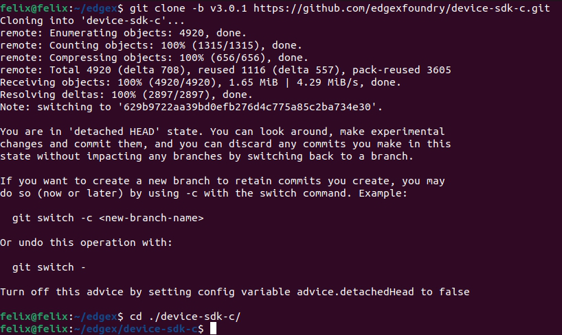
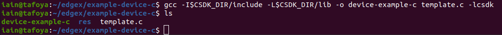
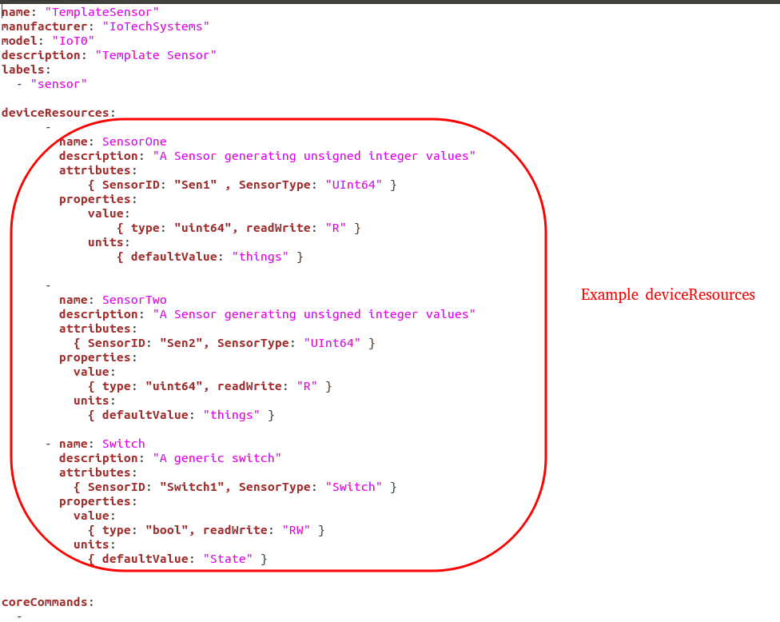

# C SDK

In this guide, you create a simple device service that generates a
random number as a means to simulate getting data from an actual device. In this way, you explore some of the SDK framework and work necessary to complete a device service without actually having a device to talk to.

## Install dependencies

See the [Getting Started - C Developers](./Ch-GettingStartedCDevelopers.md) guide to install the necessary tools and infrastructure needed to develop a C service.

## Get the EdgeX Device SDK for C

The next step is to download and build the EdgeX device service SDK for C.

1.  First, clone the device-sdk-c from Github:
    ``` bash
    git clone -b v1.2.1 https://github.com/edgexfoundry/device-sdk-c.git
    cd ./device-sdk-c
    ```

    

    !!! Note
        The clone command above has you pull v1.2.1 of the C SDK which is the version compatible with the Geneva release.

2.  Then, build the device-sdk-c:
    ``` bash
    make
    ```

## Starting a new Device Service

For this guide, you use the example template provided by the
C SDK as a starting point for a new device service.  You modify the device service to generate random integer
values.

Begin by copying the template example source into a new directory
    named `example-device-c`:
    ``` bash
    mkdir -p ../example-device-c/res
    cp ./src/c/examples/template.c ../example-device-c
    cd ../example-device-c
    ```


## Build your Device Service

Now you are ready to build your new device service using the C SDK you
compiled in an earlier step.

1.  Tell the compiler where to find the C SDK files:
    ``` bash
    export CSDK_DIR=../device-sdk-c/build/release/_CPack_Packages/Linux/TGZ/csdk-1.2.1
    ```

    !!! Note
        The exact path to your compiled CSDK_DIR may differ depending on the tagged version number on the SDK.  The version of the SDK can be found in the VERSION file located in the ./device-sdk-c/VERSION file.  In the example above, the Geneva release of 1.2.1 is used.

2.  Now build your device service executable:

    ``` bash
    gcc -I$CSDK_DIR/include -L$CSDK_DIR/lib -o device-example-c template.c -lcsdk
    ```

    If everything is working properly, a `device-example-c` executable will be created in the directory.

    

## Customize your Device Service

Up to now you've been building the example device service provided by
the C SDK. In order to change it to a device service that generates
random numbers, you need to modify your `template.c` method
**template\_get\_handler**.  Replace the following code:

``` c
for (uint32_t i = 0; i < nreadings; i++)
{
    /* Log the attributes for each requested resource */
    iot_log_debug (driver->lc, "  Requested reading %u:", i);
    dump_nvpairs (driver->lc, requests[i].attributes);
    /* Fill in a result regardless */
    readings[i].type = String;
    /* NB String (and binary) readings get deallocated in the SDK */
    readings[i].value.string_result = strdup ("Template result");
}
return true;
```

with this code:

``` c
for (uint32_t i = 0; i < nreadings; i++)
{
    const char *rdtype = edgex_nvpairs_value (requests[i].attributes, "type");
    if (rdtype)
    {
        if (strcmp (rdtype, "random") == 0)
        {
        /* Set the resulting reading type as Uint64 */
        readings[i].type = Edgex_Uint64;
        /* Set the reading as a random value between 0 and 100 */
        readings[i].value.ui64_result = rand() % 100;
        }
        else
        {
        iot_log_error (driver->lc, "Unknown sensor type \"%s\" requested", rdtype);
        return false;
        }
    }
    else
    {
        iot_log_error (driver->lc, "Unable to read value, no \"type\" attribute given");
        return false;
    }
}
return true;
```

## Creating your Device Profile

A device profile is a YAML file that describes a class of device to
EdgeX. General characteristics about the type of device, the data these devices provide, and how to command the device are all in a device profile.   The device profile tells the device service what data gets collected from the the device and how to get it. 

Follow these steps to create a device profile for the simple random number generating device service.

1.  Explore the files in the device-sdk-c/src/c/examples/res folder.   Note the example TemplateProfile.yaml device profile that is already in this folder.  Open the file with your favorite editor and explore its contents.  Note how `deviceResources` in the file represent properties of a device (properties like SensorOne, SensorTwo and Switch).  Similarly, `coreCommands` specify commands that get issued to the device.

    

2.  A pre-created device profile for the random number device is provided in this documentation.  Download **[random-generator-device.yaml](random-generator-device.yaml)** and save the file to the `./res` folder.

3.  Open the random-generator-device.yaml file in a text editor. In this device profile, the device described has a deviceResource:  `randomnumber`.  Note how the association of a type to the deviceResource.  In this case, the device profile informs EdgeX that `randomnumber` will be a INT32.  In real world IoT situations, this deviceResource list could be extensive and filled with many deviceResources all different types of data.  Note also how the device profile describes a REST command (GET Random) to call to get the random number from the device service.

## Configuring your Device Service

Now update the configuration for the new device service.    This documentation provides a new configuration.toml file.  This configuration file:
- changes the port the service operates on so as not to conflict with other device services
- alters the the auto event frequency, which determines when the device service collects data from the simulated device (every 10 seconds)
- sets up the initial provisioning of the random number generating device when the service starts

Download  **[configuration.toml](configuration.toml)** and save the file to the ./res folder.

## Rebuild your Device Service

Now you have your new device service, modified to return a random
number, a device profile that will tell EdgeX how to read that random
number, as well as a configuration file that will let your device
service register itself and its device profile with EdgeX, and begin
taking readings every 10 seconds.

Rebuild your Device Service to reflect the changes that you have made:

``` bash
gcc -I$CSDK_DIR/include -L$CSDK_DIR/lib -o device-example-c template.c -lcsdk
```

## Run your Device Service

Allow your newly created Device Service, which was formed out of the
Device Service C SDK, to create sensor mimicking data which it then
sends to EdgeX.

1.  Follow the [Getting Started with Docker](./Ch-GettingStartedUsers.md) guide to start all of EdgeX. From
    the folder containing the docker-compose file, start EdgeX with the
    following call:

    ``` bash
    docker-compose up -d
    ```

2.  Back in your custom device service directory, tell your device
    service where to find the `libcsdk.so`:

    ``` bash
    export LD_LIBRARY_PATH=$CSDK_DIR/lib
    ```

3.  Run your device service:

    ``` bash
    ./device-example-c
    ```

4.  You should now see your device service having its /Random command
    called every 10 seconds. You can verify that it is sending data into
    EdgeX by watching the logs of the `edgex-core-data`
    service:

    ``` bash
    docker logs -f edgex-core-data
    ```

    Which would print an event record every time your device service is called.

5.  You can manually generate an event using curl to query the device
    service directly:

    ``` bash
    curl 0:49992/api/v1/device/name/RandNum-Device01/randomnumber
    ```

6.  Using a browser, enter the following URL to see the event/reading
    data that the service is generating and sending to EdgeX:

    <http://localhost:48080/api/v1/event/device/RandNum-Device01/100>

    This request asks core data to provide the last 100 events/readings associated to the RandNum-Device-01.


