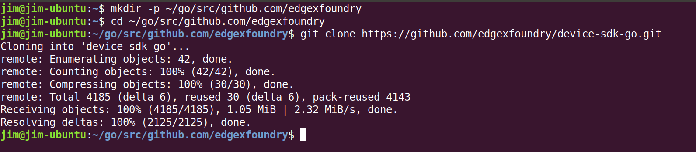
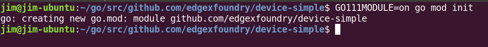
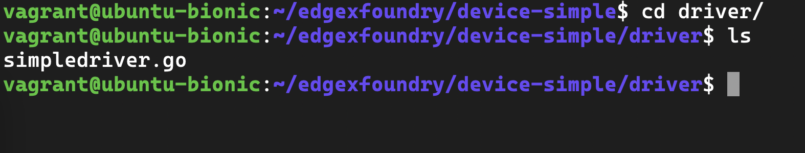
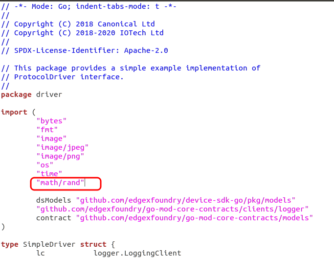
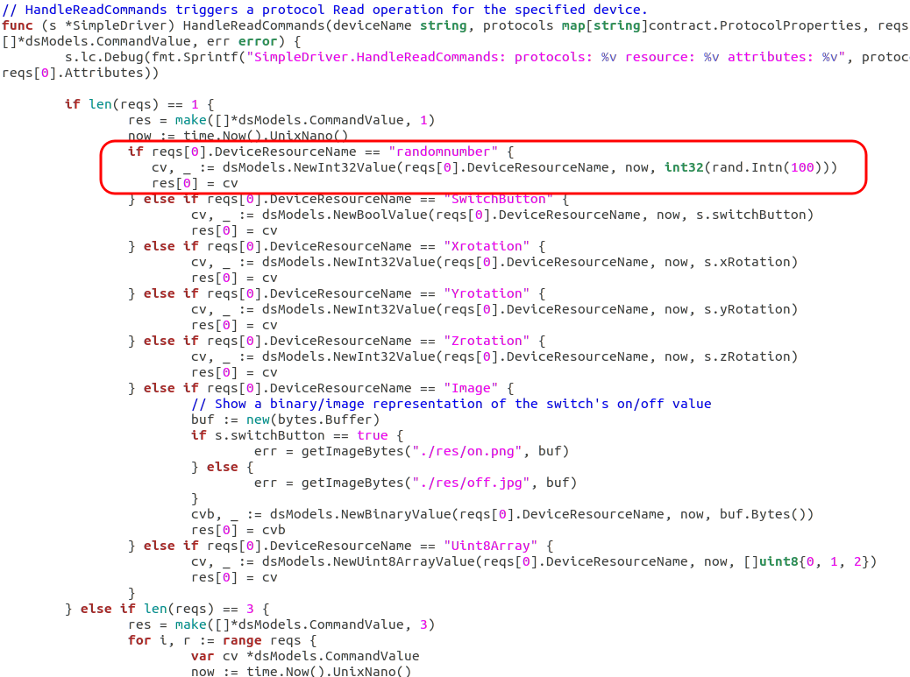
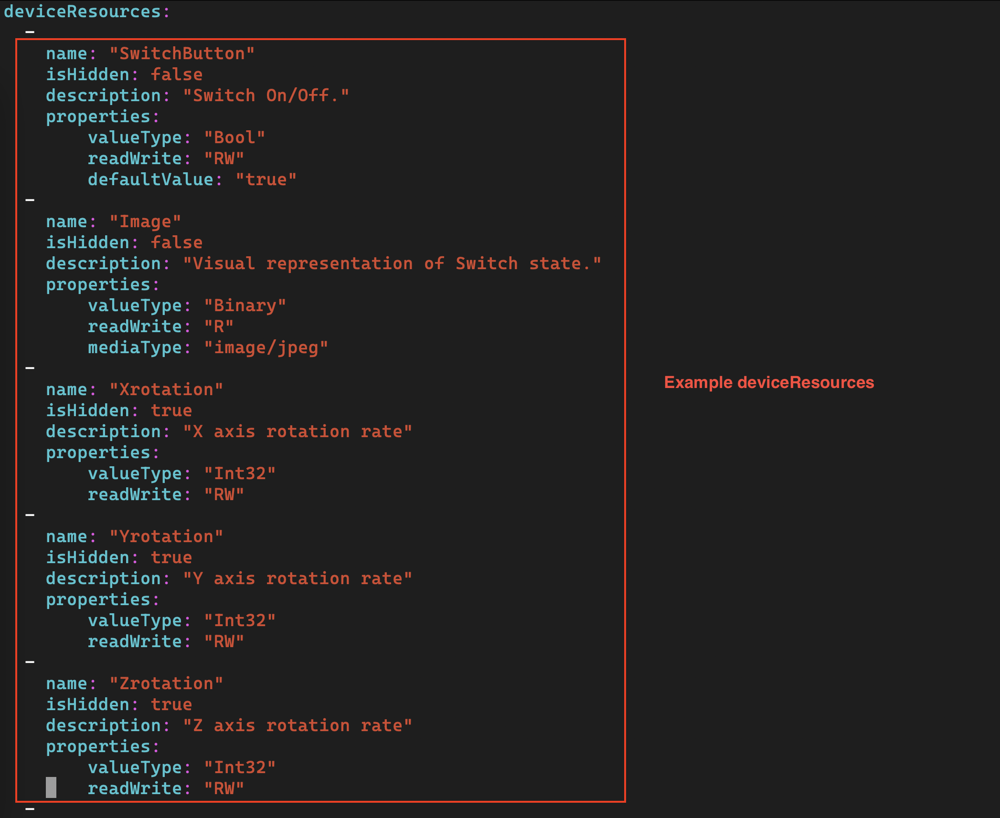

# Golang SDK

In this guide, you create a simple device service that generates a
random number as a means to simulate getting data from an actual device. In this way, you explore some SDK framework and work necessary to complete a device service without actually having a device to talk to.

## Install dependencies

See the [Getting Started - Go Developers](Ch-GettingStartedGoDevelopers.md) guide to install the necessary tools and infrastructure needed to develop a GoLang service.

## Get the EdgeX Device SDK for Go

Follow these steps to create a folder on your file system,
download the [Device SDK](../../microservices/device/sdk/Ch-DeviceSDK), and get the GoLang device service SDK on your system.

1.  Create a collection of nested folders, `~/edgexfoundry` on your file system. This folder will hold your new Device Service. In Linux, create a directory with a single mkdir command
    ``` bash
    mkdir -p ~/edgexfoundry
    ```

2. In a terminal window, change directories to the folder just created and pull down the SDK in Go with the commands as shown.
    ``` bash
    cd ~/edgexfoundry
    git clone --depth 1 --branch v2.0.0 https://github.com/edgexfoundry/device-sdk-go.git
    ```

    

    !!! Note
        The clone command above has you pull v2.0.0 of the Go SDK which is the version associated to Ireland.  There are later releases of EdgeX, and it is always a good idea to pull and use the latest version associated with the major version of EdgeX you are using.  You may want to check for the latest released version by going to https://github.com/edgexfoundry/device-sdk-go and look for the latest release.

3.  Create a folder that will hold the new device service.  The name of the folder is also the name you want to give your new device service. Standard practice in EdgeX is to prefix the name of a device service with `device-`.  In this example, the name 'device-simple' is used.
    ``` bash
    mkdir -p ~/edgexfoundry/device-simple
    ```

4.  Copy the example code from **device-sdk-go** to **device-simple**:
    ``` bash
    cd ~/edgexfoundry
    cp -rf ./device-sdk-go/example/* ./device-simple/
    ```

5.  Copy Makefile to device-simple:
    ``` bash
    cp ./device-sdk-go/Makefile ./device-simple
    ```
6. Copy version.go to device-simple:
    ``` bash
    cp ./device-sdk-go/version.go ./device-simple/
    ```

After completing these steps, your device-simple folder should look like the listing below.


## Start a new Device Service

With the device service application structure in place, time now to program the service to act like a sensor data fetching service.

1.  Change folders to the device-simple directory.

    ``` bash
    cd ~/edgexfoundry/device-simple
    ```

2.  Open main.go file in the cmd/device-simple folder with your favorite text editor. Modify the
    import statements.  Replace `github.com/edgexfoundry/device-sdk-go/v2/example/driver` with `github.com/edgexfoundry/device-simple/driver` in the import statements.
    Also replace `github.com/edgexfoundry/device-sdk-go/v2` with `github.com/edgexfoundry/device-simple`. Save the file when you have finished editing.

    

3.  Open Makefile found in the base folder (~/edgexfoundry/device-simple) in your favorite text editor and make the following
    changes

    -   Replace:

            MICROSERVICES=example/cmd/device-simple/device-simple

        with:

            MICROSERVICES=cmd/device-simple/device-simple

    -   Change:

            GOFLAGS=-ldflags "-X github.com/edgexfoundry/device-sdk-go/v2.Version=$(VERSION)"

        to refer to the new service with:

            GOFLAGS=-ldflags "-X github.com/edgexfoundry/device-simple.Version=$(VERSION)"

    -   Change:

            example/cmd/device-simple/device-simple:
              go mod tidy
              $(GOCGO) build $(GOFLAGS) -o $@ ./example/cmd/device-simple

        to:

            cmd/device-simple/device-simple:
              go mod tidy
              $(GOCGO) build $(GOFLAGS) -o $@ ./cmd/device-simple

4.  Save the file.

5.  Enter the following command to create the initial module definition
    and write it to the go.mod file:

        GO111MODULE=on go mod init github.com/edgexfoundry/device-simple

    

6. Use an editor to open and edit the go.mod file created in ~/edgexfoundry/device-simple.  Add the code highlighted below to the bottom of the file.  This code indicates which version of the device service SDK and the associated EdgeX contracts module to use.

    ``` go
    require (
        github.com/edgexfoundry/device-sdk-go/v2 v2.0.0
        github.com/edgexfoundry/go-mod-core-contracts/v2 v2.0.0
    )
    ```
    

    !!! Note
        You should always check the **go.mod** file in the [latest released version SDK](https://github.com/edgexfoundry/device-sdk-go) for the correct versions of the Go SDK and go-mod-contracts to use in your go.mod.

## Build your Device Service

To ensure that the code you have moved and updated still works, build
the device service. In a terminal window, make sure you are still in the device-simple folder (the folder containing the Makefile).  Build the service by issuing the following command:

``` bash
make build
```

If there are no errors, your service is ready for you to add
custom code to generate data values as if there was a sensor
attached.

## Customize your Device Service

The device service you are creating isn't going to talk to a real
device. Instead, it is going to generate a random number where the
service would ordinarily make a call to get sensor data from the actual device.

1.  Locate the simpledriver.go file in the /driver folder and open it
    with your favorite editor.

    

2.  In the import() area at the top of the file, add "math/rand" under "time".

    

3.  Locate the HandleReadCommands() function in this same file (simpledriver.go). Find the
    following lines of code in this file (around line 139):

    ``` go
    if reqs[0].DeviceResourceName == "SwitchButton" {
        cv, _ := sdkModels.NewCommandValue(reqs[0].DeviceResourceName, common.ValueTypeBool, s.switchButton)  
        res[0] = cv
	}
    ```

    Add the conditional (if-else) code in front of the above conditional:

    ``` go
    if reqs[0].DeviceResourceName == "randomnumber" {
        cv, _ := sdkModels.NewCommandValue(reqs[0].DeviceResourceName, common.ValueTypeInt32, int32(rand.Intn(100)))
        res[0] = cv
    } else
    ```

    

    The first line of code checks that the current request is for a resource called "RandomNumber". The second line of code generates
    an integer (between 0 and 100) and uses that as the value the device
    service sends to EdgeX -- mimicking the collection of data from a
    real device. It is here that the device service would normally
    capture some sensor reading from a device and send the data to
    EdgeX. The HandleReadCommands is where you'd need to do
    some customization work to talk to the device, get the
    latest sensor values and send them into EdgeX.

4.  Save the simpledriver.go file

## Creating your Device Profile

A device profile is a YAML file that describes a class of device to
EdgeX. General characteristics about the type of device, the data these devices provide, and how to command the device are all in a device profile.   The device profile tells the device service what data gets collected from the the device and how to get it. 

Follow these steps to create a device profile for the simple random number generating device service.

1.  Explore the files in the cmd/device-simple/res/profiles folder.   Note the example Simple-Driver.yaml device profile that is already in this folder.  Open the file with your favorite editor and explore its contents.  Note how `deviceResources` in the file represent properties of a device (properties like SwitchButton, X, Y and Z rotation).

    

2.  A pre-created device profile for the random number device is provided in this documentation.  Download **[random-generator-device.yaml](random-generator-device.yaml)** and save the file to the `~/edgexfoundry/device-simple/cmd/device-simple/res/profiles` folder.

3.  Open the random-generator-device.yaml file in a text editor. In this device profile, the device described has a deviceResource:  `RandomNumber`.  Note how the association of a type to the deviceResource.  In this case, the device profile informs EdgeX that RandomNumber will be a INT32.  In real world IoT situations, this deviceResource list could be extensive.  Rather than a single deviceResource, you might find this section filled with many deviceResources and each deviceResource associated to a different type.

## Creating your Device

Device Service accepts pre-defined devices to be added to EdgeX during device service startup.

Follow these steps to create a pre-defined device for the simple random number generating device service.

1.  Explore the files in the cmd/device-simple/res/devices folder.   Note the example simple-device.toml that is already in this folder.  Open the file with your favorite editor and explore its contents.  Note how `DeviceList` in the file represent an actual device with its properties (properties like Name, ProfileName, AutoEvents).
    
2.  A pre-created device for the random number device is provided in this documentation.  Download **[random-generator-device.toml](random-generator-device.toml)** and save the file to the `~/edgexfoundry/device-simple/cmd/device-simple/res/devices` folder.
    
3.  Open the random-generator-device.toml file in a text editor. In this example, the device described has a ProfileName:  `RandNum-Device`.  In this case, the device informs EdgeX that it will be using the device profile we created in [Creating your Device Profile](./Ch-GettingStartedSDK-Go.md#creating-your-device-profile)

### Validating your Device

Go Device Services provide `/api/v2/validate/device` API to validate device's ProtocolProperties.  
This feature allows Device Services whose protocol has strict rule to validate their devices before adding them into EdgeX.

Go SDK provides `DeviceValidator` interface:
```go
// DeviceValidator is a low-level device-specific interface implemented
// by device services that validate device's protocol properties.
type DeviceValidator interface {
    // ValidateDevice triggers device's protocol properties validation, returns error
    // if validation failed and the incoming device will not be added into EdgeX.
    ValidateDevice(device models.Device) error
}
```

By implementing `DeviceValidator` interface whenever a device is added or updated,
`ValidateDevice` function will be called to validate incoming device's ProtocolProperties and reject
the request if validation failed.

## Configuring your Device Service

Now update the configuration for the new device service.    This documentation provides a new configuration.toml file.  This configuration file:

- changes the port the service operates on so as not to conflict with other device services

Download  **[configuration.toml](configuration.toml)** and save the file to the `~/edgexfoundry/device-simple/cmd/device-simple/res` folder (overwrite the existing configuration file).  Change the host address of the device service to your system's IP address.

!!! Warning
    In the configuration.toml, change the host address (around line 14) to the IP address of the system host.  This allows core metadata to callback to your new device service when a new device is created.  Because the rest of EdgeX, to include core metadata, will be running in Docker, the IP address of the host system on the Docker network must be provided to allow metadata in Docker to call out from Docker to the new device service running on your host system.

### Custom Structured Configuration

!!! edgey "EdgeX 2.0"
    New for EdgeX 2.0

Go Device Services can now define their own custom structured configuration section in the `configuration.toml` file. Any additional sections in the TOML are ignored by the SDK when it parses the file for the SDK defined sections. 

This feature allows a Device Service to define and watch it's own structured section in the service's TOML configuration file.

The `SDK` API provides the follow APIs to enable structured custom configuration:

- `LoadCustomConfig(config UpdatableConfig, sectionName string) error`
  
    Loads the service's custom configuration from local file or the Configuration Provider (if enabled). The Configuration Provider will also be seeded with the custom configuration the first time the service is started, if service is using the Configuration Provider. The `UpdateFromRaw` interface will be called on the custom configuration when the configuration is loaded from the Configuration Provider.

- `ListenForCustomConfigChanges(configToWatch interface{}, sectionName string, changedCallback func(interface{})) error`
  
    Starts a listener on the Configuration Provider for changes to the specified section of the custom configuration. When changes are received from the Configuration Provider the UpdateWritableFromRaw interface will be called on the custom configuration to apply the updates and then signal that the changes occurred via changedCallback.

See the [Device MQTT Service](https://github.com/edgexfoundry/device-mqtt-go/tree/v2.0.0) for an example of using the new Structured Custom Configuration capability.

- [See here for defining the structured custom configuration](https://github.com/edgexfoundry/device-mqtt-go/blob/v2.0.0/internal/driver/config.go#L21-L72)
- [See here for custom section on the configuration.toml file](https://github.com/edgexfoundry/device-mqtt-go/blob/v2.0.0/cmd/res/configuration.toml#L86-L108)
- [See here for loading, validating and watching the configuration](https://github.com/edgexfoundry/device-mqtt-go/blob/v2.0.0/internal/driver/driver.go#L54-L69)

## Retrieving Secrets

The Go Device SDK provides the `SecretProvider.GetSecret()` API to retrieve the Device Services secrets.  See the [Device MQTT Service](https://github.com/edgexfoundry/device-mqtt-go/blob/v2.0.0/internal/driver/config.go#L114) for an example of using the `SecretProvider.GetSecret()` API. Note that this code implements a retry loop allowing time for the secret(s) to be push into the service's `SecretStore` via the /secret endpoint. See [Storing Secrets](../../microservices/device/Ch-DeviceServices/#storing-secrets) section for more details.  

## Rebuild your Device Service

Just as you did in the [Build your Device Service](./Ch-GettingStartedSDK-Go.md#build-your-device-service) step above, build the device-simple service, which creates the executable program that is your device service.  In a terminal window, make sure you are in the device-simple folder (the folder containing the Makefile).  Build the service by issuing the following command:

``` bash
cd ~/edgexfoundry/device-simple
make build
```


If there are no errors, your service is created and put in the 
`~/edgexfoundry/device-simple/cmd/device-simple` folder.  Look for the `device-simple` executable in the folder.

## Run your Device Service

Allow the newly created device service, which was formed out of the
Device Service Go SDK, to create sensor-mimicking data that it then
sends to EdgeX:

1.  Follow the [Getting Started using Docker](./Ch-GettingStartedDockerUsers.md) guide to start all of EdgeX. From
    the folder containing the docker-compose file, start EdgeX with the
    following call (we're using non-security EdgeX in this example):

    ``` bash
    docker-compose -f docker-compose-no-secty.yml up -d
    ```

2.  In a terminal window, change directories to the device-simple's
    cmd/device-simple folder and run the new device-simple service.

    ``` bash
    cd ~/edgexfoundry/device-simple/cmd/device-simple
    ./device-simple
    ```

    This starts the service and immediately displays log entries in the
    terminal.

3.  Using a browser, enter the following URL to see the event/reading
    data that the service is generating and sending to EdgeX:

    <http://localhost:59880/api/v2/event/device/name/RandNum-Device01>

    This request asks core data to provide the events associated to the RandNum-Device-01.

