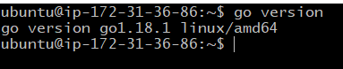
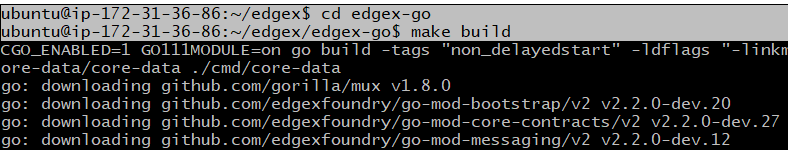

# Build and Run on Linux on ARM 32
## Specifically - build and run EdgeX natively on a Raspberry Pi 

!!! Warning
    This build and run guide offers some assistance to seasoned developers or administrators to help build and run EdgeX on Linux OS with ARM 32 hardware natively (not using Docker and not running with snaps).   Running on ARM 32 is **not supported by the project**.  EdgeX was built to be platform independent.  As such, we believe most of EdgeX can run on almost any environment (on any hardware architecture and almost any operating system).
    
    Existence of this guide **does not imply current or future support**.  Use of this guide should be used with care and with an understanding that it is the community's best effort to provide advanced developers with the means to begin their own custom EdgeX development and execution on Linux distributions running on ARM 32 hardware.

This build and run guide shows you how to get, compile/build, execute and test EdgeX (including the core and supporting services, the configurable application service, eKuiper rules engine and a virtual device service) in Linux on ARM 32 hardware.  Specifically, this guide was done using a [Raspberry Pi 3](https://www.raspberrypi.com/products/raspberry-pi-3-model-b/) running [Raspberry Pi OS - version 5.15](https://www.raspberrypi.com/software/).  For the most part, the guide should assist in building and running EdgeX in almost any Linux distribution on almost any ARM 32 hardware, but some instructions will vary based on the nuances of the underlying distribution.

## Environment

Building and running EdgeX on Linux natively will require you have:

- A relatively modern Linux OS (this guide was written using Raspberry Pi OS version 5.15)
- `sudo` or root access
- Access from the host machine to the Internet in order to get tools and source code (e.g., to clone code from GitHub)
- ARM 32 hardware platform - such as that found on the Raspberry Pi platform
- Sufficient memory to build and run EdgeX micro services ([EdgeX suggests](../general/../../general/PlatformRequirements.md) 1GB minimum.)
    - 1GB is sufficient memory to run all the required software as well as build/run EdgeX services listed below
- Sufficient disk space to pull the required tools, libraries, code, etc. to build and run EdgeX ([EdgeX suggests](../general/../../general/PlatformRequirements.md) 10GB minimum )
    - 10GB is inclusive of space needed to download and setup all the required software/tools as well as EdgeX

## Required Software

The following software is assumed to already be installed and available on the host platform.  Follow the referenced guides if you need to install or setup this software.  Please note, the commands to check for the required software documented below are correct, but the actual results of the check may vary per OS distribution and version.

- Go Lang, version 1.17 or later as of the Kamakura release
    - See [Go Download and install guide for help](https://go.dev/doc/install)
    - How to check for existence and version on your machine

        

- GCC Build Essentials (for C++)
    - See [How to Install Build Essentials on Raspberry Pi](https://lindevs.com/install-build-essential-on-raspberry-pi/)
    - How to check for existence and version on your machine

        

    - Your installation process may vary based on Linux version/distribution
  
- Consul, version 1.10 or later as of the Kamakura release
    - See [Open Source Consul for help](https://www.consul.io/)
    - How to check for existence and version on your machine

        

- Redis,version 6.2 or later as of the Kamakura release
    - See [How to install Redis on Arm (32)/Raspberry Pi](https://amalgjose.com/2020/08/11/how-to-install-redis-in-raspberry-pi/)
    - How to check for existence and version on your machine

        

    - Your installation process may vary based on Linux version/distribution

- Git
    - Git is already installed with Raspberry Pi OS
    - If not already provided with your OS, see [Install Git on Linux](https://www.atlassian.com/git/tutorials/install-git#linux)
    - How to check for existence and version on your machine

        

## Prepare your environment

In this guide, you will be building and running EdgeX in "non-secure" mode.  That is, you will be building and running the EdgeX platform without the security services and security configuration.  An environmental variable, `EDGEX_SECURITY_SECRET_STORE`,  is set to indicate whether the EdgeX services are expected to initialize and use the secure secret store.  By default, this variable is set to `true`.  Prior to building and running EdgeX, set this environment variable to false.

``` Shell
export EDGEX_SECURITY_SECRET_STORE=false 
```

This can be done in the terminal from which you build and run EdgeX or you can set it in your user's profile to make an environment persist across terminal sessions.  See [How to Set Environment Variables in Linux](https://www.serverlab.ca/tutorials/linux/administration-linux/how-to-set-environment-variables-in-linux/) for assistance.

## Download EdgeX Source

In order to build and run EdgeX micro services, you will first need to get the source code for the platform.  Using git, clone the EdgeX repositories with the following commands:

!!! Tip
    You may wish to create a new folder and then issue these git commands from that folder so that all EdgeX code is neatly stored in a single folder.

``` Shell
git clone https://github.com/edgexfoundry/edgex-go.git
git clone https://github.com/edgexfoundry/device-virtual-go.git
git clone https://github.com/edgexfoundry/app-service-configurable.git
git clone https://github.com/lf-edge/ekuiper.git
git clone https://github.com/edgexfoundry/edgex-ui-go.git
```

Note that a new folder, named for the repository, gets created containing source code with each of the git clones above.

!!! Warning
    These git clone operations pull from the main branch of the EdgeX repositories.  This is the current working branch in EdgeX development.  See the [git clone documentation](https://git-scm.com/docs/git-clone) for how to clone a specific named release branch or version tag.

## Build EdgeX Services

With the source code, you can now build the EdgeX services, GUI, as well as eKuiper rules engine.  

### Build Core and Supporting Services

Most of the services are in the `edgex-go` folder.  This folder contains the code for the [core](../../microservices/core/Ch-CoreServices.md) and [supporting](../../microservices/support/Ch-SupportingServices.md) services.  A single command in this repository will build several of the services.

Enter the `edgex-go` folder and issue the `make build` command as shown below.



!!! Warning
    Depending on the amount of memory your system has, building the services in `edgex-go` can take several minutes (in the case of a Raspberry Pi 3, build time for edgex-go services can take as much as 30-45 minutes and a device service is taking about 10-15 minutes to build).

!!! Note
    Building the services in edgex-go folder will actually build some of the services (such as the security services) not used in this guide, but issuing a single command is the easiest way to build the services needed without having to build services one by one.

### Build the Virtual Device Service

The [virtual device service](../../microservices/device/supported/device-virtual/Ch-VirtualDevice.md) simulates devices/sensors sending data to EdgeX as if it was a "thing".  This guide uses the virtual device service to exemplify how other devices services can be built and run.

Enter the `device-virtual-go` folder and issue the `make build` command as shown below.


### Build the Configurable Application Service

The [configurable application service](../../microservices/application/AppServiceConfigurable.md) helps prepare device/sensor data for enterprise or cloud systems.  It also prepares data for use by the rules engine - [eKuiper](../../microservices/support/eKuiper/Ch-eKuiper.md)

Enter the `app-service-configurable` folder and issue the `make build` command as shown below.


### Build eKuiper

Sister Linux Foundation, LF Edge project [eKuiper](https://www.lfedge.org/projects/ekuiper/) is the reference implementation rules engine for EdgeX.

Enter the `ekuiper` folder and issue the `make build_with_edgex` command as shown below.


!!! Note
    eKuiper does also provide [binaries](https://github.com/lf-edge/ekuiper/releases) which can be downloaded and used without the need for builds.  

### Build the GUI

EdgeX provides a [graphical user interface](../tools/Ch-GUI.md) for exploring a single instance of the EdgeX platform.  The GUI makes it easier to work with EdgeX and see sample data coming from sensors.  It provides a means to check that EdgeX is working correctly, monitor EdgeX and even make some configuration changes.

Enter the `edgex-ui-go` folder and issue the `make build` command as shown below.


## Run EdgeX

Provided everything built correctly and without issue, you can now start your EdgeX services one at a time.  First make sure Redis Server is running.  If Redis is not running, start it before the other services.  If it is running, you can start each of the EdgeX services **in order** as listed below.

### Start Consul

Start Consul Agent with the following command.

``` Shell
nohup consul agent -ui -bootstrap -server -client 0.0.0.0 -data-dir=tmp/consul &
```

The `nohup` is used to execute the command and ignore all SIGHUP (hangup) signals.  The `&` says to execute the process in the background.  Both `nohup` and `&` will be used to run each of the services so that the same terminal can be used and the output will be directed to local nohup.out log files.

If Consul is running correctly, you should be able to reach the Consul UI through a browser at http://(host address):8500


### Start Core Metadata

Each of core and supporting EdgeX services are located in `edgex-go/cmd` under a subfolder by the service name.  In the first case, core-metadate is located in `edgex-go/cmd/core-metadata`.  Change directories to the core-metadata service subfolder and then run the executable found in the subfolder with `-cp` and `-registry` command line options as shown below.

``` shell
cd edgex-go/cmd/core-metadata/
nohup ./core-metadata -cp=consul.http://localhost:8500 -registry &
```

The `-cp=consul.http://localhost:8500` command line parameter tells core-metadata to use Consul and where to find Consul running.  The `-registry` command line parameter tells core-metadata to use (and register with) the registry service.  Both of these command line parameters will be use when launching all EdgeX services.

### Start the other Core and Supporting Services

In a similar fashion, enter each of the other core and supporting service folders in `edgex-go/cmd` and launch the services.

```Shell
cd ../core-data
nohup ./core-data -cp=consul.http://localhost:8500 -registry &
cd ../core-command
nohup ./core-command -cp=consul.http://localhost:8500 -registry &
cd ../support-notifications/
nohup ./support-notifications -cp=consul.http://localhost:8500 -registry &
cd ../support-scheduler/
nohup ./support-scheduler -cp=consul.http://localhost:8500 -registry &
```

!!! Tip
    If you still have the Consul UI up, you should see each of the EdgeX core and supporting services listed in Consul's `Services` page with green check marks next to them suggesting they are running.

    

### Start Configurable Application Service

The configurable application service is located in the root of `app-service-configurable` folder.


The configurable application service is started in a similar way as the other EdgeX services.  The configurable application service is going to be used to route data to the rules engine.  Therefore, an additional command line parameter (`p`) is added to its launch command to tell the app service to use the rules engine configuration and profile.

```Shell
nohup ./app-service-configurable -cp=consul.http://localhost:8500 -registry -p=rules-engine &
```

### Start the Virtual Device Service

The virtual device service is also started in similar way as the other EdgeX services.  The virtual device service manufactures data as if it was to come from a sensor and sends that data into the rest of EdgeX.  By default, the virtual device service will generate random numbers (integers, unsigned integers, floats), booleans and even binary data as simulated sensor data.  The virtual device service is located in the `device-virtual-go/cmd` folder.  


Change directories to the virtual device service's `cmd` folder and then launch the service with the command shown below.

```Shell
nohup ./device-virtual -cp=consul.http://localhost:8500 -registry &
```

### Start the GUI

The EdgeX graphical user interface (GUI) provides an easy to use visual tool to monitor data passing through EdgeX services.  It also provides some capability to change an EdgeX instance's configuration or metadata.  The EdgeX GUI is located in the `edgex-ui-go/cmd/edgex-ui-server` folder.


Change directories to the GUI's `cmd/edgex-ui-server` folder and then launch the GUI with the command shown below.

```Shell
nohup ./edgex-ui-server &
```

If the GUI is running correctly, you should be able to reach the GUI through a browser at http://(host address):4000.  It may take a few seconds for the GUI to initialize once you hit the URL.


!!! Note
    Some elements of the GUI will not work as you do not have all available EdgeX services running.  Notably, the System Management service and its executor are not running so the System view of the GUI will display an error.  By default, the System Management service and its executor operate by checking on the other services memory, CPU, etc. via Docker Stats.  In this case, since you are not running Docker containers, the System Management service would not function.

### Start eKuiper

[eKuiper](https://ekuiper.org/) is the reference implementation rules engine that is typically run with EdgeX by default.  It is a lightweight, easy to use rules engine.  Rules can be established using SQL.  It is a sister project under the LF Edge umbrella project.

eKuiper's executable (called `kuiperd`) is located in the `ekuiper/_build/kuiper-*version*-linux-arm/bin` folder.  Note that the location is in a `_build` folder subfolder created when you built eKuiper.  The subfolder is named for the eKuiper version, OS, architecture.


Change directories to the `ekuiper/_build/kuiper-*version*-linux-arm/bin` folder.

#### Set eKuiper Environment Variables

As a 3rd party component, eKuiper can be setup to work with many streams of data from various systems or engines.  It must be provided knowledge about where it is receiving data and how to handle/treat the incoming data.  Therefore, before launching eKuiper, execute the following export of environmental variables in order to tell eKuiper where to receive data coming from the EdgeX configurable application service (via the EdgeX message bus).

``` Shell
export CONNECTION__EDGEX__REDISMSGBUS__PORT=6379
export CONNECTION__EDGEX__REDISMSGBUS__PROTOCOL=redis
export CONNECTION__EDGEX__REDISMSGBUS__SERVER=localhost
export CONNECTION__EDGEX__REDISMSGBUS__TYPE=redis
export EDGEX__DEFAULT__PORT=6379
export EDGEX__DEFAULT__PROTOCOL=redis
export EDGEX__DEFAULT__SERVER=localhost
export EDGEX__DEFAULT__TOPIC=rules-events
export EDGEX__DEFAULT__TYPE=redis
export KUIPER__BASIC__CONSOLELOG="true"
export KUIPER__BASIC__RESTPORT=59720
```

Setting these environment variables must be done in the same terminal from which you plan to execute the eKuiper server.

#### Run eKuiper

From the `ekuiper/_build/kuiper-*version*-linux-arm` folder, and with the environmental variables set, launch eKuiper's server with the command shown below.

``` Shell
nohup ./bin/kuiperd &
```

!!! Warning
    There is both a `kuiper` and a `kuiperd` executable in the `bin` folder.  Make sure you are running `kuiperd`.
  
If eKuiper is running correctly, the RuleEngine tab in the EdgeX GUI should offer the ability to define eKuiper Streams and Rules as shown below.


If eKuiper is not running correctly or if the environmental variables where incorrectly set, then you will see an error screen like that shown below.


## Test and Explore EdgeX

With EdgeX up and running (inclusive of Consul, Redis, and eKuiper), you can try these quick tests to see that EdgeX is running correctly.

### See sensor data flowing through EdgeX

You have already been using Consul and the EdgeX GUI to check on some items of EdgeX in this tutorial.  You can use the EdgeX GUI to further check that sensor data is flowing through the system.

In a browser, go to http://(host address):4000.  Remember, it may take a few seconds for the GUI to initialize once you hit the URL.  Once the GUI displays, find and click on the `DataCenter` link on the left hand navigation bar (highlighted below).


The `DataCenter` display allows you to see the EdgeX event/readings as they are persisted by the core data service to Redis.  Simply press the `>Start` button to see the "stream" of simulated sensor data that was generated by the virtual device service and sent to EdgeX. The simulated data may take a second or two to start to display in the `EventDataStream` area of the GUI.


Press the `Pause` button to stop this display of data.  Notice that you can see the EdgeX Events (and associated Readings) or just the Readings with the two tabs on this `DataCenter` display.

### Check EdgeX service API

Each EdgeX micro service has a REST API associated with it.  You can use curl or a browser to test that the service is up using its `ping` API.  Below are curl commands to "ping" both core data and core metadata.

``` Shell
  curl http://localhost:59880/api/v2/ping
  curl http://localhost:59881/api/v2/ping
```

Each service should respond with JSON data to indicate it is able to respond to requests.  Below is an example response from the core metadata "Ping" request.

``` JSON
{"apiVersion":"v2","timestamp":"Thu May 12 23:25:04 UTC 2022","serviceName":"core-metadata"}
```

See [the service port reference page](../general/../../general/ServicePorts.md) for a list of service ports to check the `ping` API of other services.

As an added test, use curl to get the count of the number of events persisted by core data with the command below (you can also use a browser with the URL to get the same).

``` Shell
curl http://localhost:59880/api/v2/event/count
```

The response will indicate a "count" of events stored (in this case 6270).

``` JSON
{"apiVersion":"v2","statusCode":200,"Count":6270}
```

!!! Info
    The full set of APIs for each service can be found in [SwaggerHub](https://app.swaggerhub.com/search?owner=EdgeXFoundry1).  You can use the documentation to test other APIs as well.

### Set up an eKuiper Stream and Rule

While eKuiper is running, it is currently sitting idle since it has no rules on which to watch for data and execute commands.  Set up a simple eKuiper rule to log any sensor data it sees.  Use the GUI tool to establish the eKuiper `stream` and `rule`.  Learn about Streams and Rules in the [eKuiper documentation](https://ekuiper.org/docs/en/latest/concepts/ekuiper.html).

#### Establish the Stream

In the GUI, click on the `Rules Engine` link in the navigation bar on the left.  Then, click on the `Add` button on the Stream tab.  Allow the default EdgeX stream be created by hitting the `Submit` button.


#### Establish the Rule

Next, click on the `Rules` tab on the `Rules Engine` page.  Then click on the `Add` button on the `Rules` tab in order to create a new eKuiper rule.  In the form that appears, enter any name for the rule (`TestRule` is used below) in the Name field.  Enter `SELECT * FROM EdgeXStream` in the RuleSQL field and add a `log` action - all as shown below in the form.  Hit the `Submit` button when you have your rule established.


#### Check the Rule Engine is firing

With the stream and rule defined, you have asked eKuiper to fire a log entry each time it sees a new EdgeX event/reading come through it.  In the future, you could have eKuiper look for particular events/readings (e.g., thermostat readings above a specified temperature) produced by a particular sensor in order to issue commands to some device.  But for now, you can check the eKuiper log to see that the rule engine is working and publishing a message to the log with each event/reading.

In the `ekuiper/_build/kuiper-*version*-linux-arm/log` folder, you will find a `stream.log` file.  


If you use Linux `tail`, you can see that the eKuiper rules engine is firing a log entry for each virtual device service record that flows through EdgeX.  Issue the following command to see the log entries occur in real time:

``` Shell
  tail -f stream.log
```


!!! Info

  Seeing the eKuiper rules engine fire a log entry into a file for each EdgeX event/reading that comes through, has allowed you to confirm and see the entire EdgeX system is working properly.

  - It started with the virtual device service creating an EdgeX event/reading to simulate a real sensor reading that was sent via message bus to both the core data and the configurable application services.
    - The GUI allowed you to see the EdgeX event/readings that were stored in the database by the core data service.
  - The application service had to pick up the EdgeX event/reading off the message bus and send it to the eKuiper rules engine.
  - The rules engine then picked up the EdgeX event/reading and fire an entry into the log.

## Debugging and Troubleshooting

With the `nohup` command on each service, the log file contents are redirected to a file (`nohup.out`) in the directory where you started each service.  if you find that a service does not appear to be running or if it is running but not working correctly, check the `nohup.out` file for any errors or issues.  In the example below, the core data's `nohup.out` log file is explored.


