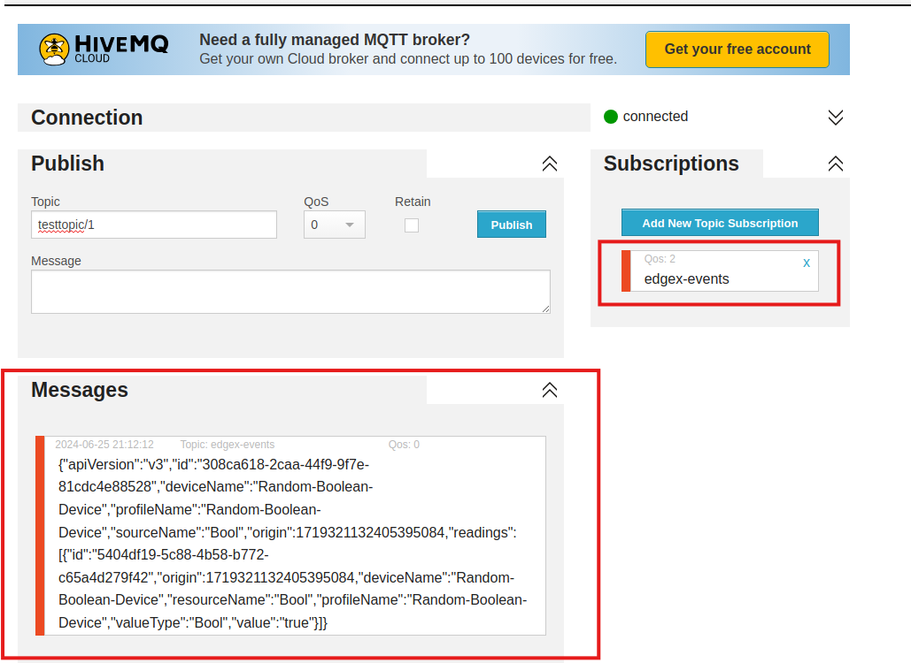

# Quick Start
This guide will get EdgeX up and running on your machine in as little as 5 minutes. We will skip over lengthy descriptions for now. The goal here is to get you a working IoT Edge stack, from device to cloud, as simply as possible.  

When you need more detailed instructions or a breakdown of some of the commands you see in this quick start, see either the [Getting Started- Users](../Ch-GettingStartedUsers) or [Getting Started - Developers](../Ch-GettingStartedDevelopers) guides.

## Setup
The fastest way to start running EdgeX is by using our pre-built Docker images. To use them you'll need to install the following:

* Docker <https://docs.docker.com/install/>
* Docker Compose <https://docs.docker.com/compose/install/>

## Running EdgeX

!!! Info
    Ireland (v 2.0) is the latest version of EdgeX and used by example in this guide.

Once you have Docker and Docker Compose installed, you need to:

* download / save the latest [`docker-compose` file](https://github.com/edgexfoundry/edgex-compose/blob/ireland/docker-compose-no-secty.yml)
* issue command to download and run the EdgeX Foundry Docker images from Docker Hub

This can be accomplished with a single command as shown below (please note the tabs for x86 vs ARM architectures).

=== "x86"
    ```
    curl https://raw.githubusercontent.com/edgexfoundry/edgex-compose/ireland/docker-compose-no-secty.yml -o docker-compose.yml; docker-compose up -d
    ```
=== "ARM"
    ```
    curl https://raw.githubusercontent.com/edgexfoundry/edgex-compose/ireland/docker-compose-no-secty-arm64.yml -o docker-compose.yml; docker-compose up -d
    ```

Verify that the EdgeX containers have started:
```
docker-compose ps 
```

*If all EdgeX containers pulled and started correctly and without error, you should see a process status (ps) that looks similar to the image above.*

## Connected Devices
EdgeX Foundry provides a [Virtual device service](https://github.com/edgexfoundry/device-virtual-go/tree/v2.0.0) which is useful for testing and development.  It simulates a number of [devices](../../general/Definitions.md#Device), each randomly generating data of various types and within configurable parameters.  For example, the Random-Integer-Device will generate random integers.

The Virtual Device (also known as Device Virtual) service is already a service pulled and running as part of the default EdgeX configuration.

You can verify that Virtual Device readings are already being sent by querying the EdgeX core data service for the event records sent for Random-Integer-Device:
```
curl http://localhost:59880/api/v2/event/device/name/Random-Integer-Device
```

*Verify the virtual device service is operating correctly by requesting the last event records received by core data for the Random-Integer-Device.*

!!! Note
    By default, the maximum number of events returned will be 20 (the default limit).  You can pass a `limit` parameter to get more or less event records.
    ```
    curl http://localhost:59880/api/v2/event/device/name/Random-Integer-Device?limit=50
    ```

## Controlling the Device

Reading data from devices is only part of what EdgeX is capable of.  You can also use it to control your devices - this is termed ['actuating'](../../general/Definitions.md#Actuate) the device. When a device registers with the EdgeX services, it provides a [Device Profile](../../microservices/device/profile/Ch-DeviceProfile.md) that describes both the data readings available from that device, and also the commands that control it. 

When our Virtual Device service registered the device `Random-Integer-Device`, it used a [profile](https://github.com/edgexfoundry/device-virtual-go/blob/v2.0.0/cmd/res/profiles/device.virtual.int.yaml) to also define commands that allow you to tell the service not to generate random integers, but to always return a value you set.

You won't call commands on devices directly, instead you use the EdgeX Foundry [Command Service](../../microservices/core/command/Ch-Command.md) to do that. The first step is to check what commands are available to call by asking the Command service about your device:
``` bash
curl http://localhost:59882/api/v2/device/name/Random-Integer-Device
```

This will return a lot of JSON, because there are a number of commands you can call on this device, but the commands we're going to use in this guide are `Int16` (the comand to get the current integer 16 value) and `WriteInt16Value` (the command to disable the generation of the random integer 16 number and specify the integer value to return).  Look for the `Int16` and `WriteInt16Value` commands like those shown in the JSON as below:
``` json
{
    "apiVersion": "v2",
    "statusCode": 200,
    "deviceCoreCommand": {
        "deviceName": "Random-Integer-Device",
        "profileName": "Random-Integer-Device",
        "coreCommands": [
            {
                "name": "WriteInt16Value",
                "set": true,
                "path": "/api/v2/device/name/Random-Integer-Device/WriteInt16Value",
                "url": "http://edgex-core-command:59882",
                "parameters": [
                    {
                        "resourceName": "Int16",
                        "valueType": "Int16"
                    },
                    {
                        "resourceName": "EnableRandomization_Int16",
                        "valueType": "Bool"
                    }
                ]
            },
            {
                "name": "Int16",
                "get": true,
                "set": true,
                "path": "/api/v2/device/name/Random-Integer-Device/Int16",
                "url": "http://edgex-core-command:59882",
                "parameters": [
                    {
                        "resourceName": "Int16",
                        "valueType": "Int16"
                    }
                ]
            }
            ...
            
        ]
    }
}
```
You'll notice that the commands have `get` or `set` (or both) options. A **get** call will return a random number (integer 16), and is what is being called automatically to send data into the rest of EdgeX (specifically core data). You can also call **get** manually using the URL provided (with no additinal parameters needed):
``` bash
curl http://localhost:59882/api/v2/device/name/Random-Integer-Device/Int16
```
!!! Warning
    Notice that **localhost** replaces **edgex-core-command** here. That's because the EdgeX Foundry services are running in Docker.  Docker recognizes the internal hostname **edgex-core-command**, but when calling the service from outside of Docker, you have to use **localhost** to reach it.

This command will return a JSON result that looks like this:
``` json
{
    "apiVersion": "v2",
    "statusCode": 200,
    "event": {
        "apiVersion": "v2",
        "id": "6d829637-730c-4b70-9208-dc179070003f",
        "deviceName": "Random-Integer-Device",
        "profileName": "Random-Integer-Device",
        "sourceName": "Int16",
        "origin": 1625605672073875500,
        "readings": [
            {
                "id": "545b7add-683b-4745-84f1-d859f3d839e0",
                "origin": 1625605672073875500,
                "deviceName": "Random-Integer-Device",
                "resourceName": "Int16",
                "profileName": "Random-Integer-Device",
                "valueType": "Int16",
                "binaryValue": null,
                "mediaType": "",
                "value": "-8146"
            }
        ]
    }
}
```


*A call to GET of the Int16 device's Random-Integer-Device operation through the command service results in the next random value produced by the device in JSON format.*

The default range for this reading is -32,768 to 32,767.  In the example above, a value of `-8146` was returned as the reading value.  With the service set up to randomly return values, the value returned will be different each time the `Int16` command is sent.  However, we can use the `WriteInt16Value` command to disable random values from being returned and instead specify a value to return.  Use the curl command below to call the **set** command to disable random values and return the value `42` each time. 

``` bash
curl -X PUT -d '{"Int16":"42", "EnableRandomization_Int16":"false"}' http://localhost:59882/api/v2/device/name/Random-Integer-Device/WriteInt16Value
```

!!! Warning
    Again, also notice that **localhost** replaces **edgex-core-command**.

If successful, the service will confirm your setting of the value to be returned with a `200` status code.


*A call to the device's SET command through the command service will return the API version and a status code (200 for success).*

Now every time we call **get** on the `Int16` command, the returned value will be `42`.


*A call to GET of the Int16 device's Random-Integer-Device operation after setting the Int16 value to 42 and disabling randomization will always return a value of 42.*

## Exporting Data

EdgeX provides exporters (called application services) for a variety of cloud services and applications. To keep this guide simple, we're going to use the community provided 'application service configurable' to send the EdgeX data to a public MQTT broker hosted by HiveMQ.  You can then watch for the EdgeX event data via HiveMQ provided MQTT browser client.

First add the following application service to your docker-compose.yml file right after the 'app-service-rules' service (the first service in the file).  Spacing is important in YAML, so make sure to copy and paste it correctly.

``` yaml
  app-service-mqtt:
    container_name: edgex-app-mqtt
    depends_on:
    - consul
    - data
    environment:
      CLIENTS_CORE_COMMAND_HOST: edgex-core-command
      CLIENTS_CORE_DATA_HOST: edgex-core-data
      CLIENTS_CORE_METADATA_HOST: edgex-core-metadata
      CLIENTS_SUPPORT_NOTIFICATIONS_HOST: edgex-support-notifications
      CLIENTS_SUPPORT_SCHEDULER_HOST: edgex-support-scheduler
      DATABASES_PRIMARY_HOST: edgex-redis
      EDGEX_PROFILE: mqtt-export
      EDGEX_SECURITY_SECRET_STORE: "false"
      MESSAGEQUEUE_HOST: edgex-redis
      REGISTRY_HOST: edgex-core-consul
      SERVICE_HOST: edgex-app-mqtt
      TRIGGER_EDGEXMESSAGEBUS_PUBLISHHOST_HOST: edgex-redis
      TRIGGER_EDGEXMESSAGEBUS_SUBSCRIBEHOST_HOST: edgex-redis
      WRITABLE_PIPELINE_FUNCTIONS_MQTTEXPORT_PARAMETERS_BROKERADDRESS: tcp://broker.mqttdashboard.com:1883
      WRITABLE_PIPELINE_FUNCTIONS_MQTTEXPORT_PARAMETERS_TOPIC: EdgeXEvents
    hostname: edgex-app-mqtt
    image: edgexfoundry/app-service-configurable:2.0.0
    networks:
      edgex-network: {}
    ports:
    - 127.0.0.1:59702:59702/tcp
    read_only: true
    security_opt:
    - no-new-privileges:true
    user: 2002:2001
```

!!! Note
    This adds the application service configurable to your EdgeX system.  The application service configurable allows you to configure (versus program) new exports - in this case exporting the EdgeX sensor data to the HiveMQ broker at `tcp://broker.mqttdashboard.com:1883`.  You will be publishing to the EdgeXEvents topic.

    For convenience, see documentation on the [EdgeX Compose Builder](../Ch-GettingStartedUsers/#generate-a-custom-docker-compose-file) to create custom Docker Compose files.

Save the compose file and then execute another compose up command to have Docker Compose pull and start the configurable application service.

```
docker-compose up -d
```
You can connect to this broker with any MQTT client to watch the sent data. HiveMQ provides a [web-based client](http://www.hivemq.com/demos/websocket-client/) that you can use.  Use a browser to go to the client's URL.  Once there, hit the Connect button to connect to the HiveMQ public broker.  


*Using the HiveMQ provided client tool, connect to the same public HiveMQ broker your configurable application service is sending EdgeX data to.*

Then, use the Subscriptions area to subscribe to the "EdgeXEvents" topic.


*You must subscribe to the same topic - EdgeXEvents - to see the EdgeX data sent by the configurable application service.*

You will begin seeing your random number readings appear in the Messages area on the screen.


*Once subscribed, the EdgeX event data will begin to appear in the Messages area on the browser screen.*

## Next Steps

Congratulations! You now have a full EdgeX deployment reading data from a (virtual) device and publishing it to an MQTT broker in the cloud, and you were able to control your device through commands into EdgeX. 

It's time to continue your journey by reading the [Introduction](../../index.md) to EdgeX Foundry, what it is and how it's built. From there you can take the [Walkthrough](../../walk-through/Ch-Walkthrough.md) to learn how the micro services work together to control devices and read data from them as you just did.
