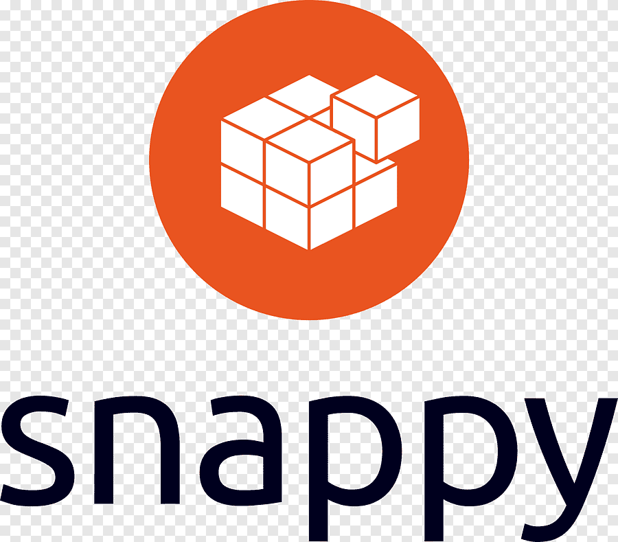

# Overview

EdgeX Foundry is a vendor-neutral open source project hosted by The Linux Foundation. EdgeX Foundry builds a common open framework for IoT edge computing.  At the heart of the project is an interoperability framework hosted within a full hardware- and OS-agnostic reference software platform to enable an ecosystem of plug-and-play components that unifies the marketplace and accelerates the deployment of IoT solutions.

  

    

        <a href="./getting-started/quick-start/">
          <b>Docker Quick Start</b>
          
Jump in to EdgeX Foundry by running locally with Docker containers.

          
        </a>
    

  

  

    

        <a href="./getting-started/Ch-GettingStartedSnapUsers/">
        <b>Snap Quick Start</b>
        
Jump in to EdgeX Foundry by running Ubuntu Core Snaps.

        
        </a>
    

  

  

    

        <a href="./getting-started/native/Ch-BuildRunNative/">
        <b>Build & Run Natively</b>
        
Build EdgeX and run it natively on your OS.

        
        </a>
    

  

  

    

        <a href="./getting-started/Ch-GettingStartedSDK/">
        <b>Build a Device Service</b>
        
Build a custom device service to connect to your sensor or device.

        
        </a>
    

  

  

    

        <a href="./getting-started/Ch-GettingStartedSDK/">
        <b>Build an Application Service</b>
        
Build or configure a new application service to get data to the cloud, database, enterprise application or other external system.

        
        </a>
    

  

  

    

        <a href="./getting-started/Ch-GettingStartedHybrid/">
        <b>Running in Hybrid Mode</b>
        
How to run a service you are working on natively and then run the rest of EdgeX with Docker containers

        
        </a>
    

  

