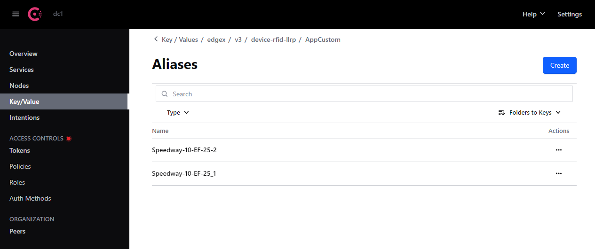

# App RFID LLRP Inventory - Location Aliases

Every device(reader) + antenna port represents a tag location and can be assigned an alias
such as Freezer, Backroom etc. to give more meaning to the data. The default alias set by the
application has a format of `<deviceName>_<antennaId>` e.g. `Reader-10-EF-25_1` where `Reader-10-EF-25` is the deviceName and `1` is the antennaId.

To get the list of LLRP devices or readers connected, send `GET` to the `/api/v3/readers` endpoint.

!!! example - "Example Get list of connected readers"
     curl -o- localhost:59711/api/v3/readers
    
    ```json
    {
      "Readers": [
        "SpeedwayR-10-EF-25"
      ]
    }
    ```

An alias can be configured for each Reader/Antenna combination.

## Configuring the Aliases

### Via configuration.yaml (before deployment)
If you already know the alias values you would like to use before deployment, they can be defined in your
`configuration.yaml` file. There is a section called `Aliases` under the `AppCustom` section that is defaulted to empty.

Set the default alias as the key, and the new alias as the value you want.

!!! example - "Example Aliases configuration"
    ```yaml
    Aliases:
      Reader-10-EF-25_1: "Freezer"
      Reader-10-EF-25_2: "Backroom"
    ```

#### Aliases Configuration in Config Provider (aka Consul)
If an existing `Aliases` folder key (even if empty) is found in Config Provider, nothing is done. Data in Config Provider
will be left as-is.

If no existing `Aliases` folder key is found in Config Provider:
- If an `Aliases` section is **not present** or **is empty** in the user's YAML file, nothing will be done or added to Config Provider.
- If an `Aliases` section is **present and contains data**, this data will be uploaded to Config Provider.

#### Overwrite Config in Config Provider (During Development)
During development, the user also has the option to pass the `-o/--overwrite` command line flag
to the service. In addition to what EdgeX normally does when this is passed, the Aliases are read
from the YAML file and uploaded to Config Provider, overwriting existing Aliases with the same key.

!!! note
    One thing to be aware of however is that the Aliases are treated as Key/Value pairs so any Alias key in Config Provider that is not present in the YAML file will **not** be deleted from Config Provider. Read below for an example scenario.

##### Scenario
Config Provider already contains the following key/values:
- `app-rfid-llrp-inventory/AppCustom/Aliases/Reader-10-EF-25_1` = `POS`
- `app-rfid-llrp-inventory/AppCustom/Aliases/Reader-20-20-20_1` = `Store`

The user passes `-o/--overwrite` flag, with the following YAML:
```yaml
    Aliases:
      Reader-10-EF-25_1: "Freezer"
      Reader-10-EF-25_2: "Backroom"
```

##### Outcome
- `Reader-10-EF-25_1` already exists with a value of `POS` and will be overwritten to `Freezer`.
- `Reader-10-EF-25_2` is new and will be added as expected with value `Backroom`.
- `Reader-20-20-20_1` is not present in the YAML file, but was pre-existing in Config Provider. This value will be left alone.

This results in the following key/value pairs existing in Config Provider:
- `app-rfid-llrp-inventory/AppCustom/Aliases/Reader-10-EF-25_1` = `Freezer`
- `app-rfid-llrp-inventory/AppCustom/Aliases/Reader-10-EF-25_2` = `Backroom`
- `app-rfid-llrp-inventory/AppCustom/Aliases/Reader-20-20-20_1` = `Store`

!!! note
    There is a Config Provider config watcher for the `AppCustom` section that notifies the app of changes. This config watcher will load all the aliases from Config Provider on startup.

### Via Config Provider (after deployment)
Users can also configure the aliases using Config Provider. This can be achieved via Config Provider’s UI or CLI. This
can be done regardless of whether `configuration.yaml` specified initial aliases or not.

#### Setting Alias via Config Provider UI
- If one does not exist, create a folder named `Aliases` under [Service Root][http://localhost:8500/ui/dc1/kv/edgex/v3/device-rfid-llrp/AppCustom/].
  A folder is created by ending the key with a `/` like so: `Aliases/`


- Add Key Value pairs. Key is the default alias which is `<deviceName>_<antennaId>`. The value must be the alias value.
  Examples of KV pairs:
    - Speedway-10-EF-25_1: Freezer
    - Speedway-10-EF-25_2: Backstock




Everytime the user creates/updates the Aliases folder, the configuration changes apply to the application dynamically, and the updated alias can be seen under tag location `(location_alias)`

Send `GET` to the `/api/v3/inventory/snapshot` endpoint to see the changes.

!!! example "Inventory Snapshot with new location name"
    curl -o- localhost:59711/api/v3/inventory/snapshot
    
    ```json
     [
       {
         "epc": "30143639f8419145db602154",
         "tid": "",
         "location": {
           "device_name": "SpeedwayR-10-EF-25",
           "antenna_id": 1
         },
         "location_alias": "Freezer",
         "last_read": 1601441311411,
         "last_arrived": 1601441265669,
         "last_departed": 0,
         "state": "Present",
         "stats_map": {
           "SpeedwayR-10-EF-25_1": {
             "last_read": 1601441311411,
             "mean_rssi": -54.25
           }
         }
       }
     ]     
    ```

#### Setting Alias via Config Provider CLI
Aliases can also be set via [Consul API](https://www.consul.io/api-docs/kv). Ex:
    ```
    curl \
    --request PUT \
    --data "Freezer" \
    http://localhost:8500/v1/kv/edgex/appservices/2.0/app-rfid-llrp-inventory/AppCustom/Aliases/SpeedwayR-10-EF-25_1
    ```
