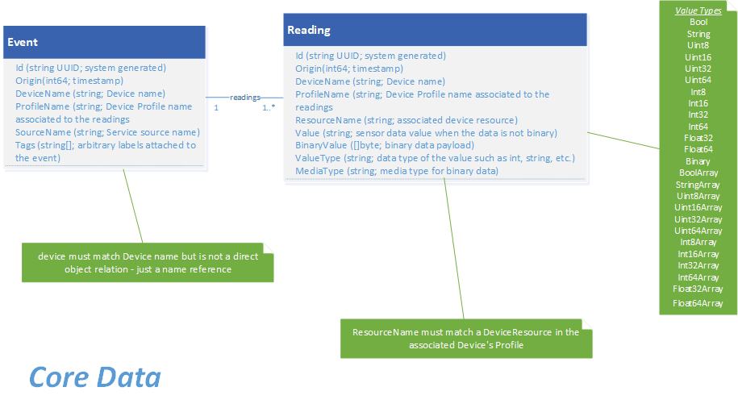
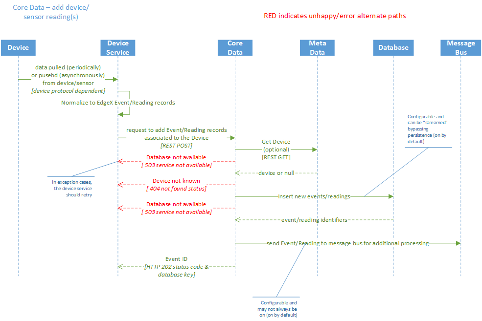
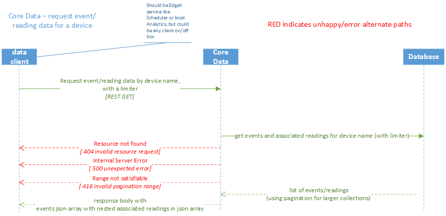

# Core Data

## Introduction

The core data micro service provides centralized persistence for data collected by [devices](../../../general/Definitions.md#device). 
Device services that collect sensor data call on the core data service to
store the sensor data on the edge system (such as in a
[gateway](../../../general/Definitions.md#gateway)) until the data gets moved "north" and then exported to
Enterprise and cloud systems.  Core data persists the data in a local database.  [Redis](https://redis.io/) is used by default, but a database abstraction layer allows for other databases to be used.

Other services and systems, both within EdgeX Foundry and outside of EdgeX Foundry, access the sensor data through the core data service. Core data could also provide a degree of security and protection of the data collected while the data is at the edge.

!!! edgey "EdgeX 2.0"
    As of EdgeX 2.0 (Ireland), core data is completely optional.  Device services can send data via message bus directly to application services.  If local persistence is not needed, the service can be removed.
    
    If persistence is needed, sensor data can be sent via message bus to core data (the new default means to communicate with core data) or can be sent via REST to core data (the legacy way to send data to core data).  See below for more details.

Sensor data can be sent to core data via two different means:

1. Services (like devices services) and other systems can put sensor data on a message bus topic and core data can be configured to subscribed to that topic.  This is the default means of getting data to core data.  Any service (like an application service or rules engine service) or 3rd system could also subscribe to the same topic.  If the sensor data does not need to persisted locally, core data does not have to subscribe to the message bus topic - making core data completely optional.  By default, the message bus is implemented using Redis Pub/Sub.  MQTT can be used as an alternate message bus implementation.

    

2. Services and systems can call on the core data REST API to send data to core data and have the data put in local storage.  Prior to EdgeX 2.0, this was the default and only means to send data to core data.  Today, it is an alternate means to send data to core data.  When data is sent via REST to core data, core data re-publishes the data on to message bus so that other services can subscribe to it. 

    

Core data moves data to the application service (and [edge analytcs](../../../general/Definitions.md#edge-analytics)) via Redis Pub/Sub by default. MQTT or ZeroMQ can alternately be used.  Use of MQTT requires the installation of a broker such as ActiveMQ.  A messaging infrastructure abstraction is in place that allows for other message bus (e.g., AMQP) implementations to be created and used.

## Core Data "Streaming"

By default, core data persists all data sent to it by services and other systems. However, when the data is too sensitive to keep at the edge, or there is no use for the data at the edge by other local services (e.g., by an analytics micro service), the data can be "streamed" through core data without persisting it. A
configuration change to core data (Writable.PersistData=false) has core data
send data to the application services without persisting the data. This option has the advantage of reducing
latency through this layer and storage needs at the network edge.  But the cost is having no historical data to use for analytics that need to look back in time to make a decision.

!!! Note
    When persistence is turned off via the PersistData flag, it is off for all devices.  At this time, you cannot specify which device data is persisted and which device data is not.  [Application services](../../application/ApplicationServices.md) do allow filtering of device data before it is exported or sent to another service like the rules engine, but this is not based on whether the data is persisted or not.

!!! edgey "EdgeX 2.0"
    As mentioned, as of EdgeX 2.0 (Ireland), core data is completely optional.  Therefore, if persistence is not needed, and if sensor data is sent from device services directly to application services via message bus, core data can be removed.  In addition to reducing resource utilization (memory and CPU for core data), it also removes latency of throughput as the core data layer can be completely bypassed.  However, if device services are still using REST to send data into the system, core data is the central receiving endpoint and must remain in place; even if persistence is turned off.

## Events and Readings

Data collected from sensors is marshalled into EdgeX event and reading objects (delivered as JSON objects or a binary object encoded as [CBOR](../../../general/Definitions.md#cbor) to core data).  An event represents a collection of one or more sensor readings.  Some sensors or devices are only providing a single value – a single reading - at a time. Other sensors spew multiple values whenever they are read.

An event must have at least one reading.  Events are associated to a sensor or device – the “thing” that sensed the environment and produced the readings.  Readings represent a sensing on the part of a device or sensor.  Readings only exist as part of (are owned by) an event.  Readings are essentially a simple key/value pair of what was sensed (the key - called a [ResourceName](../../../general/Definitions.md#resource)) and the value sensed (the value).  A reading may include other bits of information to provide more context (for example, the data type of the value) for the users of that data.  Consumers of the reading data could include things like user interfaces, data visualization systems and analytics tools.

In the diagram below, an example event/reading collection is depicted.  The event coming from the “motor123” device has two readings (or sensed values).  The first reading indicates that the motor123 device reported the pressure of the motor was 1300 (the unit of measure might be something like PSI).

!!! edgey "EdgeX 2.0"
    In EdgeX 2.0, Value Descriptors have been removed.  The ResourceName in a reading provides an indication of the data read.  The other properties of that were in Value Descriptor (min, max, default value, unit of measure, etc.) can all be obtained from the Resource (in core metadata's resource properties associated to each Resource which are associated to a device profile) by ResourceName.  ValueType property is also provided in the Reading so that the data type of the value is immediately available without having to do a lookup in core metadata.

The value type property (shown as type above) on the reading lets the consumer of the information know that the value is an integer, base 64.  The second reading indicates that the motor123 device also reported the temperature of the motor was 120 at the same time it reported the pressure (perhaps in degrees Fahrenheit).

## Data Model

The following diagram shows the Data Model for core data.  Device services send Event objects containing a collection or Readings to core data when a device captures a sensor reading.

!!! edgey "EdgeX 2.1"
    v2.1 supports a new value type, `Object`, to present the structral reading value instead of encoding it as string. Similar to the `BinaryValue`, there is a new field `ObjectValue` in the Reading. If the ValueType is `Object`, the read value will be put into the `ObjectValue` field in JSON object data type.

!!! edgey "EdgeX 2.0"
    Note that ValueDescriptor has been removed from this model as Value Descriptors have been removed in EdgeX 2 (see note above for more details). 

## Data Dictionary

=== "Event"
    |Property|Description|
    |---|---|
    ||Event represents a single measurable event read from a device.  Event has a one-to-many relationship with Reading.|
    |ID|Uniquely identifies an event, for example a UUID.|
    |DeviceName|DeviceName identifies the source of the event; the device's name.|
    |ProfileName|Identifies the name of the device profile associated with the device and corresponding resources collected in the readings of the event.|
    |SourceName|Name of the source request from the device profile (ResourceName or Command) associated to the reading.|
    |Origin|A timestamp indicating when the original event/reading took place.  Most of the time, this indicates when the device service collected/created the event.|
    |Tags|An arbitrary set of labels or additional information associated with the event.  It can be used, for example, to add location information (like GPS coordinates) to the event.|
    |Readings|A collection (one to many) of associated readings of a given event.|
=== "Reading"
    |Property|Description|
    |---|---|
    |ID|Uniquely identifies a reading, for example a UUID.|
    |DeviceName|DeviceName identifies the source of the reading; the device's name.|
    |ProfileName|Identifies the name of the device profile associated with the device and corresponding resource collected in the reading.|
    |Origin|A timestamp indicating when the original event/reading took place.  Most of the time, this indicates when the device service collected/created the event.|
    |ResourceName|ResourceName-Value provide the key/value pair of what was sensed by a device.  ResourceName specifies what was the value collected.  ResourceName should match a device resource name in the device profile.|
    |Value|The sensor data value|
    |ValueType|The type of the sensor data - from a list of allowed value types that includes Bool, String, Uint8, Int8, ...|
    |BinaryValue|Byte array of sensor data when the data captured is not structured; for example an image is captured.  This information is not persisted in the Database and is expected to be empty when retrieving a Reading for the ValueType of Binary.|
    |MediaType|Indicating the type of binary data when collected.|
    |ObjectValue|Complex value of sensor data when the data captured is structured; for example a BACnet date object: `"date":{ "year":2021, "month":8, "day":26, "wday":4 }`.  This is expected to be empty when the Reading for the ValueType is not `Object`.|

## High Level Interaction Diagrams

The two following High Level Interaction Diagrams show:

- How new sensor readings are collected by a device and added as event/readings to core data and the associated persistence store
- How a client (inside or outside of EdgeX) can query for events (in this case by device name)

**Core Data Add Sensor Readings**

**Core Data Request Event / Reading for a Device**

## Configuration Properties

Please refer to the general [Common Configuration documentation](../../configuration/CommonConfiguration.md) for configuration properties common to all services. Below are only the additional settings and sections that are not common to all EdgeX Services.

=== "Writable"
|Property|Default Value|Description|
|---|---|---|
||Writable properties can be set and will dynamically take effect without service restart|
|PersistData|true|When true, core data persists all sensor data sent to it in its associated database|
=== "Databases/Databases.Primary"
|Property|Default Value|Description|
|---|---|---|
|Name|'coredata'|Document store or database name|
=== "MessageQueue"
|Property|Default Value|Description|
|---|---|---|
||Entries in the MessageQueue section of the configuration allow for publication of events to a message bus|
|Protocol | redis| Indicates the connectivity protocol to use to use the bus.|
|Host | localhost | Indicates the host of the messaging broker, if applicable.|
|Port | 6379| Indicates the port to use when publishing a message.|
|Type | redis| Indicates the type of messaging library to use. Currently this is Redis by default. Refer to the [go-mod-messaging](https://github.com/edgexfoundry/go-mod-messaging) module for more information. |
|PublishTopicPrefix | edgex/events/core| Indicates the base topic to which messages should be published. /`<device-profile-name>/<device-name>` will be added to this Publish Topic prefix|
=== "MessageQueue.Optional"
|Property|Default Value|Description|
|---|---|---|
||Configuration and connection parameters for use with MQTT message bus - in place of Redis|
|ClientId|'core-data'|Client ID used to put messages on the bus|
|Qos|'0'| Quality of Sevice values are 0 (At most once), 1 (At least once) or 2 (Exactly once)|
|KeepAlive |'10'| Period of time in seconds to keep the connection alive when there is no messages flowing (must be 2 or greater)|
|Retained|false|Whether to retain messages|
|AutoReconnect |true |Whether to reconnect to the message bus on connection loss|
|ConnectTimeout|5|Message bus connection timeout in seconds|
|SkipCertVerify|false|TLS configuration - Only used if Cert/Key file or Cert/Key PEMblock are specified|

### V2 Configuration Migration Guide

Refer to the [Common Configuration Migration Guide](../../../configuration/V2MigrationCommonConfig) for details on migrating the common configuration sections such as `Service`.

#### Writable

The following settings have been removed from the `Writable` section

- DeviceUpdateLastConnected
- MetaDataCheck
- ServiceUpdateLastConnected
- ValidateCheck
- ChecksumAlgo

#### MessageQueue

The following `MessageQueue` setting values have changed:

- Host - Override value for docker is now `edgex-redis`
- Protocol = "redis"
- Port = 6379
- Type = 'redis'

The following setting has been removed from the `MessageQueue` section

- Topic

The following new settings have been added to  `MessageQueue` section

- PublishTopicPrefix = 'edgex/events/core'
- SubscribeTopic = 'edgex/events/device/#'

- AuthMode = 'usernamepassword'
- SecretName = 'redisdb'
- PublishTopicPrefix = 'edgex/events/core'
- SubscribeEnabled = true

#### MessageQueue.Optional

The following settings have been removed from `MessageQueue.Optional` section for when using MQTT for the MessageBus. Secure MessageBus using MQTT is not yet supported and will be retrieved from the Secret Store in a future release.

- Username
- Password

## API Reference

[Core Data API Reference](../../../api/core/Ch-APICoreData.md)
