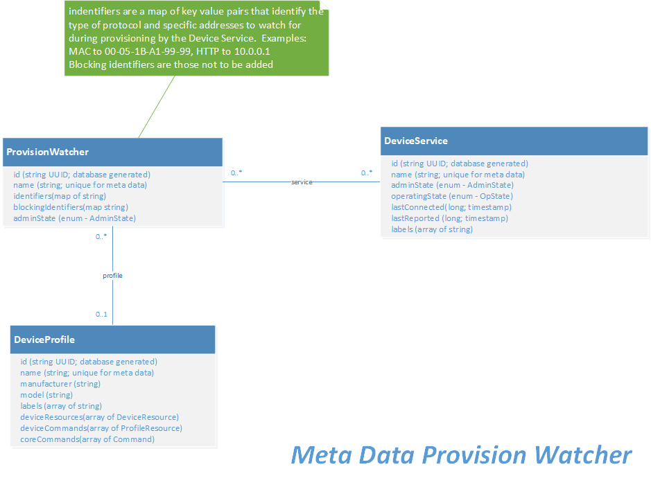

# Core Metadata


## Introduction

The core metadata micro service has the knowledge about the [devices](../../../general/Definitions.md#device) and sensors and how to communicate with them used by the other services, such as core data, core command, and so forth.

Specifically, metadata has the following abilities:

-   Manages information about the devices connected to, and operated by, EdgeX Foundry
-   Knows the type, and organization of data reported by the devices
-   Knows how to command the devices

Although metadata has the knowledge, it does not do the following activities:

-   It is not responsible for actual data collection from devices, which is performed by device services and core data
-   It is not responsible for issuing commands to the devices, which is performed by core command and device
    services

## Data Models

To understand metadata, its important to understand the EdgeX data objects it manages.  Metadata stores its knowledge in a local persistence database.  [Redis](https://redis.io/) is used by default, but a database abstraction layer allows for other databases to be used.

### Device Profile

Device profiles define general characteristics about devices, the data they provide, and how to command them. Think of a device profile as a template of a type or classification of device. For example, a device profile for BACnet thermostats provides general characteristics for the types of data a BACnet thermostat sends, such as current temperature and humidity level. It also defines which types of commands or actions EdgeX can send to the BACnet thermostat.  Examples might include actions that set the cooling or heating point.  Device profiles are typically specified in YAML file and uploaded to EdgeX.  More details are provided below.

#### Device Profile Details


*Metadata device profile object model*

=== "General Properties"

    A device profile has a number of high level properties to give the profile context and identification. Its name field is required and must be unique in an EdgeX deployment. Other fields are optional - they are not used by device services but may be populated for informational purposes:
    
    - Description
    - Manufacturer
    - Model
    - Labels
    
    Here is an example general information section for a sample KMC 9001 BACnet thermostat device profile provided with the BACnet device service (you can find the [profile](https://github.com/edgexfoundry/device-bacnet-c/blob/main/sample-profiles/BAC-9001.json) in Github) .  Only the name is required in this section of the device profile.  The name of the device profile must be unique in any EdgeX deployment.  The manufacturer, model and labels are all optional bits of information that allow better queries of the device profiles in the system.
    
    ``` YAML
    name: "BAC-9001"
    manufacturer: "KMC"
    model: "BAC-9001"
    labels: 
        - "B-AAC"
    description: "KMC BAC-9001 BACnet thermostat"
    ``` 
    
    Labels provided a way to tag, organize or categorize the various profiles.  They serve no real purpose inside of EdgeX.

=== "Device Resources"

    A device resource (in the deviceResources section of the YAML file) specifies a sensor value within a device that may be read from or written to either individually or as part of a device command (see below).  Think of a device resource as a specific value that can be obtained from the underlying device or a value that can be set to the underlying device.  In a thermostat, a device resource may be a temperature or humidity (values sensed from the devices) or cooling point or heating point (values that can be set/actuated to allow the thermostat to determine when associated heat/cooling systems are turned on or off).  A device resource has a name for identification and a description for informational purposes.
    
    The properties section of a device resource has also been greatly simplified.  See details below.
    
    Back to the BACnet example, here are two device resources.  One will be used to get the temperature (read) the current temperature and the other to set (write or actuate) the active cooling set point.  The device resource name must be provided and it must also be unique in any EdgeX deployment.
    
    ``` YAML
    name: Temperature
    description: "Get the current temperature"
    isHidden: false
    
    name: ActiveCoolingSetpoint
    description: "The active cooling set point"
    isHidden: false
    ```
    
    !!! Note
        While made explicit in this example, `isHidden` is false by default when not specified.  `isHidden` indicates whether to expose the device resource to the core command service.
    
    The device service allows access to the device resources via REST endpoint.  Values specified in the device resources section of the device profile can be accessed through the following URL patterns:
    
    -  http://<device-service>:<port>/api/v2/device/name/<DeviceName>/<DeviceResourceName>

=== "Attributes"

    The attributes associated to a device resource are the specific parameters required by the device service to access the particular value.   In other words, attributes are “inward facing” and are used by the device service to determine how to speak to the device to either read or write (get or set) some of its values. Attributes are detailed protocol and/or device specific information that informs the device service how to communication with the device to get (or set) values of interest.
    
    Returning to the BACnet device profile example, below are the complete device resource sections for Temperature and ActiveCoolingSetPoint – inclusive of the attributes – for the example device.
    
    ``` YAML
    -
        name: Temperature
        description: "Get the current temperature"
        isHidden: false
        attributes: 
            { type: "analogValue", instance: "1", property: "presentValue", index: "none"  }
    -
        name: ActiveCoolingSetpoint
        description: "The active cooling set point"
        isHidden: false
        attributes:
            { type: "analogValue", instance: "3", property: "presentValue", index: "none"  }
    ```

=== "Properties"

    The properties of a device resource describe the value obtained or set on the device.  The properties can optionally inform the device service of some simple processing to be performed on the value.  Again, using the BACnet profile as an example, here are the properties associated to the thermostat's temperature device resource.
    
    ``` YAML
    name: Temperature
    description: "Get the current temperature"
    attributes: 
        { type: "analogValue", instance: "1", property: "presentValue", index: "none"  }
    properties: 
        valueType: "Float32"
        readWrite: "R"
        units: "Degrees Fahrenheit"
    ```
    
    The 'valueType' property of properties gives more detail about the value collected or set.  In this case giving the details of the temperature value to be set.  The value provides details such as the type of the data collected or set, whether the value can be read, written or both.
    
    The following fields are available in the value property:
    
    - valueType - Required. The data type of the value. Supported types are Bool, Int8 - Int64, Uint8 - Uint64, Float32, Float64, String, Binary, Object and arrays of the primitive types (ints, floats, bool). Arrays are specified as eg. Float32Array, BoolArray etc.
    - readWrite - R, RW, or W indicating whether the value is readable or writable.
    - units - gives more detail about the unit of measure associated with the value. In this case, the temperature unit of measure is in degrees Fahrenheit.
    - min - minimum allowed value 
    - max - maximum allowed value
    - defaultValue - a value used for PUT requests which do not specify one.
    - base - a value to be raised to the power of the raw reading before it is returned.
    - scale - a factor by which to multiply a reading before it is returned.
    - offset - a value to be added to a reading before it is returned.
    - mask - a binary mask which will be applied to an integer reading.
    - shift - a number of bits by which an integer reading will be shifted right.
    
    The processing defined by base, scale, offset, mask and shift is applied in that order. This is done within the SDK. A reverse transformation is applied by the SDK to incoming data on set operations (NB mask transforms on set are NYI)


=== "Device Commands"

    Device commands (in the deviceCommands section of the YAML file) define access to reads and writes for multiple simultaneous device resources. Device commands are optional.  Each named device command should contain a number of get and/or set resource operations, describing the read or write respectively.
    
    Device commands may be useful when readings are logically related, for example with a 3-axis accelerometer it is helpful to read all axes (X, Y and Z) together.
    
    A device command consists of the following properties:
    
    - name - the name of the command
    - readWrite - R, RW, or W indicating whether the operation is readable or writable.
    - isHidden - indicates whether to expose the device command to the core command service (optional and false by default)
    - resourceOperations - the list of included device resource operations included in the command.
    
    Each resourceOperation will specify:
    
    - the deviceResource - the name of the device resource
    - defaultValue - optional, a value to return when the operation does not provide one
    - parameter - optional, a value that will be used if a PUT request does not specify one.
    - mappings - optional, allows readings of String type to be re-mapped.
    
    The device commands can also be accessed through a device service’s REST API in a similar manner as described for device resources.
    
    - http://<device-service>:<port>/api/v2/device/name/<DeviceName>/<DeviceCommandName>
    
    If a device command and device resource have the same name, it will be the device command which is available.

=== "Core Commands"
 
    Device resources or device commands that are not hidden are seen and available via the EdgeX core command service.  
    
    Other services (such as the rules engine) or external clients of EdgeX, should make requests of device services through the core command service, and when they do, they are calling on the device service’s unhidden device commands or device resources.  Direct access to the device commands or device resources of a device service is frowned upon.  Commands, made available through the EdgeX command service, allow the EdgeX adopter to add additional security or controls on who/what/when things are triggered and called on an actual device.
    
    

### Device

Data about actual devices is another type of information that the metadata micro service stores and manages. Each device managed by EdgeX Foundry registers with metadata (via its owning device service.  Each device must have a unique name associated to it. 

Metadata stores information about a device (such as its address) against the name in its database. Each device is also associated to a device profile. This association enables metadata to apply knowledge provided by the device profile to each device. For example, a thermostat profile would say that it reports temperature values in Celsius.  Associating a particular thermostat (the thermostat in the lobby for example) to the thermostat profile allows metadata to know that the lobby thermostat reports temperature value in Celsius. 


### Device Service

Metadata also stores and manages information about the device services.  Device services serve as EdgeX's interfaces to the actual devices and sensors.

Device services are other micro services that communicate with devices via the protocol of that device.  For example, a Modbus device service facilitates communications among all types of Modbus devices.  Examples of Modbus devices include motor controllers, proximity sensors, thermostats, and power meters.  Device services simplify communications with the device for the rest of EdgeX.

When a device service starts, it registers itself with metadata.  When EdgeX provisions a new devices the device gets associated to its owning device service.  That association is also stored in metadata.


**Metadata Device, Device Service and Device Profile Model**


*Metadata's Device Profile, Device and Device Service object model and the association between them* 

### Provision Watcher

Device services may contain logic to automatically provision new devices.  This can be done statically or dynamically.  In static device configuration (also known as static provisioning) the device service connects to and establishes a new device that it manages in EdgeX (specifically metadata) from configuration the device service is provided.  For example, a device service may be provided with the specific IP address and additional device details for a device (or devices) that it is to onboard at startup.  In static provisioning, it is assumed that the device will be there and that it will be available at the address or place specified through configuration.  The devices and the connection information for those devices is known at the point that the device service starts.

In dynamic discovery (also known as automatic provisioning), a device service is given some general information about where to look and general parameters for a device (or devices).  For example, the device service may be given a range of BLE address space and told to look for devices of a certain nature in this range.  However, the device service does not know that the device is physically there – and the device may not be there at start up.  It must continually scan during its operations (typically on some sort of schedule) for new devices within the guides of the location and device parameters provided by configuration. 

Not all device services support dynamic discovery.  If it does support dynamic discovery, the configuration about what and where to look (in other words, where to scan) for new devices is specified by a provision watcher.  A provision watcher, is specific configuration information provided to a device service (usually at startup) that gets stored in metadata.  In addition to providing details about what devices to look for during a scan, a provision watcher may also contain “blocking” indicators, which define parameters about devices that are not to be automatically provisioned.  This allows the scope of a device scan to be narrowed or allow specific devices to be avoided.  


*Metadata's provision watcher object model*

## Data Dictionary

!!! edgey - "EdgeX 3.0"
    Two fields--**LastConnected** and **LastReported**--of Device Service are removed in EdgeX 3.0.<br><br>
    A new field **Properties** is added into Device in EdgeX 3.0, so that device-level properties can be defined and then consumed by the implementation of device services to retrieve extra device-level information.  For example, assume a device service may require extra device-level information, such as `DeviceInstance`, `Firmware`, `InstanceID`, and `ObjectName` in the runtime, and these extra device-level information can be defined in the properties.<br><br>
    A new field **Properties** is added into ProvisionWatcher in EdgeX 3.0, so that the implementation of device services can retrieve extra information when automatically provisioning a device.  For example, assume a device service would like to generate the device name in certain format during auto discovery, a property, e.g. `DeviceNameTemplate` with the template format of device name can be defined in the ProvisionWatcher, so that the implementation of device service can generate the device name based on such property.<br>

=== "BaseAddress"
    |Property|Description|
    |---|---|
    ||The metadata base structure for common information needed to make a request to an EdgeX Foundry target.|
    |Type|REST or MQTT|
    |Host|Target's address string - such as an IP address|
    |Port|Port for the target address|
=== "RESTAddress"
    |Property|Description|
    |---|---|
    ||Structure extending BaseAddress, used to make a request of EdgeX Foundry targets via REST.|
    |Path|URI path beyond the host and port| 
    |HTTPMethod|Method for connecting (i.e. POST)|
=== "MQTTPubAddress"
    |Property|Description|
    |---|---|
    ||Structure extending BaseAddress, used to make a request of EdgeX Foundry targets via MQTT.|
    |Publisher|Publisher name| 
    |User|User id for authentication| 
    |Password|Password of the user for authentication|
    |Topic|Topic for message bus|
    |QoS|Quality of service level for message publishing; value 0, 1, or 2|
    |KeepAlive|Maximum time interval in seconds with no comms before closing|
    |Retained|Flag to have the broker store the last rec'd message for future subscribers |
    |AutoReconnect|Indication to reconnect on failed connection|
    ConnectTimeout|Maximum time interval the client will wait for the connection to the MQTT server to be established|
=== "AutoEvent"
    |Property|Description|
    |---|---|
    ||AutoEvent supports auto-generated events sourced from a device service| 
    |Interval|How often the specific resource needs to be polled.| 
    |OnChange|Indicates whether the device service will generate an event only|
    |SourceName|The name of the resource in the device profile which describes the event to generate|
=== "Device"
    |Property|Description|
    |---|---|
    ||The object that contains information about the state, position, reachability, and methods of interfacing with a Device; represents a registered device participating within the EdgeX Foundry ecosystem|
    |Id|Uniquely identifies the device, a UUID for example|
    |Description||
    |Name|Name for identifying a device|
    |AdminState|Admin state (locked/unlocked)| 
    |OperatingState||Operating state (enabled/disabled)|
    |Protocols|A map of supported protocols for the given device|
    |Labels|Other labels applied to the device to help with searching|
    |Location|Device service specific location (interface{} is an empty interface so it can be anything)|
    |ServiceName|Associated Device Service - One per device|
    |ProfileName||Associated Device Profile - Describes the device|
    |AutoEvents|A list of auto-generated events coming from the device|
    |Tags|A map of device-level tags used to [tag the events](../../general/index.md#event-tagging) originated from the device|
    |Properties|A map of extendable device-level properties required by the implementation of device services to retrieve extra device-level information.  For example, assume a device service may require extra device-level information, such as `DeviceInstance`, `Firmware`, `InstanceID`, and `ObjectName` in the runtime, and these extra device-level information can be defined in the properties|
=== "DeviceProfile"
    |Property|Description|
    |---|---|
    ||Represents the attributes and operational capabilities of a device. It is a template for which there can be multiple matching devices within a given system.|
    |Id|Uniquely identifies the device, a UUID for example|
    |Description||
    |Name|Name for identifying a device|
    |Manufacturer| Manufacturer of the device|
    |Model|Model of the device|
    |Labels|Labels used to search for groups of profiles|
    |DeviceResources|DeviceResource collection|
    |DeviceCommands|Collect of deviceCommand|
=== "DeviceResource"
    |Property|Description|
    |---|---|
    ||The atomic description of a particular protocol level interface for a class of Devices; represents a value on a device that can be read or written|
    |Description||
    |Name||
    |Tag||
    |Properties|List of associated properties|
    |Attributes|List of associated attributes|
=== "DeviceService"
    |Property|Description|
    |---|---|
    ||Represents a service that is responsible for proxying connectivity between a set of devices and the EdgeX Foundry core services; the current state and reachability information for a registered device service|
    |Id|Uniquely identifies the device service, a UUID for example|
    |Name||Time in milliseconds that the device last provided any feedback or responded to any request|
    |Labels||Tags or other labels applied to the device service for search or other identification needs|
    |BaseAddress|Address (MQTT topic, HTTP address, serial bus, etc.) for reaching the service|
    |AdminState||Device Service Admin State|
=== "ResourceProperties"
    |Property|Description|
    |---|---|
    ||The transformation and constraint properties for a device resource.|
    |ValueType|Type of the value|
    |ReadWrite|Read/Write Permissions set for this property|
    |Minimum|Minimum value that can be get/set from this property|
    |Maximum|Maximum value that can be get/set from this property|
    |DefaultValue|Default value set to this property if no argument is passed|
    |Mask|Mask to be applied prior to get/set of property|
    |Shift|Shift to be applied after masking, prior to get/set of property|
    |Scale|Multiplicative factor to be applied after shifting, prior to get/set of property|
    |Offset|Additive factor to be applied after multiplying, prior to get/set of property|
    |Base|Base for property to be applied to, leave 0 for no power operation (i.e. base ^ property: 2 ^ 10)|
    |Assertion|Required value of the property, set for checking error state.  Failing an assertion condition will mark the device with an error state|
    |MediaType||
=== "ProvisionWatcher"
    |Property|Description|
    |---|---|
    ||The metadata used by a Service for automatically provisioning matching Devices.|
    |Id||
    |Name|Unique name and identifier of the provision watcher|
    |Labels||Tags or other labels applied to the provision watcher for search or other identification needs|
    |Identifiers|Set of key value pairs that identify property (MAC, HTTP,...) and value to watch for (00-05-1B-A1-99-99, 10.0.0.1,...)|
    |BlockingIdentifiers|Set of key-values pairs that identify devices which will not be added despite matching on Identifiers|
    |ServiceName|The base name of the device service that new devices will be associated to|
    |AdminState|Administrative state for provision watcher - either unlocked or locked|
    |DiscoveredDevice|A DiscoveredDevice defines the data to be assigned on the new discovered device|
=== "DiscoveredDevice"
    |Property|Description|
    |---|---|
    ||A DiscoveredDevice defines the data to be assigned on the new discovered device.|
    |ProfileName|Name of the device profile that should be applied to the devices available at the identifier addresses|
    |AdminState|Administrative state for new devices - either unlocked or locked|
    |AutoEvents|Associated auto events to this new devices|
    |Properties|A map of extendable properties required by the implementation of device services to retrieve extra information when automatically provisioning a device. For example, assume a device service would like to generate the device name in certain format during auto discovery, a property, e.g. `DeviceNameTemplate` with the template format of device name can be defined in the ProvisionWatcher, so that the implementation of device service can generate the device name based on such property|

## High Level Interaction Diagrams

Sequence diagrams for some of the more critical or complex events regarding metadata.  These High Level Interaction Diagrams show:

1.  Adding a new device profile (Step 1 to provisioning a new device) via metadata
2.  Adding a new device via metadata (Step 2 to provisioning a new device)
3.  EdgeX Foundry device service startup (and its interactions with metadata)


*Add a New Device Profile (Step 1 to provisioning a new device)*


*Add a New Device (Step 2 to provisioning a new device)*


*What happens on a device service startup?*

## Configuration Properties

Please refer to the general [Common Configuration documentation](../../configuration/CommonConfiguration.md) for configuration settings common to all services.
Below are only the additional settings and sections that are specific to Core Metadata.

!!! edgey - "EdgeX 3.0"
    **Notifications** configuration is removed in EdgeX 3.0. Metadata will leverage [Device System Events](#device-system-events) to replace the original device change notifications.

!!! edgey "Edgex 3.0"
    For EdgeX 3.0 the `MessageQueue` configuration has been moved to `MessageBus` in [Common Configuration](../../../configuration/CommonConfiguration/#configuration-properties)

=== "Writable"
    |Property|Default Value|Description|
    |---|---|---|
    |||entries in the Writable section of the configuration can be changed on the fly while the service is running if the service is running with the `-cp/--configProvider` flag|
    |LogLevel|INFO|log entry [severity level](https://en.wikipedia.org/wiki/Syslog#Severity_level).  Log entries not of the default level or higher are ignored. |
=== "Writable.Telemetry"
    |Property|Default Value|Description|
    |---|---|---|
    |||See `Writable.Telemetry` at [Common Configuration](../../../configuration/CommonConfiguration/#configuration-properties) for the Telemetry configuration common to all services |
    |Metrics| `<TBD>` |Service metrics that Core Metadata collects. Boolean value indicates if reporting of the metric is enabled.|
    |Tags|`<empty>`|List of arbitrary Core Metadata service level tags to included with every metric that is reported. |
=== "Writable.ProfileChange"
    |Property|Default Value|Description|
    |---|---|---|
    |StrictDeviceProfileChanges|false|Whether to allow device profile modifications, set to `true` to reject all modifications which might impact the existing events and readings. Thus, the changes like `manufacture`, `isHidden`, or `description` can still be made.|
    |StrictDeviceProfileDeletes|false|Whether to allow device profile deletionsm set to `true` to reject all deletions.|
=== "Writable.UoM"
    |Property|Default Value|Description|
    |---|---|---|
    |Validation|false|Whether to enable units of measure validation, set to `true` to validate all device profile `units` against the list of units of measure by core metadata.|
=== "Service"
    |Property|Default Value|Description|
    |---|---|---|
    ||| Unique settings for Core Metadata. The common settings can be found at [Common Configuration](../../../configuration/CommonConfiguration/#configuration-properties)
    | Port | 59881|Micro service port number|
    |StartupMsg |This is the EdgeX Core Metadata Microservice|Message logged when service completes bootstrap start-up|
=== "UoM"
    |Property|Default Value|Description|
    |---|---|---|
    |UoMFile|'./res/uom.yaml'|path to the location of units of measure configuration|
=== "Database"
    |Property|Default Value|Description|
    |---|---|---|
    ||| Unique settings for Core Metadata. The common settings can be found at [Common Configuration](../../../configuration/CommonConfiguration/#configuration-properties)
    |Name|metadata|Database or document store name |
=== "MessageBus.Optional"
    |Property|Default Value|Description|
    |---|---|---|
    ||| Unique settings for Core Metadata. The common settings can be found at [Common Configuration](../../../configuration/CommonConfiguration/#configuration-properties)
    |ClientId|"core-metadata|Id used when connecting to MQTT or NATS base MessageBus |

### V3 Configuration Migration Guide

Coming soon

## Device System Events

Device System Events are events triggered by the add, update or delete of devices. A System Event DTO is published to the EdgeX MessageBus each time a new Device is added, an existing Device is updated or when an existing Device is deleted.

### System Event DTO

!!! edgey - "Edgex 3.0"
    System Event types `deviceservice`, `deviceprofile` and `provisionwatcher` are new in EdgeX 3.0

The System Event DTO has the following properties:

| Property  | Description                                   | Value                                                        |
| --------- | --------------------------------------------- | ------------------------------------------------------------ |
| Type      | Type of System Event                          | `device`, `deviceservice`,  `deviceprofile`, or `provisionwatcher`                                       |
| Action    | System Event action                           | `add`, `update`, or `delete` in this case                    |
| Source    | Source of the System Event                    | `core-metadata` in this case                                 |
| Owner     | Owner of the data in the System Event         | In this case it is the name of the device service that owns the device or `core-metadata` |
| Tags      | Key value map of additional data              | empty in this case                                           |
| Details   | The data object that trigger the System Event | the added, updated, or deleted Device/Device Profile/Device Service/Provision Watcher in this case           |
| Timestamp | Date and time of the System Event             | timestamp                                                    |

### Publish Topic

The System Event DTO for Device System Events is published to the topic specified by the `MessageQueue.PublishTopicPrefix` configuration setting  above, which has a default of `edgex/system-events`, plus the following data items, which are added to allow receivers to filter by subscription.

- source = core-metadata
- type = device
- action = add/update/delete
- owner = [device service name which owns the device]
- profile = [device profile name associated with the device]

!!! example - "Example Device System Event publish topics"
    ```
    edgex/system-events/core-metadata/device/add/device-onvif-camera/onvif-camera
    edgex/system-events/core-metadata/device/update/device-rest/sample-numeric
    edgex/system-events/core-metadata/device/delete/device-virtual/Random-Boolean-Device
    ```

## Units of Measure

Core metadata will read unit of measure configuration (see configuration example below) located in `UoM.UoMFile` during startup.

When validation is turned on (`Writable.UoM.Validation` is set to `true`),
all device profile `units` (in device resource, device properties) will be validated against the list of units of measure by core metadata.

In other words, when a device profile is created or updated via the core metadata API, the units specified in the device resource's `units` field
will be checked against the valid list of UoM provided via core metadata configuration.

If the `units` value matches any one of the configuration units of measure, then the device resource is considered valid - allowing the create or update operation to continue.
If the `units` value does not match any one of the configuration units of measure, then the device profile or device resource operation (create or update) is rejected (error code 500 is returned) and an appropriate error message is returned in the response to the caller of the core metadata API.

!!! Note
    The `units` field on a profile is and shall remain optional.  If the `units` field is not specified in the device profile, then it is assumed that the device resource does not have well-defined units of measure.  In other words, core metadata will not fail a profile with no `units` field specified on a device resource.

!!! example - "Sample unit of measure configuration"
    ```yaml
    Source: reference to source for all UoM if not specified below
    Units:
      temperature:
        Source: www.weather.com
        Values:
          - C
          - F
          - K
      weights:
        Source: www.usa.gov/federal-agencies/weights-and-measures-division
        Values:
          - lbs
          - ounces
          - kilos
          - grams
    ```

## API Reference

[Core Metadata API Reference](../../../api/core/Ch-APICoreMetadata.md)
