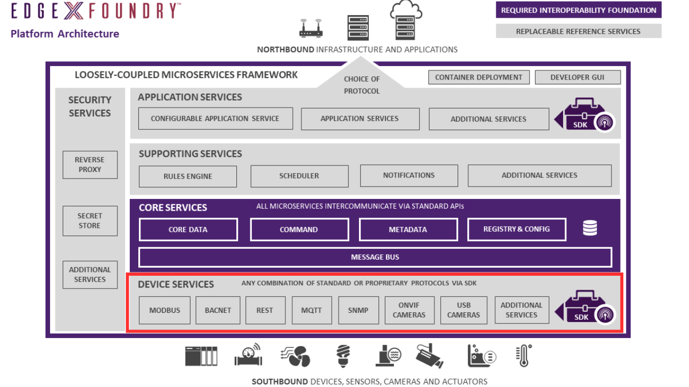

# Device Services Microservices



## Introduction

The Device Services Layer interacts with Device Services.

Device services are the edge connectors interacting with the
[devices](../../general/Definitions.md#device) that include, but are not limited to: appliances
in your home, alarm systems, HVAC equipment, lighting, machines in any
industry, irrigation systems, drones, traffic signals, automated
transportation, and so forth.

EdgeX device services translate information coming from devices via hundreds of protocols and thousands of formats and bring them into EdgeX.  In other terms, device services ingest sensor data provided by “things”.  When it ingests the sensor data, the device service converts the data produced and communicated by the “thing” into a common EdgeX Foundry data structure, and sends that converted data into the core services layer, and to other micro services in other layers of EdgeX Foundry.

Device services also receive and handle any request for actuation back to the device.  Device services take a general command from EdgeX to perform some sort of action and it translates that into a protocol specific request and forwards the request to the desired device.

Device services serve as the main means EdgeX interacts with sensors/devices.  So, in addition to getting sensor data and actuating devices, device services also:

- Get status updates from devices/sensors
- Transform data before sending sensor data to EdgeX
- Change configuration
- Discover devices

Device services may service one or a number of devices at one time. 

A device that a device service manages, could be something other than a simple, single, physical device.  The device could be an edge/IoT [gateway](../../general/Definitions.md#gateway) (and all of that gateway's devices), a device manager, a sensor hub, a web service available over HTTP, or a software sensor that acts as a device, or collection of devices, to EdgeX Foundry.


The device service communicates with the devices through protocols native to each device object.  EdgeX comes with a number of device services speaking many common IoT protocols such as Modbus, BACnet, BLE, etc.  EdgeX also provides the means to create new devices services through [device service software development kits (SDKs)](./sdk/Ch-DeviceSDK.md) when you encounter a new protocol and need EdgeX to communicate with a new device.

## Device Service Abstraction

A device service is really just a software abstraction around a device and any associated firmware, software and protocol stack.  It allows the rest of EdgeX (and users of EdgeX) to talk to a device via the abstraction API so that all devices look the same from the perspective of how you communicate with them.  Under the covers, the implementation of the device service has some common elements, but can also vary greatly depending on the underlying device, protocol, and associate software.


A device service provides the abstraction between the rest of EdgeX and the physical device.  In other terms, the device service “wraps” the protocol communication code, device driver/firmware and actual device.

Each device service in EdgeX is an independent micro service.  Devices services are typically created using a [device service SDK](./sdk/Ch-DeviceSDK.md). The SDK is really just a library that provides common scaffolding code and convenience methods that are needed by all device services.  While not required, the EdgeX community use the SDKs as the basis for the all device services the community provides.  The SDKs make it easier to create device service by allowing a developer to focus on device specific communications, features, etc. versus having to code a lot of EdgeX service boilerplate code.   Using the SDKs also helps to ensure the device services adhere to rules required of the device services.

Unless you need to create a new device service or modify an existing device service, you may not ever have to go under the covers, so to speak, to understand how a device service works.  However, having some general understanding of what a device service does and how it does it can be helpful in customization, setting configuration and diagnosing problems.

## Device Service Functionality

All device services must perform the following tasks:

- Register with core metadata – thereby letting all of EdgeX know that it is running and stands ready to manage devices.  In the case of an existing device service, the device service will update its metadata registration and get any new information.
- Get its configuration settings from the EdgeX’s configuration service (or local configuration file if the configuration service is not being used).
- Register itself an EdgeX running micro service with the EdgeX registry service (when running) – thereby allowing other EdgeX services to communicate with it.
- On-board and manage physical devices it knows how to communicate with.  This process is called provisioning of the device(s).  In some cases, the device service may have the means to automatically detect and provision the devices.  For example, a BLE device service may automatically scan a BLE address space, detect a new BLE device in its range, and then provision that device to EdgeX and the associated BLE device service.
- Update and inform EdgeX on the operating state of the device (does it appear the device is still running and able to communicate).
- Monitor for configuration changes and apply new configuration where applicable.  Note, in some cases configuration changes cannot be dynamically applied (example: change the operating port of the device service).
- Get sensor data (i.e. ingest sensor data) and pass that data to the core data micro service via REST.
- Receive and react to REST based actuation commands.

As you can imagine, many of these tasks (like registering with core metadata) are generic and the same for all device services and thereby provided by the SDK.  Other tasks (like getting sensor data from the underlying device) are quite specific to the underlying device.  In these cases, the device service SDK provides empty functions for performing the work, but the developer would need to fill in the function code as it relates to the specific device, the communication protocol, device driver, etc.

### Device Service Functional Requirements

[Requirements for the device service](../../design/legacy-requirements/device-service.md) are provided in this documentation. These
requirements are being used to define what functionality needs to be
offered via any Device Service SDK to produce the device service
scaffolding code. They may also help the reader further understand the duties
and role of a device service.

## Device Profile

EdgeX comes with a number of existing device services for communicating with devices that speak many IoT protocols – such as Modbus, BACnet, BLE, etc.  While these devices services know how to speak to devices that communicate by the associated protocol, the device service doesn’t know the specifics of all devices that speak that protocol.  For example, there are thousands of Modbus devices in the world.  It is a common industrial protocol used in a variety of devices.  Some Modbus devices measure temperature and humidity and provide thermostatic control over building HVAC systems, while other Modbus devices are used in automation control of flare gas meters in the oil and gas industry.  This diversity of devices means that the Modbus device service could never know how to communicate with each Modbus device directly.  The device service just knows the Modbus protocol generically and must be informed of how to communicate with each individual device based on what that device knows and communicates.  Using an analogy, you may speak a language or two.  Just because you speak English, doesn’t mean you know everything about all English-speaking people.  For example, just because someone spoke English, you would not know if they could solve a calculus problem for you or if they can sing your favorite song.

Device profiles describe a specific device to a device service.  Each device managed by a device service has an association device profile, which defines that device in terms of the data it reports and operations that it supports. General characteristics about the type of device, the data the device provides, and how to command the device is all provided in a device profile. A device profile is described in YAML which is a human-readable data serialization language (similar to a markup language like XML).  See the [page on device profiles](./profile/Ch-DeviceProfile.md) to learn more about how they provide the detail EdgeX device services need to communicate with a device.

!!! Info
    Device profiles, while normally provided to EdgeX in a YAML file, can also be specified to EdgeX in JSON.  See the metadata API for [upload via JSON](https://app.swaggerhub.com/apis-docs/EdgeXFoundry1/core-metadata/2.0.0#/default/post_deviceprofile) versus [upload YAML file](https://app.swaggerhub.com/apis-docs/EdgeXFoundry1/core-metadata/2.0.0#/default/post_deviceprofile_uploadfile).

## Device Discovery and Provision Watchers

Device Services may contain logic to automatically provision new devices.  This can be done **statically** or **dynamically**.  

### Static Provisioning

In static device configuration (also known as static provisioning) the device service connects to and establishes a new device that it manages in EdgeX (specifically metadata) from configuration the device service is provided.  For example, a device service may be provided with the specific IP address and additional device details for a device (or devices) that it is to onboard at startup.  In static provisioning, it is assumed that the device will be there and that it will be available at the address or place specified through configuration.  The devices and the connection information for those devices is known at the point that the device service starts.

### Dynamic Provisioning

In dynamic discovery (also known as automatic provisioning), a device service is given some general information about where to look and general parameters for a device (or devices).  For example, the device service may be given a range of BLE address space and told to look for devices of a certain nature in this range.  However, the device service does not know that the device is physically there – and the device may not be there at start up.  It must continually scan during its operations (typically on some sort of schedule) for new devices within the guides of the location and device parameters provided by configuration. 

Not all device services support dynamic discovery.  If it does support dynamic discovery, the configuration about what and where to look (in other words, where to scan) for new devices is specified by a provision watcher.  A provision watcher is created via a call to the [core metadata provision watcher API](https://app.swaggerhub.com/apis-docs/EdgeXFoundry1/core-metadata/2.0.0#/default/post_provisionwatcher) (and is stored in the metadata database).  In addition to providing details about what devices to look for during a scan, a provision watcher may also contain “blocking” indicators, which define parameters about devices that are not to be automatically provisioned.  This allows the scope of a device scan to be narrowed or allow specific devices to be avoided.  

## Admin State

The **adminState** is either `LOCKED` or `UNLOCKED` for each device.  This is an administrative condition applied to the device.  This state is periodically set by an administrator of the system – perhaps for system maintenance or upgrade of the sensor.  When `LOCKED`, requests to the device via the device service are stopped and an indication that the device is locked (HTTP 423 status code) is returned to the caller.

## Sensor Reading Schedule

Data collected from devices by a device service is marshalled into EdgeX event and reading objects (delivered as JSON objects in service REST calls).  This is one of the primary responsibilities of a device service.  Typically, a configurable schedule - called an **auto event schedule** - determines when a device service sends data to core data via core data’s REST API (future EdgeX implementations may afford alternate means to send the data to core data or to send sensor data to other services).

## Test and Demonstration Device Services

Among the many available device services provided by EdgeX, there are two device services that are typically used for demonstration, education and testing purposes only.  The random device service ([device-random-go](https://github.com/edgexfoundry/device-random)) is a very simple device service used to provide device service authors a bare bones example inclusive of a device profile.  It can also be used to create random integer data (either 8, 16, or 32 bit signed or unsigned) to simulate integer readings when developing or testing other EdgeX micro services. It was created from the Go-based device service SDK.

The virtual device service ([device-virtual-go](https://github.com/edgexfoundry/device-virtual-go)) is also used for demonstration, education and testing.  It is a more complex simulator in that it allows any type of data to be generated on a scheduled basis and used an embedded SQL database (ql) to provide simulated data.  Manipulating the data in the embedded database allows the service to mimic almost any type of sensing device.   More information on the [virtual device service](./virtual/Ch-VirtualDevice.md) is available in this documentation.

## Running multiple instances

Device services support one additional command-line argument, `--instance` or `-i`. This allows for running multiple instances of a device service in an EdgeX deployment, by giving them different names.

For example, running `device-modbus -i 1` results in a service named `device-modbus_1`, ie the parameter given to the `instance` argument is added as a suffix to the device service name. The same effect may be obtained by setting the `EDGEX_INSTANCE` environment variable.

## Publish to MessageBus

!!! edgey "Edgex 2.0"
    New in Edgex 2.0

Device services now have the capability to publish Events directly to the EdgeX MessageBus, rather than POST the Events to Core Data via REST. This capability is controlled by the `Device.UseMessageBus` configuration property (see below), which is set to `true` by default. Core Data is configured by default to subscribe to the EdgeX MessageBus to receive and persist the Events. Application services, as in EdgeX 1.x, subscribe to the EdgeX MessageBus to receive and process the Events.

## Configuration Properties

Please refer to the general [Common Configuration documentation](../configuration/CommonConfiguration.md) for configuration properties common to all services.

!!! edgey "Edgex 2.2"
    `Writable.Reading.ReadingUnits` and `MaxEventSize` are new for Edgex 2.2

=== "Device"
    |Property|Default Value|Description|
    |---|---|---|
    |||Properties that determine how the device service communicates with a device|
    |DataTransform|true|Controls whether transformations are applied to numeric readings|
    |MaxCmdOps|128|Maximum number of resources in a device command (hence, readings in an event)|
    |MaxCmdResultLen|256|Maximum JSON string length for command results|
    |ProfilesDir|''|If set, directory containing profile definition files to upload to core-metadata|
    |DevicesDir|''|If set, directory containing device definition files to upload to core-metadata|
    |UpdateLastConnected|false|If true, update the LastConnected attribute of a device whenever it is successfully accessed|
    |UseMessageBus|true|Controls whether events are published via MessageBus or core-data (REST)|
    |Discovery/Enabled|true|Controls whether device discovery is enabled|
    |Discovery/Interval|0|Interval between automatic discovery runs. Zero means do not run discovery automatically|
=== "MessageQueue"
    |Property|Default Value|Description|
    |---|---|---|
    ||Entries in the MessageQueue section of the configuration allow for publication of events to a message bus|
    |Protocol | redis| Indicates the connectivity protocol to use to use the bus.|
    |Host | localhost | Indicates the host of the messaging broker, if applicable.|
    |Port | 6379| Indicates the port to use when publishing a message.|
    |Type | redis| Indicates the type of messaging library to use. Currently this is Redis by default. Refer to the [go-mod-messaging](https://github.com/edgexfoundry/go-mod-messaging) module for more information. |
    |AuthMode | usernamepassword| Auth Mode to connect to EdgeX MessageBus.|
    |SecretName | redisdb | Name of the secret in the Secret Store to find the MessageBus credentials.|
    |PublishTopicPrefix | edgex/events/device| Indicates the base topic to which messages should be published. /`<device-profile-name>/<device-name>` will be added to this Publish Topic prefix|
=== "MessageQueue.Optional"
    |Property|Default Value|Description|
    |---|---|---|
    ||Configuration and connection parameters for use with MQTT message bus - in place of Redis|
    |ClientId|[service-key]|Client ID used to put messages on the bus|
    |Qos|'0'| Quality of Sevice values are 0 (At most once), 1 (At least once) or 2 (Exactly once)|
    |KeepAlive |'10'| Period of time in seconds to keep the connection alive when there is no messages flowing (must be 2 or greater)|
    |Retained|false|Whether to retain messages|
    |AutoReconnect |true |Whether to reconnect to the message bus on connection loss|
    |ConnectTimeout|5|Message bus connection timeout in seconds|
    |SkipCertVerify|false|TLS configuration - Only used if Cert/Key file or Cert/Key PEMblock are specified|
=== "Writable.Reading"
    |Property|Default Value|Description|
    |---|---|---|
    |ReadingUnits|true|Indicate the units of measure for the Value in the Reading, set to `false` to not to include units in the Reading. |
=== "MaxEventSize"
    |Property|Default Value|Description|    
    |---|---|---|
    |MaxEventSize|0|maximum event size in kilobytes sent to Core Data or MessageBus. 0 represents default to system max.|


### Custom Configuration

Device services can have custom configuration in one of two ways. See the table below for details.

=== "Driver"

    `[Driver]` - The Driver section used for simple custom settings and is accessed via the SDK's DriverConfigs() API. The DriverConfigs API returns a `map[string] string` containing the contents on the `Driver` section of the `configuration.toml` file.
    
    ```toml
    [Driver]
    MySetting = "My Value"
    ```

=== "Custom Structured Configuration"
    For Go Device Services see [Go Custom Structured Configuration](../../../getting-started/Ch-GettingStartedSDK-Go/#custom-structured-configuration) for more details.
    

    For C Device Service see [C Custom Structured Configuration](../../../getting-started/Ch-GettingStartedSDK-C/#custom-structured-configuration) for more details.

## Secrets

!!! edgey "EdgeX 2.0"
    New in EdgeX 2.0 the Device Services now have the capability to store and retrieve secure secrets. Note that currently this only applies to Go based Device Services. The C SDK currently does not have support for `secrets` which is planned for the Jakarta 2.1 release.

#### Configuration

All instances of Device Services running in secure mode require a `SecretStore` to be created for the service by the Security Services. See [Configuring Add-on Service](../../../security/Ch-Configuring-Add-On-Services) for details on configuring a `SecretStore` to be created for the Device Service. With the use of `Redis Pub/Sub` as the default EdgeX MessageBus all Device Services need the `redisdb` known secret added to their `SecretStore` so they can connect to the Secure EdgeX MessageBus. See the [Secure MessageBus](../../../security/Ch-Secure-MessageBus) documentation for more details.

Each Device Service also has detailed configuration to enable connection to it's exclusive `SecretStore`

!!! example "Example - SecretStore configuration for Device MQTT"
    ```toml
    [SecretStore]
    Type = "vault"
    Host = "localhost"
    Port = 8200
    Path = "device-mqtt/"
    Protocol = "http"
    RootCaCertPath = ""
    ServerName = ""
    TokenFile = "/tmp/edgex/secrets/device-mqtt/secrets-token.json"
      [SecretStore.Authentication]
      AuthType = "X-Vault-Token"
    ```

#### Storing Secrets

##### Secure Mode

When running an Device Service in secure mode, secrets can be stored in the SecretStore by making an HTTP `POST` call to the `/api/v2/secret` API route on the Device Service. The secret data POSTed is stored to the `SecretStore` based on values in the `[SecretStore]` section of the configuration. Once a secret is stored, only the service that added the secret will be able to retrieve it.  See the [Secret API Reference](https://app.swaggerhub.com/apis-docs/EdgeXFoundry1/device-sdk/2.0.0#/default/post_secret) for more details and example.

##### Insecure Mode

When running in insecure mode, the secrets are stored and retrieved from the *Writable.InsecureSecrets* section of the service's configuration.toml file. Insecure secrets and their paths can be configured as below.

!!! example "Example - InsecureSecrets Configuration"
    ```toml
       [Writable.InsecureSecrets]    
         [Writable.InsecureSecrets.DB]
         path = "redisdb"
           [Writable.InsecureSecrets.DB.Secrets]
           username = ""
           password = ""
         [Writable.InsecureSecrets.MQTT]
         path = "credentials"
           [Writable.InsecureSecrets.MQTT.Secrets]
           username = "mqtt-user"
           password = "mqtt-password"
    ```

#### Retrieving Secrets

Device Services retrieve secrets from their `SecretStore` using the SDK API.  See [Retrieving Secrets](../../getting-started/Ch-GettingStartedSDK-Go/#retrieving-secrets) for more details using the Go SDK. 

## API Reference

[Device Service - SDK- API Reference](https://app.swaggerhub.com/apis-docs/EdgeXFoundry1/device-sdk/2.0.0)
