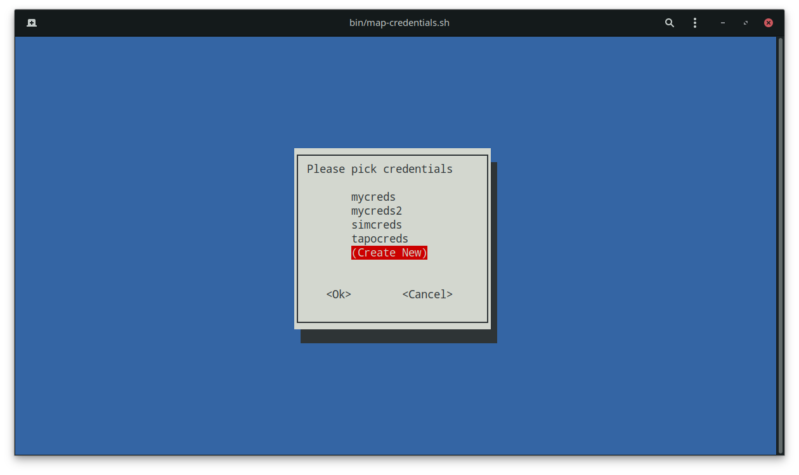
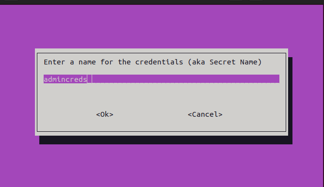
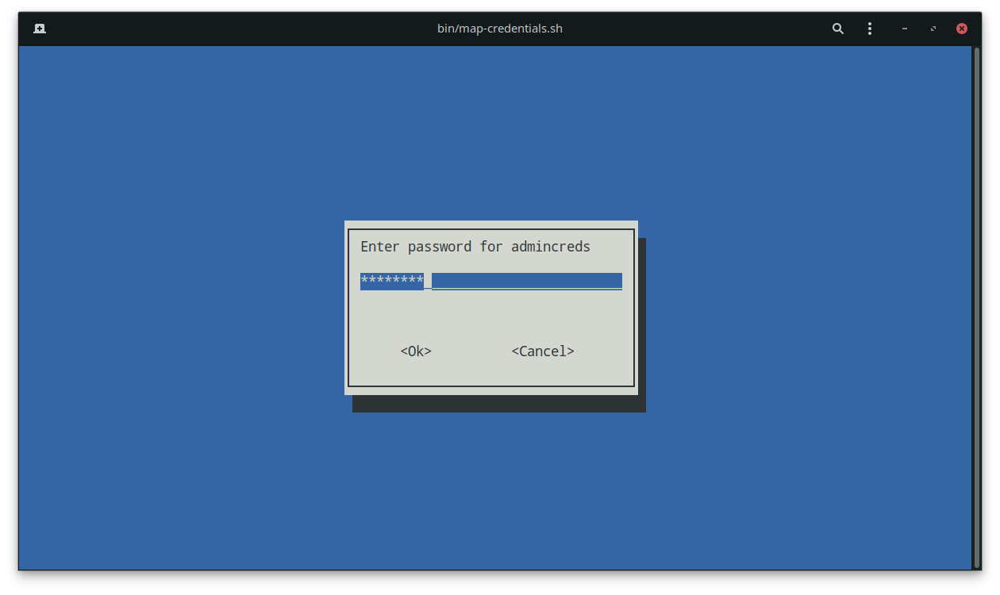
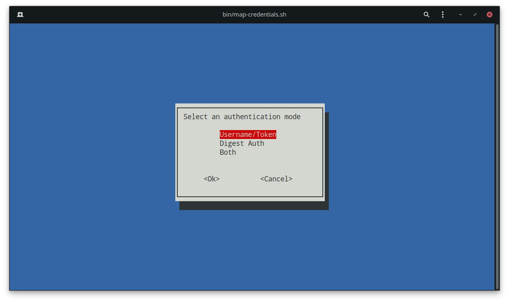
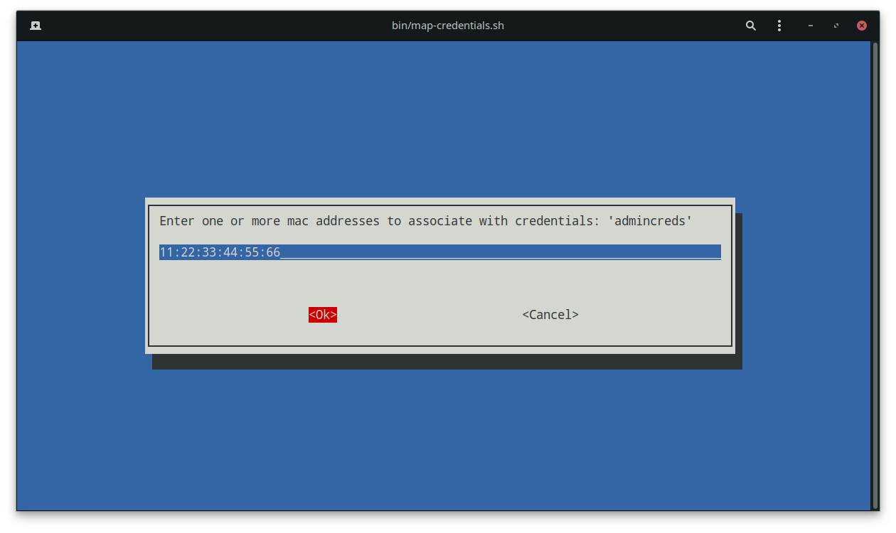

# ONVIF Device Service Running Guide

## Table of Contents

[Deploy EdgeX and ONVIF Device Service](#deploy-edgex-and-onvif-device-service)  
[Verify Service and Device Profiles](#verify-service-and-device-profiles)  
[Add Device](#add-device)  
[Using EdgeX UI](#using-edgex-ui)  
[Manage Devices](#manage-devices)  
[Next Steps](#next-steps)  


## Deploy EdgeX and ONVIF Device Camera Microservice

<details>
<summary><strong>Run the Service using Docker</strong></summary>

   1. Navigate to the EdgeX `compose-builder` directory:

      ```bash
      cd edgex-compose/compose-builder/
      ```

   1. Run EdgeX with the microservice in non-secure mode:

      ```bash
      make run no-secty ds-onvif-camera
      ```
   
   1. Run EdgeX with the microservice in secure mode:

      ```bash
      make run ds-onvif-camera
      ```
</details>

<details>
<summary><strong>Run the Service natively</summary><strong>  

   >**NOTE:** Go version 1.20+ is required to run natively. See [here](https://go.dev/doc/install) for more information.

   1. Navigate to the EdgeX `compose-builder` directory:

      ```bash
      cd edgex-compose/compose-builder/
      ```

   1. Run EdgeX:

      ```bash
      make run no-secty
      ```

   1. Navigate out of the `edgex-compose` directory to the `device-onvif-camera` directory:

      ```bash
      cd device-onvif-camera
      ```

   1. Run the service
      ```bash
      make run
      ```
      
      <details>
      <summary>[Optional] Run with NATS</summary>

         ```bash
         make run-nats
         ```

      </details>

</details>

## Verify Service and Device Profiles

### Using Command Line
1. Check the status of the container:

   ```bash 
   docker ps
   ```

   The status column will indicate if the container is running, and how long it has been up.

   Example Output:

    ```docker
   CONTAINER ID   IMAGE                                                       COMMAND                  CREATED       STATUS          PORTS                                                                                         NAMES
   33f9c5ecb70e   nexus3.edgexfoundry.org:10004/device-onvif-camera:latest    "/device-onvif-camer…"   7 weeks ago   Up 48 minutes   127.0.0.1:59985->59985/tcp                                                                    edgex-device-onvif-camera
   ```

2. Check whether the device service is added to EdgeX:

   ```bash
   curl -s http://localhost:59881/api/v2/deviceservice/name/device-onvif-camera | jq .
   ```
   Good response:
   ```json
      {
         "apiVersion": "v2",
         "statusCode": 200,
         "service": {
            "created": 1657227634593,
            "modified": 1657291447649,
            "id": "e1883aa7-f440-447f-ad4d-effa2aeb0ade",
            "name": "device-onvif-camera",
            "baseAddress": "http://edgex-device-onvif-camera:59984",
            "adminState": "UNLOCKED"
         }         
      }
   ```
   Bad response:
   ```json
   {
      "apiVersion": "v2",
      "message": "fail to query device service by name device-onvif-camer",
      "statusCode": 404
   }
   ```


3. Check whether the device profile is added:

   ```bash
   curl -s http://localhost:59881/api/v2/deviceprofile/name/onvif-camera | jq -r '"profileName: " + '.profile.name' + "\nstatusCode: " + (.statusCode|tostring)'

   ```
   Good response:
   ```bash
   profileName: onvif-camera
   statusCode: 200
   ```
   Bad response:
   ```bash
   profileName: 
   statusCode: 404
   ```
   > note: `jq -r` is used to reduce the size of the displayed response. The entire device profile with all resources can be seen by removing `-r '"profileName: " + '.profile.name' + "\nstatusCode: " + (.statusCode|tostring)', and replacing it with '.'`

### Using EdgeX UI
1. Visit http://localhost:4000 to go to the dashboard for EdgeX Console GUI:

   
   <p align="left">
      <i>Figure 1: EdgeX Console Dashboard</i>
   </p>

2. To see **Device Services**, **Devices**, or **Device Profiles**, click on their respective tab:

   
   <p align="left">
      <i>Figure 2: EdgeX Console Device Service List</i>
   </p>

   
   <p align="left">
      <i>Figure 3: EdgeX Console Device List</i>
   </p>

   
   <p align="left">
      <i>Figure 4: EdgeX Console Device Profile List</i>
   </p>
## Manage Devices
Follow these instructions to update devices.


### Curl Commands

#### Add Device

1. Edit the information to appropriately match the camera. The fields `Address`, `MACAddress` and `Port` should match that of the camera:

   ```bash
   curl -X POST -H 'Content-Type: application/json'  \
   http://localhost:59881/api/v2/device \
   -d '[
            {
               "apiVersion": "v2",
               "device": {
                  "name":"Camera001",
                  "serviceName": "device-onvif-camera",
                  "profileName": "onvif-camera",
                  "description": "My test camera",
                  "adminState": "UNLOCKED",
                  "operatingState": "UP",
                  "protocols": {
                     "Onvif": {
                        "Address": "10.0.0.0",
                        "Port": "10000",
                        "MACAddress": "aa:bb:cc:11:22:33",
                        "FriendlyName":"Default Camera"
                     },
                     "CustomMetadata": {
                        "Location":"Front door"
                     }
                  }
               }
            }
   ]'
   ```

   Example Output: 
   ```bash
   [{"apiVersion":"v2","statusCode":201,"id":"fb5fb7f2-768b-4298-a916-d4779523c6b5"}]
   ```

 Map credentials using the `map-credentials.sh` script.  
   a. Run `bin/map-credentials.sh`    
   b. Select `(Create New)`
      
   c. Enter the Secret Name to associate with these credentials  
      
   d. Enter the username  
      
   e. Enter the password  
      
   f. Choose the Authentication Mode  
      
   g. Assign one or more MAC Addresses to the credential group  
      
   h. Learn more about updating credentials [here](../utility-scripts.md)  

   Successful:
   
   ```bash 
   Dependencies Check: Success
         Consul Check: ...
                     curl -X GET http://localhost:8500/v1/kv/edgex/v3/device-onvif-camera?keys=true
   Response [200]      Success
   curl -X GET http://localhost:8500/v1/kv/edgex/v3/device-onvif-camera/AppCustom/CredentialsMap?keys=true
   Response [200] 
   Secret Name: a
   curl -X GET http://localhost:8500/v1/kv/edgex/v3/device-onvif-camera/AppCustom/CredentialsMap/a?raw=true
   Response [404] 
   Failed! curl returned a status code of '404'
   Setting InsecureSecret: a/SecretName
   curl --data "<redacted>" -X PUT http://localhost:8500/v1/kv/edgex/v3/device-onvif-camera/Writable/InsecureSecrets/a/SecretName
   Response [200] true


   Setting InsecureSecret: a/SecretData/username
   curl --data "<redacted>" -X PUT http://localhost:8500/v1/kv/edgex/v3/device-onvif-camera/Writable/InsecureSecrets/a/SecretData/username
   Response [200] true


   Setting InsecureSecret: a/SecretData/password
   curl --data "<redacted>" -X PUT http://localhost:8500/v1/kv/edgex/v3/device-onvif-camera/Writable/InsecureSecrets/a/SecretData/password
   Response [200] true


   Setting InsecureSecret: a/SecretData/mode
   curl --data "usern<redacted>metoken" -X PUT http://localhost:8500/v1/kv/edgex/v3/device-onvif-camera/Writable/InsecureSecrets/a/SecretData/mode
   Response [200] true


   Setting Credentials Map: a = ''
   curl -X PUT http://localhost:8500/v1/kv/edgex/v3/device-onvif-camera/AppCustom/CredentialsMap/a
   Response [200] true


   Secret Name: a
   curl -X GET http://localhost:8500/v1/kv/edgex/v3/device-onvif-camera/AppCustom/CredentialsMap/a?raw=true
   Response [200] 
   Setting Credentials Map: a = '11:22:33:44:55:66'
   curl --data "11:22:33:44:55:66" -X PUT http://localhost:8500/v1/kv/edgex/v3/device-onvif-camera/AppCustom/CredentialsMap/a
   Response [200] true
   ``` 

1. Verify device(s) have been succesfully added to core-metadata.

   ```bash
   curl -s http://localhost:59881/api/v2/device/all | jq -r '"deviceName: " + '.devices[].name''
   ```

   Example Output: 
   ```bash
   deviceName: Camera001
   deviceName: device-onvif-camera
   ```
   >note: device with name `device-onvif-camera` is a stand-in device and can be ignored.  
   >note: `jq -r` is used to reduce the size of the displayed response. The entire device with all information can be seen by removing `-r '"deviceName: " + '.devices[].name'', and replacing it with '.'`

#### Update Device

   There are multiple commands that can update aspects of the camera entry in meta-data. Refer to the [Swagger documentation]() for more information (not implemented).

#### Delete Device

   ```bash
   curl -X 'DELETE' \
   'http://localhost:59881/api/v2/device/name/<device name>' \
   -H 'accept: application/json' 
   ```

## Shutting Down
To stop all EdgeX services (containers), execute the `make down` command. This will stop all services but not the images and volumes, which still exist.

1. Navigate to the `edgex-compose/compose-builder` directory.
1. Run this command
   ```bash
   make down
   ```
1. To shut down and delete all volumes, run this command
   ```bash
   make clean
   ```

## Next Steps

[Learn how to use the device service](./general-usage.md)

## References

- ONVIF Website: http://www.onvif.org
- EdgeX Foundry Project Wiki: https://wiki.edgexfoundry.org/
- EdgeX Source Code: https://github.com/edgexfoundry
- Edgex Developer Guide: https://docs.edgexfoundry.org/2.1/
- Docker Repos
   - Docker https://docs.docker.com/engine/install/ubuntu/#install-using-the-repository
   - Docker Compose https://docs.docker.com/compose/install/#install-compose

# License

[Apache-2.0](https://github.com/edgexfoundry-holding/device-onvif-camera/blob/main/LICENSE)
