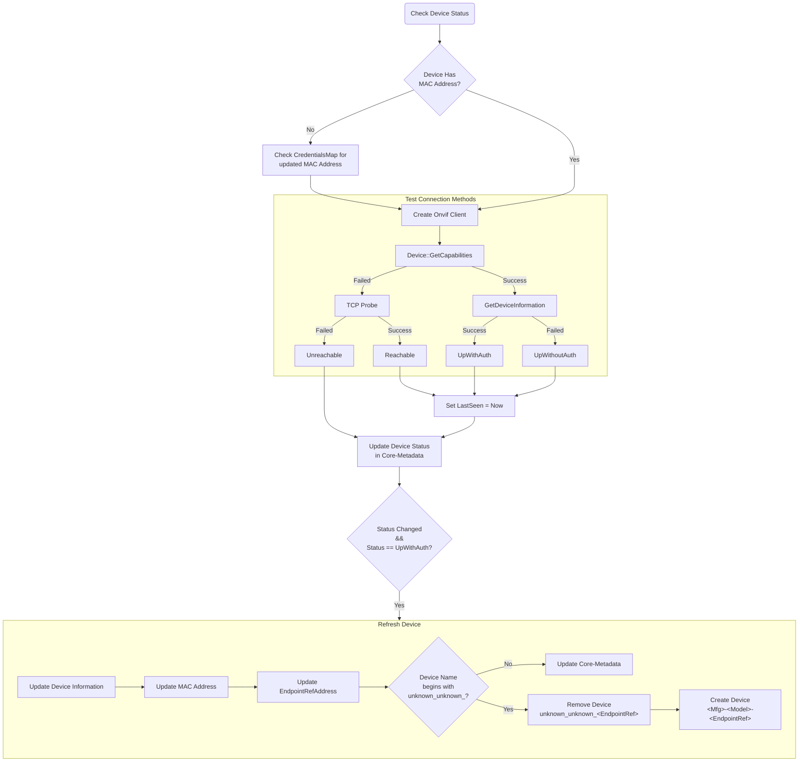

# Device Status
The device status goes hand in hand with the rediscovery of the cameras, but goes beyond the scope of just discovery. 
It is a separate background task running at a specified interval (default 30s) to determine the most accurate 
operating status of the existing cameras. This applies to all devices regardless of how or where they were added from.

## States and Descriptions
Currently, there are 4 different statuses that a camera can have

- **UpWithAuth**: Can execute commands requiring credentials  
- **UpWithoutAuth**: Can only execute commands that do not require credentials. Usually this means the camera's credentials have not been registered with the service yet, or have been changed.  
- **Reachable**: Can be discovered but no commands can be received.  
- **Unreachable**: Cannot be seen by service at all. Typically, this means that there is a connection issue either physically or with the network.

### Status Check flow for each device


## Configuration Options
- Use `EnableStatusCheck` to enable the device status background service.
- `CheckStatusInterval` is the interval at which the service will determine the status of each camera.

```toml
EnableStatusCheck = true

# The interval in seconds at which the service will check the connection of all known cameras and update the device status 
# A longer interval will mean the service will detect changes in status less quickly
# Maximum 300s (1 hour)
CheckStatusInterval = 30
```

## Automatic Triggers
Currently, there are some actions that will trigger an automatic status check:
- Any modification to the `CredentialsMap` from the config provider (Consul)
