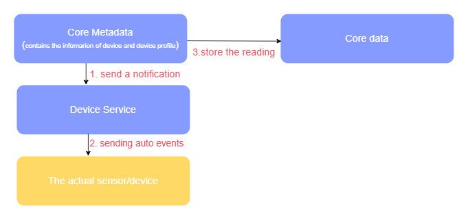

# Device Service - Auto Events
## Concept

In the Operational Technology (OT) working field, there's a need to check/monitor the status of the actual device/sensor, for example, when the temperature reaches 30°C, the Air Conditioner will turn on itself. However, it is time-consuming to check sensor's status manually so edgex provides this functionality called <code>AutoEvents</code> to check their statuses automatically and periodically.

From the diagram above, <code>Autoevents</code> is used to define how often events/readings are collected to be sent to core data from the device service. When the device service receives the information of devices being created, updated or deleted from core metadata, it will get reading from the real device automatically and send event/reading to MessageBus when App service/Core Data receive them.

<code>Autoevents</code> is an optional feature when creating a devices, each device may or may not have multiple autoevents associated with it. An AutoEvent has the following fields:

- **sourceName**: the name of a deviceResource or deviceCommand indicating what to read.
- **interval**: a string indicating the time to wait between reading, expressed as an integer followed by units of ms, s, m or h.
- **onChange**: a boolean: if set to true, only generate new events if one or more of the contained readings has changed since the last event.

## Example and Usage

The AutoEvent is defined in the `autoEvents` section of the device definition file:

!!! example
    ```yaml
    device:
      name: device-demo
      adminState: UNLOCKED
      operatingState: UP
      serviceName: device-virtual
      profileName: virtual-profile
      protocols: virtual
      autoEvents:
      - interval: 10s 
        onChange: false
        sourceName: Bool
    ```

After service startup, query core-data's API to query the number of events:

``` bash
curl http://localhost:59880/api/v3/event/device/name/device-demo
```

``` bash
{
   "apiVersion":"v3",
   "statusCode":200,
   "totalCount":1,
   "events":[
      {
         "apiVersion":"v3",
         "id":"cbb9d4bd-50e3-4a99-bdf0-63ca2d4b4a37",
         "deviceName":"device-demo",
         "profileName":"virtual-profile",
         "sourceName":"temperature",
         "origin":1705997198406508020,
         "readings":[
            {
               "id":"81decf04-3e9f-48cc-a3ee-1aeaa6730c76",
               "origin":1705997198406508020,
               "deviceName":"device-demo",
               "resourceName":"Bool",
               "profileName":"virtual-profile",
               "valueType":"Bool",
               "value":"false"
            }
         ]
      }
   ]
}
```

After 10s, query core-data's API to query the number of events again. You can see that the totalCount of events will change to 2 after 10s.

``` bash
{
   "apiVersion":"v3",
   "statusCode":200,
   "totalCount":2,
   "events":[
      {
         "apiVersion":"v3",
         "id":"1dead670-fc91-48db-8f6a-74f30bd3e0d6",
         "deviceName":"device-demo",
         "profileName":"virtual-profile",
         "sourceName":"Bool",
         "origin":1707986208822384190,
         "readings":[
            {
               "id":"c66db516-f27f-4663-b0a1-39d3693bf5fc",
               "origin":1707986208822384190,
               "deviceName":"device-demo",
               "resourceName":"Bool",
               "profileName":"virtual-profile",
               "valueType":"Bool",
               "value":"true"
            }
         ]
      },
      {
         "apiVersion":"v3",
         "id":"2549332e-0dfb-4881-a305-a2044a7ae835",
         "deviceName":"device-demo",
         "profileName":"virtual-profile",
         "sourceName":"Bool",
         "origin":1707986198816126412,
         "readings":[
            {
               "id":"a5dd24ba-bc41-4a10-a99d-082c0edc026c",
               "origin":1707986198816126412,
               "deviceName":"device-demo",
               "resourceName":"Bool",
               "profileName":"virtual-profile",
               "valueType":"Bool",
               "value":"false"
            }
         ]
      }
   ]
}
```
