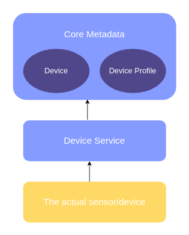

# Device Service - Device Definitions
## Concept

In EdgeX parlance, "device" is used to refer to a sensor, actuator, or IoT "thing". A sensor generally collects information from the physical world - like a temperature or vibration sensor. Actuators are machines that can be told to do something. Actuators move or otherwise control a mechanism or system - like a value on a pump. While there may be some technical differences, for the purposes of EdgeX documentation, device will refer to a sensor, actuator or "thing".

Data about actual devices is another type of information and each device must have a unique name associated to it. The [core metadata micro service](../../core/metadata/Purpose.md) stores information about a device. This information is used by other services (Device, Command, etc) to communicate with the devices. Each device is also associated to a device profile. This association enables metadata to apply knowledge provided by the device profile to each device. For example, a thermostat profile would say that it reports temperature values in Celsius. Associating a particular thermostat (the thermostat in the lobby for example) to the thermostat profile allows metadata to know that the lobby thermostat reports temperature value in Celsius.

## Usage
### How to start
You can [define your device](../../../walk-through/Ch-WalkthroughDeviceProfile.md) by creating device profile first and add your device based on the profile.

### Provisioning
Some device service have the ability to discover new devices, see [Provision a device](../../../walk-through/Ch-WalkthroughProvision.md) and [Device Discovery](../../../microservices/device/details/DeviceDiscovery.md) for more detailed information.
