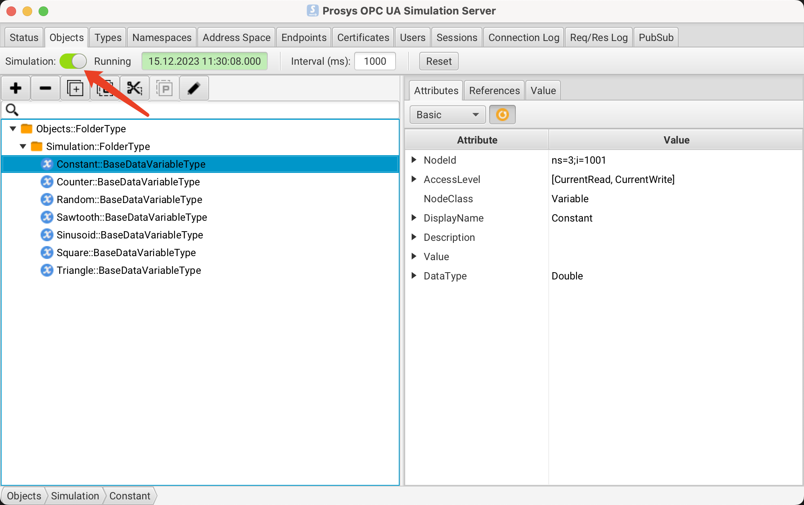
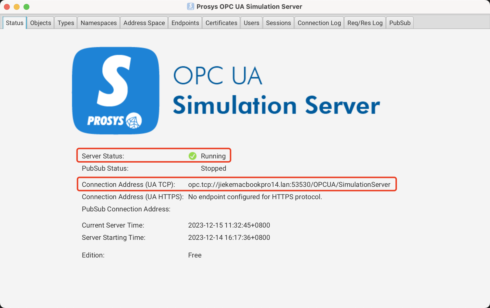
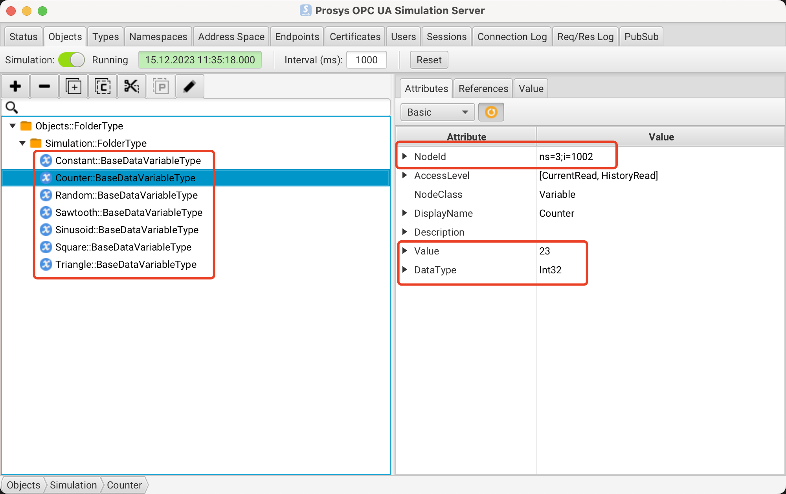

# Device OPC-UA - Getting Started

This page describes how to connect OPC-UA devices to EdgeX.

In this example, we simulate the [OPC UA Simulation Server](https://www.prosysopc.com/products/opc-ua-simulation-server/) instead of using a real device. This provides a straightforward way to test the device service features.

## Environment

You can use any operating system that can install docker and
docker-compose. In this example, we use Ubuntu to deploy EdgeX using docker.

## Prosys OPC UA Simulation Server

1. Download Prosys OPC UA Simulation Server

Download the latest version of Prosys OPC UA Simulation Server from the [OPC UA Simulation Server Download](https://downloads.prosysopc.com/opc-ua-simulation-server-downloads.php) .

2. Install the simulation server

3. Startup the simulation server
   

4. Verify the simulation server

- Status
  

  Copy the Connection Address(UA TCP) value: `opc.tcp://jiekemacbookpro14.lan:53530/OPCUA/SimulationServer`

- Objects
  

## Set Up Before Starting Services

The following sections describe how to complete the set up before starting the services.

- Using the pre-defined Configuration for testing
- Set Up New Configuration

### Using the pre-defined Configuration for testing

The pre-defined configuration in the folder: `cmd/res/`

#### Pre-defined Device Profile

The deivce profile [profiles/OpcuaServer.yaml](https://github.com/edgexfoundry/device-opcua-go/blob/{{edgexversion}}/cmd/res/profiles/OpcuaServer.yaml) described a simulation device, it contains 3 resources, the table described each resource of the device profile:

| Resource Name | valueType of EdgeX | nodeId      | Description               |
| ------------- | ------------------ | ----------- | ------------------------- |
| Constant      | Float64            | ns=3;i=1001 | generated constant number |
| Counter       | Int32              | ns=3;i=1002 | generated counter number  |
| Random        | Float64            | ns=3;i=1003 | generated random number   |

#### Pre-defined Device Configuration

The device configuration [devices/Simple-Devices.yaml](https://github.com/edgexfoundry/device-opcua-go/blob/{{edgexversion}}/cmd/res/devices/Simple-Devices.yaml) described two devices as shown below.

The `protocols.opcua.Endpoint` value is the same above metioned.

```yaml
---
protocols:
  opcua:
    Endpoint: 'opc.tcp://jiekemacbookpro14.lan:53530/OPCUA/SimulationServer'
```

### Set Up New Configuration

#### Create a Custom configuration folder

Run the following command:

```shell
mkdir -p custom-config
```

#### Set Up Device Profile

Run the following command to create your device profile:

```shell
cd custom-config
vi new-device-profile.yaml
```

Insert your device profile definition, it's up to your OPC-UA device configuration.

#### Set Up Device Service Configuration

```shell
cd custom-config
vi new-device-config.yaml
```

Fill in the new-device-config.yaml file.

## Prepare docker-compose File

### Generate docker compose file

1. Clone edgex-compose

```shell
git clone https://github.com/edgexfoundry/edgex-compose.git
```

1. Generate the docker-compose.yml file

```shell
cd edgex-compose
make gen no-secty ds-opcua
```

### Add Custom Configuration to docker-compose File

Add prepared configuration files to docker-compose file, you can mount them using volumes and change the environment for device-opcua internal use.

Open the `docker-compose.yml` file and then add volumes path and environment as shown below:

```yaml
device-opcua:
  ...
  environment:
    ...
    DEVICE_PROFILESDIR: /custom-config
    DEVICE_DEVICESDIR: /custom-config
  volumes:
    ...
    - /path/to/custom-config:/custom-config
```

## Start EdgeX Foundry on Docker

Since we generate the `docker-compose.yml` file at the previous step, we can deplay EdgeX as shown below:

```shell
cd edgex-compose/compose-builder
make up
```

```
[+] Running 12/12
 ✔ Container edgex-core-consul                      Started    0.0s
 ✔ Container edgex-ui-go                            Started    0.0s
 ✔ Container edgex-redis                            Started    0.0s
 ✔ Container edgex-core-common-config-bootstrapper  Started    0.1s
 ✔ Container edgex-support-scheduler                Started    0.0s
 ✔ Container edgex-kuiper                           Started    0.0s
 ✔ Container edgex-support-notifications            Started    0.1s
 ✔ Container edgex-core-metadata                    Started    0.1s
 ✔ Container edgex-core-command                     Started    0.0s
 ✔ Container edgex-core-data                        Started    0.0s
 ✔ Container edgex-app-rules-engine                 Started    0.0s
 ✔ Container edgex-device-opcua                     Started    0.0s
```

## Set Up After Starting Services

If the services are already running and you want to add a device, you can use the `Core Metadata API` as outlined in this section. If you set up the device profile and Service as described in [Set Up Before Starting Services](#set-up-before-starting-services), you can skip this section.

To add a device after starting the services, complete the following steps:

1. Upload the device profile above to metadata with a POST to http://localhost:59881/api/{{api_version}}/deviceprofile/uploadfile and add the file as key "file" to the body in form-data format, and the created ID will be returned. The following example command uses curl to send the request:

```shell
curl http://localhost:59881/api/{{api_version}}/deviceprofile/uploadfile \
 -X POST \
 -F "file=@new-device-profile.yml"
```

2. Ensure the OPC-UA device service is running, adjust the service name below to match if necessary or if using other device services.

3. Add the device with a POST to http://localhost:59881/api/{{api_version}}/device, the body will look something like:

```shell
curl http://localhost:59881/api/{{api_version}}/device -H "Content-Type:application/json" -X POST \
-d '[
        {
            "apiVersion" : "{{api_version}}",
            "device" : {
            "adminState" : "UNLOCKED",
            "description" : "OPCUA device",
            "labels" : [
                "OPCUA",
                "TEST"
            ],
            "name" : "SimulationServer1",
            "operatingState" : "UP",
            "profileName" : "OPCUA-Server",
            "protocols" : {
                "opcua" : {
                "Endpoint" : "opc.tcp://192.168.123.21:53530/OPCUA/SimulationServer"
                }
            },
            "serviceName" : "device-opcua"
            }
        }
    ]'
```

The service name must match/refer to the target device service(`device-opcua`), and the profile name must match the device profile name(`OPCUA-Server`) from the previous steps.

## Execute Commands

Now we're ready to run some commands.

### Find Executable Commands

Use the following query to find executable commands:

```shell
curl http://localhost:59882/api/{{api_version}}/device/name/SimulationServer1 | json_pp
```

```json
{
  "apiVersion": "v3",
  "deviceCoreCommand": {
    "coreCommands": [
      {
        "get": true,
        "name": "ConstantNum",
        "parameters": [
          {
            "resourceName": "Constant",
            "valueType": "Float64"
          }
        ],
        "path": "/api/v3/device/name/SimulationServer1/ConstantNum",
        "set": true,
        "url": "http://edgex-core-command:59882"
      },
      {
        "get": true,
        "name": "CounterNum",
        "parameters": [
          {
            "resourceName": "Counter",
            "valueType": "Int32"
          }
        ],
        "path": "/api/v3/device/name/SimulationServer1/CounterNum",
        "url": "http://edgex-core-command:59882"
      },
      {
        "get": true,
        "name": "RandomNum",
        "parameters": [
          {
            "resourceName": "Random",
            "valueType": "Float64"
          }
        ],
        "path": "/api/v3/device/name/SimulationServer1/RandomNum",
        "url": "http://edgex-core-command:59882"
      },
      {
        "get": true,
        "name": "Constant",
        "parameters": [
          {
            "resourceName": "Constant",
            "valueType": "Float64"
          }
        ],
        "path": "/api/v3/device/name/SimulationServer1/Constant",
        "set": true,
        "url": "http://edgex-core-command:59882"
      },
      {
        "get": true,
        "name": "Counter",
        "parameters": [
          {
            "resourceName": "Counter",
            "valueType": "Int32"
          }
        ],
        "path": "/api/v3/device/name/SimulationServer1/Counter",
        "url": "http://edgex-core-command:59882"
      },
      {
        "get": true,
        "name": "Random",
        "parameters": [
          {
            "resourceName": "Random",
            "valueType": "Float64"
          }
        ],
        "path": "/api/v3/device/name/SimulationServer1/Random",
        "url": "http://edgex-core-command:59882"
      }
    ],
    "deviceName": "SimulationServer1",
    "profileName": "OPCUA-Server"
  },
  "statusCode": 200
}
```

### Execute SET command

Execute SET command according to `url` and `parameterNames`, replacing `localhost` with the server IP when running the SET command.

Here we use the `Constant` command:

```shell
curl http://localhost:59882/api/{{api_version}}/device/name/SimulationServer1/Constant \
-H "Content-Type:application/json" -X PUT  \
-d '{"Constant": "199.99"}'
```

```
{"apiVersion":"{{api_version}}","statusCode":200}
```

### Execute GET command

Replace `localhost` with the server IP when running the GET command.

Here we use the `Constant` command:

```shell
curl http://localhost:59882/api/{{api_version}}/device/name/SimulationServer1/Constant
```

We got the result, `"value" : "1.999900e+02"`:

```json
{
  "apiVersion": "v3",
  "event": {
    "apiVersion": "v3",
    "deviceName": "SimulationServer1",
    "id": "cc8ea84d-0a5f-4d5b-b4db-9126368f4aa3",
    "origin": 1702613269923352589,
    "profileName": "OPCUA-Server",
    "readings": [
      {
        "deviceName": "SimulationServer1",
        "id": "5c1ea763-bb50-4837-b78c-8ef1c2ed0035",
        "origin": 1702613269921,
        "profileName": "OPCUA-Server",
        "resourceName": "Constant",
        "value": "1.999900e+02",
        "valueType": "Float64"
      }
    ],
    "sourceName": "Constant"
  },
  "statusCode": 200
}
```

## AutoEvent

The `AutoEvent` is defined in the `autoEvents` section of the device definition file:

```yaml
deviceList:
  autoEvents:
    interval: '30s'
    onChange: false
    sourceName: 'Constant'
```

After service startup, query `core-data's` API. The results show that the service auto-executes the command every `30 seconds`.
