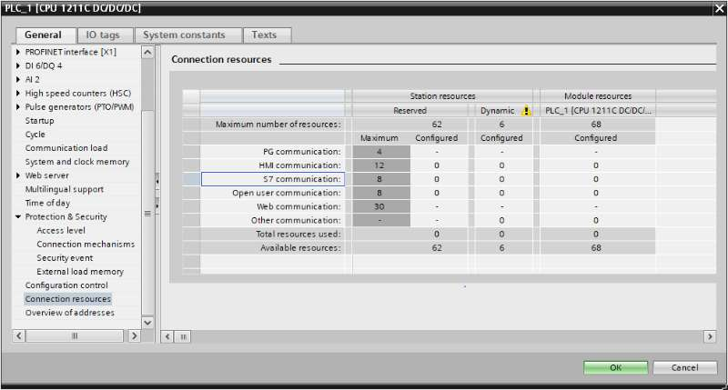

# Device S7 - Getting Started

This page describes how to connect S7 devices to EdgeX. In this example, we using a real device(such as S7-1200). This provides a straightforward way to test the device service features.

## Environment

You can use any operating system that can install docker and docker-compose. In this example, we use Ubuntu to deploy EdgeX using docker.

## Set Up a S7 Device

!!! warning "Warning"
    This page is not a complete guide for setting up your S7 device, just a few important steps.

### Set Up ISO-on-TCP access

#### IP protocol

Set up Ethernet addresses -> IP protocol, such as 192.168.123.199/255.255.255.0


#### Enable S7 Communication from remote

Enable `Permit access with PUT/GET communication from remote partner`.


#### (Optional) Reserved S7 communication

Number of reserved and used resources for `S7 communication`s, the `Configured` is 0, it means EdgeX can establish max 8 connections.

!!! warning "WARNING"
    IMPORTANT: DO NOT CREAT MORE THAN `6` CONNECTIONS TO SINGLE S7 DEVICE! WE NEED RESEVER `2` FOR WINCC.



### Set Up Data Blocks

**Data Block 1**
In this case, just use `Clcok` in Offset 160.0 for testing.


**Data Block 4**
In this case, use `bool`, `byte`, `word`, `dword`, `int`, `dint`, `real` for testing.


## Set Up Before Starting Services

The following sections describe how to complete the set up before starting the services.

- Using the pre-defined Configuration for testing
- Set Up New Configuration

### Using the pre-defined Configuration for testing

The pre-defined configuration in the folder: `cmd/res/`

#### Pre-defined Device Profile

The deivce profile [profiles/Simple-Driver.yaml](https://github.com/edgexfoundry/device-s7/blob/{{edgexversion}}/cmd/res/profiles/Simple-Driver.yaml) described a S7-1200 device, it contains 8 resources, the table described each resource of the device profile:

| Resource Name | valueType of EdgeX | NodeName   | Note(DB: Data Block)                            |
| ------------- | ------------------ | ---------- | ----------------------------------------------- |
| bool          | Bool               | DB4.DBX0.0 | DB4: `DBX0.0`: (`BOOL`) bit 0 of offset 0       |
| byte          | Uint8              | DB4.DBB1   | DB4, `DBB1`: (`BYTE`) one byte of offset 1      |
| word          | Int16              | DB4.DBW2   | DB4, `DBW2`: (`WORD`) two bytes of offset 2     |
| dword         | Int32              | DB4.DBD4   | DB4, `DBD4`: (`DWORD`) four bytes of offset 4   |
| int           | Int16              | DB4.DBW8   | DB4, `DBW8`: (`WORD`) two bytes of offset 8     |
| dint          | Int32              | DB4.DBW10  | DB4, `DBW10`: (`WORD`) two bytes of offset 10   |
| real          | Float32            | DB4.DBD14  | DB4, `DBD14`: (`REAL`) four bytes of offset 14  |
| heartbeat     | Int16              | DB1.DBW160 | DB1, `DBW160`: (`WORD`) two bytes of offset 160 |

#### Pre-defined Device Configuration

The device configuration [devices/Simple-Device.yaml](https://github.com/edgexfoundry/device-s7/blob/{{edgexversion}}/cmd/res/devices/Simple-Device.yaml) described two devices as shown below.

- S7-Device01: The autoevent `interval` value(10s) < IdleTimeout(30s), only one tcp connection until the connection failed.
- S7-Device02: The autoevent `interval` value(10s) > IdleTimeout(5s), so every read command will reconnect to the S7 device.

### Set Up New Configuration

#### Create a Custom configuration folder

Run the following command:

```shell
mkdir -p custom-config
```

#### Set Up Device Profile

Run the following command to create your device profile:

```shell
cd custom-config
vi new-device-profile.yaml
```

Insert your device profile definition, it's up to your S7 device configuration.

#### Set Up Device Service Configuration

```shell
cd custom-config
vi new-device-config.yaml
```

Fill in the new-device-config.yaml file.

## Prepare docker-compose file

### Generate docker compose file

1. Clone edgex-compose

```shell
git clone https://github.com/edgexfoundry/edgex-compose.git
```

1. Generate the docker-compose.yml file

```shell
cd edgex-compose
make gen no-secty ds-s7
```

### Add Custom Configuration to docker-compose File

Add prepared configuration files to docker-compose file, you can mount them using volumes and change the environment for device-s7 internal use.

Open the `docker-compose.yml` file and then add volumes path and environment as shown below:

```yaml
device-s7:
  ...
  environment:
    ...
    DEVICE_PROFILESDIR: /custom-config
    DEVICE_DEVICESDIR: /custom-config
  volumes:
    ...
    - /path/to/custom-config:/custom-config
```

## Start EdgeX Foundry on Docker

Since we generate the `docker-compose.yml` file at the previous step, we can deplay EdgeX as shown below:

```shell
cd edgex-compose/compose-builder
make up
```

```
[+] Running 12/12
 ✔ Container edgex-core-consul                      Started    0.0s
 ✔ Container edgex-ui-go                            Started    0.0s
 ✔ Container edgex-redis                            Started    0.0s
 ✔ Container edgex-core-common-config-bootstrapper  Started    0.1s
 ✔ Container edgex-support-scheduler                Started    0.0s
 ✔ Container edgex-kuiper                           Started    0.0s
 ✔ Container edgex-support-notifications            Started    0.1s
 ✔ Container edgex-core-metadata                    Started    0.1s
 ✔ Container edgex-core-command                     Started    0.0s
 ✔ Container edgex-core-data                        Started    0.0s
 ✔ Container edgex-app-rules-engine                 Started    0.0s
 ✔ Container edgex-device-s7                        Started    0.0s
```

## Set Up After Starting Services

If the services are already running and you want to add a device, you can use the `Core Metadata API` as outlined in this section. If you set up the device profile and Service as described in [Set Up Before Starting Services](#set-up-before-starting-services), you can skip this section.

To add a device after starting the services, complete the following steps:

1. Upload the device profile above to metadata with a POST to http://localhost:59881/api/{{api_version}}/deviceprofile/uploadfile and add the file as key "file" to the body in form-data format, and the created ID will be returned. The following example command uses curl to send the request:

```shell
curl http://localhost:59881/api/{{api_version}}/deviceprofile/uploadfile -F "file=@new-device-profile.yml"
```

2. Ensure the S7 device service is running, adjust the service name below to match if necessary or if using other device services.

3. Add the device with a POST to http://localhost:59881/api/{{api_version}}/device, the body will look something like:

```shell
curl http://localhost:59881/api/{{api_version}}/device -H "Content-Type:application/json" -X POST \
  -d '[
        {
            "apiVersion" : "{{api_version}}",
            "device": {
                "name": "S7-Device03",
                "description": "Example of S7 Device",
                "adminState": "UNLOCKED",
                "operatingState": "UP",
                "serviceName": "device-s7",
                "profileName": "S7-Device",
                "protocols": {
                    "s7": {
                        "Host": "192.168.123.199",
                        "Port": 102,
                        "Rack": 0,
                        "Slot": 1,
                        "Timeout": 30,
                        "IdleTimeout": 30
                    }
                },
                "autoEvents": [
                    {
                        "interval": "10s",
                        "onChange": false,
                        "sourceName": "AllResource"
                    }
                ]
            }
        }
    ]'
```

The service name must match/refer to the target device service(`device-s7`), and the profile name must match the device profile name(`S7-Device`) from the previous steps.

## Execute Commands

Now we're ready to run some commands.

### Find Executable Commands

Use the following query to find executable commands:

```shell
curl http://localhost:59882/api/{{api_version}}/device/name/S7-Device03 | json_pp
```

```json
{
  "apiVersion": "{{api_version}}",
  "deviceCoreCommand": {
    "coreCommands": [
      {
        "get": true,
        "name": "word",
        "parameters": [
          {
            "resourceName": "word",
            "valueType": "Int16"
          }
        ],
        "path": "/api/{{api_version}}/device/name/S7-Device03/word",
        "set": true,
        "url": "http://edgex-core-command:59882"
      },
      {
        "get": true,
        "name": "int",
        "parameters": [
          {
            "resourceName": "int",
            "valueType": "Int16"
          }
        ],
        "path": "/api/{{api_version}}/device/name/S7-Device03/int",
        "set": true,
        "url": "http://edgex-core-command:59882"
      },
      {
        "get": true,
        "name": "real",
        "parameters": [
          {
            "resourceName": "real",
            "valueType": "Float32"
          }
        ],
        "path": "/api/{{api_version}}/device/name/S7-Device03/real",
        "set": true,
        "url": "http://edgex-core-command:59882"
      },
      {
        "get": true,
        "name": "heartbeat",
        "parameters": [
          {
            "resourceName": "heartbeat",
            "valueType": "Int16"
          }
        ],
        "path": "/api/{{api_version}}/device/name/S7-Device03/heartbeat",
        "set": true,
        "url": "http://edgex-core-command:59882"
      },
      {
        "get": true,
        "name": "AllResource",
        "parameters": [
          {
            "resourceName": "bool",
            "valueType": "Bool"
          },
          {
            "resourceName": "byte",
            "valueType": "Uint8"
          },
          {
            "resourceName": "word",
            "valueType": "Int16"
          },
          {
            "resourceName": "dword",
            "valueType": "Int32"
          },
          {
            "resourceName": "int",
            "valueType": "Int16"
          },
          {
            "resourceName": "dint",
            "valueType": "Int32"
          },
          {
            "resourceName": "real",
            "valueType": "Float32"
          },
          {
            "resourceName": "heartbeat",
            "valueType": "Int16"
          }
        ],
        "path": "/api/{{api_version}}/device/name/S7-Device03/AllResource",
        "set": true,
        "url": "http://edgex-core-command:59882"
      },
      {
        "get": true,
        "name": "bool",
        "parameters": [
          {
            "resourceName": "bool",
            "valueType": "Bool"
          }
        ],
        "path": "/api/{{api_version}}/device/name/S7-Device03/bool",
        "set": true,
        "url": "http://edgex-core-command:59882"
      },
      {
        "get": true,
        "name": "byte",
        "parameters": [
          {
            "resourceName": "byte",
            "valueType": "Uint8"
          }
        ],
        "path": "/api/{{api_version}}/device/name/S7-Device03/byte",
        "set": true,
        "url": "http://edgex-core-command:59882"
      },
      {
        "get": true,
        "name": "dword",
        "parameters": [
          {
            "resourceName": "dword",
            "valueType": "Int32"
          }
        ],
        "path": "/api/{{api_version}}/device/name/S7-Device03/dword",
        "set": true,
        "url": "http://edgex-core-command:59882"
      },
      {
        "get": true,
        "name": "dint",
        "parameters": [
          {
            "resourceName": "dint",
            "valueType": "Int32"
          }
        ],
        "path": "/api/{{api_version}}/device/name/S7-Device03/dint",
        "set": true,
        "url": "http://edgex-core-command:59882"
      }
    ],
    "deviceName": "S7-Device03",
    "profileName": "S7-Device"
  },
  "statusCode": 200
}
```

### Execute SET command

Execute SET command according to `url` and `parameterNames`, replacing `localhost` with the server IP when running the SET command.

Here we use `heartbeat` command:

```shell
curl http://localhost:59882/api/{{api_version}}/device/name/S7-Device03/heartbeat \
-H "Content-Type:application/json" -X PUT  \
-d '{"heartbeat": "1"}'
```

```
{"apiVersion":"{{api_version}}","statusCode":200}
```

### Execute GET command

Replace `localhost` with the server IP when running the GET command.

Here we use `heartbeat` command:

```shell
curl http://localhost:59882/api/{{api_version}}/device/name/S7-Device03/heartbeat
```

```json
{
  "apiVersion": "{{api_version}}",
  "statusCode": 200,
  "event": {
    "apiVersion": "{{api_version}}",
    "id": "dd56ed66-2874-4d78-af02-753783164b3c",
    "deviceName": "S7-Device03",
    "profileName": "S7-Device",
    "sourceName": "heartbeat",
    "origin": 1702103303160428120,
    "readings": [
      {
        "id": "8324105a-1843-415d-bea7-b61e6d12142c",
        "origin": 1702103303159722671,
        "deviceName": "S7-Device03",
        "resourceName": "heartbeat",
        "profileName": "S7-Device",
        "valueType": "Int16",
        "value": "1"
      }
    ]
  }
}
```

## AutoEvent

The `AutoEvent` is defined in the `autoEvents` section of the device definition file:

```yaml
deviceList:
  autoEvents:
    interval: '30s'
    onChange: false
    sourceName: 'heartbeat'
```

After service startup, query `core-data's` API. The results show that the service auto-executes the command every `30 seconds`.
