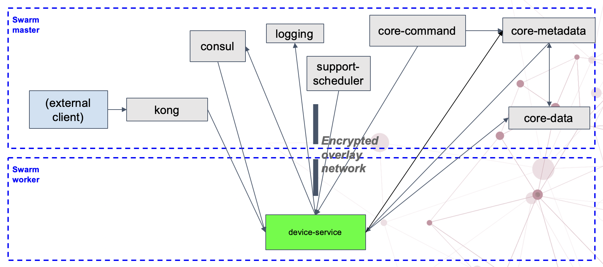

# Security for EdgeX Stack

This page shows how to secure communication between core EdgeX services and various device services by utilizing docker swarm to create an encrypted overlay network between two hosts.  We are showcasing two interesting concepts here.  

1) Securing the traffic between core and device services
2) Setting up an EdgeX Stack cross platform using docker swarm

## Docker Swarm Overlay Network

Docker's overlay network driver is a software abstraction on top of physical networking hardware to link multiple nodes together in a distributed network. This allows nodes/containers running on the network to communicate securely, if encryption is in enabled. Overlay network encryption is not supported on Windows.

We created two docker swarm nodes for this example a manager node and a worker node.  The manager node is running all of the core EdgeX services and the worker node runs the device services.  Using the docker daemon's overlay network abstraction and enabling security we can have secure communication between these nodes.




## Reference implementation example

The reference implementation example can be found in this repository:
[Reference example device-service docker-swarm overlay network](https://github.com/edgexfoundry/edgex-examples/tree/swarm/security/remote_devices/docker-swarm)

### Setup remote running Virtual Machine

In this example setup, similar to the the [SSH example](https://github.com/edgexfoundry/edgex-docs/blob/master/docs_src/microservices/security/Ch-SSH-Tunneling-HowToSecureDeviceServices.md), `vagrant` is used on the top of `Virtual Box` to set up the secondary/remote VM.

Download vagrant from Hashicorp website or if you're on Ubuntu via `sudo apt install virtualbox` and `sudo apt install vagrant`.  We have a simple vagrant file used for this tutorial [here](https://github.com/edgexfoundry/edgex-examples/blob/swarm/security/docker-swarm/docker-swarm/Vagrantfile)

This vagrant file sets the hostname for the new VM and installs docker.

### Getting the VM running

- Launch the worker node or VM if it is not yet running:

This will create the VM select your network interface and let the prompt continue.  Once the prompt finishes, ignore the VMs popup window, we will be login in via SSH in the next step.

```sh
vagrant up
```

- ssh into the worker node via from your host's terminal:

```sh
vagrant ssh
```

This will give you a terminal prompt in the worker node where you will run the `sudo docker swarm join` command in a few steps.

### Connecting the swarm nodes

With the VM up and running we need to connect the two nodes using docker swarm.

The following command initializes a docker swarm and is to be ran on the host machine: 

```sh
sudo docker swarm init --advertise-addr <your host ip address>
```

The previous command will output a token use this token in the following join command.  This joins the worker node to the cluster, to be ran your vagrant VM (worker-node):

```sh
sudo docker swarm join --token <token> <manager ip address>:2377
```

Next, I will walk-through the changes we made to the docker-stack.yml file to convert the edgex compose file into a docker swarm stack file.

### Setting up the docker-stack-edgex.yml file

All of the following changes are already done in the examples repo.  I will just outline the necessary changes to go from a compose file to stack file.

First, remove 'restart' command from compose file; 'restart' is not a valid command in docker swarm.

Next, we define constraints that the edgex core services must not run on the worker node add this section of yml to the 'docker-stack-edgex.yml'.  We will do the inverse for the device-service to ensure it does run on the worker node thus ensuring it uses the overlay network to communicate with the other services.  Note that this is already done in the example directory.

```yaml
    deploy: 
      placement: 
        constraints: 
          - node.hostname != worker-node
```
Here is the inverse of the previous yml block. This gets added to the device services in the stack file. 

```yaml
    deploy: 
      placement: 
        constraints: 
          - node.hostname == worker-node
```

These work because we set the 'hostname = worker-node' in the Vagrantfile.

### Adding Host Mounted Volumes

In docker swarm bind mount volumes need to be explicitly defined in the stack yml file.  Below are the first three bind mount volume definitions these directories must be created on the host before the stack file can be ran.

Note that this is only an example.  In a production deployment you would want to use a network filesystem or create the shared volumes between containers.

```yaml
  secrets-volume:
    driver: local
    driver_opts:
      o: bind
      type: none
      device: /tmp/edgex/secrets/
  secrets-ca-volume:
    driver: local
    driver_opts:
      o: bind
      type: none
      device: /tmp/edgex/secrets/ca/
  edgex-consul:
    driver: local
    driver_opts:
      o: bind
      type: none
      device: /tmp/edgex/secrets/edgex-consul/
...
```

The full docker-stack file is included here:

[docker-stack-edgex.yml file](https://github.com/edgexfoundry/edgex-examples/security/remote_devices/docker-swarm/docker-stack-edgex.yml)

### Other changes in docker-stack-edgex.yml file 

Another change we had to make in the docker-stack-edgex.yml file is to disable `IPC_LOCK` because the `cap_add` flag in vault's configuration is not supported in docker swarm.  To do this we add `SKIP_SETCAP=true` and `disable_mlock = "true"` to vault in the stack file. 

```yaml
  vault:
    image: vault:1.3.1
    hostname: edgex-vault
    networks:
      edgex-network:
        aliases:
            - edgex-vault
    ports:
      - target: 8200
        published: 8200
        protocol: tcp
        mode: host
    # cap_add not allowed in docker swarm, this is a security issue and I don't recommend disabling this in production
    # cap_add:
    #   - "IPC_LOCK"
    tmpfs:
      - /vault/config
    entrypoint: ["/vault/init/start_vault.sh"]
    environment:
      - VAULT_ADDR=https://edgex-vault:8200
      - VAULT_CONFIG_DIR=/vault/config
      - VAULT_UI=true
      - SKIP_SETCAP=true
      - |
        VAULT_LOCAL_CONFIG=
          listener "tcp" { 
              address = "edgex-vault:8200" 
              tls_disable = "0" 
              cluster_address = "edgex-vault:8201" 
              tls_min_version = "tls12" 
              tls_client_ca_file ="/tmp/edgex/secrets/edgex-vault/ca.pem" 
              tls_cert_file ="/tmp/edgex/secrets/edgex-vault/server.crt" 
              tls_key_file = "/tmp/edgex/secrets/edgex-vault/server.key" 
              tls_perfer_server_cipher_suites = "true"
          } 
          backend "consul" { 
              path = "vault/" 
              address = "edgex-core-consul:8500" 
              scheme = "http" 
              redirect_addr = "https://edgex-vault:8200" 
              cluster_addr = "https://edgex-vault:8201" 
          } 
          default_lease_ttl = "168h" 
          max_lease_ttl = "720h"
          disable_mlock = "true"
    volumes:
      - vault-file:/vault/file:z
      - vault-logs:/vault/logs:z
      - vault-init:/vault/init:ro,z
      - edgex-vault:/tmp/edgex/secrets/edgex-vault:ro,z
    depends_on:
      - consul
      - security-secrets-setup
    deploy: 
      endpoint_mode: dnsrr
      placement:
        constraints: 
          - node.hostname != worker-node 
```

Another change we had to make is to set the restart policy for one-shot initialization containers like kong-migrations and edgex-proxy.  Simply add this section of yaml to the services you'd like to only run once and they wont be restarted unless a failure condition happens.

```yml
restart_policy:
  condition: on-failure
```

The next and final change in the stack yml file is to ensure the EdgeX services are binding to the correct host.  Since Geneva we do this by adding a common variable `Service_ServerBindAddr: "0.0.0.0"` to ensure that the service will bind to any host and not be limited to the hostname.  

### Running the docker stack file

With all of these changes in place we are ready to run the stack file.  We included a script to run the stack file and create the volumes needed in the stack file.  This script simply creates the volumes directories and runs the `docker stack deploy ...` command.

```sh
sudo ./run.sh
```

Once the stack is up you can run the following command to view the running services: 

```sh
sudo docker stack services edgex-overlay
```

### Confirming results

To ensure the device service is running on the worker node you can run the `docker stack ps edgex-overlay` command. Now check that you see the device service running on the `worker-node` while all of the other services are running on your host.

We have encryption enabled but how to we confirm that the overlay network is encrypting our data?  

We can use `tcpdum` with a protocol filter for ESP (Encapsulating Security Payload) traffic on the worker node this allows us to sniff and ensure the traffic is coming over the expected encrypted protocol. Adding a `-A` flag would also highlight that the data is not in the HTTP protocol format.

`sudo tcpdump -p esp`

### Tearing everything down

To remove the stack run the command:

```sh
sudo ./down.sh
```

This will remove the volumes and the stack.

To remove the swarm itself run: on the worker node `docker swarm leave`  and on the host machine `docker swarm leave --force`.

To remove the vagrant VM run `vagrant destroy` on the host.