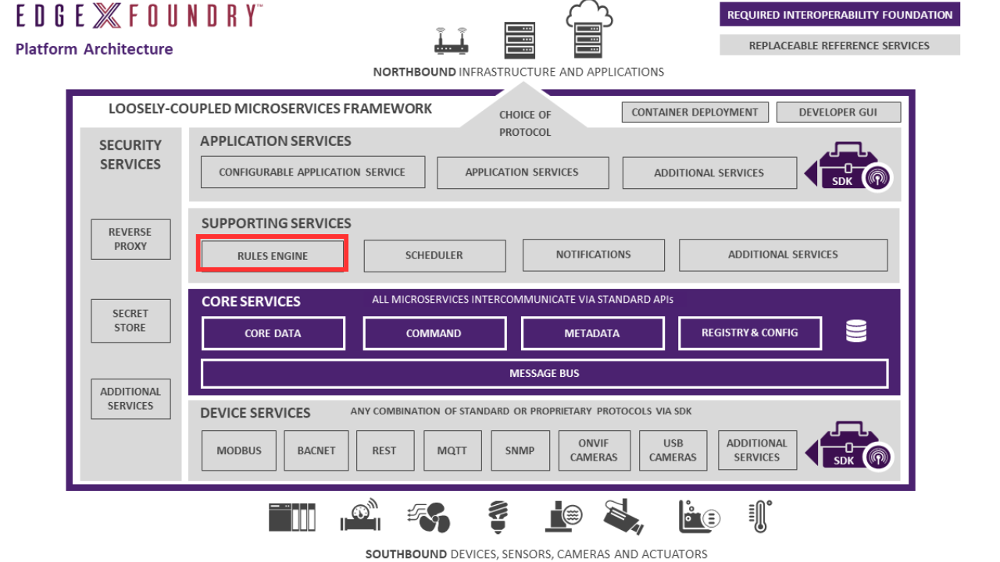

# eKuiper Rules Engine

## Overview

[LF Edge eKuiper](https://www.lfedge.org/projects/ekuiper/) is the EdgeX reference implementation rules engine (or [edge analytics](../../../general/Definitions.md#edge-analytics)) implementation.

## What is LF Edge eKuiper?

LF Edge eKuiper is a lightweight open source software (Apache 2.0 open source license agreement) package for IoT edge analytics and stream processing implemented in Go lang, which can run on various resource constrained edge devices. Users can realize fast data processing on the edge and write rules in SQL. The eKuiper rules engine is based on three components `Source`, `SQL` and `Sink`.

- Source: Source of stream data, such as data from an MQTT server. For EdgeX, the data source is an EdgeX message bus, which can be implemented by Redis Pub/Sub, MQTT or NATS;
- SQL: SQL is where the specified business logic is processed. eKuiper provides SQL statements to extract, filter, and transform data;
- Sink: Used to send the analysis result to a specific target, such as sending the analysis results to EdgeX's Command service, or an MQTT broker in the cloud;

The relationship among Source, SQL and Sink in eKuiper is shown below.

eKuiper runs very efficiently on resource constrained edge devices. For common IoT data processing, the throughput can reach 12k per second. Readers can refer to [here](https://github.com/lf-edge/ekuiper#performance-test-result) to get more performance benchmark data for eKuiper.

## eKuiper rules engine of EdgeX

An extension mechanism allows eKuiper to be customized to analyze and process data from different data sources. By default for the EdgeX configuration, eKuiper analyzes data coming from the EdgeX [message bus](https://github.com/edgexfoundry/go-mod-messaging). EdgeX provides an abstract message bus interface, and implements the Redis Pub/Sub, MQTT and NATS protocols respectively to support information exchange between different micro-services. The integration of eKuiper and EdgeX mainly includes the following:

- Extend an EdgeX message bus source to support receiving data from the EdgeX message bus. By default, eKuiper listens to the port `5566` on which the Application Service publishes messages. After the data from the Core Data Service is processed by the Application Service, it will flow into the eKuiper rules engine for processing.
- Read the data type definition from Core Contract Service, convert EdgeX data to eKuiper data type, and process it according to the rules specified by the user.
- eKuiper supports sending analysis results to different Sink:
  - The users can choose to send the analysis results to Command Service to control the equipment;
  - The analysis results can be sent to the EdgeX message bus sink for further processing by other micro-services.

## Learn more

- [EdgeX eKuiper Rules Engine Tutorial](https://github.com/lf-edge/ekuiper/blob/master/docs/en_US/edgex/edgex_rule_engine_tutorial.md): A 10-minute quick start tutorial, readers can refer to this article to start trying out the rules engine.
- [Configure the data flow from EdgeX to eKuiper](https://github.com/lf-edge/ekuiper/blob/master/docs/en_US/edgex/edgex_source_tutorial.md):  a demonstrate on how to set up the various data flows from EdgeX to eKuiper.  Learn how to configure the source to adopt any kind of data flow.
- [Control the device with the EdgeX eKuiper rules engine](https://github.com/lf-edge/ekuiper/blob/master/docs/en_US/edgex/edgex_rule_engine_command.md): This article describes how to use the eKuiper rule engine in EdgeX to control the device based on the analysis results.
- Read [EdgeX Source](https://github.com/lf-edge/ekuiper/blob/master/docs/en_US/guide/sources/builtin/edgex.md) to get more detailed information, and type conversions.
- [How to use the meta function to extract more information sent in the EdgeX message bus?](https://github.com/lf-edge/ekuiper/blob/master/docs/en_US/edgex/edgex_meta.md) When the device service sends data to the bus, some additional information is also sent, such as creation time and id. If you want to use this information in SQL statements, please refer to this article.
- [EdgeX Message Bus Sink](https://github.com/lf-edge/ekuiper/blob/master/docs/en_US/guide/sinks/builtin/edgex.md): The document describes how to use EdgeX message bus sink. If you'd like to have your analysis result consumed by other EdgeX services, you can send analysis data with EdgeX data format through this sink, and other EdgeX services can subscribe new message bus exposed by eKuiper sink.

!!! Info
  The eKuiper tutorials and documentation are available in both [English](https://github.com/lf-edge/ekuiper/tree/master/docs/en_US/edgex) and [Chinese](https://github.com/lf-edge/ekuiper/tree/master/docs/zh_CN/edgex).

For more information on the LF Edge eKuiper project, please refer to the following resources.

- [eKuiper Github Code library](https://github.com/lf-edge/ekuiper/)
- [eKuiper Reference](https://github.com/lf-edge/ekuiper/blob/master/docs/en_US/index.md)
