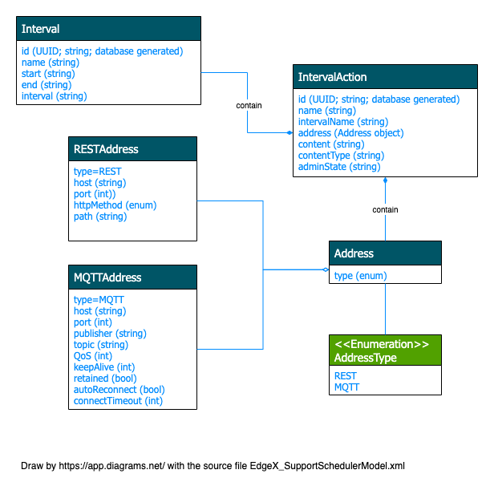

# Support Scheduler

## Introduction

The support scheduler microservice provide an internal EdgeX “clock” that can kick off operations in any EdgeX service.  At a configuration specified time (called an **interval**), the service calls on any EdgeX service API URL via REST to trigger an operation (called an **interval action**).  For example, the scheduler service periodically calls on core data APIs to clean up old sensed events that have been successfully exported out of EdgeX.

### Default Interval Actions

Scheduled interval actions configured by default with the reference implementation of the service include:

- Clean up of Core-data events/readings that have been persisted for an extended period. In order to prevent the edge node from running out of space, these old events/readings are removed. This is the "ScrubAged" operation. Scheduler parameters around this operation determine how often and where to call into Core-data to invoke this operation to expunge of old data.

---
**NOTE**
The removal of stale records occurs on a configurable schedule. By default, the default action above is invoked once a day at midnight.

---

### Scheduler Persistence

Support scheduler uses a data store to persist the Interval(s) and IntervalAction(s). Persistence is accomplished by the Scheduler DB located
in your current configured database for EdgeX.

---
**Info**
    Redis DB is used by default to persist all scheduler service information to include intervals and interval actions.

---
### ISO 8601 Standard

The times and frequencies defined in the scheduler service's intervals are specified using the [international date/time standard - ISO 8601](https://en.wikipedia.org/wiki/ISO_8601).  So, for example, the start of an interval would be represented in YYYYMMDD'T'HHmmss format.  20180101T000000 represents January 1, 2018 at midnight.  Frequencies are represented with ISO 8601 durations. 

## Data Model
The latest developed data model will be updated in the [Swagger API document](../../../../api/support/Ch-APISupportScheduler).

**NOTE**
Only RESTAddress is supported. The MQTTAddress may be implemented in a future release.

This diagram is drawn by [diagram.net](https://app.diagrams.net/), and the source file is [here]( EdgeX_SupportSchedulerModel.xml).
## Data Dictionary

=== "Intervals"
    |Property|Description|
    |---|---|
    ||An object defining a specific "period" in time|
    |Id|Uniquely identifies an interval, for example a UUID|
    |Created|A timestamp indicating when the interval was created in the database|
    |Modified|A timestamp indicating when the interval was last modified|
    |Name |the name of the given interval - unique for the EdgeX instance|
    |Start|The start time of the given interval in ISO 8601 format|
    |End|The end time of the given interval in ISO 8601 format|
    |Interval |How often the specific resource needs to be polled. It represents as a duration string. The format of this field is to be an unsigned integer followed by a unit which may be "ns", "us" (or "µs"), "ms", "s", "m", "h" representing nanoseconds, microseconds, milliseconds, seconds, minutes or hours. Eg, "100ms", "24h"|
=== "IntervalActions"
    |Property|Description|
    |---|---|
    ||The action triggered by the service when the associated interval occurs|
    |Id|Uniquely identifies an interval action, for example a UUID|
    |Created|A timestamp indicating when the interval action was created in the database|
    |Modified|A timestamp indicating when the interval action was last modified|
    |Name |the name of the interval action|
    |Interval|associated interval that defines when the action occurs|
    |AdminState|interval action state - either LOCKED or UNLOCKED|
    |AuthMethod|interval action authentication method - either NONE or JWT (EdgeX microservice authentication JWT)|
    |Content|The actual content to be sent as the body|
    |ContentType|Indicates which request contentType should be used (i.e. `text/html`, `application/json`), the default is `application/json`|   
=== "IntervalActions.Address"     
    |Property|Description|
    |---|---|
    ||An object inside `IntervalActions` indicating how to contact a specific endpoint by HTTP protocol|
    |Type|Currently only support `REST`|
    |Host|The host targeted by the action when it activates|
    |Port|The port on the targeted host|
    |HttpMethod|Indicates which Http verb should be used for the REST endpoint.(Only using when type is REST|
    |Path|The HTTP path at the targeted host for fulfillment of the action.(Only using when type is REST)|

See [Interval](../../../../api/support/Ch-APISupportScheduler) and [IntervalAction](../../../../api/support/Ch-APISupportScheduler) for more information, please see Interval and IntervalAction endpoints.
!!! warning
    `AuthMethod: JWT` exposes a sensitive credential and should only be used for, and is required to be used for, authenticating to peer EdgeX microservices.

## High Level Interaction Diagrams

**Scheduler interval actions to expunge old and exported (pushed) records from Core Data**

## Configuration Properties

Please refer to the general [Common Configuration documentation](../../configuration/CommonConfiguration.md) for configuration settings common to all services.
Below are only the additional settings and sections that are specific to Support Scheduler.

!!! edgey "Edgex 3.0"
    For EdgeX 3.0 the `MessageQueue` configuration has been moved to `MessageBus` in [Common Configuration](../../../configuration/CommonConfiguration/#configuration-properties)

=== "Writable"
    |Property|Default Value|Description|
    |---|---|---|
    ||Writable properties can be set and will dynamically take effect without service restart|
    |LogLevel|INFO|log entry [severity level](https://en.wikipedia.org/wiki/Syslog#Severity_level).  Log entries not of the default level or higher are ignored. |
=== "Writable.Telemetry"
    |Property|Default Value|Description|
    |---|---|---|
    |||See `Writable.Telemetry` at [Common Configuration](../../../configuration/CommonConfiguration/#configuration-properties) for the Telemetry configuration common to all services |
    |Metrics| `TBD` |Service metrics that Support Scheduler collects. Boolean value indicates if reporting of the metric is enabled.|
    |Tags|`<empty>`|List of arbitrary service level tags to included with every metric that is reported. i.e. `Gateway="my-iot-gateway"` |
=== "ScheduleIntervalTime"
    |Property|Default Value|Description|
    |---|---|---|
    |ScheduleIntervalTime|500|the time, in milliseconds, to trigger any applicable interval actions|
=== "Service"
    |Property|Default Value|Description|
    |---|---|---|
    ||| Unique settings for Support Scheduler. The common settings can be found at [Common Configuration](../../../configuration/CommonConfiguration/#configuration-properties)
    | Port | 59861|Micro service port number|
    |StartupMsg |This is the Support Scheduler Microservice|Message logged when service completes bootstrap start-up|
=== "Database"
    |Property|Default Value|Description|
    |---|---|---|
    ||| Unique settings for Support Scheduler. The common settings can be found at [Common Configuration](../../../configuration/CommonConfiguration/#configuration-properties)
    |Name|'scheduler'|Document store or database name|
=== "MessageBus.Optional"
    |Property|Default Value|Description|
    |---|---|---|
    ||| Unique settings for Support Notifications. The common settings can be found at [Common Configuration](../../../configuration/CommonConfiguration/#configuration-properties)
    |ClientId|"support-scheduler| Id used when connecting to MQTT or NATS base MessageBus |
=== "Intervals/Intervals.Midnight"
    |Property|Default Value|Description|
    |---|---|---|
    ||Default intervals for use with default interval actions|
    |Name|midnight|Name of the every day at midnight interval|
    |Start|20180101T000000|Indicates the start time for the midnight interval which is a midnight, Jan 1, 2018 which effectively sets the start time as of right now since this is in the past|
    |Interval|24h|defines a frequency of every 24 hours|
=== "IntervalActions.IntervalActions.ScrubAged"
    |Property|Default Value|Description|
    |---|---|---|
    ||Configuration of the core data clean old events operation which is to kick off every midnight|
    |Name|scrub-aged-events|name of the interval action|
    |Host|localhost|run the request on core data assumed to be on the localhost|
    |Port|59880|run the request against the default core data port|
    |Protocol|http|Make a RESTful request to core data|
    |Method|DELETE|Make a RESTful delete operation request to core data|
    |Path|/api/{{api_version}}/event/age/604800000000000|request core data's remove old events API with parameter of 7 days |
    |Interval|midnight|run the operation every midnight as specified by the configuration defined interval|

### V3 Configuration Migration Guide
- Removed `RequireMessageBus` 
- A new field `AuthMethod` is added to `IntervalActions.ScrubAged`

See [Common Configuration Reference](../../../configuration/V3MigrationCommonConfig/) for complete details on common configuration changes.
## API Reference

[Support Scheduler API Reference](../../../api/support/Ch-APISupportScheduler.md)
