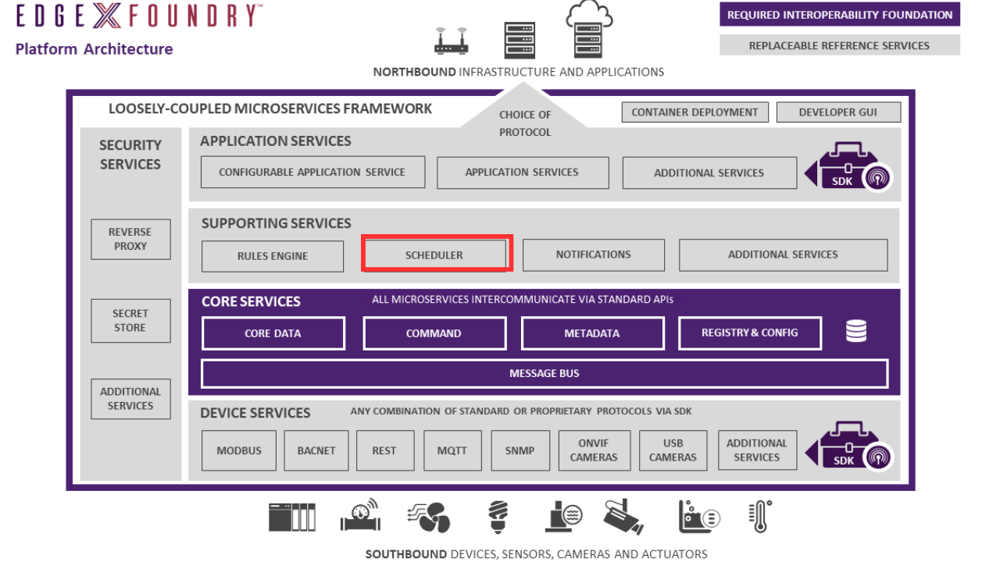

# Support Scheduler - Purpose

The Support Scheduler microservice provides a mechanism that can kick off operations in any EdgeX service.

At a configuration specified time or a crontab expression scheduled time, the service calls on any EdgeX service via REST, EdgeX Message Bus, or Device Control to trigger an operation.

A schedule action record will be created for each operation.

For example, the scheduler service periodically calls on core data APIs to clean up old sensed events that have been successfully exported out of EdgeX.
