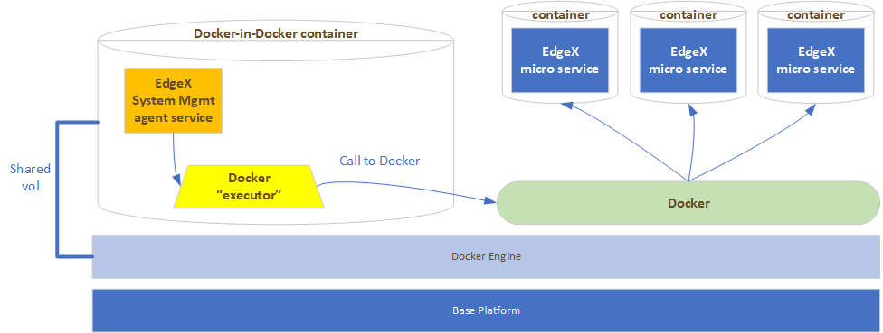

# System Management Executor (SME)

!!! Warning
    The System Management services (inclusive of the Executor) are deprecated with the Ireland (EdgeX 2.0) release.  See the notes on the [System Management Microservice](../Ch_SystemManagement.md) page.  Use this functionality with caution.

## Introduction
The executable applications that the system management agent (SMA) micro service calls on for some management requests are referred to as the “executors”.  In particular, executors take care of service operations (start, stop, and restart functionality) as well as providing service metrics (CPU and memory usage).  How the executor performs its duties is left for the implementer and is generally dictated by the available operating system, platform environment (existence and use of Docker for example) and associated programming language resources.  EdgeX provides the executor interface and a reference implementation executor for use in Docker container runtime environments.

The executor design allows use of other orchestrating software (example: Kubernetes or Swarm), scripts, OS specific technology (snaps or sysd), etc. to be used without having to build anything into the SMA – allowing for a more scalable solution in EdgeX but still allowing use of all sorts of implementation technology outside of EdgeX.  The SMA will be informed of what executor to use for metrics and start/stop/restart functionality through a configuration option – ExecutorPath.  The ExecutorPath will specify the location (which may be platform dependent) and executable to be called.

## Reference Implementation Executor

### Docker Executor

When using the reference implementation Docker executor for metrics collection and start, stop and restart functions, the executor will make command line calls to the Docker Engine.  However, this is not as straightforward as one would think.  Complexity comes from the fact that the SMA (and associated executor) is itself containerized in this type of environment and so a call from within a normal container to Docker would fail as Docker is not installed inside of that container.

Even if Docker were part of the SMA’s container, a call to Docker to start (or stop or restart) the other services would be internal to the SMA’s container.  This would not be helpful since it would try to start the EdgeX services inside of the SMA’s container and not on the Docker Engine where all the EdgeX containers exist.

The solution to solve this issue is that the SMA must run inside of a special container – a Docker-in-Docker container - and that container must share a volume with the Docker Engine.  This acts in a way as to expose the Docker calls out to the Docker Engine running on the base platform.  Thereby allowing the SMA (and its executor) to effect calls to the original EdgeX services running on the same Docker Engine as the SMA.

!!! Info
    Metrics collection is accomplished by making calls to `docker stats`.
 
### Docker Executor Internals

Again, the makeup of the executors is at the implementer’s discretion.  In the Docker executor reference implementation, code for calling Docker to execute start, stop and restart commands is exemplifeid in [command.go](https://github.com/edgexfoundry/edgex-go/blob/master/internal/system/executor/commands.go) while metrics collection (using `docker stats`) is exemplified in [metrics.go](https://github.com/edgexfoundry/edgex-go/blob/master/internal/system/executor/metrics.go).  Other executors for other environments can use these function templates to perform service operations and metrics collection by a variety of means.

The reference implementation Docker executor is deployed inside of the SMA container.  Therefore, there are no exposed APIs.  The SMA makes a direct call to the executor executable inside the container. 
