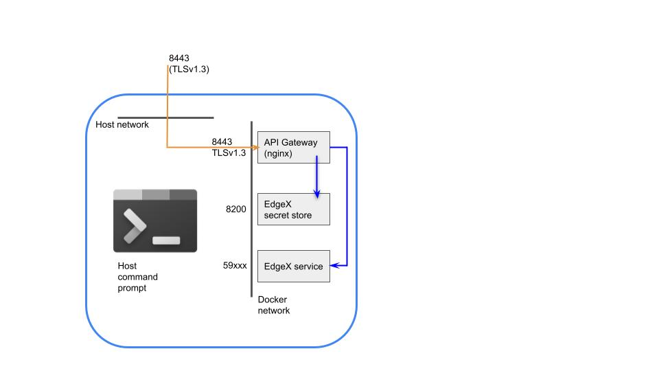

# Authenticating to EdgeX Microservices

!!! edgey "EdgeX 3.0"
    Microservice-level authentication is new for EdgeX 3.0.

## Introduction

Starting in EdgeX 3.0, when EdgeX is run in secure mode,
EdgeX microservices require an authentication token before
they will respond to requests issued over the REST API.
(These changes are detailed in the
[EdgeX microservice authentication ADR](../design/adr/security/0028-authentication.md)
and were introduced to mitigate against certain threats
that originate from behind the API gateway or have somehow bypassed the API gateway.)

Prior to EdgeX 3.0, requests that originated remotely
were authenticated at the API gateway via an HTTP `Authorization`
header that contained a JWT bearer token.
Internally-originated requests required no authentication.
In EdgeX 3.0, the `Authorization` header is **additionally** checked
at the microservice level on a per-route basis,
where the majority of URL paths require authentication.

## How to Make Authenticated EdgeX Calls

In order to make an authenticated EdgeX service call to a REST API,
an appropriate authentication token must be present
on the HTTP `Authorization` header.
To be recognized as valid,
these tokens must be issued by EdgeX's secret store.

Built-in EdgeX services already have a token that allows them access
to the EdgeX secret store.
The [Configuring Add-on Services](./Ch-Configuring-Add-On-Services.md)
chapter contains details on what is required to
enroll a new microservice into EdgeX,
for the purpose of obtaining a secret store token.
The secret store token is used to obtain a JWT
that is used for authenticating EdgeX REST API calls.
The service's secret store token is not used directly,
as this would enable the receiver to access the senders
private slice of the secret store.
Instead, the identity of the caller is attested using a JWT authenticator.

Non-services such as interactive users and script clients
are also required to obtain a secret store token
and exchange it for a JWT authenticator for REST API calls.

There are several possible authentication scenarios:

- Authentication for non-service clients (includes EdgeX UI)

- Local service-to-service clients using EdgeX service clients

- Local service-to-service clients using the SecretProvider interface


The service-to-service scenario using the API gateway is not currently supported.
The built-in service clients are not reverse-proxy-aware,
and the lack of service prefixes in generated URLs
will result in the API gateway blocking requests.


### Authentication for Non-service Clients

Non-service clients include interactive users using the EdgeX UI,
clients using hand-crafted REST API requests,
or other API usages where the caller of an EdgeX microservice
is not also an EdgeX microservice.

Authentication consists of three steps:

1. Creating a user identity
2. Logging into the EdgeX secret store as that identity and obtaining a temporary token
3. Exchanging the temporary token for an authentication JWT.
4. Passing the JWT in a REST API call


#### TL;DR.  Just Give Me a Token

When running EdgeX in Docker using the `edgex-compose` repository,
steps 1, 2, and 3 above have been automated by the following command:

```shell
make get-token
```

This method should only be used for development and testing:
the username is fixed by the script,
and the password is reset every time the script is run.

The example will be done in the Docker environment.

The long form of `make get-token` is below:

#### 1. Creating a User Identity

Internally, a user identity is a paring of a Vault identity
and an associated `userpass` login method bound to that identity.
Vault supports [many other authentication backends](https://developer.hashicorp.com/vault/docs/auth)
besides `userpass`,
making it possible to federate with enterprise single sign-on, for example,
but `userpass` is the only authentication method enabled by default.

The provided `secrets-config` tool includes two sub-functions,
`adduser` and `deluser`, for creating user identities.

Let use first set a shell variable to hold a username:

```shell
username=exampleuser
```

Optional: Delete existing user

```shell
docker exec -ti edgex-security-proxy-setup ./secrets-config proxy deluser --user "${username}" --useRootToken
```

Create new user identity, capture the password.
In this example, the Vault token has a 60 second time-to-live (TTL),
and any JWTs that we create will have a 119 minute TTL.
This is set at the time of account creation.

```shell
password=$(docker exec -ti edgex-security-proxy-setup ./secrets-config proxy adduser --user "${username}" --tokenTTL 60 --jwtTTL 119m --useRootToken | jq -r '.password')
```

The username and password created above should be saved for future use;
they will be required in the future to obtain fresh JWT's.

#### 2. Obtaining a Temporary Secret Store Token

Authenticate to the EdgeX secret store using the username and password generated above
to obtain a temporary secret store token.
This token must be exchanged for a JWT within the `tokenTTL` liveness period.

```shell
vault_token=$(curl -ks "http://localhost:8200/v1/auth/userpass/login/${username}" -d "{\"password\":\"${password}\"}" | jq -r '.auth.client_token')
```

This temporary token can be discarded after the next step.

In the microservice-to-microservice authentication scenario,
secret store tokens are periodically renewed and used to request further JWTs and access the service's secret store.
Tokens associated with user identities, however, only be used to obtain a JWT.


#### 3. Obtaining a JWT authentication token

The token created in the previous step is passed as an authenticator to Vault's identity secrets engine.
The output is a JWT that expires after `jwtTTL` (see above) has passed.

```shell
id_token=$(curl -ks -H "Authorization: Bearer ${vault_token}" "http://localhost:8200/v1/identity/oidc/token/${username}" | jq -r '.data.token')

echo "${id_token}"
```

Optionally, if the secret store token (vault_token) isn't expired yet,
it can be used to check the validity of an arbitrary JWT.
This example checks the validity of the JWT that was issued above.
Any JWT that passes this check should suffice
for making an authenticated EdgeX microservice call.

```shell
introspect_result=$(curl -ks -H "Authorization: Bearer ${vault_token}" "http://localhost:8200/v1/identity/oidc/introspect" -d "{\"token\":\"${id_token}\"}" | jq -r '.active')
echo "${introspect_result}"
```

#### 4. Using the JWT to Call an EdgeX API or EdgeX UI

##### Calls via EdgeX UI

EdgeX UI users should supply the `id_token` to the prompt issued by the EdgeX UI.
When the token eventually expires, obtain another token using the above process.

##### Calls to Local Services

To call an EdgeX service directly from host context using a command-line interface,
go directly to the service's localhost-mapped port,
and pass the JWT as an HTTP `Authorization` header:

```shell
curl -H"Authorization: Bearer ${id_token}" "http://localhost:59xxx/api/{{api_version}}/version"
```

##### Remote Calls to Services via API Gateway

Calling an EdgeX service from a remote machine using the EdgeX API gateway
looks similar to the above, with a few minor changes:

* Accesses to the API gateway must use TLS
* The service's URL prefix must be part of the request URL


The docker network architecture is illustrated below:




In the example below, `ca.crt` is the CA certificate
that is used to verify the TLS certificate presented by the API gateway,
and `SERVICENAME` is the name of the EdgeX service
that is being proxied by the API gateway, such as `core-data`:

```shell
curl --cacert ca.crt -H"Authorization: Bearer ${id_token}" "https://`hostname --fqdn`:8443/SERVICENAME/api/{{api_version}}/version"
```

This is identical to what was done in EdgeX versions prior to 3.0.
The only thing that has changed is the method use to obtain the JWT.


### Local Service-to-Service - Using EdgeX Service Clients

The preferred method of making an authenticated
call to an EdgeX microservice is to use
the service proxies configured by go-mod-bootstrap.

Clients are retrieved from the dependency injection container
using the helper functions in 
[clients.go](https://github.com/edgexfoundry/go-mod-bootstrap/blob/{{edgexversion}}/bootstrap/container/clients.go)
in go-mod-bootstrap.
For example:

```go
import "github.com/edgexfoundry/go-mod-bootstrap/bootstrap/container"

// ... 

commandClient := container.CommandClientFrom(dic.Get)
```

EdgeX methods invoked via the service proxies
automatically authenticate to peer EdgeX microservices
with no additional work needed on the part of the developer.

If EdgeX is run in non-secure mode,
the built-in service clients that are configured in go-mod-bootstrap
gracefully degrade to non-authenticating clients.


### Local Service-to-Service - Using the SecretProvider interface

In the example where two user-provided services directly invoke one-another,
there will be no service client available.
In this case, it is necessary to use go-mod-bootstrap's `SecretProvider`
interface to obtain a JWT.

See the following pseudo-code to add an `Authorization` header
to an outgoing HTTP request, req.

```go

import (
	bootstrapContainer "github.com/edgexfoundry/go-mod-bootstrap/v3/bootstrap/container"
  clientInterfaces "github.com/edgexfoundry/go-mod-core-contracts/v3/clients/interfaces"
  "github.com/edgexfoundry/go-mod-bootstrap/v3/bootstrap/secret"
)


  // Get the SecretProvider from bootstrap's DI container.
  // Internally, this is a wrapper for go-mod-secret's GetSelfJWT()
  secretProvider := bootstrapContainer.SecretProviderFrom(dic.Get)

  // get an instance of the AuthenticationInjector helper
  var jwtSecretProvider clientInterfaces.AuthenticationInjector
  jwtSecretProvider = secret.NewJWTSecretProvider(m.secretProvider)

  // Call the AddAuthenticationData helper method
  // internally, this calls GetSelfJWT() on the SecretProvider
  // to obtain a JWT and adds an Authorization header to the HTTP request
  err := jwtSecretProvider.AddAuthenticationData(req);
```

## Implementation Notes

Internally, the receiving microservice will call the secret store's
[token introspection endpoint](https://developer.hashicorp.com/vault/api-docs/secret/identity/tokens#introspect-a-signed-id-token)
to validate incoming JWT's.
Note that as in all things dealing with the EdgeX secret store,
calling the introspection endpoint is also an authenticated call,
and a service must have explicit authorization to invoke this API.

Similarly, explicit authorization is required for a calling microservice
to obtain a JWT to pass as an authentication token.
In the EdgeX implementation, microservices use the
[userpass login](https://developer.hashicorp.com/vault/api-docs/auth/userpass#login)
authentication method to obtain an initial secret store token.
This token is explicitly granted the ability to
[generate a JWT](https://developer.hashicorp.com/vault/api-docs/secret/identity/tokens#generate-a-signed-id-token).

In the external user scenario of the API gateway,
clients must manually log in to the secret store,
and exchange the resulting token for JWT.
In the internal usage scenario,
EdgeX microservices are typically pre-seeded with a valid JWT,
and obtain a fresh JWT for each outbound microservice call.

There are obvious opportunities for caching to reduce round trips to the EdgeX secret store,
but none have been implemented at this time.
