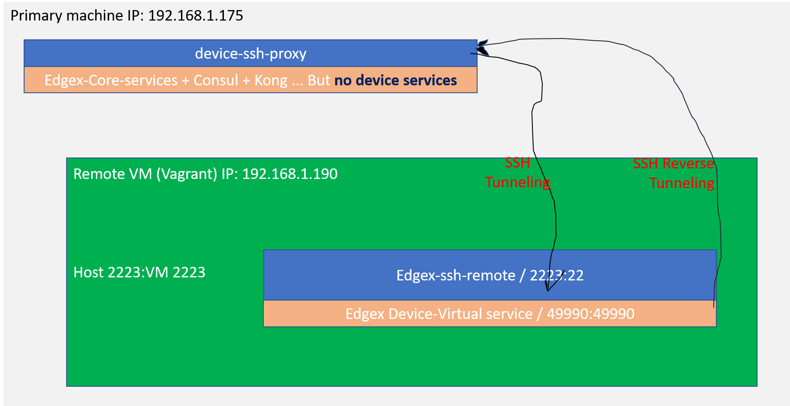

# Security for EdgeX Stack

This page describes one of many options to secure the EdgeX software stack with running remote device services like device-virtual, device-rest, device-mqtt, and so on, via secure two-way SSH-tunnelings.

## Basic SSH-Tunneling

In this option to secure the EdgeX software stack, SSH tunneling is utilized. The basic idea is to create a secure SSH connection between a local machine and a remote machine in which some micro-services or applications can be relayed.   In this particular example, the local machine as the primary host is running the whole EdgeX core services including core services and security services but **without** any device service.  The device services are running in the remote machine.  

The communication is secure because SSH port forwarding connection is encrypted by default.

The SSH communication is established by introducing some extra SSH-related services:

1) `device-ssh-proxy`: this is the service with ssh client opening up the SSH communication between the local machine and the remote one

2) `device-ssh-remote`: this is actually the SSH server or daemon service together with device services running on the remote machine

The high-level diagram is shown as follows:



"Top level diagram for SSH tunneling for device services"

In the local machine, the SSH tunneling handshake is initiated by `device-ssh-proxy` service to the remote running device services.  The dependencies that remote device services needed are reversely tunneling back from the local machine.

## Reference implementation example

The whole reference implementation example can be found in this repository:
[Reference example in holding repo for device service SSH tunneling](https://github.com/edgexfoundry-holding/external-device-security-examples/ssh-tunneling/README.md)

### Setup remote running Virtual Machine

In the example setup, `vagrant` is used on the top of `Virtual Box` to set up as the secondary/remote VM. The network port for ssh standard port 22 is mapped into 2222 for `vagrant ssh` itself and the forwarded port is also mapped on the VM network for port 2223 to the host machine port 2223.  This port 2223 is used for the ssh daemon Docker container that will be introduced later on below.

Once you have downloaded the vagrant from Hashicorp website, typical vagrant setup for the first time can be done via command `./vagrant init` and it will generate the Vagrant configuration file.

Here is the Vagrant file used to create the remote machine:

[remote VM Vagrant file with docker and docker-compose installed](https://github.com/edgexfoundry-holding/external-device-security-examples/ssh-tunneling/Vagrantfile)

### SSH Tunneling: Setup the SSH server on the remote machine

For an example of how to run a SSH server in Docker, checkout <https://docs.docker.com/engine/examples/running_ssh_service/> for detailed instructions.

Note that this one is the ssh server and it is set up using password authentication by default.  In order to authenticate to this ssh server without password prompt, we injected the generated public SSH key from the local machine via simple login into the ssh server machine first and then created the `authorized_keys` under `~/.ssh` directory.  In general, the following command example shows how this is accomplished:

```sh
root@sshd-remote: mkdir -p ~/.ssh
root@sshd-remote: chmod 700 ~/.ssh
root@sshd-remote:  echo "ssh-rsa AAAAB3NzaC1yc2EAAAADAQABAAABAQDKvsFf5HocBOBWXdVJKfQzkhf0K8lSLjZn9PX84VdhHyP8n1mzfpZywA4vsz8+A3OsGHAr2xpkyzOS0YkwD7nrI3q1x0A0+ANhQNOaKbnfQRe... root" >> ~/.ssh/authorized_keys
```

The ssh key pairs can be generated using `ssh-keygen` command from the local machine and the contents of ssh public key usually is stored as ~/.ssh/id_rsa.pub file like this:

```sh
ssh-keygen -q -t rsa -C root -N '' -f ~/.ssh/id_rsa 2>/dev/null
```

An example of a build script to inject the SSH public key into the sshd server can be found as the following [here](https://github.com/edgexfoundry-holding/external-device-security-examples/ssh-tunneling/build.sh).

### SSH Tunneling: Local Port Forwarding

This step is to show how to connect from the local machine to the remote machine. The -L flag of ssh command is important here.

```sh
ssh -vv -o StrictHostKeyChecking=no \
  -o UserKnownHostsFile=/dev/null \
  -N $TUNNEL_HOST \
  -L *:$SERVICE_PORT:$SERVICE_HOST:$SERVICE_PORT \
  -p $TUNNEL_SSH_PROT
```

where environment variables are:

- `TUNNEL_HOST` is the remote host name or IP address that SSH daemon or server is running on;

- `TUNNEL_SSH_PROT` is the port number to be used on the SSH tunnel communication between the local machine and the remote machine

- `SERVICE_PORT` is the port number from the local or the primary to be forwared to the remote machine; without lose of generality, the port number on the remote machine is the same as the local one

- `SERVICE_HOST` is the service host name or IP address of the Docker containers that are running on the remote machine;

### SSH Reverse Tunneling: Remote Port Forwarding

This step is to show the reverse direction of SSH tunneling: from the remote back to the local machine.

The reverse SSH tunneling is also needed because the device services depends on the core services like `coreData`, `metaData`, and `coreConsul`.  These core services are running on the local machine and should be **reverse** tunneling back to the device services on the remote side through the SSH remote port forwarding connection.  This can be achieved by using `-R` flag of ssh command.

```sh
ssh -vv -o StrictHostKeyChecking=no \
  -o UserKnownHostsFile=/dev/null \
  -N $TUNNEL_HOST \
  -R 0.0.0.0:48080:edgex-core-data:48080 \
  -R 0.0.0.0:5563:edgex-core-data:5563 \
  -R 0.0.0.0:48081:edgex-core-metadata:48081 \
  -R 0.0.0.0:8500:edgex-core-consul:8500 \
  -p $TUNNEL_SSH_PROT
```

where environment variables are:

- `TUNNEL_HOST` is the remote host name or IP address that SSH daemon or server is running on;

In the reverse tunneling, the service host names of dependent services are used like `edgex-core-data`, for example.

### Put it all together

- Launch the remote machine or VM if it is not yet:

```sh
~/vm/vagrant up
```

and ssh into the remote machine via `~/vm/vagrant ssh`

- In the local machine, generate ssh key pairs using `ssh-keygen`:

```sh
ssh-keygen -q -t rsa -C root -N '' -f ~/.ssh/id_rsa 2>/dev/null
```

This produces two files under directory ~/.ssh: one for private key (id_rsa) and one for public key (id_rsa.pub)

- Make docker build with ssh-device-proxy Dockerfile and `entrypoint.sh`:

[local device service proxy Dockerfile](https://github.com/edgexfoundry-holding/external-device-security-examples/ssh-tunneling/Dockerfile-primary-ds-proxy)

[Docker entrypoint shell script for local device service proxy](https://github.com/edgexfoundry-holding/external-device-security-examples/ssh-tunneling/ds-proxy-entrypoint.sh)

and build it with the following command:

```sh
docker build -f Dockerfile-primary-ds-proxy --build-arg SSH_PORT=2223 -t device-ssh-proxy:test .
```

- Make docker build the remote sshd server / daemon image with Dockerfile:

[remote sshd Dockerfile](https://github.com/edgexfoundry-holding/external-device-security-examples/ssh-tunneling/Dockerfile-remote-sshd)

to build:

```sh
docker build -t eg_sshd .
```

- Run the remote EdgeX device services with the following docker-compose file:

[docker-compose file for remote device services with SSH server/daemon](https://github.com/edgexfoundry-holding/external-device-security-examples/ssh-tunneling/edgex-device-sshd-remote.yml)

Note that the following ssh server service is added in the docker-compose file:

```yaml
################################################################
# SSH Daemon
################################################################
  sshd-remote:
    image: eg_sshd
    ports:
      - "2223:22"
    container_name: edgex-sshd-remote
    hostname: edgex-sshd-remote
    networks:
      edgex-network:
        aliases:
        - edgex-core-consul
        - edgex-core-data
        - edgex-core-metadata
```

- In the local machine, include `device-ssh-proxy:test` ssh proxy docker image together with EdgeX core services in the docker-compose file like this:

```yaml
##########################################################
# ssh tunneling proxy service for device-virtual
##########################################################
  device-ssh-proxy:
    image: device-ssh-proxy:test
    container_name: edgex-device-ssh-proxy
    hostname: edgex-device-ssh-proxy
    volumes:
      - $HOME/.ssh:/root/ssh:ro
    ports:
      - "49990:49990"
    networks:
      edgex-network:
        aliases:
            - edgex-device-virtual
    environment:
      TUNNEL_HOST: 192.168.1.190
      TUNNEL_SSH_PORT: 2223
      SERVICE_HOST: edgex-device-virtual
      SERVICE_PORT: 49990
```

The full docker-compose file is included here:

[docker-compose file for the local core services and ssh tunneling proxy service without any device services](https://github.com/edgexfoundry-holding/external-device-security-examples/ssh-tunneling/edgex-core-ssh-proxy.yml)

Note that:

1. The values of environment variables depend on your environment settings of the local machine and the remote machine. In this particular case, we are ssh tunneling to the remote device-virtual service.

2. The docker-compose file in the local machine does not include any device services at all.  This is to ensure that we are actually using the device services in the remote machine.

#### Test with the device-virtual APIs

- mainly run curl or postman directly from the local machine to the device-virtual APIs to verify the remote device virtual service can be accessible from the local host machine via two-way SSH tunneling. This can be checked from the console of the local machine:

the ping response of calling edgex-device-virtual's ping action:

```sh
jim@jim-NUC7i5DNHE:~/go/src/github.com/edgexfoundry/developer-scripts/releases/geneva/compose-files$ curl http://localhost:49990/api/v1/ping

1.2.0-dev.13j

```

or see the configuration of it via `curl` command:

```sh
jim@jim-NUC7i5DNHE:~/go/src/github.com/edgexfoundry/developer-scripts/releases/geneva/compose-files$ curl http://localhost:49990/api/v1/config
```

```json
{"Writable":{"LogLevel":"INFO"},"Clients":{"Data":{"Host":"localhost","Port":48080,"Protocol":"http"},"Logging":{"Host":"localhost","Port":48061,"Protocol":"http"},"Metadata":{"Host":"edgex-core-metadata","Port":48081,"Protocol":"http"}},"Logging":{"EnableRemote":false,"File":""},"Registry":{"Host":"edgex-core-consul","Port":8500,"Type":"consul"},"Service":{"BootTimeout":30000,"CheckInterval":"10s","ClientMonitor":15000,"Host":"edgex-device-virtual","Port":49990,"Protocol":"http","StartupMsg":"device virtual started","MaxResultCount":0,"Timeout":5000,"ConnectRetries":10,"Labels":[],"EnableAsyncReadings":true,"AsyncBufferSize":16},"Device":{"DataTransform":true,"InitCmd":"","InitCmdArgs":"","MaxCmdOps":128,"MaxCmdValueLen":256,"RemoveCmd":"","RemoveCmdArgs":"","ProfilesDir":"./res","UpdateLastConnected":false,"Discovery":{"Enabled":false,"Interval":""}},"DeviceList":[{"Name":"Random-Boolean-Device","Profile":"Random-Boolean-Device","Description":"Example of Device Virtual","Labels":["device-virtual-example"],"Protocols":{"other":{"Address":"device-virtual-bool-01","Port":"300"}},"AutoEvents":[{"frequency":"10s","resource":"Bool"}]},{"Name":"Random-Integer-Device","Profile":"Random-Integer-Device","Description":"Example of Device Virtual","Labels":["device-virtual-example"],"Protocols":{"other":{"Address":"device-virtual-int-01","Protocol":"300"}},"AutoEvents":[{"frequency":"15s","resource":"Int8"},{"frequency":"15s","resource":"Int16"},{"frequency":"15s","resource":"Int32"},{"frequency":"15s","resource":"Int64"}]},{"Name":"Random-UnsignedInteger-Device","Profile":"Random-UnsignedInteger-Device","Description":"Example of Device Virtual","Labels":["device-virtual-example"],"Protocols":{"other":{"Address":"device-virtual-uint-01","Protocol":"300"}},"AutoEvents":[{"frequency":"20s","resource":"Uint8"},{"frequency":"20s","resource":"Uint16"},{"frequency":"20s","resource":"Uint32"},{"frequency":"20s","resource":"Uint64"}]},{"Name":"Random-Float-Device","Profile":"Random-Float-Device","Description":"Example of Device Virtual","Labels":["device-virtual-example"],"Protocols":{"other":{"Address":"device-virtual-float-01","Protocol":"300"}},"AutoEvents":[{"frequency":"30s","resource":"Float32"},{"frequency":"30s","resource":"Float64"}]},{"Name":"Random-Binary-Device","Profile":"Random-Binary-Device","Description":"Example of Device Virtual","Labels":["device-virtual-example"],"Protocols":{"other":{"Address":"device-virtual-bool-01","Port":"300"}},"AutoEvents":null}],"Driver":{}}
```

- one can also monitor the docker log messages of core-data on the local machine too see if it publishes the events to the bus:

```sh

$ docker logs -f edgex-core-data

level=INFO ts=2020-06-10T00:49:26.579819548Z app=edgex-core-data source=event.go:284 msg="Putting event on message queue"
level=INFO ts=2020-06-10T00:49:26.579909649Z app=edgex-core-data source=event.go:302 msg="Event Published on message queue. Topic: events, Correlation-id: 4dc57d03-178e-49f5-a799-67813db9d85b "
level=INFO ts=2020-06-10T00:49:27.107028244Z app=edgex-core-data source=event.go:284 msg="Putting event on message queue"
level=INFO ts=2020-06-10T00:49:27.107128916Z app=edgex-core-data source=event.go:302 msg="Event Published on message queue. Topic: events, Correlation-id: 2a0fd8fa-bb16-4d1a-ba1b-c5e70e1a1cec "
level=INFO ts=2020-06-10T00:49:27.376915392Z app=edgex-core-data source=event.go:284 msg="Putting event on message queue"
level=INFO ts=2020-06-10T00:49:27.377084206Z app=edgex-core-data source=event.go:302 msg="Event Published on message queue. Topic: events, Correlation-id: 76d288e2-a2e8-4ed4-9265-986661b71bbe "
level=INFO ts=2020-06-10T00:49:27.718042678Z app=edgex-core-data source=event.go:284 msg="Putting event on message queue"
level=INFO ts=2020-06-10T00:49:27.718125128Z app=edgex-core-data source=event.go:302 msg="Event Published on message queue. Topic: events, Correlation-id: f5412a38-0346-4bd3-b9da-69498e4edb9a "
level=INFO ts=2020-06-10T00:49:30.49407257Z app=edgex-core-data source=event.go:284 msg="Putting event on message queue"
level=INFO ts=2020-06-10T00:49:30.494162219Z app=edgex-core-data source=event.go:302 msg="Event Published on message queue. Topic: events, Correlation-id: da54fcc9-4771-4e0f-9eff-e0d2067eac7e "
level=INFO ts=2020-06-10T00:49:31.204976003Z app=edgex-core-data source=event.go:284 msg="Putting event on message queue"
level=INFO ts=2020-06-10T00:49:31.205211102Z app=edgex-core-data source=event.go:302 msg="Event Published on message queue. Topic: events, Correlation-id: 08574f61-6ea3-49cf-a776-028876de7957 "
level=INFO ts=2020-06-10T00:49:31.778242016Z app=edgex-core-data source=event.go:284 msg="Putting event on message queue"
level=INFO ts=2020-06-10T00:49:31.778342992Z app=edgex-core-data source=event.go:302 msg="Event Published on message queue. Topic: events, Correlation-id: f1630f13-6fa7-45a6-b6f6-6bbde159b414 "
level=INFO ts=2020-06-10T00:49:34.747901983Z app=edgex-core-data source=event.go:284 msg="Putting event on message queue"
level=INFO ts=2020-06-10T00:49:34.748045382Z app=edgex-core-data source=event.go:302 msg="Event Published on message queue. Topic: events, Correlation-id: cf14c573-60b9-43cd-b95b-2c6ffe26ba20 "
level=INFO ts=2020-06-10T00:49:34.944758331Z app=edgex-core-data source=event.go:284 msg="Putting event on message queue"
level=INFO ts=2020-06-10T00:49:34.9449585Z app=edgex-core-data source=event.go:302 msg="Event Published on message queue. Topic: events, Correlation-id: 292b9ca7-a640-4ac8-8650-866b7c4a6d15 "
level=INFO ts=2020-06-10T00:49:37.421202715Z app=edgex-core-data source=event.go:284 msg="Putting event on message queue"
level=INFO ts=2020-06-10T00:49:37.421367863Z app=edgex-core-data source=event.go:302 msg="Event Published on message queue. Topic: events, Correlation-id: bb7a34b1-c65f-4820-91a3-162903ac1e7a "
level=INFO ts=2020-06-10T00:49:42.290660694Z app=edgex-core-data source=event.go:284 msg="Putting event on message queue"
level=INFO ts=2020-06-10T00:49:42.290756356Z app=edgex-core-data source=event.go:302 msg="Event Published on message queue. Topic: events, Correlation-id: 8fff92c0-ef69-4758-bf8a-3492fb48cef2 "
level=INFO ts=2020-06-10T00:49:42.559019764Z app=edgex-core-data source=event.go:284 msg="Putting event on message queue"
level=INFO ts=2020-06-10T00:49:42.559105855Z app=edgex-core-data source=event.go:302 msg="Event Published on message queue. Topic: events, Correlation-id: 12947a42-4669-4bff-8720-d0e9fbeef343 "
level=INFO ts=2020-06-10T00:49:44.922764379Z app=edgex-core-data source=event.go:284 msg="Putting event on message queue"
level=INFO ts=2020-06-10T00:49:44.922848184Z app=edgex-core-data source=event.go:302 msg="Event Published on message queue. Topic: events, Correlation-id: 3c07ce76-203a-4bf5-ab89-b99a1fbbb266 "


```

and also do the docker log messages of device-virtual container on the remote:

```sh
vagrant@ubuntu-bionic:~/geneva$ docker logs -f edgex-device-virtual

level=INFO ts=2020-06-10T00:51:52.602154238Z app=device-virtual source=utils.go:94 Content-Type=application/json correlation-id=3d86a699-c089-412d-94f3-af6cd9093f28 msg="SendEvent: Pushed event to core data"
level=INFO ts=2020-06-10T00:51:53.358352349Z app=device-virtual source=utils.go:94 Content-Type=application/json correlation-id=9612b186-98cb-4dc5-887a-195ce7300978 msg="SendEvent: Pushed event to core data"
level=INFO ts=2020-06-10T00:51:57.649085447Z app=device-virtual source=utils.go:94 Content-Type=application/json correlation-id=da682ffb-9120-4286-9f33-aa0a9f2c0489 msg="SendEvent: Pushed event to core data"
level=INFO ts=2020-06-10T00:51:57.86899148Z app=device-virtual source=utils.go:94 Content-Type=application/json correlation-id=afc1fccf-de8a-46ce-9849-82c5e4e5837e msg="SendEvent: Pushed event to core data"
level=INFO ts=2020-06-10T00:51:59.543754189Z app=device-virtual source=utils.go:94 Content-Type=application/json correlation-id=80ac32a0-3a9a-4b07-bf3f-b26ec159dc40 msg="SendEvent: Pushed event to core data"
level=INFO ts=2020-06-10T00:51:59.688746606Z app=device-virtual source=utils.go:94 Content-Type=application/json correlation-id=21501030-c07c-4ac4-a2d2-1243782cb4b8 msg="SendEvent: Pushed event to core data"
level=INFO ts=2020-06-10T00:51:59.853069376Z app=device-virtual source=utils.go:94 Content-Type=application/json correlation-id=3b2927db-e689-4fad-8d53-af6fe20239f8 msg="SendEvent: Pushed event to core data"
level=INFO ts=2020-06-10T00:52:00.055657757Z app=device-virtual source=utils.go:94 Content-Type=application/json correlation-id=a7698f2d-a115-4b46-af5f-3b8bf77e6ea4 msg="SendEvent: Pushed event to core data"
level=INFO ts=2020-06-10T00:52:04.460557145Z app=device-virtual source=utils.go:94 Content-Type=application/json correlation-id=602efd03-8e9d-441b-9a7d-45dbcb6b416f msg="SendEvent: Pushed event to core data"
level=INFO ts=2020-06-10T00:52:07.696983268Z app=device-virtual source=utils.go:94 Content-Type=application/json correlation-id=88190186-6f93-4c6a-a1f6-d6a20a6e79e4 msg="SendEvent: Pushed event to core data"
level=INFO ts=2020-06-10T00:52:08.040474761Z app=device-virtual source=utils.go:94 Content-Type=application/json correlation-id=73c60159-f50c-480b-90da-ebe310fa2f6e msg="SendEvent: Pushed event to core data"
level=INFO ts=2020-06-10T00:52:08.2091048Z app=device-virtual source=utils.go:94 Content-Type=application/json correlation-id=2d799509-dc1d-4075-b193-1e5da24cfa77 msg="SendEvent: Pushed event to core data"
level=INFO ts=2020-06-10T00:52:12.751717832Z app=device-virtual source=utils.go:94 Content-Type=application/json correlation-id=7611a188-23f4-44d0-bd12-f6574535be8d msg="SendEvent: Pushed event to core data"
level=INFO ts=2020-06-10T00:52:13.553351482Z app=device-virtual source=utils.go:94 Content-Type=application/json correlation-id=a32067c8-adae-4778-b72d-0d8d7d11220f msg="SendEvent: Pushed event to core data"
level=INFO ts=2020-06-10T00:52:15.20395683Z app=device-virtual source=utils.go:94 Content-Type=application/json correlation-id=41df0427-5998-4d1e-9c26-1f727912638b msg="SendEvent: Pushed event to core data"
level=INFO ts=2020-06-10T00:52:15.686970839Z app=device-virtual source=utils.go:94 Content-Type=application/json correlation-id=c6a8bb2d-22ab-4932-bdd0-138f12f843b6 msg="SendEvent: Pushed event to core data"
level=INFO ts=2020-06-10T00:52:18.177810023Z app=device-virtual source=utils.go:94 Content-Type=application/json correlation-id=a49d663b-1676-4ecf-ba52-76e9ad7c501d msg="SendEvent: Pushed event to core data"
level=INFO ts=2020-06-10T00:52:19.600220653Z app=device-virtual source=utils.go:94 Content-Type=application/json correlation-id=b6d2c2d1-5d5c-4f7a-9dd2-2067e732f018 msg="SendEvent: Pushed event to core data"
level=INFO ts=2020-06-10T00:52:19.990751025Z app=device-virtual source=utils.go:94 Content-Type=application/json correlation-id=1db5dde3-bb6b-4600-abbb-d01b3042c329 msg="SendEvent: Pushed event to core data"

```

- test to get random integer value of the remote device-virtual random integer device from the local machine using `curl` command like this:

```sh
jim@jim-NUC7i5DNHE:~/go/src/github.com/edgexfoundry/device-virtual-go$ curl -k http://localhost:49990/api/v1/device/name/Random-Integer-Device/Int8
{"device":"Random-Integer-Device","origin":1592432603445490720,"readings":[{"origin":1592432603404127336,"device":"Random-Integer-Device","name":"Int8","value":"11","valueType":"Int8"}],"EncodedEvent":null}
```
