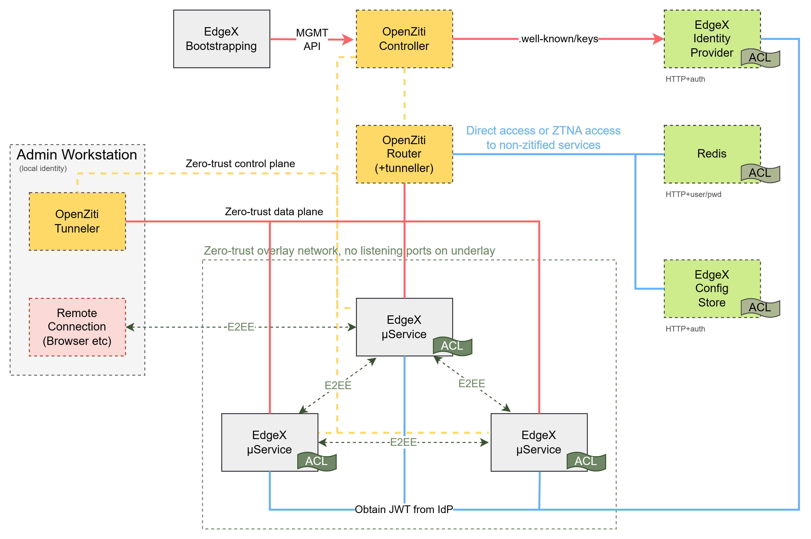
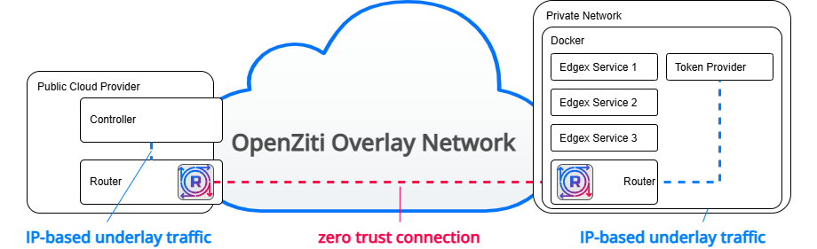

# Zero Trust

## Introduction

Zero Trust is a set of security strategies centered around the fundamental principle that no network is safe. There are
numerous vendors, all using the "zero trust" adjective to describe their security solutions. At the core of zero trust
are a few fundamental principles:

* Explicit Authorization: connections should be authenticated before traffic can be sent
* Cryptographically Verifiable Identities: connections should be authenticated using strong identities
* Least Privilege Access: identities should have access only the minimum set of services they require
* Continual Authentication: authorized connections should be able to be revoked immediately and monitored continuously

With version 3.2+, EdgeX Foundry can now secure its core services with a zero trust configuration. EdgeX Foundry has
integrated with [OpenZiti](https://openziti.io) to provide secure, zero trust connectivity among the EdgeX provided
services based on go. This includes the core services, support services, application services and numerous device
services.

OpenZiti also offers a novel approach of embedding these zero trust concepts directly into services through SDKs. By
adopting OpenZiti, EdgeX Foundry core services **no longer have ports exposed to the IP-based underlay network at all**. 
After enabling zero trust support, the EdgeX Foundry services will not be discoverable nor attackable by standard 
IP-based tooling whatsoever. Any attacks will first need to be authenticated into the OpenZiti overlay network and then
also authorized to make connections to the relevant EdgeX Foundry service.

## About OpenZiti

OpenZiti is an open source project focused on bringing zero trust networking principles directly into any application.
It accomplishes this by providing [numerous SDKs](https://openziti.io/docs/reference/developer/sdk/) that can be
integrated into any application. EdgeX Foundry has integrated the [golang sdk](https://github.com/openziti/sdk-golang/)
from the OpenZiti project, enabling secure connectivity through an OpenZiti overlay mesh network. OpenZiti also provides
clients for all major desktop and mobile operating systems that allow applications which are not OpenZiti-enabled to
access the overlay network called tunnelers. If an OpenZiti SDK cannot be integrated into an application that needs to 
connect to services secured via OpenZiti, such as the core EdgeX Foundry services, these clients can be used to provide
access. These applications are known as tunnelers.

An OpenZiti overlay network consists of a controller and edge routers. The controller, as it sounds, is responsible for
decisions surrounding the overlay network such as authentication, authorization, management of the overlay, etc. Edge
Routers are responsible for creating the overlay mesh network. One or more can link together to form a fully redundant
mesh and routers may be assigned specific roles as needed. The full scope of what OpenZiti is and how to use it is
impossible to document succinctly here. To learn how OpenZiti works or for additional information, please visit the 
official docs site at https://openziti.io/docs and for help, ask in the official support forum: 
https://openziti.discourse.group/.

## Integrating EdgeX Foundry With OpenZiti

EdgeX has adopted and integrated OpenZiti into it's microservice architecture and can now be enabled through 
standard EdgeX configuration mechanisms. In order to build a zero trust overlay network usable by EdgeX, an OpenZiti 
overlay network will need to be available and configured. The EdgeX project provides a docker compose file that deploys
a full EdgeX Foundry install and can be optionally enabled with an OpenZiti, zero trust overlay network. If you are 
already familiar with deploying EdgeX Foundry through the existing docker compose mechanism you will be able to 
enable this additional security mechanism in the same way.

#### Overview of EdgeX Foundry integrated with OpenZiti


## Securing EdgeX Services With OpenZiti

When running in secure mode, EdgeX Foundry creates and uses strong identities in the form of JWTs for services. 
When enabling zero trust access, those strong identities are used to authenticate to the OpenZiti overlay network by 
leveraging a feature of OpenZiti called "external JWT signers". OpenZiti can be configured to trust other 
authorities, such as the token provider EdgeX Foundry uses (Vault as of July 12, soon to be OpenBao). Once the 
appropriate trust is configured, OpenZiti can use the strong identities created by another authority for 
authentication to the overlay network. This is how "external JWT signers" operate. In order for OpenZiti to be able 
to verify authentication tokens from the external provider, the JWT provider must be addressable by the OpenZiti 
controller as it will use the JWKS endpoint provided by token provider in order to verify the token.

The OpenZiti external JWT signer must be configured with an expected claim which will be contained within the JWT. 
As part of the authentication process with OpenZiti, after the JWT is verified as authentic, the configured claim 
will be inspected and a corresponding OpenZiti must exist with an "external id" set that matches the value of this 
claim.

### Example JWT Verification With OpenZiti

Let's look at an example verification process to understand better how the JWT from the token provider is used to 
authenticate to the OpenZiti overlay.

1. After the EdgeX Foundry security bootstrapper completes, a token from the token provider for the target service 
   will be available to the service.
2. The token is read into memory.
3. The token is exchanged with the token provider for a JWT. Here is a representative payload section of a JWT 
   delivered to the core-command service:

       {
         "aud": "edgex",
         "exp": 1720809046,
         "iat": 1720808146,
         "iss": "/v1/identity/oidc",
         "name": "core-command",
         "namespace": "root",
         "sub": "790fd597-f773-21a6-158f-ee1158875115"
       }

   Notice the fields contained within the JWT payload, both the issuer (`iss`) field `name` field are important and 
   are used in the OpenZiti `ext-jwt-signer` configuration. The `iss` field must match a configured `ext-jwt-signer`.
4. The JWT is sent to OpenZiti for verification.
5. OpenZiti makes a request to the token provider's JWKS endpoint (as needed) to obtain the necessary key material 
   to verify the authenticity of the JWT.
6. Once the JWT is verified as authentic, the configured field (in this case `name`) read from the JWT.
7. OpenZiti scans all identities for one with an `--externalId` set to the value from the JWT (in this case 
   `core-command`)
8. If an identity is found with an associated auth policy utilizing the expected value (`core-command`), the 
   identity is considered authenticated.

### Authorizing Access to EdgeX Foundry Services

OpenZiti is also now able to authorize connections to EdgeX Foundry services and when configured to operate in with 
the zero trust security model, this is how service authorization works. With zero trust enabled, traffic for any 
particular service must be delivered, authenticated, and authorized by the OpenZiti overlay network. It is no longer 
necessary to also provide a bearer token to the service.

This allows other, non-EdgeX Foundry services or clients to access services without passing a bearer token to the 
service. Instead, those clients will be required to have a strong identity and be authenticated and authorized by 
the zero trust overlay network. OpenZiti does not prevent services from implementing other, additional 
authentication mechanisms. If a service provides an HTTP server and also requires ancillary authentication in the 
form of username/password, bearer token, etc., these additional mechanisms maybe be applied by service authors. The 
EdgeX Foundry services will not require additional authentication when operating in the zero trust security model.

## Listing of EdgeX Foundry ←→ OpenZiti Services
| EdgeX Foundry Service | OpenZiti Service Name | OpenZiti Configured Intercept Address | Port | Service Attribute |
|-----------------------|-|---------------------------------------|------|-------------------|
| core-command | edgex.core-command | core-command.edgex.ziti | 80 | core.svc |
| core-data | edgex.core-data | core-data.edgex.ziti | 80 | core.svc |
| core-metadata | edgex.core-metadata | core-metadata.edgex.ziti | 80 | core.svc |
| ui | edgex.ui | ui.edgex.ziti | 80 | core.svc |
| rules-engine | edgex.rules-engine | rules-engine.edgex.ziti | 80 | support.svc |
| support-notifications | edgex.support-notifications | support-notifications.edgex.ziti | 80 | support.svc |
| support-scheduler | edgex.support-scheduler | support-scheduler.edgex.ziti | 80 | support.svc |
| device-bacnet-ip | edgex.device-bacnet-ip | device-bacnet-ip.edgex.ziti | 80 | device.svc |
| device-coap | edgex.device-coap | device-coap.edgex.ziti | 80 | device.svc |
| device-gpio | edgex.device-gpio | device-gpio.edgex.ziti | 80 | device.svc |
| device-modbus | edgex.device-modbus | device-modbus.edgex.ziti | 80 | device.svc |
| device-mqtt | edgex.device-mqtt | device-mqtt.edgex.ziti | 80 | device.svc |
| device-onvif-camera | edgex.device-onvif-camera | device-onvif-camera.edgex.ziti | 80 | device.svc |
| device-rest | edgex.device-rest | device-rest.edgex.ziti | 80 | device.svc |
| device-rfid-llrp | edgex.device-rfid-llrp | device-rfid-llrp.edgex.ziti | 80 | device.svc |
| device-snmp | edgex.device-snmp | device-snmp.edgex.ziti | 80 | device.svc |
| device-uart | edgex.device-uart | device-uart.edgex.ziti | 80 | device.svc |
| device-usb-camera | edgex.device-usb-camera | device-usb-camera.edgex.ziti | 80 | device.svc |
| device-virtual | edgex.device-virtual | device-virtual.edgex.ziti | 80 | device.svc |
| app-external-mqtt-trigger | edgex.app-external-mqtt-trigger | app-external-mqtt-trigger.edgex.ziti | 80 | application.svc |
| app-http-export | edgex.app-http-export | app-http-export.edgex.ziti | 80 | application.svc |
| app-metrics-influxdb | edgex.app-metrics-influxdb | app-metrics-influxdb.edgex.ziti | 80 | application.svc |
| app-mqtt-export | edgex.app-mqtt-export | app-mqtt-export.edgex.ziti | 80 | application.svc |
| app-rfid-llrp-inventory | edgex.app-rfid-llrp-inventory | app-rfid-llrp-inventory.edgex.ziti | 80 | application.svc |
| app-rules-engine | edgex.app-rules-engine | app-rules-engine.edgex.ziti | 80 | application.svc |
| app-record-replay | edgex.app-record-replay | app-record-replay.edgex.ziti | 80 | application.svc |
| app-sample | edgex.app-sample | app-sample.edgex.ziti | 80 | application.svc |

## Granting Access To Services

As shown in the section above, there are essentially four groupings of services:
* core services, using the `core.svc` attribute
* support services, using the `support.svc` attribute
* device services, using the `device.svc` attribute
* application services, using the `application.svc` attribute

The initialization script will also create OpenZiti service-policy entries authorizing identities to bind services 
if the service is configured as a server and also authorizing identities which need to access identities acting as a
server. Policies authorizing bind should all named with a `.bind` suffix as in: `edgex.core-metadata.bind`. 
Similarly, policies will be generated ending with `.dial` to authorize identities to dial services.

Generally there are likely to be fewer identities needing to bind services. Instead, it's more common to authorize 
identities to dial services. It's worthwhile to take note that the dial policies leverage attributes, allowing 
identities to be authorized to dial services easily. When creating an identity, assign the appropriate attribute to 
and it will be automatically authorized to dial the related services.

## Controlling Access Through Policies

OpenZiti has a flexible authorization model based on policies. In OpenZiti, these are known as
[Service Policies](https://openziti.io/docs/learn/core-concepts/security/authorization/policies/overview/). Service
policies allow the operator of the overlay network to authorize individual identities or groups of identities to
access services, also by name or by grouping.

When EdgeX Foundry is configured using the `openziti-init-entrypoint.sh` script, it will precreate all the services for
the default EdgeX Foundry services, regardless whether you use these services or not. That way, should you add an
optional service later on, the OpenZiti overlay network will likely have an existing service already.

When initializing the OpenZiti overlay for EdgeX Foundry, an initial set of services will be configured in the
OpenZiti overlay network. Below is an incomplete listing of those services For the most complete table, refer to the
`openziti-init-entrypoint.sh` script itself.

### Example Authorizing Dial
To better understand how authorizing an identity to dial a service works, imagine a new device service is being 
developed. Looking at the `edgex.device.id.dial` service policy with the `ziti` CLI, we can see that device services 
(identities with the `#device.id` attribute) are authorized to access `core-metadata`:
```
$ ziti edge list service-policies 'name contains "device.id" sort by name limit none'
╭────────────────────────┬──────────────────────┬──────────┬──────────────────────┬────────────────┬─────────────────────╮
│ ID                     │ NAME                 │ SEMANTIC │ SERVICE ROLES        │ IDENTITY ROLES │ POSTURE CHECK ROLES │
├────────────────────────┼──────────────────────┼──────────┼──────────────────────┼────────────────┼─────────────────────┤
│ 4lj78qsu9ffrPxsLgs2LEq │ edgex.device.id.dial │ AnyOf    │ @edgex.core-metadata │ #device.id     │                     │
╰────────────────────────┴──────────────────────┴──────────┴──────────────────────┴────────────────┴─────────────────────╯
results: 1-1 of 1
```

When developing a new device service, when creating the identity we should add the `#device.id` attribute to 
authorize this service to connect to `core-metadata`.

## Accessing EdgeX Services OpenZiti From The Network

As described above, EdgeX Foundry services protected by OpenZiti have no listening ports. These services are not 
discoverable by IP-based underlay probes and are not accessible by IP-based tooling without an adapting layer.
OpenZiti provides software called ["tunnelers"](https://openziti.io/docs/reference/tunnelers/) that adapt classic, 
IP-based, underlay traffic to and from the OpenZiti overlay network. These tunnelers are provided for all major 
desktop and mobile operating systems. These tunnelers are purpose-built applications leveraging the suite of 
[OpenZiti SDKs](https://openziti.io/docs/reference/developer/sdk/) mainly to do one thing: convert IP-based underlay 
traffic to OpenZiti overlay traffic and OpenZiti overlay traffic to IP-based underlay traffic.

When using OpenZiti to add zero trust principles to EdgeX Foundry services, in order to access those services using 
tools that are not integrated with OpenZiti (classic, IP-based tools), one will need to have a tunneler installed to 
adapt the IP traffic to OpenZiti traffic. Accordingly, the tunneler requires a valid identity exists, authorizing 
the tunneler to access the desired services. To add an identity to a tunneler, read about
[enrolling an identity](https://openziti.io/docs/learn/core-concepts/identities/enrolling/#enrolling-an-identity).

### Intercepting Services
With the tunneler deployed and authenticated with an OpenZiti overlay network, traffic local to that operating 
system will be able to be sent to the target service. Accessing services with a tunneler, requires additional 
"intercept" configurations. These intercept configurations are used to instruct the tunneler to adapt the host 
operating system in a way that send the IP-based underlay traffic to the tunneler, where it is converted to OpenZiti 
overlay traffic and sent to the target service.

The `openziti-init-entrypoint.sh` script configures each service that acts as a server with an `intercept` config,
making it easy for an identity with authorization to access the service. The configs all follow the 
pattern of `edgex.${service_name}.intercept` and have a configured intercept of `${service_name}.edgex.ziti`. 
Should [CORS](https://en.wikipedia.org/wiki/Cross-origin_resource_sharing) configuration be needed, it's important 
to have a predictable top-level domain name, so the intercepts all end with `.edgex.ziti`. Configs can be seen by 
reading the script or by enumerating them with the `ziti` CLI tool.

### Summary of Configured Intercepts

| Service Name | Intercept Name | Intercept Address |
|--------------|----------------|-------------------|
| app-external-mqtt-trigger | edgex.app-external-mqtt-trigger.intercept | app-external-mqtt-trigger.edgex.ziti |
| app-http-export | edgex.app-http-export.intercept | app-http-export.edgex.ziti          |
| app-metrics-influxdb | edgex.app-metrics-influxdb.intercept | app-metrics-influxdb.edgex.ziti     |
| app-mqtt-export | edgex.app-mqtt-export.intercept | app-mqtt-export.edgex.ziti          |
| app-record-replay | edgex.app-record-replay.intercept | app-record-replay.edgex.ziti        |
| app-rfid-llrp-inventory | edgex.app-rfid-llrp-inventory.intercept | app-rfid-llrp-inventory.edgex.ziti  |
| app-rules-engine | edgex.app-rules-engine.intercept | app-rules-engine.edgex.ziti         |
| app-sample | edgex.app-sample.intercept | app-sample.edgex.ziti               |
| core-command | edgex.core-command.intercept | core-command.edgex.ziti             |
| core-data | edgex.core-data.intercept | core-data.edgex.ziti                |
| core-metadata | edgex.core-metadata.intercept | core-metadata.edgex.ziti            |
| device-bacnet-ip | edgex.device-bacnet-ip.intercept | device-bacnet-ip.edgex.ziti         |
| device-coap | edgex.device-coap.intercept | device-coap.edgex.ziti              |
| device-gpio | edgex.device-gpio.intercept | device-gpio.edgex.ziti              |
| device-modbus | edgex.device-modbus.intercept | device-modbus.edgex.ziti            |
| device-mqtt | edgex.device-mqtt.intercept | device-mqtt.edgex.ziti              |
| device-onvif-camera | edgex.device-onvif-camera.intercept | device-onvif-camera.edgex.ziti      |
| device-rest | edgex.device-rest.intercept | device-rest.edgex.ziti              |
| device-rfid-llrp | edgex.device-rfid-llrp.intercept | device-rfid-llrp.edgex.ziti         |
| device-snmp | edgex.device-snmp.intercept | device-snmp.edgex.ziti              |
| device-uart | edgex.device-uart.intercept | device-uart.edgex.ziti              |
| device-usb-camera | edgex.device-usb-camera.intercept | device-usb-camera.edgex.ziti        |
| device-virtual | edgex.device-virtual.intercept | device-virtual.edgex.ziti           |
| rules-engine | edgex.rules-engine.intercept | rules-engine.edgex.ziti             |
| support-notifications | edgex.support-notifications.intercept | support-notifications.edgex.ziti    |
| support-scheduler | edgex.support-scheduler.intercept | support-scheduler.edgex.ziti        |
| ui | edgex.ui.intercept | ui.edgex.ziti                       |

## Healthcheck Proxy

A great example of an IP-based underlay service that needs access to EdgeX Foundry services is consul. Consul is 
configured to check the health of services but consul is not OpenZiti-enabled and requires IP-based underlay access 
in order to perform health checks.

When running in zero trust mode, each service provides the intercept value for the service as input to the consul 
configuration. When a new service is registered in consul and the healthcheck starts, it will only understand how to 
make a classic, IP-based connection to the endpoint which will not succeed.

To allow consul health checks to succeed another container needs to be deployed. A new container is deployed when 
running in zero trust mode found from ghcr.io/openziti-test-kitchen/healthcheck-proxy/healthcheck-proxy:latest. Read 
the [README.md](https://github.com/openziti-test-kitchen/healthcheck-proxy) to learn more about how to configure it. 
This container starts up and waits for an identity file to be provided to it (which is done during the 
initialization phase by the `openziti-init-entrypoint.sh` script), authorizing the container to make requests to 
EdgeX Foundry services.  This identity is created with the `#edgex-healthchecker` role which authorizes the identity 
to connect to all services. The proxy is then configured to only allow specific requests through. By default, the 
proxy will only allow `GET` requests to urls ending with `/ping` and only hostnames ending with `.edgex.ziti` on 
port 80.

In order to capture these requests, the container leverages the docker network it's part of and has an alias 
assigned for each intercept (all preconfigured).

## Operating an External OpenZiti Overlay Network

It's common to expose an OpenZiti overlay network to the internet. An OpenZiti overlay deployed on the internet allows 
identities to connect to the OpenZiti overlay from anywhere. Once connected to the overlay, identities authorized to
access EdgeX Foundry services are then able to access those services securely from anywhere. EdgeX Foundry supports 
operating an externally managed OpenZiti overlay network, but it does require additional setup steps. Most notably, 
the OpenZiti overlay network will need to be able to communicate to the token provider in order to verify the JWT 
tokens provided during authentication to the network.



Here is an overview of the additional steps required to integrate an EdgeX Foundry deployment with an external 
OpenZiti overlay network:
* Set up the OpenZiti overlay network
* Configure the OpenZiti overlay network to tunnel requests to token provider. You could alternatively expose the 
  token provider directly to the internet, but if you have an OpenZiti overlay network available that seems like a 
  bad decision 
* Configure the OpenZiti overlay for EdgeX Foundry support
* Enable zero trust mode on EdgeX Foundry services

### Set Up the OpenZiti Overlay Network
Setting up and maintaining an OpenZiti overlay is too big a topic to include here. Refer to the OpenZiti 
documentation for installation and maintenance. Optionally, if available find a vendor to setup and maintain the 
OpenZiti overlay network on your behalf. Currently, NetFoundry can host an OpenZiti overlay for use with EdgeX Foundry
see: https://nfconsole.io/pricing  

## Configure the OpenZiti Overlay for the Token Provider
Assuming the token provider will be running in your own private networking space, the OpenZiti overlay will need 
to be able to communicate to it to verify JWTs. This will require a tunneler to exist on or near the OpenZiti 
controller to provide the necessary access. An easy way to accomplish this is to deploy a router near the controller 
and enable it for `tproxy` mode. This will allow the router to adapt IP-based underlay traffic from the controller 
back into the overlay network, eventually sending traffic to the token provider.

These steps below will expect this topology. The edge router near/colocated with the controller will be configured 
with `tproxy` support, and it will tunnel traffic to the token provider.

### Set Some Variables In Your Shell
Correctly set the following variables for your OpenZiti overlay in your shell for use with the commands below. 
Either set the variables directly, create and source a file with these answers, or simply replace them in the 
commands as you see fit. However, if you choose to set these variables, you should be able to copy/paste the other 
commands easier

**Variables to set:**
```
ZITI_USER=
ZITI_PWD=
OPENZITI_ADVERTISED_ADDRESS="your.openziti.ctrl.example.com"
OPENZITI_ADVERTISED_PORT=1280
OPENZITI_CONTROL_PORT=6262
OPENZITI_PERSISTENCE_PATH="/edgex_openziti"
OPENZITI_EDGEX_ROUTER_NAME="edgex.router"
OPENZITI_CONTROLLER_ROUTER_NAME="ip-172-31-47-200-edge-router"
EDGEX_TOKEN_PROVIDER_HOST=edgex-vault
```

**Variable Explanations:**

* **ZITI_USER:** The user that has administrative permission to the OpenZiti overlay. In order to create 
  configuration, you will need to be administrator.
* **ZITI_PWD:** The password for the user with admin priviliges to the OpenZiti overlay.
* **OPENZITI_ADVERTISED_ADDRESS:** The externally addressable endpoint of the OpenZiti controller management API.
* **OPENZITI_ADVERTISED_PORT:** The port assigned to the OpenZiti management API.
* **OPENZITI_CONTROL_PORT:** The control plane port assigned to the OpenZiti control plane. This is the port routers 
  will use to connect to the controller.
* **OPENZITI_EDGEX_ROUTER_NAME:** The name of the router to create within the docker network the rest of EdgeX 
  Foundry dependencies and services reside. This router will offload requests from the OpenZiti controller to the 
  token provider.
* **OPENZITI_CONTROLLER_ROUTER_NAME:** The name of the router to create near the controller. This router will be 
  responsible for tunneling token provider requests to the token provider.
* **OPENZITI_PERSISTENCE_PATH:** The path within docker where the healthcheck proxy is expected to be mounted. An 
  identity will be provisioned and copied into docker at this location, allowing the healthcheck-proxy to proxy 
  healthchecks from consul. Generally speaking this will be `/edgex_openziti`
* **EDGEX_TOKEN_PROVIDER_HOST:** The address, relative to the router near the EdgeX Foundry services where the token
  provider endpoints can be reached

### Create or Adapt the Router for the OpenZiti Controller

Configure a router adjacent to the OpenZiti controller with the ability to tunnel and operating in `tproxy` mode. 
Ensure the router was created with tunneling enabled. This complex looking command will use the `ziti` CLI to query 
the OpenZiti overlay for the router near the controller, send the output as json to `jq` and find the 
`isTunnelerEnabled` value.

**Example illustrating the router is tunneler-enabled:**
```
ziti edge list ers 'name = "'"${OPENZITI_CONTROLLER_ROUTER_NAME}"'"' -j | jq -r '.data[].isTunnelerEnabled'
true
```

After confirming the router is enabled for tunneling, locate the config file and verify a listener is declared with 
the `tunnel` binding and with the `mode` `option` set to `tproxy` as shown:
```
listeners:
...
  - binding: tunnel
    options:
      mode: tproxy
```

If editing the file was needed, restart the router to pick up the configuration change.

### Create a Router Near EdgeX Foundry

Connections and data will need to be tunneled from the public OpenZiti overlay to the private networking space where 
the token provider is deployed - generally within docker. Add an OpenZiti router to your docker compose project. It 
should look something like this:
```
  openziti-router:
    container_name: edgex-openziti-router
    image: openziti/ziti-cli:1.1.4
    env_file:
      - .env
    environment:
      PFXLOG_NO_JSON: "${PFXLOG_NO_JSON:-true}"
    entrypoint: /openziti-router-entrypoint.sh
    command: run "\${HOME}/\${OPENZITI_EDGEX_ROUTER_NAME}.yml"
    volumes:
      - edgex_openziti:/edgex_openziti
      - $PWD/openziti-router-entrypoint.sh:/openziti-router-entrypoint.sh
#    ports:
#      - ${ZITI_INTERFACE:-0.0.0.0}:${ZITI_ROUTER_PORT:-3022}:${ZITI_ROUTER_PORT:-3022}
    restart: unless-stopped
    networks:
      edgex-network:
```

Reviewing the docker-compose service shown above there are some things to take note of. 
* the container uses an entrypoint script found in the `edge-compose` project. Clone the repo or download it from 
  GitHub [here](https://raw.githubusercontent.com/edgexfoundry/edgex-compose/main/openziti-router-entrypoint.sh)
* The router is set to use 'human legible' logging by setting `PFXLOG_NO_JSON: "${PFXLOG_NO_JSON:-true}"`. Remove 
  this to use json-based logging, which is better for log-shipping
* The router service mounts a volume named `edgex_openziti` as the path `/edgex_openziti`. This is where configuration 
  files will be stored
* The router service mounts the entrypoint script from your current directory. Set this accordingly or ensure you 
  start the router from a folder with the `openziti-router-entrypoint.sh` within it
* the `ports` section is commented out. If you would like to use this router for local zero trust connections, you 
  would uncomment this block and set the exposed port accordingly
*  The container uses an `env_file`. The `env_file` is expected to have the following values set properly:
     ```
     ZITI_USER=
     ZITI_PWD=
     
     OPENZITI_ADVERTISED_ADDRESS="your.openziti.ctrl.example.com"
     OPENZITI_ADVERTISED_PORT=1280
     OPENZITI_CONTROL_PORT=6262
     OPENZITI_ADVERTISED_ADDRESS_PORT=${OPENZITI_ADVERTISED_ADDRESS}:${OPENZITI_ADVERTISED_PORT}
     
     OPENZITI_EDGEX_ROUTER_NAME="edgex.router"
     OPENZITI_CONTROLLER_ROUTER_NAME="ip-172-31-47-200-edge-router"
     
     OPENZITI_PERSISTENCE_PATH=/edgex_openziti
     EDGEX_TOKEN_PROVIDER_HOST="edgex-vault"
     ```

Start the OpenZiti router service using docker. When it first starts, the entrypoint script will wait for an 
enrollment token to be mounted into the container at `/home/ziggy/edgex.router.jwt`. You will see this message 
repeated until the token is put in place:
```
waiting for router enrollment... please mount or copy the router's jwt to: /home/ziggy/edgex.router.jwt
waiting for router enrollment... please mount or copy the router's jwt to: /home/ziggy/edgex.router.jwt
waiting for router enrollment... please mount or copy the router's jwt to: /home/ziggy/edgex.router.jwt
```

Once the token is in place, the entrypoint script will enroll the router with the OpenZiti overlay network and then 
start the process router process.

To create the OpenZiti router for use with EdgeX Foundry, perform the following steps as the OpenZiti administrator:

```
ziti edge login "${OPENZITI_ADVERTISED_ADDRESS}:${OPENZITI_ADVERTISED_PORT}" -u "${ZITI_USER}" -p "${ZITI_PWD}" -y
ziti edge create edge-router ${OPENZITI_EDGEX_ROUTER_NAME} -t -o ${OPENZITI_EDGEX_ROUTER_NAME}.jwt
```

With the router created in the OpenZiti overlay, copy the enrollment token into the container at the specified 
location and ensure the `ziggy` user/group owns the token:
```
docker compose \
  -f docker-compose-zero-trust-just-deps.yml \
  cp ${OPENZITI_EDGEX_ROUTER_NAME}.jwt \
  openziti-router:/home/ziggy/${OPENZITI_EDGEX_ROUTER_NAME}.jwt

docker compose exec --user root openziti-router chown ziggy:ziggy /home/ziggy/${OPENZITI_EDGEX_ROUTER_NAME}.jwt
```

Finally, remove the enrollment token from your local filesystem. While only good for one use, it's useful to clean 
it up. 
```
rm ${OPENZITI_EDGEX_ROUTER_NAME}.jwt
```

### Configure OpenZiti to Allow Token Provider Tunneling

With the OpenZiti topology in place, the OpenZiti overlay can now be configured to allow the controller to tunnel 
token provider requests. This is a standard OpenZiti configuration task as the overlay network is deployed. Here, 
you will:
* Create an "intercept" config, allowing the controller to send IP-based underlay traffic to a predefined url 
  that represents the token provider via the ${OPENZITI_CONTROLLER_ROUTER_NAME} router. Notice the `addresses` field 
  and `portRanges`. Whatever values are entered here must match the same values used to initialize the OpenZiti 
  overlay network. This example uses the values from the `openziti-init-entrypoint.sh`

      ziti edge create config "edgex.token-provider.intercept" intercept.v1 \
        '{"protocols":["tcp"],"addresses":["token-provider.edgex.ziti"], "portRanges":[{"low":8200, "high":8200}]}'

* Create a "host" config, allowing the ${OPENZITI_EDGEX_ROUTER_NAME} router to offload traffic from the OpenZiti 
  overlay network back to the IP-based underlay network. Notice the address and port here must be accurate relative 
  to where the router near the EdgeX Foundry services are deployed. The 
  [container name](https://github.com/edgexfoundry/edgex-compose/blob/main/docker-compose.yml#L1305) or the 
  containers `network alias` should be used for

      ziti edge create config "edgex.token-provider.host" host.v1 \
        '{"protocol":"tcp", "address":"edgex-vault","port":8200}'

* Create an OpenZiti service representing the path from OpenZiti controller to token provider

      ziti edge create service edgex.token-provider \
        --configs edgex.token-provider.intercept,edgex.token-provider.host \
        -a 'edgex.token-provider'

* Authorize the router near the OpenZiti controller to connect to the token provider by creating a `Dial` 
  `service-policy`. Notice this is done using the attribute of `#edgex.token-provider.dialers`.
  Any identity with this attribute will be authorized to dial the `@edgex.token-provider` service

      ziti edge create service-policy edgex.token-provider.dial Dial \
        --identity-roles '#edgex.token-provider.dialers' \
        --service-roles @edgex.token-provider \
        --semantic "AnyOf"

* Authorize the router near the EdgeX Foundry services to offload traffic towards the IP-based token provider 
  service by creating a `Bial` `service-policy`. Notice this is done using the attribute of `#edgex.token-provider.binders`. 
  Any identity with this attribute will be authorized to bind the `@edgex.token-provider` service

      ziti edge create service-policy edgex.token-provider.bind Bind \
        --identity-roles '#edgex.token-provider.binders' \
        --service-roles @edgex.token-provider \
        --semantic "AnyOf"

* It will likely be necessary to update the router identities, authorizing them to bind and dial the service. Notice 
  here the router near the OpenZiti Controller is marked as `public` as well as `edgex.token-provider.dialers`. This is 
  because it's likely the router near the controller is being used as a public router for any edge connections.

      ziti edge update identity ${OPENZITI_CONTROLLER_ROUTER_NAME} -a 'public,edgex.token-provider.dialers'
      ziti edge update identity ${OPENZITI_EDGEX_ROUTER_NAME} -a 'edgex.token-provider.binders'

* Wait for the OpenZiti components to recognize the change and confirm a new OpenZiti terminator exists for the 
  token-provider service. This indicates the router near the EdgeX Foundry services is ready to relay traffic from 
  the OpenZiti controller to the token provider. You can check for this terminator by running the following `ziti` 
  CLI command:

      ziti edge list terminators 'service.name = "edgex.token-provider"'

* At this point, you should be able to ssh to the OpenZiti Controller and execute a `curl` (or `wget`) to the 
  configured intercept address and reach your token provider! Getting a `Temporary Redirect` result indicates you 
  have successfully tunneled from the OpenZiti controller to the token provider.

      curl http://token-provider.edgex.ziti:8200
      <a href="/ui/">Temporary Redirect</a>.

  Alternatively you can issue a request to the JWKS endpoint and receive a response. Using the values configured 
  with the `openziti-init-entrypoint.sh` script here's what that looks like

      curl -s http://token-provider.edgex.ziti:8200/v1/identity/oidc/.well-known/keys | jq .
      {
        "keys": [
          {
            "use": "sig",
            "kty": "EC",
            "kid": "b536965c-316d-3ed2-f830-b4d2e4e7ae3b",
            "crv": "P-384",
            "alg": "ES384",
            "x": "wMnzI5rCNaQLml3kK36sLGDY6en8OVU_564ADhHb3okJYoHo_PCQEsTyFMdbLxW0",
            "y": "bxxGM2r7_rcJtWsH4vhCohlDBdwOyFXZq_RmY0TO64VKE0lGF1CEmOGHE9nEXZgG"
          },
          {
            "use": "sig",
            "kty": "EC",
            "kid": "969cef78-7b05-c0d2-388c-12a3a9c1fad1",
            "crv": "P-384",
            "alg": "ES384",
            "x": "h8m37IqZ_6u-NnRx1OF_olJtnJQJMAR0bQa6rmRjLMgBrJ8CR3DTucM9SYfUN27-",
            "y": "FT9M-MOkUf7DbCdOr6D1LWtRINLeri1mYkkEc-CB6koFB1gRtydEAwqF0SX5UaR1"
          }
        ]
      }

### Configure the OpenZiti Overlay for EdgeX Foundry

With OpenZiti being able to issue requests to the JWKS endpoint from the token provider, it can now be configured to 
work with EdgeX Foundry services. EdgeX Foundry provides a convenient script that will configure the OpenZiti 
overlay for use with EdgeX Foundry. It is not necessary to run this script within a docker container, but it does 
make it more convenient as the `ziti` CLI will be installed and on the path by using the `openziti/ziti-cli` image.

    docker run -it --rm \
      --env-file .env \
      -e ZITI_ADMIN \
      -e ZITI_PWD \
      -e OPENZITI_OIDC_URL="http://token-provider.edgex.ziti:8200" \
      -e OPENZITI_PERSISTENCE_PATH="/edgex_openziti" \
      -v edgex_edgex_openziti:/edgex_openziti \
      -v ${PWD}/openziti-init-entrypoint.sh:/openziti-init-entrypoint.sh \
      --entrypoint "/bin/sh" \
      --user root \
      openziti/ziti-cli \
      -c 'chown -Rc 2002:2001 "${OPENZITI_PERSISTENCE_PATH}" && ./openziti-init-entrypoint.sh'

Some things to note. This container runs as root in order to write the enrollment token for the 
healthcheck container. It passes the `ZITI_ADMIN` and `ZITI_PWD` variables into the container to be used by the 
entrypoint script to automate the configuration of the OpenZiti overlay.

Remember that once configured for zero trust, the docker containers no longer need to export any port as there are 
no listening ports.

### Start EdgeX Foundry's External Dependencies

When the script completes, the OpenZiti overlay will be configured and ready to use. Start the EdgeX Foundry 
services. 