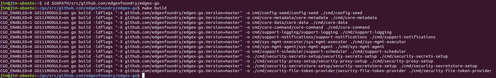

#################################
Get EdgeX Foundry - Go Developers
#################################

============
Introduction
============

These instructions are for Go Lang Developers and Contributors to obtain, run and otherwise work with Go-based EdgeX Foundry microservices. (Users should read: :doc:`../Ch-GettingStartedUsers`)

================================
What You Need For Go Development
================================

In additional to the hardware and software listed in the Developers page, you will need the following to work with the EdgeX Go-based microservcices.

**Go**

The open sourced microservices of EdgeX Foundry are written in Go 1.12. See https://golang.org/dl/ for download and installation instructions.  Newer versions of Go are available and may work (as of this writing - although Go version 1.13 will work as well), but the project has not thorougly built and tested to these newer versions of the language.  Older versions of Go, especially 1.10 or older, are likely to cause issues (EdgeX now uses Go Modules which were introduced with Go Lang 1.11).

It is suggested that you create a set of directories for your Go work (including a /bin and /src folder) and set the GOPATH env variable to that directory. This will assist in getting your environment setup and makes it easier to understand how to find code, tools and 3rd party packages.  Specifically, and as shown below, create a 'go' folder with /src/github.com/edgexfoundry sub-folders.  When you pull (see below) EdgeX code in from its repositories, add the repository folder under /edgexfoundry (in this example, edgex-go has been downloaded and its repository contents would comprise a new subfolder under /src/github.com/edgexfoundry).

::

    ~/go
        /bin
            /src
                /github.com
                    /edgexfoundry
                        /edgex-go

In this case, your $GOPATH environment variable should be set to ~/go.

EdgeX relies on many modules (some external and some EdgeX created).  This directory structure allows the modules to be automatically pulled and deposited into the appropriate place in this directory tree - thereby supporting the build processes.

**An IDE**

There are many options for writing Go Lang code and one could use a simple text editor.  This guide demonstrates how to get started with JetBrains Go Land.

*Go Land* -   Go Land is a popular although subscription-fee based IDE. Learn how to purchase and download Go Land here:  https://www.jetbrains.com/go/.

*Visual Studio Code (Optional)* - As an alternative to Go Land, Visual Studio Code is a free, open source IDE developed by Microsoft.   Find and download Visual Studio Code here:  https://code.visualstudio.com/.  This guide does not demonstrate how to use Visual Studio Code but the steps would be very similar.

*Atom IDE (Optional)* - As another alternative to Go Land, Atom is a free, open source IDE used with many languages.  Find and download Atom here:  https://ide.atom.io/.   This guide does not demonstrate how to use Atom but the steps would be very similar.

============
Get the code
============

This portion of the documentation assumes you wish to get and work with many **"core"** or widely used EdgeX Foundry Go-based services.  This includes but is not limited to Core, Supporting, Export (archived as of the Geneva release), some security, and system management services. To work with other Go-based security services, device services, application services, SDKs, user interface, or other service you may need to pull in the other repository code.  See other getting started guides for working with other Go-based services.  As you will see below, you do not need to explicitly pull in dependency modules (whether EdgeX or 3rd party provided).  Dependencies will automatically be pulled through the building process.

To work with the core services, you will need to download the source code from the EdgeX Go repository.  The EdgeX Go-based microservices are all available in a single GitHub repository download (note: the Go-based services do use a number of modules but again these dependencies will be pulled automatically for you as part of the build process). Once the code is pulled, the Go lang microservices are built and packaged as platform dependent executables and then also containerized for end user deployment/use.

The EdgeX Foundry Go lang microservice code is hosted at https://github.com/edgexfoundry/edgex-go.

To download or "pull" the EdgeX Go code, first change directories to the location where you want to download the code, and then use your git tool and request to clone this repository with the following command:

    git clone https://github.com/edgexfoundry/edgex-go.git

.. image:: EdgeX_GettingStartedClone.png

Again, it is recommended that you clone the edgex-go mono repo to the $GOPATH/src/github.com/edgexfoundry folder.  You will find that the project tools and configuration provided by the EdgeX community will work much better when applied to this structure.

**Note**, if you plan to contribute code back to the EdgeX project (as a Contributor), you are going to want to fork the repositories you plan to work with and then pull your fork versus the EdgeX repositories directly.  This documentation does not address the process and procedures for working with an EdgeX fork, committing changes and submitting contribution pull requests (PRs).  See some of the links below in the EdgeX Wiki for assistance on how to fork and contribute EdgeX code.

- https://wiki.edgexfoundry.org/display/FA/Contributor%27s+Guide
- https://wiki.edgexfoundry.org/display/FA/Contributor%27s+Guide+-+Go+Lang
- https://wiki.edgexfoundry.org/display/FA/Contributor+Process?searchId=AW768BAW7

===================
Build EdgeX Foundry
===================
To build the existing services found in edgex-go, first change directories to the root of the edgex-go code

    cd $GOPATH/src/github.com/edgexfoundry/edgex-go

Second, use the provided Makefile to build all the services in a single call

    make build

The first time EdgeX builds, it will take longer than subsequent builds as it has to download all dependencies.  Depending on the size of your host, an initial build can take several minutes.  Make sure the build completes successfully and has no errors. If it does build successfully, you should find new service executables in each of the service folders under $GOPATH/src/github.com/edgexfoundry/edgex-go/cmd/.  

=================
Run EdgeX Foundry
=================

**Run the Database**

Several of the EdgeX Foundry microservices utilize the MongoDB instance.  This includes core-data, core-metadata, support-rulesengine, supporting-logging (in some situations), among others.  Therefore, when working with EdgeX Foundry its a good idea to have the database up and running as a general rule.  See https://docs.mongodb.com/manual/tutorial/install-mongodb-on-ubuntu/#run-mongodb-community-edition for how to run Mongo in a Linux environment (or find similar documenation for other environments).

**Run the core Go services**

With the services built successfully, and the database up and running, you can now run all the services via second make command.  Simply call

    make run

.. image:: EdgeX_GettingStartedRun.png
  
This will start all of the EdgeX go services and leave them running until you terminate the process (with Ctrl-C). The log entries from each service will start to display in the terminal.  Watch the log entries for any **ERROR** indicators.  While the EdgeX services are running you can make EdgeX API calls to `localhost`.

**Verify that EdgeX is working**

You can check that the microservices are working properly by calling their `ping` API endpoint:

    curl http://localhost:48080/api/v1/ping

You should recieve a `pong` message in response.

To stop all the services, hit Contrl-C in the terminal.

No sensor data will be collected as this just gets the core services up and running.  To get sensor data flowing into EdgeX core services, you will need to get, build and run an EdgeX device service in a similar fashion.  A virtual device service has been provided to test and experiment with (https://github.com/edgexfoundry/device-virtual-go).  

========================
EdgeX Foundry in Go Land
========================
IDEs offer many code editing conveniences. Go Land was specifically built to edit and work with Go code.  So if you are doing any significant code work with the EdgeX Go microservices, you will likely find it conveniet to edit, build, run, test, etc. from GoLand.

**Import the Project**

The EdgeX Foundry Go mono repo contains the Go Lang source code (and many additional files such as configuration and Docker files) for all the Go-based microservices and supporting packages.  As its name implies, it is the single (or mono) repository for all EdgeX Go source.  To bring in the mono repo into Go Land, use the File → Open... menu option in Go Land to open the Open File or Project Window.

.. image:: EdgeX_GoLandOpenProject.png

In the "Open File or Project" popup, select the location of the folder containing your cloned edgex-go repo.  If you are following the EdgeX recommended standards, the edgex-go folder should be located under $GOPATH/src/github.com/edgexfoundry/edgex-go.

.. image:: EdgeX_GoLandSelectProject.png

**Open the Terminal**

From the View menu in Go Land, select the Terminal menu option.  This will open a command terminal from which you can issue commands to install the dependencies, build the microservices, run the microservices, etc.

.. image:: EdgeX_GoLandViewTerminal.png

**Build the EdgeX Microservices**

With all the dependencies now loaded, you can build the EdgeX Foundry microservices.  Run **"make build"** in the Terminal view (as shown below) to build the services.  This can take a few minutes to build all the services.

.. image:: EdgeX_GoLandMakeBuild.png

**NOTE** - in some cases, Go Land IDE may encounter an error (go: parsing $GOFLAGS: non-flag "\"-X") when building as shown below.  

.. image:: EdgeX_GoLandBuildError.png

If you encounter this issue, unset the GOFLAGS env var in GoLand.  Make a call to unset GOFLAGS as shown below and then call make build again.

.. image:: EdgeX_GoLandBuildFix.png

Just as when running make build from the command line in a terminal, the microservice executables that get built in Go Land's terminal will be created under the $GOPATH/src/github.com/edgexfoundry/edgex-go/cmd/[microservice folder]/[microservice name].  So, for example, core-data would get created as the $GOPATH/src/github.com/edgexfoundry/edgex-go/cmd/core-data/core-data.

.. image:: EdgeX_GoLandBuildEdgeXMicroservices.png

**Run EdgeX**

With all the microservices built, you can now run EdgeX.  You may first want to make sure the database is running.  Then issue the command **"make run"** as shown below.

.. image:: EdgeX_GoLandMakeRun.png

You can now call on the service APIs to make sure they are running correctly.  Namely, call on localhost:[service port]/api/v1/ping to see each service respond to the simplest of requests.
